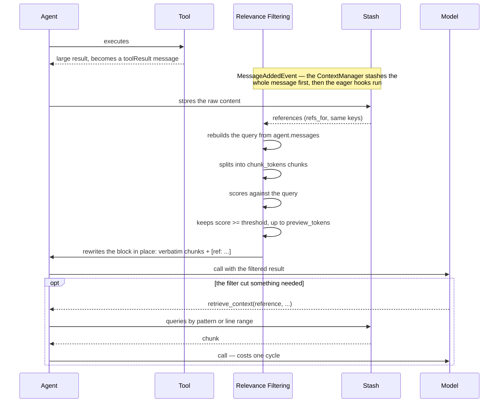

# A — Relevance Filtering

## The idea

When a tool returns more content than fits the budget, the usual reduction is a **positional
slice** — keep the first N characters (or a head-plus-tail). That slice is blind: it has no
awareness of the content's structure, of the content itself, or of the question being answered. On
an HTML page the first characters are `<head>`, `<style>` and `<script>`, so the preview retains the
CSS and the footer and discards the answer. Nobody decided the CSS mattered — position did.

Relevance filtering replaces position with **meaning**: split the large result into chunks, score
each chunk against the question in progress, and keep the chunks that pass a threshold — **verbatim**,
because the value of a tool result is often an exact number or table that a paraphrase would corrupt.
The raw content is not thrown away; it is archived and remains **retrievable on demand**, so the one
case the score gets wrong costs a follow-up query rather than a lost fact.

Two properties make this cheap and safe: scoring is a reranker pass (one query over a few dozen
chunks), not an LLM pass over the whole result; and what stays is the original bytes, never a summary.

## Example

The rest of this document is the idea realized in one agentic framework (Strands + Bedrock), at
L200 — public surface, hook points, mechanism and failure modes. The concepts above stand on their
own; the code below shows one way to wire them. For the shared concepts, see `design.md`.

Status: **draft for discussion**

---

## 1. What it does

When a tool returns large content, today a positional slice of it is kept in context. This
approach scores the chunks by relevance to the question in progress and keeps the ones that
pass a threshold. The raw content stays stored and queryable.

## 2. The problem

The positional preview is a slice, in both places that write one. The `ContextOffloader` version
is literal:

```python
def _slice_preview(self, text: str) -> str:
    return text[: self._preview_tokens * _CHARS_PER_TOKEN]
```

`ContextManager`'s `offload:truncate` keeps a head plus a tail with a `[... N chars elided ...]`
marker between them (`_context_manager/methods/truncate.py`), which is two slices instead of one.
Both are blind in the same way: no awareness of structure, of content or of the question. On an
HTML page, the first characters are `<head>`, `<style>` and `<script>` — the head of the preview
retains the CSS and the tail retains the footer.

Nobody decided the CSS mattered. The slice is blind.

## 3. Public surface

A strategy inside the `ContextManager` pipeline, not a new plugin:

```python
from strands.experimental.context_manager import ContextManager, Offload

ContextManager(
    strategies=[
        Offload.relevance(
            "tool_results",
            {
                "relevance_threshold": 0.5,  # minimum score for a chunk to get in
                "chunk_tokens": 2500,        # chunk size for scoring
                "preview_tokens": 1000,      # budget for what stays visible
            },
        ).when(threshold=8_000),             # only blocks above this are rewritten
    ]
)
```

The strategy id is `offload:relevance` and the class is `RelevanceStrategy`, a sibling of
`offload:truncate`, `offload:summarize` and `offload:drop`. The three config values shown are the
defaults; `when(threshold=...)` has none, and a strategy declared with no conditions rewrites every
matching block.

Two more keys exist on `RelevanceConfig`: `reranker`, to inject a scorer, and
`summarize_overflow`, which defaults to `False` and is reserved (§6).

Why a strategy and not a plugin: the `Stash`, the retrieval tool, the target routing
(`"tool_results"`, `"*"`, `tool::name` lists) and the `.when()` conditions all already exist on the
base offload strategy. As a strategy, relevance inherits all of that and is one ordered entry among
others.

Where it moved from. Relevance filtering used to live in `ContextOffloader`, selected by a
`preview_strategy` parameter. That parameter is gone, and so are the offloader's exports of
`Reranker`, `BedrockReranker` and `RerankerError` — everything public now comes from
`strands.experimental.context_manager`, which exports `ContextManager`, `Offload`,
`RelevanceConfig`, `Reranker`, `BedrockReranker` and `RerankerError`. The reason is not local to A:
design `0015-context-manager` §7.3 retires the plugin — v1 warns when a `ContextOffloader` and a
`ContextManager` are both set, v2 removes the plugin (issue #3489). A strategy that only existed
inside the plugin would have been retired with it.

## 4. Hook point

| What | Where |
|---|---|
| rewrites the block, before the next model call | eager `MessageAddedEvent` hook |
| rewrites the block, when the window is under pressure | the strategy pipeline, via `apply` |

Which of the two runs is decided by `.when()`, in the base strategy:

```
  .when(threshold=N)                 ──▶  eager: MessageAddedEvent, once per oversized block
  .when(utilization=...)             ──▶  reactive: only when the window fills
  .when(..., preserve_recent=N > 0)  ──▶  reactive
```

The eager hook is what reproduces the proactive timing the offloader had on
`AfterToolCallEvent`: the rewrite lands when the message is added, which is before the next model
call, so the raw content is never *sent*. What changed is that it now **is** a message for a
moment, and the rewrite is in place over `agent.messages` rather than over `event.result`. Two
consequences run through the rest of this document: the query has to be recovered from the history
(§5), and the content that leaves goes to the `ContextManager`'s `Stash`.

Ordering on that one event matters and is not the strategy's doing. `ContextManager.init_agent`
registers its own `MessageAddedEvent` callback — the one that calls `stash.store_message` — before it
initializes any strategy, so the raw content is stashed before a strategy can rewrite over it. The
strategy only asks the stash for the reference keys (`refs_for`) and appends them to the marker it
writes.

## 5. Mechanism



### The scoring query

Two signals, same as before: the user question and the tool arguments. Concatenating them gives a
better signal than the question alone — in a multi-tool loop, the original question may be far from
the sub-goal.

What changed is where they come from. The strategy's `_replace_block` receives no event, only the
block — and a `toolResult` block carries a `toolUseId` and nothing else. So both signals are walked
out of `agent.messages`:

```
  the question   ──▶  newest user message that carries text
                      (a tool-result-only turn is not a question)
  the arguments  ──▶  the toolUse whose toolUseId matches the block
```

The concatenation is capped at 2,000 characters, keeping the **tail** so the arguments survive when
the question is long. Serialized arguments alone longer than the cap are kept as a head instead.

### The scorer

Bedrock's `Rerank` has exactly the shape of the problem: one query, 1 to 1000 inline documents,
and the response brings the index plus a `relevanceScore` per document. Pricing is per query,
and one query holds up to 100 chunks — `BedrockReranker.max_sources_per_query`, which is also how
larger chunk lists are paginated internally.

A 100 thousand token result in 2.5k chunks gives 40 chunks — one query, one search unit. Orders
of magnitude cheaper than an LLM pass over the same 100 thousand tokens.

Constraints to respect: text only, and a distinct client (`bedrock-agent-runtime`) from the one
used for inference. Model availability by region is limited — the default model is
`amazon.rerank-v1:0`, resolved to a foundation-model ARN in the client's region.

Which is why the reranker is built **lazily**, on first use, not in the strategy constructor:
`Offload.relevance(...)` has to be declarable in a `ContextManager` pipeline without any AWS client
existing, and a strategy whose condition never fires must not have cost a session token.

`Reranker` is a `Protocol`, so any scorer that returns one finite score in `[0.0, 1.0]` per chunk,
in chunk order, can be passed as `config["reranker"]`. Scores are validated against that contract
before selection: a wrong length or an out-of-range value raises rather than being clamped, because
a misaligned score drops the passage the question needed.

## 6. Summarization is an exception, not a step

The rerank output is **verbatim**. Summarizing destroys precisely that.

The concrete case: the relevant chunk is `"Bank A ... R$ 47,832.15"`. A small model
paraphrasing may return "roughly R$ 47 thousand", or swap a digit. Numeric and tabular data is
where small models fail, and the error is silent.

```
rerank cuts
    ├── fits the budget?   ──▶ goes in VERBATIM
    └── still overflowed?  ──▶ summarize only the excess
```

The second branch is **not implemented**. `summarize_overflow` exists on `RelevanceConfig`, defaults
to `False` and is accepted and stored without being acted upon. What happens today when the
selection overflows is truncation of the last chunk at a line boundary, plus a
`[... N lines omitted ...]` marker — no model is called on this path at all.

Guard, and it is implemented: `_has_protected_content` matches a decimal or thousand separator
between digits, a `R$` / `$` / `€` / `USD` / `BRL` marker, two or more `|` or tab characters on a
line, or a run of three or more digits. It is the gate the summarization step would have to pass,
and it errs permissive on purpose — a false positive costs nothing, a false negative would let a
number be rewritten.

## 7. Deterministic guards

- The result of the retrieval tool itself is never filtered (avoids recursion). The guard is in the
  base strategy: with a stash present, a `toolResult` whose tool name is `retrieve_context` matches no
  target. With `stash=False` there is no stash and no retrieval tool either, so there is nothing to
  recurse into.
- Non-textual content is not scorable. The strategy concatenates only the `text` and `json` blocks
  of the result; with nothing textual, it returns the block **unchanged** rather than writing a
  placeholder. Producing a placeholder for a binary is `offload:truncate`'s job, not this one.
- A scorer failure leaves the block unchanged. It never leaves the agent without a result.

Two guards from the offloader did **not** come across, and both are worth stating rather than
assuming:

- **The delegation-tool guard is gone.** `ContextOffloader` skips a result produced by an
  `_AgentAsTool` with `delegate=True`, because that result becomes the final user-facing answer and
  there is no following call to retrieve what was left out. Nothing in `_context_manager` does the
  equivalent. Whether the pipeline needs it, or whether targeting by `tool::` name is considered
  sufficient, is not settled by the code.
- **The prefix fallback is gone.** The offloader's relevance path fell back to the positional slice
  on a `RerankerError`. The strategy returns `None`, which means "skip this block", so an oversized
  result survives a scoring failure at full size until a later strategy in the pipeline reduces it.
  The reranker module's own docstrings still describe the caller as falling back to the positional
  preview; that text is stale relative to `RelevanceStrategy._replace_block`.

## 8. Failure modes

| Failure | Effect | Mitigation |
|---|---|---|
| Scoring is wrong and cuts what was needed | poor answer | query by the reference, costs one cycle |
| Minified JSON | line search is useless, it is a single line | handled in `_chunk_text`: a line longer than the chunk budget is cut by character, so it does not degenerate into one giant chunk. Every fragment inherits that line's own line numbers |
| Aggregation query | there is no relevant chunk, they are all relevant | out of scope: fix it in the tool |
| Full retrieval | the whole content comes back and stays resident | keep as a last resort, it is already the guidance text |

The aggregation case deserves to be written down: "sum all the transactions of the year" has no
cut. The rerank returns the 5 most similar to the question and loses the other 35. The fix is
for the tool to paginate or aggregate at the source.

## 9. How to verify

- Size of the `ToolResult` that enters the conversation, before and after, per tool.
- Frequency of `retrieve_context` calls — measures how much the filter is getting wrong.
- Search units consumed per session, against the tokens saved. `RelevancePreview.search_units`
  counts them, incremented before the call and never reset, so it is the session total.
- Regression test: swapping `Offload.relevance(...)` for `Offload.truncate(...)` at the same
  position in the pipeline gives the positional behavior back.

## 10. Open decisions

1. Is the threshold fixed or per tool? A statement and a web page have different score
   distributions. Per-tool is now expressible without new API — two `Offload.relevance` entries
   with different `tool::` targets and different thresholds — but nothing measures whether it pays.
2. Overlapping chunks? Improves boundary context at the cost of more chunks per query.
3. ~~When the result exceeds 100 chunks, paginate across several queries or increase
   `chunk_tokens`?~~ Paginate: `BedrockReranker.score` batches by `max_sources_per_query` in index
   order and any batch failure aborts the whole call, so a partial score list is never misread as
   "these chunks are irrelevant".
4. ~~Is `relevance_threshold` portable across scoring models?~~ Assumed not, and settled the way
   the question suggested: it is a `RelevanceConfig` key, not a constant. The default is `0.5`.
5. Does the delegation guard need to come back (§7)? The answer depends on whether a delegating
   agent is expected to run a `ContextManager` at all, which the code does not say.
