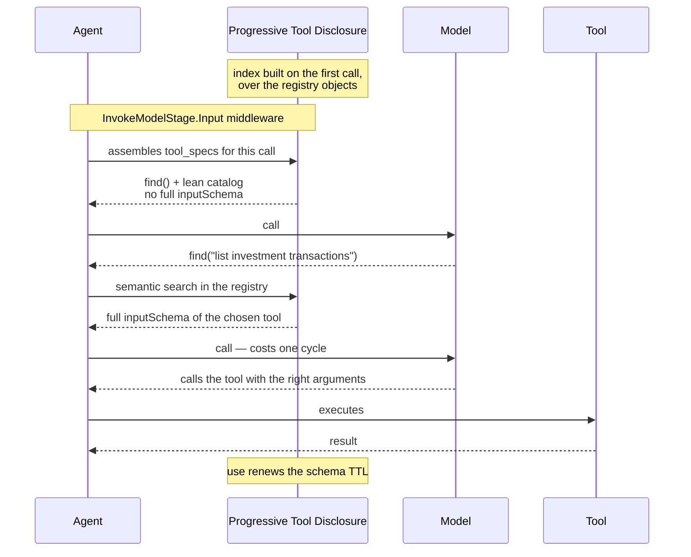

# B — Progressive Tool Disclosure

## The idea

Agents are given every tool's full description on every call. That schema is a large, **fixed** cost
— in the measured session about 63k tokens per call, ~85% of the floor — and it is paid identically
whether the turn uses one tool or none. No window management touches it: summarization works on the
conversation, while tool schema is a separate parameter of the call.

Progressive tool disclosure sends a **lean catalog** (each tool as a name plus a one-line summary)
together with a **search tool**. The model asks, in natural language, for the capability it needs;
it receives the *full* schema of the matching tool, uses it, and the detail is **forgotten through
inactivity** after a few cycles. Because the conversation branches, forgetting is what keeps the cost
flat — if every tool ever touched stayed resident, the floor would grow without bound again.

This works precisely because a tool's description, unlike a tool's *result*, has its signal at the
front: the first line of a docstring is the summary. The reverse of relevance filtering (idea A),
where the beginning of a result is rarely what matters.

## Example

The rest of this document is the idea realized in one agentic framework (Strands + Bedrock), at
L200 — public surface, hook points, mechanism and failure modes. The concepts above stand on their
own; the code below shows one way to wire them. For the shared concepts, see `design.md`.

Status: **draft for discussion**

---

## 1. What it does

Instead of sending the full description of every tool on every call, it sends a lean catalog
plus a search tool. The model asks for what it needs in natural language, receives the full
schema, uses it — and the detail is forgotten through inactivity.

## 2. The problem

In the measured session, the floor of every call is 74,675 tokens with an empty
history, and by elimination about 63,000 are tool description. They are identical across the 33
calls — 2,079,000 tokens, ~30% of the total session consumption.

And the cost is unconditional. In the event loop:

```python
tool_specs = agent.tool_registry.get_all_tool_specs()
```

No filter, no condition. No context management mode touches this: summarization operates on
`agent.messages`, and system prompt and tool specs are separate parameters of the call.

Aggravating factor: `projected_input_tokens` **includes** the schema. So the compression trigger
measures something the compression cannot reduce. In an agent with many tools on a
smaller-window model, the threshold may fire always and the summarizer chew through the history
without ever resolving it.

## 3. Public surface

A new plugin:

```python
plugins=[
    ProgressiveToolDisclosure(
        catalog_tokens=20,        # description budget per tool in the catalog
                                  # None = no catalog, search only
        ttl_cycles=5,             # how many cycles the schema stays after last use
        always_available=[...],   # tools that never go through the cycle
    )
]
```

`catalog_tokens` covers the entire spectrum in one knob:

| Value | Resident | Risk |
|---|---|---|
| full (today) | ~63,000 | none |
| ~20 tokens | ~2,500 | low |
| `None` | ~200 | the model may not know it has tools |

From full to lean is 96% of the savings. Zeroing it buys the remaining 2.3k at the cost of
depending on the model suspecting it is worth searching — which is why `None` is optional, not
the default.

Cutting the description by budget works here because docstring convention puts the summary on
the first line. It is the opposite of the tool result, where the beginning is rarely what
matters.

## 4. Hook point

**Just one:** `InvokeModelStage.Input` middleware.

`BeforeModelCallEvent` does not work — it carries `agent`, `invocation_state` and
`projected_input_tokens`, it does not carry `tool_specs`. The one that has it is
`InvokeModelContext`, and there the field is a defensive copy, made to be replaced.

There is no system prompt injection: the usage instruction lives in the description of the
search tool itself, which already travels in `tool_specs`. One hook less and no catalog format
to maintain.

A plugin can register middleware in `init_agent`. The pattern is already used by vended plugins
and by the memory manager.

## 5. Mechanism



### Composition of the `tool_specs` of each call

```
tool_specs = find()
           ∪ catalog (name + catalog_tokens of description, no inputSchema)
           ∪ always_available
           ∪ in_use (TTL, renewed on every use)
           ∪ referenced_in_retained_history            [guard]
```

`in_use` carries most of the load and is deterministic. Seven consecutive calls of the same tool
trigger no search at all — use renews the deadline, and it leaves through inactivity.

### Why forget instead of accumulate

The conversation branches. If every visited subject left its schema resident, the cost would go
back to growing without end. Forgetting keeps the cost flat.

Forgetting is free: the tool never leaves the `tool_registry`, it just stops being assembled.
`agent.tool_names` and `agent.tool` keep reflecting the full set.

### The index

Built on the first call, not in `init_agent`: at the moment the plugin initializes, the user
tools are already registered, but those vended by other plugins and the MCP ones may not be.

Index the **full schema text**, not the one-line description. The parameter description is what
separates `list_accounts` from `list_investment_transactions`.

Since the tools are static, pre-computed embeddings are enough and cost almost nothing per turn
— only the query needs to be embedded. Rerank is worth it if you want higher precision on the
shortlist.

## 6. Deterministic guards

- **`tool_specs` is never empty.** The provider rejects an empty `toolConfig` when the history
  has tool blocks — the SDK already works around it by injecting a `noop`. With `find()` always
  present, the case does not occur.
- **The schema of a tool referenced in the history is kept**, so no `toolUse` is left without a
  matching definition.
- **`always_available`** is the escape hatch for a small tool used on every turn, which should
  not go through the discovery cycle.

## 7. Failure modes

| Failure | Effect | Mitigation |
|---|---|---|
| Model does not search and answers without a tool | denies a capability it has | lean catalog, `catalog_tokens` != None |
| Search returns the wrong tool | one cycle lost | the model searches again with another description |
| Need maps to a combination of tools | search returns independent top-K and loses the composition | hypothesis, measure before treating |
| Thrash on repeated use | extra cycles | `ttl_cycles`, renewed on every use |

## 8. What it does not solve

- **System prompt and skills.** They are other parameters of the call; they stay untouched.
- **A tool with a legitimately huge schema.** If it is used on every turn, the detail stays
  resident by TTL and the savings do not show up. Then the path is to trim the schema at the
  source.

## 9. How to verify

- Sum of `tool_specs` tokens per call, before and after. It is arithmetic and does not depend on
  judgment — it can be asserted in a test.
- Cycles spent on search per session. If the same set is always requested, it is a signal to
  reintroduce pre-loading as an optimization, then with data in hand.
- Search hit rate: how many times the model searched more than once for the same intent.

## 10. Open decisions

1. `ttl_cycles` in cycles or until the end of the turn? Cycles is finer-grained and has precedent in the offloader.
2. Does similarity pre-loading come back as an optimization? Only after measuring search frequency.
3. Catalog budget per tool or total? Per tool is predictable; a total would force ranking who
   gets in, reintroducing judgment where it is not necessary.
4. Some providers have native support for deferred tool loading. Is it worth using when
   available, or keeping a single portable implementation?
