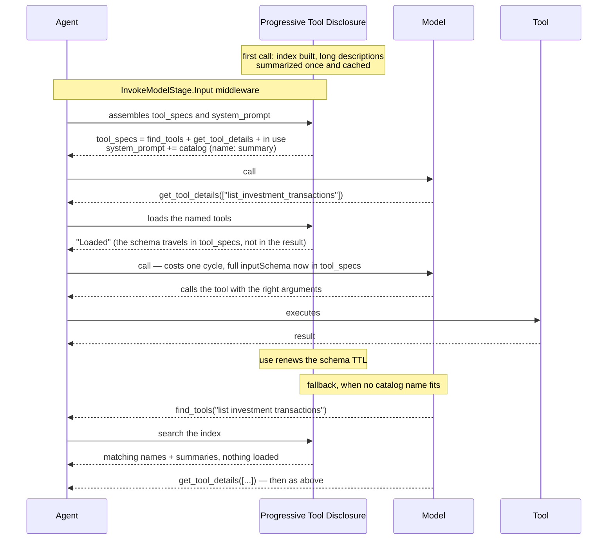

# B — Progressive Tool Disclosure

## The idea

Agents are given every tool's full description on every call. That schema is a large, **fixed** cost
— in the measured session about 63k tokens per call, ~85% of the floor — and it is paid identically
whether the turn uses one tool or none. No window management touches it: summarization works on the
conversation, while tool schema is a separate parameter of the call.

Progressive tool disclosure sends a **lean catalog** — each tool as a name plus a one-line summary,
listed in the **system prompt** — together with two small tools: `get_tool_details`, which loads the
full schema of one or more tools by name, and `find_tools`, which searches when no listed name fits.
The model loads what it needs, uses it, and the detail is **forgotten through inactivity** after a
few cycles. Because the conversation branches, forgetting is what keeps the cost flat — if every tool
ever touched stayed resident, the floor would grow without bound again.

The catalog line is a **summary**, not a cut: a description longer than the configured character
limit is summarized once, by a model, and the line is cached, so the catalog stays byte-stable from
call to call. A truncated first sentence often keeps the tool's purpose and drops what tells it apart
from its neighbours; a summary asked for exactly that distinction does not.

## Example

The rest of this document is the idea realized in one agentic framework (Strands + Bedrock), at
L200 — public surface, hook points, mechanism and failure modes. The concepts above stand on their
own; the code below shows one way to wire them. For the shared concepts, see `design.md`.

Status: **draft for discussion**

---

## 1. What it does

Instead of sending the full description of every tool on every call, it lists every tool as one
summarized line in the system prompt and sends only the schemas that are actually in use. The model
loads the schemas it needs by name, uses them — and the detail is forgotten through inactivity.

## 2. The problem

In the measured session, the floor of every call is 74,675 tokens with an empty
history, and by elimination about 63,000 are tool description. They are identical across the 33
calls — 2,079,000 tokens, ~30% of the total session consumption.

And the cost is unconditional. In the event loop:

```python
tool_specs = agent.tool_registry.get_all_tool_specs()
```

No filter, no condition. No context management mode touches this: summarization operates on
`agent.messages`, and system prompt and tool specs are separate parameters of the call.

Aggravating factor: `projected_input_tokens` **includes** the schema. So the compression trigger
measures something the compression cannot reduce. In an agent with many tools on a
smaller-window model, the threshold may fire always and the summarizer chew through the history
without ever resolving it.

## 3. Public surface

A new plugin:

```python
plugins=[
    ProgressiveToolDisclosure(
        catalog_chars=80,         # character limit of each catalog line's summary
                                  # None = no catalog, the two plugin tools only
        summarizer=None,          # None = the agent's own model, once per tool, cached
        ttl_cycles=5,             # how many cycles the schema stays after last use
        always_available=[...],   # tools that never go through the cycle
    )
]
```

`catalog_chars` covers the entire spectrum in one knob:

| Value | Resident | Risk |
|---|---|---|
| full (today) | ~63,000 | none |
| ~80 characters | ~2,500 | low |
| `None` | ~200 | the model may not know it has tools |

From full to lean is 96% of the savings. Zeroing it buys the remaining 2.3k at the cost of
depending on the model suspecting it is worth searching — which is why `None` is optional, not
the default.

**How a line is written.** A description that already fits the limit is used verbatim and costs no
call. A longer one goes to the summarizer — by default one plain call to the agent's own model, with
no tools and no history, asking for what distinguishes the tool within the limit. The line is cached
per `(name, description)` for the life of the plugin, so a tool is summarized once no matter how many
calls or agents use it, and the catalog does not drift between calls (which would invalidate a prompt
cache). If the summarizer fails or answers nothing, the line falls back to a cut at a sentence or word
boundary; an answer over the limit is clamped the same way. The summary calls are an auxiliary cost of
the strategy and are reported as `summary_usage` in the disclosure state.

**Why the catalog is in the system prompt and not in `tool_specs`.** A catalog entry in `tool_specs`
has to carry an `inputSchema` — providers reject a spec without one — and the only schema a reduced
entry can carry is `{"type": "object", "properties": {}}`, which reads as "takes no arguments". The
model believes it, calls the tool by name, and the call has to be cancelled and retried: a full round
trip carrying no information. In the system prompt the name makes no claim about its arguments, and
the rule governing it ("load it with `get_tool_details` before calling") sits in the same block as the
name, not in a sibling tool's description. `tool_specs` carries only what is callable on the call.

## 4. Hook point

**Just one:** `InvokeModelStage.Input` middleware.

`BeforeModelCallEvent` does not work — it carries `agent`, `invocation_state` and
`projected_input_tokens`, it does not carry `tool_specs`. The one that has it is
`InvokeModelContext`, and there the fields are defensive copies, made to be replaced.

The catalog is appended to the system prompt by that same middleware, so there is still one hook and
one place where what the model is told about tools gets decided.

A plugin can register middleware in `init_agent`. The pattern is already used by vended plugins
and by the memory manager. The middleware writes two fields of the context and nothing else:
`tool_specs` (the callable tools) and `system_prompt` (the catalog appended after the caller's own
prompt, so the operator's text keeps its offset).

## 5. Mechanism



The common path is **catalog → `get_tool_details` → call**. `find_tools` only finds; loading is always
`get_tool_details`, so the model takes the same road to a schema wherever it started. A load takes a
list, so every tool a step needs is loaded in one cycle.

### Composition of each call

```
tool_specs    = find_tools ∪ get_tool_details
              ∪ always_available
              ∪ in_use (TTL, renewed on every use)
              ∪ referenced_in_retained_history          [guard]

system_prompt = caller's prompt
              + catalog: every other tool as "- name: summary (≤ catalog_chars)"
```

The two partition the registry: no tool appears in both, and none is missing from both. Every entry
of `tool_specs` is a verbatim, callable specification.

`in_use` carries most of the load and is deterministic. Seven consecutive calls of the same tool
trigger no search at all — use renews the deadline, and it leaves through inactivity.

### Why forget instead of accumulate

The conversation branches. If every visited subject left its schema resident, the cost would go
back to growing without end. Forgetting keeps the cost flat.

Forgetting is free: the tool never leaves the `tool_registry`, it just stops being assembled.
`agent.tool_names` and `agent.tool` keep reflecting the full set.

### The index

Built on the first call, not in `init_agent`: at the moment the plugin initializes, the user
tools are already registered, but those vended by other plugins and the MCP ones may not be.

Index the **full schema text**, not the one-line description. The parameter description is what
separates `list_accounts` from `list_investment_transactions`.

Since the tools are static, pre-computed embeddings are enough and cost almost nothing per turn
— only the query needs to be embedded. Rerank is worth it if you want higher precision on the
shortlist.

## 6. Deterministic guards

- **`tool_specs` is never empty.** The provider rejects an empty `toolConfig` when the history
  has tool blocks — the SDK already works around it by injecting a `noop`. With `find_tools` and
  `get_tool_details` always present, the case does not occur.
- **The schema of a tool referenced in the history is kept**, so no `toolUse` is left without a
  matching definition.
- **A call to a catalog name that skipped the load is recovered.** The name is not in `tool_specs`,
  so the common path never produces it; if a model calls one anyway and the call reaches the plugin,
  it is cancelled with "call it again", and the schema is already loaded for the retry.
- **`always_available`** is the escape hatch for a small tool used on every turn, which should
  not go through the discovery cycle.

## 7. Failure modes

| Failure | Effect | Mitigation |
|---|---|---|
| Model does not load and answers without a tool | denies a capability it has | catalog in the system prompt, `catalog_chars` != None |
| Summary drops what tells two tools apart | the wrong tool is loaded, one cycle lost | the model loads another; raise `catalog_chars` or supply a `summarizer` |
| Summarizer fails | none visible | the line falls back to a boundary cut |
| No catalog name fits the need | one search cycle | `find_tools`, then `get_tool_details` |
| Need maps to a combination of tools | several tools needed at once | `get_tool_details` takes a list: one load for all of them |
| Thrash on repeated use | extra cycles | `ttl_cycles`, renewed on every use |

## 8. What it does not solve

- **System prompt and skills.** They are other parameters of the call; they stay untouched.
- **A tool with a legitimately huge schema.** If it is used on every turn, the detail stays
  resident by TTL and the savings do not show up. Then the path is to trim the schema at the
  source.

## 9. How to verify

- Sum of `tool_specs` tokens per call, before and after. It is arithmetic and does not depend on
  judgment — it can be asserted in a test.
- Cycles spent on loading and on search per session (`loads`, `searches`). If the same set is always
  loaded, it is a signal to move it to `always_available`.
- Tokens the summaries cost (`summary_usage`), billed next to what the catalog saves.

## 10. Open decisions

1. `ttl_cycles` in cycles or until the end of the turn? Cycles is finer-grained and has precedent in the offloader.
2. Does similarity pre-loading come back as an optimization? Only after measuring search frequency.
3. Catalog budget per tool or total? Per tool is predictable; a total would force ranking who
   gets in, reintroducing judgment where it is not necessary.
4. Some providers have native support for deferred tool loading. Is it worth using when
   available, or keeping a single portable implementation?
