# D — Context Graph

Context graph with activation. L200 level: surface, hook points, mechanism and failure modes.
For the concepts, see `design.md`.

Status: **draft for discussion**

---

## 0. Glossary

Eight terms, and no other is invented in this document.

| Term | What it is |
|---|---|
| **card** | a node of the graph. Groups the messages of a turn and knows which tools it called and which artifacts it cited |
| **title** | the identifier of the card, ~5 tokens. Always present in the call |
| **description** | block derived from the card, **at most 100 tokens**. It is not a summary: nothing is paraphrased (§7) |
| **tag** | one of the **5 identifiers** that define the card. Dynamic: they come out of the conversation, nothing is declared beforehand (§7.1) |
| **full content** | the messages of the card as they are |
| **resolution** | which of the three forms above enters the call: title, description or full content |
| **score** | how relevant the card seems to the turn's question. Decides the resolution (§8) |
| **STM** | short-term memory. The graph is the STM of the session, and nothing in it crosses the session (§20) |

The three resolutions, from cheapest to most expensive:

```
  title              ~5 tokens      ── always goes in
  description       ≤100 tokens     ── when the score is medium
  full content       whatever it is ── when the score is high and it fits the budget
```

## 1. What it does

Short-term memory stops being the message list and becomes a **graph with two operations: remove
and recover**.

The nodes are cards. Each card can enter the call in three resolutions — title, description or
full content (§0) — and has two parts that decay at different speeds: the dialogue and the
evidence (§3.1).

During the conversation, the STM shrinks and grows: what stopped being useful is removed, what
became useful again is recovered. None of this touches the log.

```
  durable log (agent.messages)   ── never loses anything, it is the source of truth
  STM (the graph)                ── removes and recovers freely, it is a view
```

It is this separation that makes recovering cheap: nothing was destroyed, so coming back is
re-projecting, not restoring from storage.

## 1.1 The two operations

Remove and recover are symmetrical and explicit. Neither writes to the log.

| | What it is | Who triggers it | Cost |
|---|---|---|---|
| **remove** | the card (or a part of it) stops being projected | the score dropped, or the evidence was consumed (§3.1) | zero |
| **recover** | goes back to being projected, at a higher resolution | the score rose, or the model asked for `expand` | zero, or one cycle if it was the model |

Two properties that come from the asymmetry with the log:

- **Removing never loses.** What leaves the STM stays in the log and stays addressable by the
  title, which never leaves (§3). That is what gives the model something to ask for.
- **Recovering does not read storage.** There is no block to assemble and no model call — a
  deactivated node is reactivated by clearing its mark, so what stopped being sent simply reappears.
  (This is the recover half of the "nothing is erased, what leaves stays recoverable" property; see
  the historical note on idea C below.)

What the score (§8) does is decide the resolution automatically on every turn. `expand` is the
manual route, for when the score got it wrong.

## 2. The problem

the measured session records a session of 18 turns and 99 messages:

```
  first call, empty history              74,675 tokens
  peak                                  288,678 tokens
  ──────────────────────────────────────────────────────
  history growth                          ~214k
  how much of that is tool result         ~75% at the peak
  model calls per turn                     2.5
```

The ~214k are resent as a growing prefix on every call, and the 2.5 calls per turn multiply that.

Nothing in the path removes by relevance. The sliding window cuts by age and summarization
replaces with a summary — both cut by position, not by relevance, and both are irreversible.

The detail that decides the design: **most of what grows is tool result that was only needed on
the turn where it was fetched.** Four turns of debugging a connector add up to 44.7% of the
session consumption, and kept being resent after the problem was solved.

## 3. Three resolutions

```
  ██  full content    the literal messages
  ▒▒  description     ≤100 tokens, derived
  ··  title           ~5 tokens, always present
      └─ the pointer the model uses to ask
```

The description is the finding. It costs almost nothing and gives the model something to cite
when the choice gets it wrong.

The title is cheaper still and never leaves. In a session of fifteen subjects, the whole line of
titles costs ~75 tokens, against the 63,325 tokens/call of schema that the report measures as the
baseline. It is noise.

## 3.1 Two parts: dialogue and evidence

A card is not a homogeneous block. It contains two things that **decay at completely different
speeds**:

```
  dialogue    user message + assistant response
              small · lasts several turns · sustains the anaphoric reference

  evidence    toolUse / toolResult pairs
              large · usually dies in its own turn
```

Treating the two as one is the mistake: `full content` brings everything and `description` loses
everything. Neither is right. The parts have **independent resolution**.

|  | dialogue | evidence |
|---|---|---|
| current turn | full content | full content |
| previous turn | **full content** | **description** — the numeric lines |
| old cards | description | title |

### Why the middle line is the one that matters

Walk through a bank statement conversation:

```
  1  user asks for the statements of the banks
  2  the model calls the statement tool 1×, 2×, 3× — one per bank
  3  the model composes the statement and presents it to the user
  ─────────────────────────────────────────────────────────────
  4  user asks for the detail of one entry
  5  the STM has: the results of step 2 + the response of step 3 + prompt
     └─ the results of step 2 are USELESS here: the detail is not in them,
        and the model is going to call the tool anyway
  6  the model calls the tool and composes the response with the detail
  ─────────────────────────────────────────────────────────────
  7  user: "and that other entry?"
  8  now the model needs the recent RESPONSES — the referent of
     "that other" is in the text it wrote, not in the tool results
```

Step 5 is the waste: tens of thousands of statement tokens resident for a question that requires
a new call anyway. Step 8 is the inverse: the dialogue is indispensable and the evidence remains
irrelevant.

In both steps, the right decision is the same — **dialogue in full content, evidence in
description** — and that is exactly why the numeric lines of the description (§7) do the work: the
90k statement drops to the lines `Bank A ... R$ 47,832.15`, the numbers survive, and the text
the assistant composed from them stays intact.

### The transition is derivable, with no model

```
  evidence drops to numeric lines  ⟺  the assistant already emitted text after it, in the same turn
```

The order of the messages answers that. Before that, the evidence is the work in progress and goes
in whole — which is already the contract of §12.

The reasoning: the `toolResult` is **consumed** by the assistant message that cites it. After that,
what carries the content is the response, not the raw result.

### Where the rule does not hold

Aggregation question. "Sum all the entries of the year" has no cut: it needs the raw content, and
the numeric lines do not serve. `design-a` §8 already put aggregation out of scope, and the way out
here is the same — the artifact card keeps the reference and `expand` reads by line range.

Second case: evidence that **no** assistant response cited. A tool call whose result the model has
not used yet does not decay, because it was not consumed by anything.

## 4. What goes in the card

The criterion that separates is **who owns the content**. `coordinator.py` already records the
rule: "an old mark is an outdated decision; an old copy is outdated content, which is far worse".
The card keeps a reference, never content.

| | Owner | Durable identity | In the card? |
|---|---|---|---|
| Messages | `agent.messages` + session manager | `tracking_id` | yes, the address |
| Tool result | the `ContextManager`'s `Stash` | `reference` | yes, the number |
| Retrieved memory | the SDK's `MemoryStore`, or the runtime | **none** — it is folded per call | **no** |

**A tool result has two things and it is easy to confuse them.** The preview *is* a message, has a
`tracking_id` and belongs to the subject card. The raw content is what the `Stash` holds under a
reference, and the artifact card keeps that reference. The expansion is
`retrieve_context(reference, line_range=...)`, which already exists — the `ContextManager`'s
retrieval tool, not the offloader's.

The timing changed on A's side and it is worth being exact about it, because §5 leans on the
distinction. The offloader replaced the content in the `AfterToolCallEvent`, so the raw content was
never a message at all. The `ContextManager` rewrites the block in place on `MessageAddedEvent`
(`design-a` §4), so the raw content **is** a message for a moment and then stops being one, before
any model call sees it. Either way what the card addresses is the reference, and D reads the
reference off the preview text — which is what makes the graph independent of hook order against
whichever of the two is running.

D reads both shapes, because both hosts write one:

```
  offloader   ── | ref: mem_1_tu-3_0
  stash       ── [ref: tu-3_0]        or  [refs: tu-3_0, tu-3_1]
```

`expand_artifact` resolves the stash by walking the agent's plugin registry for a `ContextManager`,
so the graph works next to a manager it was not told about — and answers with prose naming what was
missing when there is none.

**Memory is not a card, and transient injection already exists.** `design.md` §8 item 2 treats
transient injection as a fix to be made. It is already made: `injection/_message_injection.py`
folds the text into the last user message ephemerally, and the docstring is explicit — the model
sees the augmented input for one call and the durable history is never touched. `MemoryManager`
registers that middleware in `InvokeModelStage.Input` (`memory_manager.py:639`).

Consequence for D: **there is no memory message to become a card.** The block is reassembled per
call and disappears. It is not that the card would rot — it is that there is nothing to index.

What the measured session showed — resident memory, ~8k per turn cumulative, ~104k in the session — is
the behavior of the AgentCore runtime, not of the SDK's `MemoryManager`. The boundary matters: D
does not fix the runtime, and `MemoryManager` already does not have the problem.

The graph's role in memory is on the other side. Today the retrieval query is the user message;
the active subject is a better query, because in a multi-tool loop the original message is far from
the sub-goal.

```
  memory is NOT a card
  memory IS a consumer of the graph:  query = active subject, not the raw message
```

Mandatory order in the same stage: **D projects first, memory folds afterwards.** Both register
middleware in `InvokeModelStage.Input`. If D runs last, it may project out the message memory has
just folded into — it is the same class of interference as §2, with another neighbor.

### Binary artifact: the description is metadata, not content

Non-textual content leaves a placeholder in the history — written by `offload:truncate`, not by A,
which leaves a non-textual block untouched (`design-a` §7) — and for D that is not enough. A binary
has no numeric lines (§7) and is not scorable by `similar()`. Its description is derived from the
metadata:

```
  description of a binary artifact
  ┌────────────────────────────────────────────┐
  │ file name · content_type · size            │
  │ tool that produced it · turn               │
  │ reference: ref_3                           │
  └────────────────────────────────────────────┘
```

That is text, therefore it is embeddable, therefore it is searchable by the same index (§8.1). It is
the same move B makes when indexing the tool description instead of the `inputSchema`: you index
what describes, not what costs.

The `content_type` in that box is read off the placeholder — a `[image: png, …]` becomes
`image/png`, a `[document: pdf, …]` becomes `application/pdf`. One asymmetry to know about: the
recovery path is coarser than the description. When `expand_artifact` reads a stashed block that
holds no text, it answers that the reference holds non-textual content **without naming the type** —
the card describes the format, the tool's refusal does not repeat it.

## 5. The atom is the message

Tempting to slice into smaller pieces. It does not work, for three reasons that stack:

1. The message is the only unit with a `tracking_id`. Without it the projection does not know how
   to name what to drop — `background_ids` already treats a message without `tracking_id` as always
   sent.
2. It is the unit the provider accepts or rejects. `toolUse` and `toolResult` travel together, and
   `projection.py` spends two monotonic closures guaranteeing that.
3. Going below the message forces you to **rewrite content** instead of filtering a list. Then you
   have left step 5 of the event loop (copy, reversible) and gone back to step 2 (live list,
   destructive) — the distinction between marking a message inactive (reversible) and rewriting its
   content (destructive), which is what keeps recovery lossless.

Sub-message exists in one place only, and it is safe because there the content is not a message: a
stashed tool result is addressable by `line_range` and by `pattern` through `retrieve_context`, and
A splits the same text into `chunk_tokens` chunks to score it (`design-a` §5). Both read below the
message without rewriting the list.

So the granularity is two levels, not free chunking:

```
  subject card ──▶ messages (tracking_id)    projection filters the list
        │
        └───────▶ artifacts (reference) ──▶ lines    expansion reads by range
```

If a card gets too coarse — six turns and you want one — the adjustment is to score message by
message inside the card, with the card serving as the grouper. It is still list filtering.

## 6. Building the graph does not cost a model call

### The card is the turn, and it comes for free

D **has no classifier**. The natural unit of the card is the turn, and the turn boundary is
deterministic — it comes out of the role of the messages, with no model at all:

| Piece of the card | Where it comes from | Cost |
|---|---|---|
| grouping | turn boundary | deterministic, free |
| title | the turn's user message, truncated | free |
| description | the numeric lines of the turn's messages | regex scan, free |
| tags | identifiers in the turn's messages (§7.1) | regex scan, free |
| link → tool | the `toolUse` in the turn's messages | free |
| link → artifact | the references cited in the previews | free |
| link → previous turn | temporal adjacency | free |
| link ↔ similar turn | cosine between the descriptions | already paid for by `similar()` |

**No line costs an LLM call.** D consumes embedding and nothing else — see §8.

### The grouping is the turn, and that is all

D does not group turns into a subject. Grouping would require a model reading the text, and the
design does not pay for an LLM call. A session of 18 turns gives 18 cards: fine granularity.

The cost is in §22.10 — a longer queue changes the useful value of `min_cards` and of
`body_budget`. The gain is that D makes no LLM call, at no point.

## 7. The description is derived, not generated

The temptation is to summarize each card with a small model. That reintroduces the defect A
identified: paraphrasing numeric data fails silently.

The description is assembled by rule, with no model call, and has a **ceiling of 100 tokens**:

```
  description of the card "btg-posicoes-investimento"
  ┌────────────────────────────────────────────────────┐
  │ subject name                                        │
  │ tools used: list_investment_positions ×3            │
  │ artifacts cited: ref_1, ref_2                       │
  │ numeric lines:                                      │
  │   Bank A ... R$ 47,832.15                      │
  │   CDB Liquidez Diária ... 13,15% a.a.               │
  └────────────────────────────────────────────────────┘
```

The numeric lines use the same guard as A: a line that matches a numeric, monetary or tabular
pattern passes literally. It is the opposite of a summary — it is a selection of lines, chosen by
the criterion of where a small model fails silently.

The 100-token ceiling has an exact precedent in B. `_truncate_description` cuts the description to
a token budget preferring a sentence boundary, and the short one is a **literal prefix** of the
registered one — never a rewrite. The card description uses the same idea and the same parameter
format (`description_tokens`).

When the numeric lines do not fit in 100 tokens, the first ones go in and the description records
how many were left out. The model sees there is more, and the title remains the route to ask.

Why that matters for the choice, and is not just hygiene: the theory of hierarchical memory
describes a coupling between compaction and traversal. A **referential** representative — just a
label — forces level-by-level traversal. A **self-sufficient** representative allows scoring
everything at once. The derived description is self-sufficient enough to be scored, and that is
what buys the single pass.

## 7.1 The tags: five identifiers that define the card

Each card carries **5 tags**. It is not an index of everything that appeared in the turn — it is the
selection of what
identifies the card.

The ceiling changes the nature of the thing. Without a ceiling, a bank statement conversation would
generate one tag per entry, and the list would end up larger than the content it indexes. With 5,
the selection is mandatory, and what survives the selection is what defines.

A tag is an **identifier** — something that names a specific thing:

```
  R$ 1.200,00                  identifies an entry
  Bank A                        identifies a bank
  ref_1                        identifies an artifact
  list_investment_positions    identifies a tool
  account 4471                 identifies an account
```

They are **dynamic**: nothing is declared beforehand, and the set changes when the card gains a
turn. There is no type schema and no validation list. A tag is a string, and it is the one that was
in the text.

### Three uses

```
  define      title + 5 tags = what this card is
  search      how many of the 5 appear in the question    ── exact, free
  discard     none of the 5 appears                       ── signal of another subject
```

The discard is the gain that did not exist before. The score alone is similarity, which is fuzzy.
Zero tag intersection is a **second, independent signal**, and when the two agree the decision is
reliable.

And tag search gets it right where similarity gets it wrong: "that R$ 1.200 entry" — an embedding
confuses 1.200 with 1.500, because the vectors are similar. The tag either matches or it does not.

### How to choose 5 out of hundreds

Deterministic, three criteria in order of priority:

| Criterion | Why |
|---|---|
| structural first | a tool name and an artifact reference always define the card |
| repetition in the turn | an identifier that appears 3× defines; the one that appears 1× is detail |
| rarity across the cards | a tag present in every card distinguishes nothing |

The third is the one that weighs most, and it is free arithmetic. In a bank conversation, `Bank A`
appears in every card and defines zero. `ref_1` appears in one and defines it. It is inverse
frequency, counted over the cards of the graph — it needs no model and no external index.

Consequence: **the 5 tags of a card change as the graph grows.** A tag that was rare on turn 3 may
be common on turn 15, and it drops off the list. That is correct — what defines a card depends on
what it is being compared with.

### Where they come from, with no model

| Origin | How |
|---|---|
| tool name | from the message's `toolUse` |
| artifact reference | from the preview text, in either shape its host wrote (§4) |
| monetary value, date, number with a separator | regex, the same guard that produces the numeric lines |
| uppercase word, code token | regex |

No model call, like the rest of the card (§6).

### Where it fails

An identifier the user writes differently from the way the tool returned it. `1200` against
`R$ 1.200,00` against `1.200,00` are three strings and one thing. Normalizing number and currency
before indexing solves the obvious cases and does not solve all of them — what is left falls back
to similarity, which is the correct behavior: the tag is a shortcut, not the only route.

## 8. The search, in two steps

In a common search you compare the question with each item and take the ones that look most alike.
One step. In the graph you do the same first step and then **walk the links**.

```
  step 1 — who looks like the question?
  ┌────────────────────────────────────────────────┐
  │ question: "what is my biggest asset?"          │
  │                                                │
  │ investments        ●●●●●●●   looks a lot       │
  │ CDB statement      ●●        looks a little    │
  │ broken connector   ·         does not look     │
  └────────────────────────────────────────────────┘

  step 2 — who is linked to whoever rose?
  ┌────────────────────────────────────────────────┐
  │ "investments" is linked to list_positions      │
  │  ──▶ list_positions rises too                   │
  │                                                │
  │ even if the tool name does not appear           │
  │ anywhere in the question                       │
  └────────────────────────────────────────────────┘
```

**It is step 2 that justifies the graph.** Similarity alone would never find `list_positions` — the
user question does not mention a tool name. The link finds it. And it is exactly the problem the
report measured: 15 to 17 cycles lost calling a tool whose schema was not on the table. The card
knew which tool it uses; nobody asked the card.

The complete search. There is no hidden part:

```python
def choose(question, cards, links, active_subject):
    score = {}

    # step 1 — compares the question with the DESCRIPTION of each card
    for title, card in cards.items():
        score[title] = similar(question, card.description)
    score[active_subject] += 1.0          # continuity: the subject in progress starts lit

    # step 2 — whoever rose pulls its neighbors
    for title, value in list(score.items()):
        for neighbor, weight in links.get(title, []):
            score[neighbor] = score.get(neighbor, 0) + value * weight * DECAY

    return score
```

`DECAY` is just "the neighbor is worth less than the original". Without it everything pulls
everything and the whole table lights up.

Then, sort and distribute across the three resolutions:

```python
for title, value in sorted(score.items(), key=lambda pair: -pair[1]):
    if value >= expand_threshold and still_fits(body_budget):
        send_full_content(title)      # whole messages
    elif value >= collapse_floor:
        send_the_description(title)   # ≤100 tokens
    else:
        send_the_title(title)         # ~5 tokens, always
```

### `similar()` is embedding, not rerank

The only non-trivial piece, and the choice is dictated by latency.

**Rerank is the right API shape and the wrong position in the cycle.** One query, N documents, one
score per document; fifteen descriptions fit in a single search unit, whose limit is 100. But the
report measured the cost of that call in A: overhead of 10.6s with 4 search units, wall +15.6%.
That is ~2.6s per call, and part of it is chunking.

In A that is acceptable because the call runs on the tool result, once per large result. In D the
choice is **on the critical path**, at least once per turn:

| Frequency | Calls in the measured session | Summed latency | Over the 429s baseline |
|---|---|---|---|
| per model call | ~40 | ~80s | +19% |
| per turn (the choice is already locked per turn, §12) | 18 | ~36s | +8% |

**Embedding pays a fraction of that**, because only the question is new:

```
  question       ──▶  1 embed call, short text, ~150ms
  descriptions   ──▶  cached; re-embeds only the one that changed in the turn
  comparison     ──▶  cosine, free
```

Eighteen turns ≈ 3s. Noise.

`SemanticTopicMatcher` in `topics.py` is already that piece: `cohere.embed-multilingual-v3`, cache by
name, silent fallback. One difference in usage, and it matters. Today the matcher compares **slug
against slug** — symmetric — and uses `input_type: "clustering"`. D compares question against
description, which is asymmetric: `search_query` for the question, `search_document` for the
descriptions.

Multilingual is not a detail. `topics.py` documents that the classifier names the same subject in
English and in Portuguese — `patrimonio-summary-connector-status` against
`patrimony-summary-connector-status` — and an English-only model scores the two as unrelated.

**Trigrams do not serve this job.** Trigram Dice is the right choice for the job it already does:
identity of a subject name, two short strings of the same nature, differing inside words. A user
question against a description of up to 100 tokens is another thing — very different lengths — and
Dice ends up dominated by common character sequences of the language. It scores noise.

D uses **one** model, and only that:

| Piece | Model | Cost per turn |
|---|---|---|
| `similar()` | `cohere.embed-multilingual-v3`, asymmetric `input_type` | 1 embed, ~150ms |

Everything else is regex and arithmetic (§6). Rerank does not show up on purpose: it stays in A,
where its position in the cycle pays for it.

### 8.1 The manual search, in B's mold

The automatic pass uses the user message as the question. That is not always enough, and B already
solved the same problem: 94 truncated titles do not let the model decide which tool serves, and that
is why B exposes a `find_tools(need)` beyond the catalog.

The STM has the identical problem. "That R$ 1.200 card entry" is not resolved by looking at fifteen
titles.

```
  B   catalog (pre-spec, always present)  +  find_tools(need)     ──▶  full spec
  D   title (always present)              +  find_context(need)   ──▶  literal full content
```

What D had was only half: `expand(card)` requires the model to **already know which card it wants**.
`find_context` is the route for when it knows what it is looking for but not where it is.

`similar()` and `find_context` are the **same operation at different moments**, and the difference is
who formulates the question:

| | Question | When | Cost |
|---|---|---|---|
| `similar()` | the user message | before the call | 0 cycles |
| `find_context()` | what the **model** formulated | during the call | 1 cycle |

The model's is better: it knows what it is looking for after reasoning. It is the same argument as
`design-a` §5, that concatenating the question with the tool arguments gives a better signal than
the question alone.

**The index is the same.** D already builds embeddings of the descriptions for `similar()`; the
manual search reads that index. Zero new infrastructure — the same economy that made B reuse the
registry. And the shape copies B's, which is already an extension point:

```python
# mold: ToolIndex(Protocol) in progressive_tool_disclosure/index.py
class ContextIndex(Protocol):
    def search(self, need: str, top_k: int) -> Sequence[CardMatch] | Awaitable[...]
```

B's `index.py` carries a comment in the header about swapping in an embedding index in the future.
In D the embedding is not the future: it is the default, because the automatic pass already pays for
it.

### Three optionals that do not need to go in now

Each one solves a problem that only shows up after running and measuring. Recorded so they are not
rediscovered, not so they go into the first version.

| Optional | What for | Caveat |
|---|---|---|
| Propagate more than one hop | the neighbor's neighbor rises too | `follows` links every subject to the next one, so two hops already reach almost everything |
| Lateral inhibition | a strong card pushes its competitor down | it is what keeps the table from lighting up entirely when the hop count goes above one |
| Recency decay | an old card is worth less | **it must not apply to the step 1 score.** Decay is over inherited continuity; applied to direct similarity, it sinks precisely the old subject the question has just resumed — the defect of the sliding window, reproduced inside the graph |

## 9. Mechanism within a turn

The loop has two halves and they sit on different turns: **it writes at the end of one, reads at the
beginning of the next**. Nothing of the writing half is on the critical path.

The diagram below is of **one turn**. The conversation across several turns is in §9.1, and that is
where the mechanism makes sense — in the isolated turn it has almost nothing to do.

```mermaid
sequenceDiagram
    actor U as User
    participant AG as Agent
    participant G as Context Graph
    participant M as Model

    rect rgb(58, 62, 66)
    Note over AG,M: READING HALF — start of the turn, on the critical path
    U->>AG: message
    Note over AG,G: BeforeInvocationEvent — locks the choice for the turn
    AG->>G: choose the cards for this message
    G->>G: step 1 — compares the message with each card's description
    G->>G: step 2 — whoever rose pulls its neighbors
    G->>G: sorts, spends body_budget, distributes across three resolutions
    G-->>AG: full / description / title, per card
    Note over AG: InvokeModelStage.Input — D removes from the history<br/>and folds the descriptions at the end; publishes the tool names<br/>that B's referenced consumes
    AG->>M: call
    Note over AG: the in-memory conversation stays intact
    end

    opt the choice left out something necessary
        M-->>AG: toolUse — expand(card), the title was visible
        AG->>G: executes: raises the resolution of that card, fixed for the turn
        AG->>M: call — costs one cycle
    end

    M-->>AG: final response
    AG-->>U: response

    rect rgb(44, 48, 52)
    Note over AG,G: WRITING HALF — off the critical path
    Note over AG,G: MessageAddedEvent already fired and returned immediately
    G->>G: closes the turn's card by the turn boundary (no model)
    G->>G: derives links: tool called, artifact cited, previous turn
    G->>G: recomposes the description with the turn's numeric lines
    Note over G: D never calls a model at any point
    Note over G: nothing is written: the graph is ephemeral
    end
```

D has no classifier: the card comes out of the turn boundary, which is deterministic. That is what
allows rebuilding the graph by a scan after a restart, without persisting anything (§20).

If the writing half is late, the new message has no card — and a message without a card goes in
whole. More context, never less.

### The warm-up: D does not act on turn 1, and that is correct

```
  turn 1    empty graph, nothing to compare       everything whole = baseline
            └─ end of the turn: first card written
  turn 2    1 card, and it is the active subject  everything whole = baseline
  ...
  1st subject switch   the card left behind drops to description
            └─ this is where D starts to pay off
```

It is not a number of turns, it is the first subject switch. And turn 1 has nothing for D to serve:
the measured session records the first call at 74,675 tokens with an empty history, of which 63,325 are
schema — B's problem — and the rest is system prompt and memory. History: zero. D attacks the ~214k
that separate that floor from the peak of 288,678.

Two consequences that go into the contract:

- **Below `min_cards`, the choice is skipped entirely** — `similar()` is not even called. Paying
  ~150ms for a decision that can only be "send everything" is cost with no counterpart.
- **The current turn is never compacted.** Its messages do not have a card yet, and a message
  without a card goes in whole. A tool result that arrives in the middle of the turn goes in
  literally. The agent always sees its own work at maximum resolution — and that falls for free out
  of the split into two halves, it needs no guard.

## 9.1 The behavior across turns

Three effects that only exist at the scale of the session, and the third is a leak.

Walking through the bank statement conversation of §3.1, with the two parts in action:

```mermaid
sequenceDiagram
    actor U as User
    participant AG as Agent
    participant G as Context Graph
    participant M as Model
    participant T as Tools

    Note over U,T: the model NEVER executes a tool: it returns toolUse<br/>and the agent's event loop executes

    rect rgb(58, 62, 66)
    Note over U,T: TURN 1 — empty graph, everything goes in whole
    U->>AG: what are the statements of my banks?
    AG->>G: choose the cards
    G-->>AG: no card yet — below min_cards, send everything
    AG->>M: call 1
    M-->>AG: toolUse — statement of the 3 banks
    AG->>T: executes the 3
    T-->>AG: ~90k tokens
    Note over AG: one user message with the 3 toolResult
    AG->>M: call 2 — same choice, locked for the turn
    M-->>AG: statement text
    AG-->>U: presents the statement
    Note over G: end of the turn: card 1 written —<br/>dialogue, evidence and the link to the tool
    end

    rect rgb(44, 48, 52)
    Note over U,T: TURN 2 — the evidence of turn 1 drops to numeric lines
    U->>AG: detail that R$ 1.200 entry
    AG->>G: choose the cards
    G->>G: card 1 — dialogue in FULL, evidence in DESCRIPTION
    Note over G: the assistant already emitted text after that toolResult,<br/>so the evidence was consumed
    G-->>AG: the ~90k of statement become the numeric lines
    AG->>M: call 1
    Note over M: the detail was not in the evidence anyway —<br/>keeping the 90k would buy nothing
    M-->>AG: toolUse — detail of the entry
    AG->>T: executes
    T-->>AG: new evidence
    AG->>M: call 2
    M-->>AG: text with the detail
    AG-->>U: presents the detail
    end

    rect rgb(58, 62, 66)
    Note over U,T: TURN 3 — now it is the dialogue that matters
    U->>AG: and that other entry?
    AG->>G: choose the cards
    G-->>AG: dialogue of turns 1 and 2 in FULL,<br/>evidence of both in DESCRIPTION
    Note over M: the referent of that other is in the text the<br/>assistant wrote, not in the toolResult
    AG->>M: call 1
    M-->>AG: resolves from the conversation, no toolUse
    AG-->>U: response
    end

    opt the score got it wrong and the referent was from an old card
        M-->>AG: toolUse — find_context, R$ 1.200 card entry
        AG->>G: executes the search
        G-->>AG: candidate cards, scored by the description
        G->>G: adds score to that card, with decay
        Note over G: without that feedback the same request<br/>repeats every turn
        AG->>M: next call — costs one cycle
    end
```



Read the diagram by the parts, not by the turns: what changes from turn to turn is not *which* cards
go in, it is **which part of each card** goes in. The dialogue rises and stays; the evidence rises and
drops a turn later.

### The evidence stops growing; the dialogue grows slowly

The rule of §3.1 applied turn by turn is what attacks the quadratic growth of the measured diagnosis:

```
  turn 1   whole evidence            ──┐
  turn 2   ↳ became numeric lines      │  each turn knocks down the previous turn's evidence
           whole evidence            ──┤
  turn 3   ↳ became numeric lines      │
           whole evidence            ──┘
```

The evidence footprint stays **approximately constant** — one whole, the rest in numeric lines —
instead of adding up. Since tool result is ~75% of the tokens at the peak, that is where the money
is: of the ~214k that separate the floor of 74,675 from the peak of 288,678, most is evidence that
was only needed on the turn where it was fetched.

The dialogue keeps growing, linearly, but it is small. It is what you want to keep.

### The precision of the choice improves with the session

```
  turn 2     1 card     ──▶  the score discriminates nothing
  turn 8     ~5 cards   ──▶  starts to separate
  turn 15    ~15 cards  ──▶  rich descriptions, the score has something to compare
```

It is the inverse of the sliding window, which degrades as the conversation grows. Here the long
conversation is the **favorable** regime — and it explains why the warm-up (§9) is not a defect: the
mechanism is made for turn 15, not for turn 1.

### The leak: recovery without feedback costs one cycle per turn

If the score does not **learn** from the request, the same `find_context` fires every turn:

```
  turn N     the score got it wrong        ──▶  find_context  ──▶  1 cycle
  turn N+1   the score got it wrong again  ──▶  find_context  ──▶  1 cycle
  turn N+2   ...                                                    forever
```

The report already shows that failure shape in A: `relevance` worked and returned **+0.7% tokens**,
because the gap marker is an explicit invitation and the model accepts it. Repeated invitation,
repeated cost.

That promotes §22.5 from optimization to **requirement**: the recovered card adds score, with decay.
While the subject is hot it stays; when it cools, it goes down on its own. It is literally the
forgetting B already implements — exposure that expires after N cycles.

The consequence for verification is in §18: the metric that decides whether D works is not tokens, it
is the **curve of recovery cycles per turn**. If it is flat, the score did not learn and D traded
tokens for latency — the same result A delivered.

## 9.2 D uses the mechanisms that already exist

D does not invent delivery, nor turn boundary, nor search. All three are already in the SDK.

| What D needs | What already exists | Where |
|---|---|---|
| deliver the description in the call without touching the history | `_create_injection_middleware` folds text per call in `InvokeModelStage.Input` | `injection/_message_injection.py` |
| know where a turn ends | `_is_user_turn`: last message with `role: "user"` and no `toolResult` | idem |
| search by description | `MemoryStore.search(query, options)` as the shape; `ToolIndex.search(need, top_k)` as the precedent | `memory/types.py`, `progressive_tool_disclosure/index.py` |

### The description is an injected block, not a message

This is the piece that changes the mechanism, and it comes from a detail the SDK has already solved.
`_fold_into_last_user_message` folds the content per call **at the end of the last user message**, and
the docstring says why it is at the end:

> a trailing run is the only placement a provider can keep out of its cached prefix — text ahead of
> the stable conversation would invalidate the cache from the first block onward

So D does **two distinct things** in the same stage, and it is important not to confuse them:

```
  remove     filters the history            ──▶  a true subsequence
                                                 the event loop guards hold

  compact    folds the descriptions at end  ──▶  block of text per call
                                                 cache-safe position, not a message
```

The description **never enters in position**. With that, two questions that were blocking the spec
disappear: what `role` the description would have, and what to do when a card in description contains
half of a tool pair. There is no half pair because there is no message.

`InvokeModelContext` already tracks `dynamic_trailing_blocks` to count how many final blocks are
per-call content. D adds there, as `MemoryManager` and `ContextInjector` already do.

### What that implies for the order in the stage

Three things fold in the same place now: D's descriptions, `MemoryManager`'s memory and whatever
`ContextInjector` is configured to inject. All become final blocks, and the order among them decides
what the provider manages to cache.

```
  filtered history (D removes)      ◄── changes the prefix
  ├─ D's descriptions               ◄── final blocks, stable across turns
  ├─ MemoryManager's memory         ◄── final block, changes when the query changes
  └─ ContextInjector                ◄── final block
```

The most stable first is the rule, and it is not verified — it goes in as an open decision (§22.11).

## 10. Public surface

```python
plugins=[
    ContextGraph(
        expand_threshold=0.55,      # above: full content
        collapse_floor=0.15,        # between the two: description; below: title only
        description_tokens=100,     # description ceiling, in the mold of B's catalog_tokens
        tags_per_card=5,            # how many identifiers define the card, see §7.1
        body_budget=...,            # ceiling of tokens in full cards
        min_cards=3,                # below this the choice is skipped, see §9
        matcher=...,                # the similar(): asymmetric embedding, see §8
    )
]
```

**There is no `model=`.** D has no classifier: the card is the turn, derived with no model (§6). The
only remote call is the `matcher`.

`matcher` is an extension point, not a user choice in the common case: the default is the
multilingual embedding, and swapping it changes the useful value of `expand_threshold`, which is not
portable across implementations of `similar()`.

`expand_threshold=0.0` turns everything on: today's behavior, and it is the regression test.

The two thresholds do different jobs, and the asymmetric one is `collapse_floor`. It does not decide
what is sent — it decides whether a card has a description or only a title. Erring low costs up to
100 tokens; erring high takes away from the model what it would need to cite.

## 11. Hook points

D adds no new hook to the SDK. It uses four that already exist.

| What | Where |
|---|---|
| writes the card, derives links | `MessageAddedEvent` hook |
| creates the artifact card | `AfterToolCallEvent` hook, fast path; otherwise the preview scan (§19.1) |
| locks the turn's choice | `BeforeInvocationEvent` hook |
| **removes**: filters the history by resolution | `InvokeModelStage.Input` middleware |
| **compacts**: folds the descriptions as a final block | the same middleware, via the injection primitive (§9.2) |
| publishes the tool names of the cards above title | the same middleware, before B |

D assembles **history**, not `tool_specs`. The last line is where the interference dies, and not by D
taking over B's job: D publishes the set of names that the cards above title mention, and B's
`referenced` becomes the union of what the retained history cites with that set. B keeps deciding on
its own who gets the full specification and who gets the pre-specification (§13.1).

Order matters: D has to publish before B projects, in the same stage.

## 12. Contract

Seven rules. The last one is the one that defines the design.

| Rule | Why |
|---|---|
| Never mutates the history, only decides resolution | an error costs one poor call |
| Never blocks the main agent | with no cards, everything goes in whole: today's behavior |
| Main agent protection forces the full content | whoever is solving the task knows more |
| Choice locked per turn | avoids the context changing in the middle of a line of reasoning |
| The current turn always goes in whole | its cards do not exist yet; the agent sees its own work at maximum resolution |
| Below `min_cards`, the choice is skipped | during the warm-up the only possible decision is "send everything"; it is not worth paying for `similar()` |
| **Resolution only goes down by budget, never by verdict** | a card only loses resolution because the budget ran out, not because someone judged it does not matter |

There is no verdict at any point: there is sorting and budget. The card at the end of the queue was
not judged irrelevant, it just will not fit whole. And it still has a description and a title.

## 13. Deterministic guards

Three come from the shape of the event loop: a tool pair travels together, the first user message
never drops resolution, and model output is validated on form and never on merit.

Two are D's:

- **A card above title feeds B's `referenced`.** See §13.1 — D does not write to `tool_specs`, it
  supplies input to a calculation B already does.
- **An artifact card never turns by automatic choice.** A raw tool result only raises resolution on
  an explicit request. The search alone never brings back 100 thousand tokens.

### 13.1 Pre-specification and specification are distinct things

B already operates on two levels, and `_project_specs` separates them into five blocks:

```
  block 1  the search tool          ─┐
  block 2  always_available          │   FULL specification
  block 3  exposed                   │   (with inputSchema)
  block 4  referenced               ─┘
  block 5  everything else          ──▶  pre-specification
                                         literal name + truncated description
                                         + EMPTY inputSchema
```

Two readings D needs to respect:

**The pre-specification is never missing.** Block 5 emits a catalog entry for everything that did not
pass in the first four. There is no absent tool, so there is nothing for D to "bring".

**Block 4 is already the subject → tool link.** `referenced` is the names of the `toolUse` of the
**retained history**. B already reads the projected history.

The real problem is what happens when D lowers a card's resolution. Its `toolUse` leave the retained
history, the name drops off `referenced`, and the tool falls from block 4 to block 5 — it loses the
`inputSchema`. But the description **keeps naming the tool**
(`tools used: list_investment_positions ×3`). The model reads about a tool it no longer knows how to
call.

That is a defect **D introduces**, not one D fixes. The guard exists so as not to introduce it:

```
  card in full content  ──▶  tool names enter the referenced  ──▶  full spec
  card in description   ──▶  tool names enter the referenced  ──▶  full spec
  card in title         ──▶  they do not enter                ──▶  pre-specification
```

A description is history at a lower resolution, and `referenced` means "the history mentions this" —
so the description qualifies by the very criterion B already uses. D does not reimplement or override
B: it supplies a better input to an existing calculation.

The two scales become aligned, and neither has an "absent" level:

| card resolution | tool shape |
|---|---|
| full content | full specification |
| description | full specification |
| title | pre-specification |

Consequence for the budget: D does **not** compete with B's `catalog_tokens` and cannot overflow the
schema budget, because it emits no spec at all. What D moves is the boundary between block 4 and
block 5, and the cost of that boundary is the `inputSchema` of the tools of the cards above title —
measurable, and limited by the number of cards, not by the number of tools.

## 14. What D serves of the measured numbers

| Number from the measured diagnosis | What D does with it |
|---|---|
| ~214k of history growth | the resolution goes down by budget; what does not fit goes in as description or title |
| ~75% of the peak is tool result | the evidence drops to numeric lines one turn after being consumed (§3.1) |
| 44.7% in four turns of a solved subject | the score drops when the question changes subject, and the tags give the second signal (§7.1) |
| 2.5 model calls per turn | the choice is locked per turn and reused across the 2.5 calls — paid once |

And what D does **not** serve, because it is not history:

| Number | Whose it is |
|---|---|
| 63,325 tokens of schema per call | B, and D does not touch `tool_specs` (§13.1) |
| ~8k per turn of retrieved memory | the LTM mechanism; the injection is already ephemeral (§4) |
| 100 thousand tokens of raw result from a tool | A, which rewrites the block on `MessageAddedEvent`, before the next model call (§4) |

## 15. Scale and implementation

The graph grows with **turns**, and the order of magnitude is dozens of nodes, not thousands.

```
  measured session: 18 turns, 99 messages

  turn cards          18
  tool cards          94   static, it is the registry
  artifact cards      ~8   one per offloaded result
```

The card queue is one per turn, with no grouping by subject (§6). That is fine granularity, and what
it costs is in §22.10 — it is a tuning tradeoff, not a scale problem.

It needs no graph library. It is two dictionaries:

```python
cards: dict[str, Card]                       # title -> card
links: dict[str, list[tuple[str, float]]]    # title -> [(neighbor, weight)]
```

`networkx` to walk fifteen nodes does not pass the repository's bar: a *vended* plugin goes into
`strands-agents`, and a plugin dependency becomes everyone's dependency. The core has twelve
dependencies, and `topics.py` implemented trigram Dice by hand instead of pulling in a fuzzy match
lib. If someday the graph goes past thousands of nodes with propagation over many hops, `rustworkx`
is the choice — but that is a sign that the granularity was wrong, not that a lib was
missing.

## 16. Failure modes

| Failure | Effect | Mitigation |
|---|---|---|
| The search lights up too much | everything goes in whole | it is today's behavior; structural fail-safe |
| The search lights up too little | poor answer | the description is there, the model asks: one cycle |
| A wrong similarity link fuses subjects | more context | favorable asymmetry, see §14 |
| The derived description does not catch what mattered | poor answer | the full content is still in the card, the title is visible |
| Model abuses `expand` or `find_context` | each recovery becomes resident history, and `find_context` costs one cycle even when it finds nothing | same risk the report points out in A: recovery pays twice. The score feedback (§9.1) is the countermeasure, and the curve of cycles per turn (§18) is how it is detected |
| Evidence decays and the question was an aggregation | wrong answer, not poor | §3.1 names the case; the reference is in the title and `expand` reads by range. It is the most serious failure mode of the design, because it fails silently |
| Classifier fails | message without a card | a message without a card goes in whole |
| `similar()` fails or times out | no score | with no score, everything goes in whole: today's behavior. `SemanticTopicMatcher` already returns empty on any exception instead of propagating |

The fifth line needs measurement before any conclusion. The report already shows the pattern in A:
`relevance` consumed rerank units, worked, and returned +0.7% tokens — because the gap marker is an
explicit invitation to recover, and the model accepted. The title is an invitation of the same
nature. If `expand` is cheap to ask for and expensive to pay for, D trades savings for cycles just
like A did.

Available countermeasure: the requested expansion is valid for the turn only, it does not become
resident. The choice is recalculated on the next call from the cards — the difference is that the
request adds score to that card, so it tends to stay while the subject is hot and to go down on its
own when it cools. It is B's forgetting applied to every kind of card.

## 17. Two recovery tools: one by title, one by description

D exposes two recovery routes, and they answer different questions:

| Tool | What the model knows | Use |
|---|---|---|
| `expand(card)` | **which** card it wants — it read the title | raises the resolution: literal messages for a subject, line range for an artifact |
| `find_context(need, tag=None)` | **what** it is looking for, not where it is | semantic search over the descriptions, with optional exact tag filter (§7.1, §8.1) |

A tool stays out of both, and §13.1 explains why: raising a tool from pre-specification to full
specification is B's decision, taken from `referenced`. D already influences that by publishing the
names of the cards above title, and the model already has B's `find_tools` for the case of wanting a
tool no card mentions. A third route to the same thing would be ambiguity, not convenience.

Honest caveat about `expand`: subject and artifact have different parameters — line range and pattern
only exist for an artifact. Either the signature carries fields that only apply to half the cases, or
there are two tools and the prompt pays for three descriptions instead of two. It stays open (§22.6);
what is not open is the separation between asking **by title** and asking **by description**, which is
what the table above fixes.

## 18. How to verify

- Distribution of the three resolutions per call: how many full contents, how many descriptions,
  how many titles. It is the only metric with a gradient — the others are counts.
- Compaction ratio: tokens of the full content over tokens of the description, per card.
- Rate of `expand` requested by the model. It is the direct measure of the automatic choice's error,
  and a high number at the start is good: it means the way back exists and the model finds it.
- Premature calls, against **B alone** and not against zero. The 15 to 17 that the
  `progressive_tool_disclosure` counter measures come from tools never used yet — the inherent cost of
  the catalog, which no graph solves. D's prediction is *not to make it worse*: if it names a tool in
  the description without preserving the spec, the number goes up, and that is how the defect of
  §13.1 shows up in the measurement.
- How many tools D promoted from block 5 to block 4, and how many `inputSchema` tokens that cost. It
  is the direct price of the §13.1 guard, and it needs to stay below what the description saved on the
  same call.
- **Curve of recovery cycles per turn** — `expand` plus `find_context`, across the session. It is the
  metric that decides whether D works, more than tokens. A descending curve means the score learned
  from the request (§9.1); a flat curve means D traded tokens for latency, which is the result A
  delivered.
- **Overhead of the choice**, isolated. It is the column that already exists in the report — turn time
  minus model time. The target is ~150ms per turn, the cost of one embed (§8): ~3s over 18 turns,
  against a baseline of 429s. If it goes above that, `similar()` is in the wrong position, regardless
  of what the tokens say. For comparison, `relevance` clocked 10.6s with 4 rerank calls.
- Regression: `expand_threshold=0.0` assembles context bit for bit identical to the current one.

## 19. How it is enabled

D is a context strategy, selected in a parameter. **Only one strategy runs per agent.**

```
  context_strategy = "graph"   ──▶  D
                   | None      ──▶  none, today's behavior
```

It is the same shape A uses. A is now one entry in the `ContextManager` pipeline —
`Offload.relevance("tool_results")`, id `offload:relevance`, sibling of `offload:truncate` — which is
a choice between strategies, not a sum of plugins. The difference is that A's pipeline is ordered and
several entries may run; D's exclusivity is stricter, because it is the assembly point itself.

The exclusivity is not configuration convenience, it is what guarantees **a single assembly point per
call**. Two strategies deciding over the same history is the interference the report measured: gains
that add up and accuracy that does not.

## 19.1 Relationship with A and B

```
  A  filter on the result   ──▶  now a ContextManager strategy; still what produces the reference
                                 the artifact card addresses
  B  lean catalog           ──▶  keeps assembling on its own; D only feeds the referenced (§13.1)
```

Neither of the two has an assembly conflict with D: A rewrites one `toolResult` block in place on
`MessageAddedEvent`, before the next model call, and B assembles `tool_specs`, which D does not touch
(§13.1).

What A's move does change is **which of D's two paths registers the artifact card**. D's
`AfterToolCallEvent` hook is a fast path only: it reads references off `event.result`, and with A no
longer acting on that event, a result there names none, so the hook registers nothing. The card then
comes from the second path, the scan of the preview text — which is the path the code already
declares makes hook order irrelevant. Same card, one event later.

## 19.2 Historical note: D subsumes the Context Curator (idea C)

An earlier approach — a background **context curator** — was considered and **not built as a separate
mechanism**. It proposed a process running alongside the main agent that classified each conversation
turn as *focus* or *background*, moved the background out of the resident context by marking it (never
deleting it), and brought a subject back by clearing its mark when the conversation returned to it.
Its guiding principle was "nothing is erased; what leaves the context stays recoverable," and its key
insight was that the distinction that matters is not useful-vs-useless but **focus vs background** —
what stopped being the subject should stop paying a per-turn toll without being lost.

D absorbs that idea rather than sitting beside it. The focus/background separation becomes the graph's
**activation/deactivation** of nodes over an immutable log: a deactivated node is exactly the curator's
"marked background," and clearing the mark is D's recovery. Because D already reorganizes A and B into
one graph with remove/recover, a standalone curator would have been a fourth parallel mechanism doing
what the graph's activation already does — so C survives only as this note, and the active set is A, B,
and D.

## 20. The graph lives the session, and only the session

D is the STM (§1). STM has session scope by definition: **the graph persists throughout the whole
conversation and does not survive it.**

Three lifetimes, and confusing the first two with the third is what turns it into memory:

```
  the GRAPH    lives the whole session, grows every turn    ◄── it is the short term
  the SCORES   die at the end of the turn, recalculated
  nothing      survives the session                        ◄── that would be memory
```

Persisting *during* the session is what "in process memory" means, and it is mandatory: without it
there is no graph at all, because the graph is built turn by turn. What is out is surviving *the*
session.

**Why the line is there.** A graph that crosses sessions is accumulated knowledge about a user or a
domain — which is long-term memory, and has its own owner. `design.md` §5 already drew that boundary;
D stays on the same side of it.

```
  STM (D)         "what has this conversation already established, and what of it serves now?"
                  grows during the session · dies with it · rebuilds itself from the log

  LTM             "what do I know about this user / this domain?"
                  lives outside · crosses sessions · another mechanism
```

The graph is derivable from the messages in its entirety. **Nothing in it is the source of truth**,
and that is what makes discarding free: losing the graph never loses data.

| Part | Rebuilding costs | Source |
|---|---|---|
| grouping into cards | scan, free | turn boundary, deterministic |
| tool / artifact / previous edges | scan, free | the messages themselves |
| similarity edge | cosine, free after the embed | the descriptions |
| title, description and tags | regex scan, free | the card's messages |
| embeddings of the descriptions | one embed call per description | recomputable, it is cache |
| scores of the choice | free | ephemeral, dies at the end of the turn |

**Only one line costs anything, and it is cache.**

### Rebuilding is a scan, not a load

What survives a restart is not the graph — it is **the messages**, which the session manager
persists. And the messages are enough, because everything in D is derived from them:

```
  grouping                ◄── turn boundary
  edges                   ◄── scans toolUse and references
  titles and descriptions ◄── scans numeric lines
```

No I/O, no model call, no serialized format, no schema versioning. It runs on first need inside the
process.

The turn boundary is in the role of the messages, so the rebuild needs no mark and no persisted plugin
state. Losing the graph on a restart is survivable because everything it contains comes back with the
restored messages.

And the reconciliation problem **disappears instead of being solved**. A persisted graph can disagree
with the restored history — the sliding window discarded messages between the save and the load, and
then the card points to a `tracking_id` that no longer exists. A rebuilt graph does not have that class
of failure: it is derived from the present messages, so it cannot reference an absent one.

Persisting created a problem that rebuilding does not have.

### What is left is cache, and cache can be lost

The one very expensive line to re-derive is the embedding of the descriptions. That is per-process
cache, in the mold of what `SemanticTopicMatcher` already does with subject names: a miss costs one
embed call, not a loss of data. It is also the only remote call D makes in any configuration.

```
  restart  ──▶  graph rebuilt by scan (free)
           ──▶  empty embedding cache (one call per description, on first use)
           ──▶  scores recalculated (ephemeral anyway)
```

### The turn after the restore goes in whole, and that is right

The reading half runs before the writing half (§9). On the first turn after a restart, the rebuild has
not happened yet, so there is no card and everything goes in whole. It is the warm-up again, and it is
the safe direction: more context, never less.

It could be different — the scan is free and could run lazily inside `BeforeInvocationEvent`, before
the choice. It stays as an open decision (§22.7), because a scan on the critical path is new cost in a
place the contract protects.

## 21. Where this already exists

Nothing here is unprecedented piece by piece. It is the combination I did not find published.

| Piece of D | Where it already exists |
|---|---|
| hierarchy of compacted nodes over a corpus | [RAPTOR](https://arxiv.org/abs/2401.18059) clusters and summarizes recursively; [GraphRAG](https://arxiv.org/abs/2404.16130) pre-generates a summary per entity community |
| the model navigating summary nodes on demand | [MemWalker](https://arxiv.org/abs/2310.05029), 2023 — a tree of summaries the model descends with the query in hand |
| relevance that emerges from propagation, not from similarity | [SYNAPSE](https://arxiv.org/abs/2601.02744) — dynamic graph with spreading activation, lateral inhibition and temporal decay |
| hierarchical graph memory for an agent | [GAM](https://arxiv.org/abs/2604.12285) separates encoding from consolidation; [ByteRover](https://arxiv.org/abs/2604.01599) uses a Context Tree with an importance score and decay |
| folding a sub-trajectory and keeping only the summary | [Context-Folding](https://arxiv.org/abs/2510.11967); [AgentFold](https://arxiv.org/abs/2510.24699) does that at multiple scales per step |
| tree of nodes over the **conversation**, with parent↔child flow | [Conversation Tree Architecture](https://arxiv.org/html/2603.21278v1), which names the problem as *logical context poisoning* |
| formalism | [Toward a Theory of Hierarchical Memory](https://arxiv.org/html/2603.21564) decomposes all of that into α extraction, coarsening C=(π,ρ) and traversal τ, and proves the C–T coupling used in §7 |

What I did not find combined — and it is what D takes as its contract:

```
  graph of compacted nodes           RAPTOR, GraphRAG, GAM       ✓
  activation by propagation          SYNAPSE                     ✓
  over the live conversation         CTA, AgentFold              ✓
  NON destructive — the card returns                             only here
  EPHEMERAL — does not become memory                             only here
```

The last two lines are the ones that matter. Context-Folding and AgentFold **really fold**: the raw
content leaves and does not come back. SYNAPSE and GAM are an external store, persisted — exactly what
§20 refuses. CTA discards the volatile node.

*Content was rephrased for compliance with licensing restrictions.*

## 21.1 Implementation order

D comes after A and B, and the reason is measurement, not dependency: the report shows that the
combined effect is not the sum of the isolated effects, so going in last is what allows attributing
what changed.

The integrations are optional and degrade to less optimization, never to error:

```
  without A   ──▶  no artifact card; the rest works
  without B   ──▶  D publishes tool names nobody reads; harmless
```

## 22. Open decisions

1. Is the description derived by rule (§7) or is there a case where it needs a model? A statement and
   a web page have numeric lines of different natures.
2. Is `collapse_floor` global or per card type? An artifact has a much more expensive description than
   a subject.
3. What is the threshold of the similarity link between two cards? It is a different question from the
   score: "these two cards pull each other" is not "this card is relevant to the question", and the
   useful value probably is not the same.
4. ~~Is `similar()` trigrams or rerank?~~ Neither: asymmetric embedding (§8). Rerank costs ~2.6s on
   the critical path and trigrams do not score a question against a paragraph. What stays open is the
   **threshold**: `expand_threshold` and `collapse_floor` are not portable across embedding models,
   which is an argument for exposing them as configuration and not as constants — the same conclusion
   `design-a` §10 reached for its thresholds.
5. ~~Does a requested expansion add permanent score, or is it valid only for the turn?~~ Decided in
   §9.1: **it adds score with decay**, and that is a requirement, not an optimization. Without
   feedback, the same `find_context` fires every turn and D trades tokens for latency. What stays open
   is only the **decay profile** — B expires exposure by cycle count, and it is worth reusing that
   shape before inventing another.
6. Is `expand` one tool for subject and artifact, or two? §17 fixes the separation by **type of
   question** — `expand` by title, `find_context` by description — and leaves open the granularity
   inside `expand`: line range and pattern only apply to an artifact, so the single signature carries
   useless fields in half the cases. Three tool descriptions in the prompt against one confusing
   signature; measure the cost of both before choosing.
7. Does the rebuild scan run lazily in `BeforeInvocationEvent`, before the choice, or only in the
   writing half? The scan is free in I/O and model, but the contract protects the critical path, and
   "free" is not "instantaneous" over a history of 99 messages. Measure the scan before deciding.

### None blocks the spec — both were resolved

8. ~~The description is not a subsequence of the history.~~ Resolved, and the SDK already had the
   answer: **the description is not a message** (§9.2). It is a block of text folded at the end of the
   call by the primitive in `injection/_message_injection.py`. The two questions that were blocking
   disappear: there is no `role` to decide and there is no half of a tool pair, because there is no
   message. **Removing** remains list filtering, a true subsequence, and the three event loop guards
   (§13) hold unchanged.
9. ~~Is prefix cache a requirement or out of scope?~~ A requirement, and the choice in 8 already
   satisfies it in the part D introduces: a final block is the only position the provider keeps out of
   the cached prefix, and `InvokeModelContext` already tracks `dynamic_trailing_blocks` for that. What
   stays open is the effect of **removing**: dropping a message from the middle changes the prefix
   anyway. The measured session §2.4 already shows `cache_read_input_tokens: 0` with no
   plugin at all — there is an earlier problem to solve before attributing a cache regression to D.

### One only measurement answers

10. The card is the turn, so the queue is long: 18 turns give 18 cards. That changes the useful value
    of `min_cards` and of `body_budget`, and possibly calls for grouping cards by description
    proximity — clustering without an LLM, since D has no classifier (§6). Measure before deciding
    whether it is worth it.
11. In what order do the final blocks go in, when D, `MemoryManager` and `ContextInjector` are all
    three enabled (§9.2)? All of them fold at the end of the last user message, and the most stable
    first is the rule that preserves the most cache — but "most stable" is not measured. D's
    descriptions change when the score changes; memory changes when the query changes.
12. ~~How many tags per card?~~ **Five** (§7.1). The ceiling is what turns a tag from an index into a
    definition. What stays open is the **weight of rarity** against repetition in choosing the 5 — the
    order of priority is fixed, the proportion between them is not.

## 23. Out of scope

Four things D explicitly does not do, and each one has an owner.

| Out | Why | Whose it is |
|---|---|---|
| Retrieved long-term memory | it has no durable identity in the conversation and the store changes from outside; a card with a copy rots silently (§4) | the LTM mechanism; D only improves its *query* |
| A graph that crosses sessions | STM has session scope; crossing is accumulating knowledge, that is, LTM (§20) | idem |
| Assembling the `tool_specs` | pre-specification and specification are distinct levels and B already separates them into five blocks (§13.1) | B; D only feeds the `referenced` |
| Content delivery per call | `injection/_message_injection.py` already folds a final block ephemerally and cache-safely; D uses it, does not reimplement it (§9.2) | the `injection` module |
