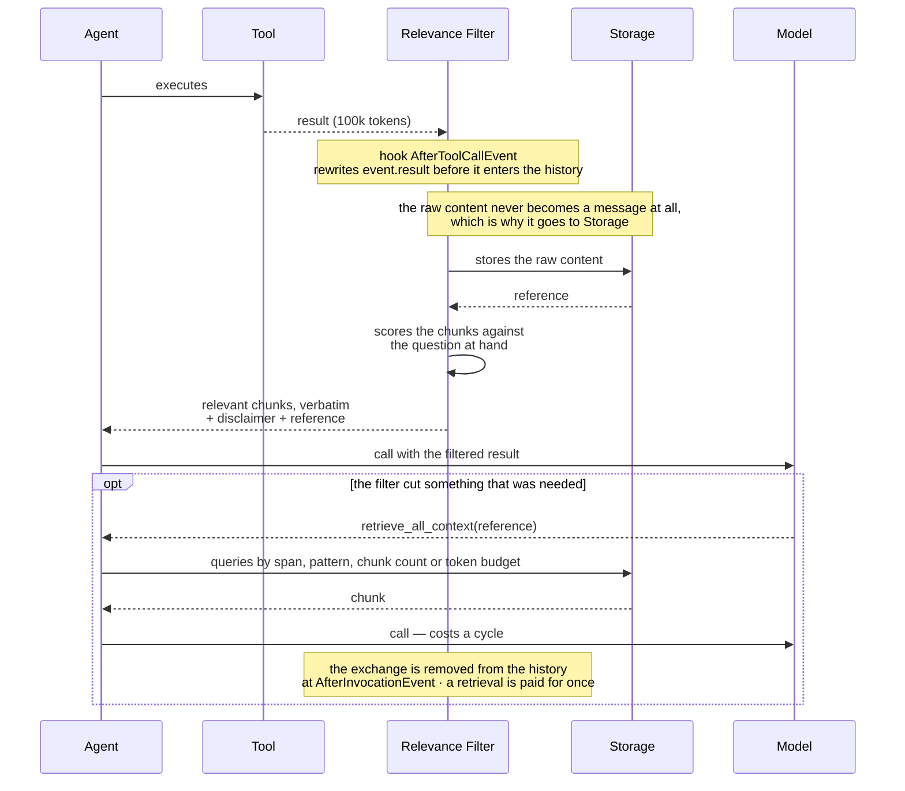
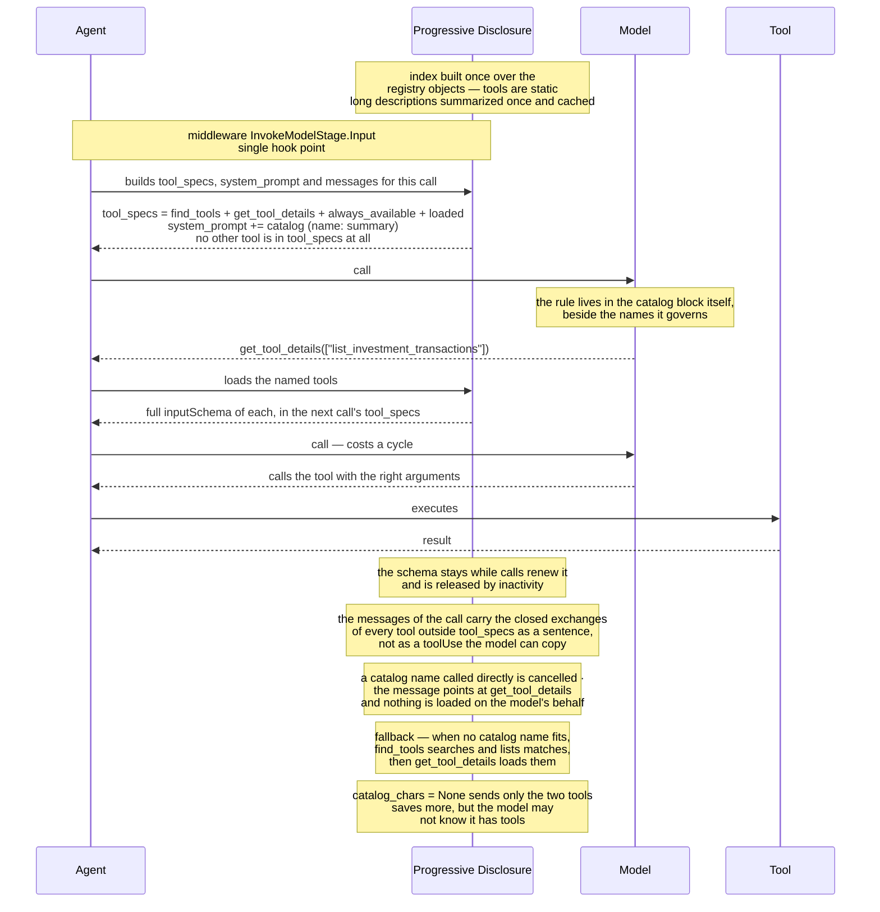
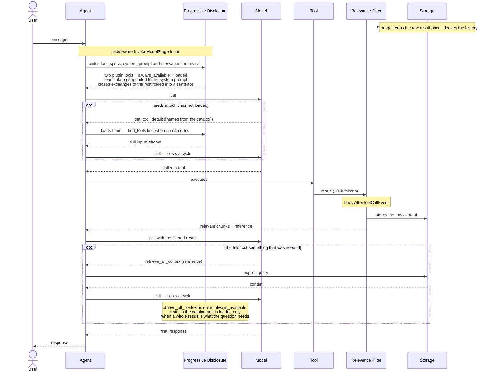

# Context Engineering — Concepts and Approaches

L100 view. Presents the concepts and the proposed approaches, without implementation detail, grounded
in a measured diagnosis of a real agent session.

Detail of each approach at L200 level:

- `design-a-relevance-filtering.md`
- `design-b-progressive-tool-disclosure.md`
- `design-d-context-graph.md` — reorganizes A and B into a single graph. It also covers what a
  standalone curator idea (C) would have done, which is why the set is A, B and D; see §19.2 there.

Status: **draft for discussion**

---

## 1. The problem

An agent's context grows with everything that happened, not with what matters to the
question at hand — and every turn resends everything that came before.

Every model call carries three parts:

```
  ┌────────────────────┬──────────┬──────────────────────────────┐
  │ tools              │ system   │ conversation history         │
  │ full manual        │ prompt   │                              │
  │ FIXED, every call  │ FIXED    │ GROWS every turn             │
  └────────────────────┴──────────┴──────────────────────────────┘
```

And the history does not grow, it accumulates:

```
  turn 1    ██
  turn 2    ██ ██
  turn 3    ██ ██ ██
  turn 4    ██ ██ ██ ██
  turn 5    ██ ██ ██ ██ ██        every turn resends everything
            └──────┬──────┘        that came before
                   │
          the cost is quadratic, not linear
```

Consequence: irrelevant content that entered on turn 2 is also paid for on turns 3, 4 and 5.
Retrieving or generating something useless is more expensive than the naive reading suggests.

---

## 2. The gap

Every context management mechanism that exists today selects by an **arithmetic**
criterion:

| Mechanism | Criterion |
|---|---|
| Sliding window | message age |
| Summarization | position (the oldest ones) |
| Compression trigger | percentage of the window consumed |
| Result offload | size in tokens |
| Offload preview | the first N characters |

That is, there are four decision axes in use and the only one that matters is missing:

```
  message age         ████████  sliding window
  position            ████████  summarization
  token size          ████████  result offload
  % of window full    ████████  compression trigger
  ─────────────────────────────────────────────────────
  RELEVANCE           ░░░░░░░░  no mechanism
```

The LLM already takes part in the process, but only to *write* the summary — after the
arithmetic has already chosen what is going to be summarized:

```
  arithmetic picks the range  ──▶  LLM writes the summary
  └── a VALUE decision             └── a FORM decision
      made without understanding       made far too late
```

Practical consequence: discarding by age does not distinguish the goal of the task from the
troubleshooting that came afterwards. Cutting by prefix can preserve a web page's CSS and
throw away the content.

---

## 3. The two concepts

**Attention Memory** — what the activity at hand needs in order to be completed. It has a
beginning and an end, and it leaves the context when the task closes.

**Background Memory** — what was legitimately discussed but is not the goal:
troubleshooting, format negotiation, digression. It is real, sometimes it needs to be
remembered, but it **must not pay a toll on every following turn**.

The distinction is not "useful vs useless". It is about responsibility: attention is input to
the answer, background is operational record — recoverable on demand, not resident.

In the measured session, the separation is sharp:

```
  turn     subject                          nature
  ─────    ─────────────────────────        ──────────────────
  1 to 8   investments, balances, positions  ATTENTION
  9        a user data correction            ATTENTION
  10 to 13 debug the data connector          BACKGROUND
                                             └─ 44.7% of consumption
```

And this is how the two behave today, versus how they should:

```
  TODAY                             PROPOSAL

  attention      ▓▓▓▓▓▓▓▓▓▓▓▓       attention      ▓▓▓▓▓▓▓▓▓▓▓▓
  background     ▓▓▓▓▓▓▓▓▓▓▓▓       background     ░░░░░░ ─────┐
                                                               │
  both resident,                                 archived,     │
  both paid on every                             recoverable ──┘
  following turn                                 on demand
```

The background does not disappear. It stops being resident.

---

## 4. The principle that guides the approaches

> Nothing is erased. What leaves the context stays recoverable.

Every reduction must be a **projection**, not a destruction:

```
  DESTRUCTION (today)                PROJECTION (proposal)

  history                            history            what the
    ├─ A                               ├─ A ──────────▶ call
    ├─ B  ──✂──  discarded             ├─ B            receives
    └─ C                               └─ C ──────────▶
         │                                  │
         ▼                                  ▼
  history                            history
    ├─ A                               ├─ A
    └─ C                               ├─ B   ◄── still there
                                       └─ C

  B never comes back                 B comes back on the next call
  error = irreversible               error = one poor call
```

Relevance is not decidable in code, unlike security. It will get things wrong. The design
has to survive the error — and it is the projection that guarantees that.

---

## 5. The approaches

```
┌─────────────────────────────────────────────────────────────┐
│  A. Relevance filter on the tool result                     │
│     "of 100k tokens of output, what answers the query?"      │
├─────────────────────────────────────────────────────────────┤
│  B. Progressive tool disclosure                             │
│     "I don't need the manual for every tool right now"       │
└─────────────────────────────────────────────────────────────┘
```

A and B are independent and act at distinct points of the cycle; D (its own L200 doc) reorganizes
them into one graph. The full map is in §6.

### A. Relevance filter on the tool result

When a tool returns too much content, today it is cut from the beginning. The proposal is to
score the chunks by relevance to the question and keep the ones that pass a threshold.

```
  tool returns 100k tokens

  TODAY                             PROPOSAL
  ┌──────────────────────────┐      ┌──────────────────────────┐
  │ ▓▓▓▓░░░░░░░░░░░░░░░░░░░░ │      │ ░░░▓░░░░▓░░░░░░░░░▓░░░░░ │
  └──────────────────────────┘      └──────────────────────────┘
    └ the first N characters            └ the chunks that answer
                                          the question

  on a web page, it keeps the        the CSS sinks because it
  CSS and throws out the content     answers nothing

              │                                  │
              ▼                                  ▼
     raw goes to the archive           raw goes to the archive
```

The raw content is archived and stays queryable. If the cut gets it wrong, the agent fetches
it back.

Two cautions:

- **Preserve verbatim.** The selected chunk enters as it is. Summarizing numeric or tabular
  data introduces silent error — it is where small models fail. Summarize only when the cut
  by relevance was not enough, and never over a number.
- **Does not solve aggregation.** "Sum it all up" has no relevant chunk, it has all of them.
  That case is fixed in the tool — paginating or aggregating at the source — not in the output.

### B. Progressive tool disclosure

Today the full description of every tool travels in every call. In the measured session,
that is the largest fixed part of the cost and it is identical across all calls.

The desired behavior is the bricklayer's: he knows he has a drill in the box, he does not
know by heart which bits he has. When he is going to drill, he looks at the bits in detail,
picks one, executes — and forgets the detail. If he needs it, he checks again.

```
  TODAY                             PROPOSAL
  ┌──────────────────────────┐      ┌──────────────────────────┐
  │ full manual for          │      │ CATALOG + 2 small tools  │
  │ ALL tools,               │      │  drill: makes holes      │
  │ on EVERY call            │      │  saw: cuts               │
  │                          │      │  tape: measures          │
  │ ██████████████████████   │      │  ░░░░░                   │
  │ ██████████████████████   │      ├──────────────────────────┤
  │ ██████████████████████   │      │ DETAIL  (only after      │
  │ ██████████████████████   │      │ the model asks)          │
  │                          │      │  the drill's bits        │
  │                          │      │  ███                     │
  └──────────────────────────┘      └──────────────────────────┘
```

The life cycle of the detail:

```
  about to drill   ──▶  asks for the bit; search brings the detail
  drills           ──▶  uses it
  done             ──▶  forgets the detail
  needs it again   ──▶  asks again
```

Translating:

- **Lean catalog**, always present, listed in the **system prompt**: each tool as its name plus a
  summary of its description within a character budget (`catalog_chars`). It is not a separate
  artifact — it is generated from the objects that are already registered, and the summary of a
  description too long to fit is written once and cached. The block states the rule where the names
  are read: a listed tool is not in the tool list and a direct call to it does not run.
- **Detail on demand**: the model names the tools it wants and `get_tool_details` loads their full
  parameters for the next call; when no listed name fits, `find_tools` searches over those same
  objects first. A call that skipped the load is cancelled with a message pointing at
  `get_tool_details`, and nothing is loaded on the model's behalf — a recovery that loaded it would
  teach that calling a catalog name directly works.
- **Forgetting**: the detail leaves when it stops being used. Every call that actually runs renews it.
- **Folding what the history shows**: a closed exchange with a tool that is not callable on this call
  goes in as a plain sentence — *the tool X was called and the result was: Y* — instead of a `toolUse`
  next to its result. The pair with its arguments is a template, and a model that copies it calls a
  tool the call no longer carries. The turn in flight is never folded, and nothing is rewritten in the
  agent's own history.

Forgetting is free — the tool is never removed from the agent, it just stops being sent.

The catalog size is a single knob, and it covers the entire spectrum:

```
  budget per tool                 resident         risk
  ─────────────────────────       ──────────       ─────────────────────────
  full (today)                     ~63,000         none
  ~20 tokens of description         ~2,500         low
  none, just the search               ~200         the model may not know
                                                   it has tools and deny
                                                   a capability it has
```

From full to lean is already 96% of the savings. Zeroing the catalog buys the remaining 2.3k
at the cost of depending on the model suspecting that it is worth searching — that is why it
is optional, not default.

Cutting the description by budget works here because docstring convention puts the summary on
the first line. It is the opposite of the tool result, where the beginning is rarely what
matters.

Why forget instead of accumulate: the conversation branches. If every visited subject left
its detail resident, the cost would go back to growing without end. Forgetting keeps the cost
flat.

### Why there is no idea C

The lettering runs A, B, D. C would have been a background *context curator*: a mechanism classifying
each turn as focus or background, moving the background out of the resident context and bringing it back
when the subject returned. It is **not a standalone approach here** — idea **D** (context graph)
reorganizes A, B and that separation into one graph, where focus/background becomes the graph's
activation/deactivation over an immutable log. See §19.2 of `design-d-context-graph.md`.

### A note on retrieved memory (not one of the approaches)

Worth separating, because it is easy to confuse with background. Memory retrieved from a
store is not conversation history, and there are two ways to bring it in — with very
different costs:

| Form | Cost |
|---|---|
| Transient injection, assembled on every call | linear, does not accumulate |
| Insertion inside the user message | accumulative, quadratic |

The second is what the measured session showed: ~8k per turn that become resident and are resent in
every following call, ~104k over the session. The fix requires no classification — it requires the
injection to be **transient**. It is low risk and attacks a big part, so it deserves to come before
the approaches.

Memory **selectivity** is a separate lever: retrieval itself — how many entries to bring and with
what relevance threshold, exposed as configuration of whoever queries the store.

---

## 6. The full cycle

Where each approach comes in:

```
                     user message
                             │
                             ▼
        ┌──────────────────────────────────────────────┐
        │ BUILDS THE CALL                              │
   B ──▶│   find + lean tool catalog                   │
        │   (the detail enters when the model asks)    │
        │   memory injected transiently                │
        └───────────────────┬──────────────────────────┘
                            ▼
                     ┌─────────────┐
                     │    MODEL    │
                     └──────┬──────┘
                            │
                ┌───────────┴────────────┐
                ▼                        ▼
          final response          called a tool
                │                        │
                │                        ▼
                │                 ┌─────────────┐
                │                 │    TOOL     │
                │                 └──────┬──────┘
                │                        ▼
                │      ┌──────────────────────────────────┐
                │      │ FILTERS THE RESULT               │◄── A
                │      │ scores the chunks, keeps the     │
                │      │ relevant ones, stores the raw    │
                │      └────────┬──────────────────┬──────┘
                │               │                  │
                │      back to top of the cycle    │
                │               │                  ▼
                │               │        ┌────────────────────┐
                │               │        │      STORAGE       │
                │               │        │ raw tool results   │
                ▼               │        │ (stashed, not in   │
          END OF TURN ◄─────────┘        │  the history)      │
                │                        └────────────────────┘
                ▼
          response to the user
```

### Sequence of A — filter on the tool result



### Sequence of B — progressive tool disclosure



### The full path, in one sequence



Three readings of the diagrams:

**The critical path gains no new work.** B delivers decisions already taken; the cycle
only filters by them. The only step that reasons inside the cycle is A, and it runs once per
tool result, not per model call.

**What leaves the context goes to two distinct places.** The raw tool result is rewritten out of
the history before the next call, so it needs its own storage. Idea D generalizes this into a graph
where any deactivated node can be recovered.

**Coming back has a route.** When the model asks for something back it pays a cycle for it; the
archived content is always retrievable, so a filter that erred costs a follow-up query, never a lost
fact.

---

## 7. Comparison

| | Unit | When it acts | If it errs | Risk |
|---|---|---|---|---|
| A | result chunk | when the tool returns | fetches the archived content | low |
| B | tool description | when building the call | queries again | low |
| D | graph node | across turns, activation over an immutable log | reactivates the node | low–medium |

D reorganizes A and B — and the earlier curator idea — into one graph: rather than a parallel
classifier on the critical path, the focus/background distinction becomes activation/deactivation of
nodes that are never erased, so an error is a badly scoped call fixable on the next one, not lost
information.

---

## 8. Proposed order

| # | Action | Why in this position |
|---|---|---|
| 1 | Fix the per-turn consumption measurement | today it reports the accumulated value; without this nothing is verifiable |
| 2 | Make the memory injection transient | a defect fix, not a feature; kills a quadratic cost |
| 3 | **B** — progressive tool disclosure | largest fixed part, arithmetic gain, no semantic judgment |
| 4 | **A** — filter on the tool result | scope contained to one result, with a route back |
| 5 | **D** — context graph | reorganizes A and B (and the earlier curator idea) into one graph; most new pieces |

Items 1 and 2 are not new approaches — they are fixes. They come first because one makes the
rest measurable and the other removes a cost that grows on its own.

The order differs from an intuitive reading for one reason: B and A are verifiable by direct
measurement and do not depend on getting a judgment right. D reorganizes them into a graph and is
the largest piece, so it comes last.

D also benefits from A and B already being in place: with the tool results filtered and the tool
detail on demand, the history left to organize into the graph is much smaller, and it becomes easier
to judge whether the graph pays for itself.

---

## 9. What these approaches do not solve

- **A tool that returns too much.** Filtering the output is remediation. The fix is the tool
  returning less.
- **A query that needs the whole thing.** Aggregation has no excerpt.
- **Relevance with a guarantee.** There is no deterministic verification of "this matters".
  The design mitigates by assuming it will err; it does not eliminate the error.

---

## 10. Open decisions

1. Is the background **discarded** or **archived** with an explicit query?
2. Who defines the goal of the attention — the user, the agent, or the platform that
   triggered it?
3. How long does a tool's detail stay before being forgotten?
4. Is the change of subject declared or inferred?
5. Are the relevance thresholds fixed, or calibrated per use case? (They do not need to be
   answered to start — an argument in favor of exposing them as configuration.)
6. How conservative is the curator? The adjustment is between token cost and risk of a poor
   answer, and it is its only parameter that changes behavior visibly.
