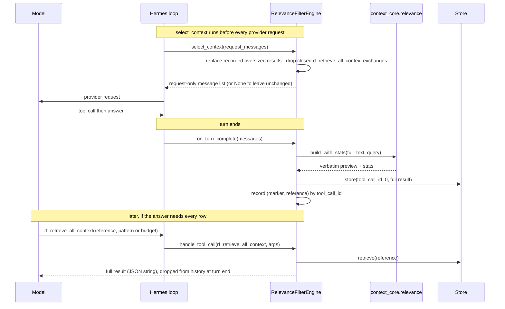

# Practice A — `hermes-relevance-filter`: Sequence & Integration Design

All line references are into one of three trees, named per reference:

| Band | Tree | Files |
|------|------|-------|
| **1. Hermes interface** | `hermes-plugins/hermes-relevance-filter/src/hermes_relevance_filter/` | `engine.py`, `_base.py`, `_compat.py` |
| **2. Message adapter** | the same package | `_adapter.py` |
| **3. `context-core`** | `context-core/src/context_core/` | `message.py`, `relevance/preview.py`, `relevance/search.py`, `relevance/store.py`, `relevance/reranker.py` |

> **Why this is different from the Strands and LangGraph bindings.** Hermes's `ContextEngine` is
> **synchronous** and hands the engine the finished turn's messages through `on_turn_complete`, not each
> tool result at production time. So detection and storage happen in `on_turn_complete`
> (`engine.py:172`) and the rewrite is applied, request-only, in `select_context` (`engine.py:219`).
> Every *decision about content* is still the same `context_core.relevance` code the Strands and
> LangGraph bindings call.

## 1. What the engine does, mechanically

`class RelevanceFilterEngine(BaseEngine)` (`engine.py:102`) implements the `ContextEngine` ABC resolved
through `_compat.py` — the real ABC when Hermes is installed, a faithful stub otherwise
(`_compat.py:28`). It overrides three seams and ships one tool:

- `on_turn_complete(messages)` (`engine.py:172`) scans the finished turn's `role: "tool"` messages. For
  each one over the gate — the Strands `ceil(chars/4)` text / `ceil(json/2)` JSON heuristic
  (`_approximate_tokens`, `engine.py:76`) — it drives `_build_rewrite` (`engine.py:193`): store the full
  text in the store under `<tool_call_id>_0`, score and build the verbatim preview
  (`RelevancePreview.build_with_stats`, `preview.py:504`), and record `(marker, reference)` keyed by
  `tool_call_id`.
- `select_context(request_messages)` (`engine.py:219`) returns a request-only copy with each recorded
  oversized result replaced by its marker, and closed `rf_retrieve_all_context` exchanges dropped
  (`_drop_tool_exchanges`). Any exception leaves the request unchanged (fail-open), matching the ABC
  contract at `conversation_loop.py:1295`.
- `get_tool_schemas()` (`engine.py:254`) returns `[rf_retrieve_all_context]`; `handle_tool_call`
  (`engine.py:259`) resolves a reference and returns the content as a JSON string.

The core store and reranker are async; the sync engine drives them to completion on a private loop
(`_run_to_completion`, `engine.py:69`).

## 2. Integration table — Hermes attachment points

| # | `ContextEngine` member | Defined at | Host call site | Role |
|---|---|---|---|---|
| 1 | `on_turn_complete` | `engine.py:172` | finalization seam (fires on a normal turn end) | detect oversized results, store them, record the rewrite |
| 2 | `select_context` | `engine.py:219` | `agent/conversation_loop.py:1295`, every turn, fail-open | replace recorded oversized results, drop closed retrieval exchanges |
| 3 | `get_tool_schemas` | `engine.py:254` | `agent/agent_init.py:2138`, merged at init | registers `rf_retrieve_all_context` |
| 4 | `handle_tool_call` | `engine.py:259` | `agent/tool_executor.py:1666` | runs `rf_retrieve_all_context`, returns a JSON string |

## 3. The turn

## 4. Documented deviation

**Token gate heuristic.** The sync engine exposes no model handle for native token counting, so the gate
uses the Strands default `count_tokens` heuristic recomputed locally (`_approximate_tokens`,
`engine.py:76`). It flips at the same size as the Strands plugin unless a Strands model opts into native
counting — the same compromise the LangGraph binding documents.
