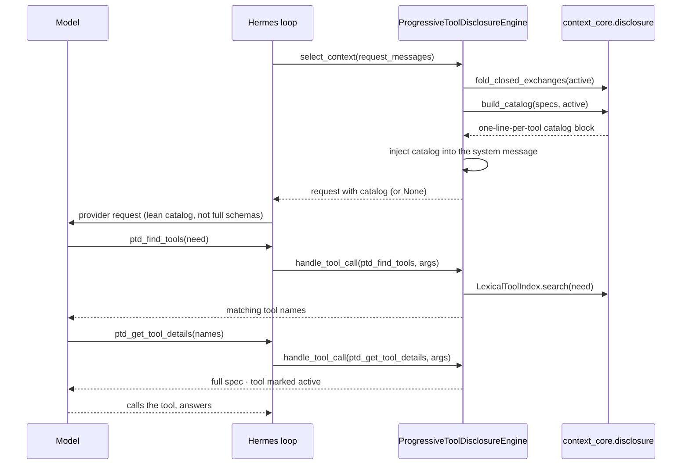

# Practice B — `hermes-progressive-tool-disclosure`: Sequence & Integration Design

| Band | Tree | Files |
|------|------|-------|
| **1. Hermes interface** | `hermes-plugins/hermes-progressive-tool-disclosure/src/hermes_progressive_tool_disclosure/` | `engine.py`, `_base.py`, `_compat.py` |
| **2. Message adapter** | the same package | `_adapter.py` |
| **3. `context-core`** | `context-core/src/context_core/disclosure/` | `catalog.py`, `tool_index.py` |

> **The one practice whose Hermes surface differs most.** Strands and LangGraph rewrite the model
> request's `tool_specs` directly. Hermes's `ContextEngine` does not own the agent's base tool catalog,
> so B runs the **portable** path: inject the catalog into the system message via `select_context`
> (`engine.py:126`) and expand specs on demand. See §4.

## 1. What the engine does, mechanically

`class ProgressiveToolDisclosureEngine(BaseEngine)` (`engine.py:70`) is constructed with the agent's base
tool schemas (OpenAI function-tool dicts converted to `context_core` `ToolSpec` by `_openai_tool_to_spec`,
`engine.py:52`), because the ABC gives the engine no access to the host tool set.

- `select_context(request_messages)` (`engine.py:126`): fold closed `ptd_get_tool_details` exchanges
  (`context_core.disclosure.fold_closed_exchanges`), build the one-line catalog of tools not yet active
  (`build_catalog`, `catalog.py:376`), and inject it into the system message (`_inject_catalog`). Fail-open.
- `get_tool_schemas()` (`engine.py:169`): `[ptd_find_tools, ptd_get_tool_details]`.
- `handle_tool_call` (`engine.py:172`): `ptd_find_tools` runs the lexical index (`_find_tools`,
  `engine.py:183`, over `LexicalToolIndex`, `tool_index.py:177`); `ptd_get_tool_details` returns the full
  spec and marks the tool active so the next call folds and does not re-summarize it (`_get_tool_details`,
  `engine.py:195`).

## 2. Integration table

| # | Member | Defined at | Host call site | Role |
|---|---|---|---|---|
| 1 | `select_context` | `engine.py:126` | `conversation_loop.py:1295` | inject catalog, fold closed detail exchanges |
| 2 | `get_tool_schemas` | `engine.py:169` | `agent_init.py:2138` | register `ptd_find_tools` + `ptd_get_tool_details` |
| 3 | `handle_tool_call` | `engine.py:172` | `tool_executor.py:1666` | run the two disclosure tools |

## 3. The turn

## 4. Documented limitation — base schemas not stripped (non-blocking follow-up)

The ABC exposes **no hook to rewrite the agent's base tool catalog** — the engine owns only its own
`get_tool_schemas()` and the message list. So this binding injects the catalog and steers the model to
`ptd_find_tools`/`ptd_get_tool_details`, but the base schemas Hermes assembled still reach the provider. This is
consistent with the LangGraph README's "Portable (LangChain ships a subset of this natively)" note.
Stripping the base schemas, if a Hermes host hook is found, is recorded as a non-blocking follow-up — not
a requirement. The engine's catalog + on-demand expansion delivers the token saving regardless.
