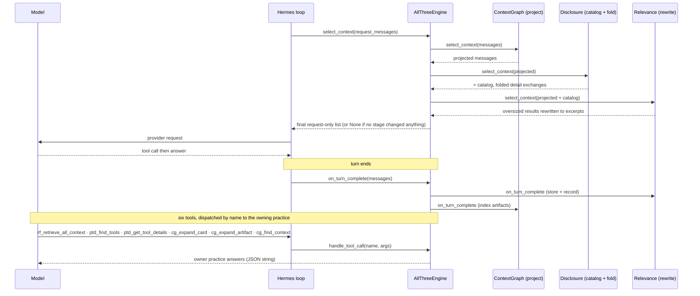

# Combined stack — `hermes-all-three`: Sequence & Integration Design

| Band | Tree | Files |
|------|------|-------|
| **1. Hermes interface** | `hermes-plugins/hermes-all-three/src/hermes_all_three/` | `engine.py`, `_base.py`, `_compat.py` |
| **2. Composed engines** | the three sibling packages | `hermes_relevance_filter.engine`, `hermes_progressive_tool_disclosure.engine`, `hermes_context_graph.engine` |
| **3. `context-core`** | `context-core/src/context_core/` | `relevance/`, `disclosure/`, `graph/` (unchanged) |

> **Why one engine.** Hermes allows only one active context engine (`register_context_engine` refuses a
> second). So "all three" is not three co-installed plugins — it is this one composed engine
> (`class AllThreeEngine(BaseEngine)`, `engine.py:42`) that applies A+B+D in one `select_context`,
> `get_tool_schemas` and `on_turn_complete`, reusing the three sibling engines unchanged over one shared
> `context-core`.

## 1. What the composed engine does, mechanically

- **Construction** instantiates the three single engines and hands A's store to D as its `stash`
  (`engine.py` constructor), so a `[ref: …]` the filter mints resolves through `cg_expand_artifact` as well
  as `rf_retrieve_all_context`. It builds a `tool_name -> owner` dispatch map from the three engines'
  schemas.
- `select_context(request_messages)` (`engine.py:90`): pipeline the message list in order **D (project)
  → B (catalog + fold) → A (rewrite)**, each stage the same `context_core` call the single engine makes.
  Each stage is independently fail-open.
- `get_tool_schemas()` (`engine.py:126`): the union of the six tools.
- `handle_tool_call` (`engine.py:132`): dispatch by tool name to the owning practice.
- `on_turn_complete` (`engine.py:119`): A's close, then D's indexing, in order.
- `update_model` / `on_session_reset` fan out to all three.

## 2. Composition order

## 3. The three silent-failure traps this engine prevents

1. **Composition order** is fixed at D → B → A, so each stage sees the previous stage's output. A
   hand-rolled pipeline in the wrong order folds away context the next stage needed.
2. **One shared relevance store** — A's store is handed to D as its `stash`, so a filter reference
   resolves through `cg_expand_artifact` too. Two separate stores would leave a reference resolvable in
   neither.
3. **Distinct retrieval tools** — `rf_retrieve_all_context` (A) and `cg_expand_artifact` (D) are scoped by name
   and description so the model does not read them as one job.

The relevance threshold default here is **`0.02`** (the benchmark value — a distribution position, not an
absolute score).
