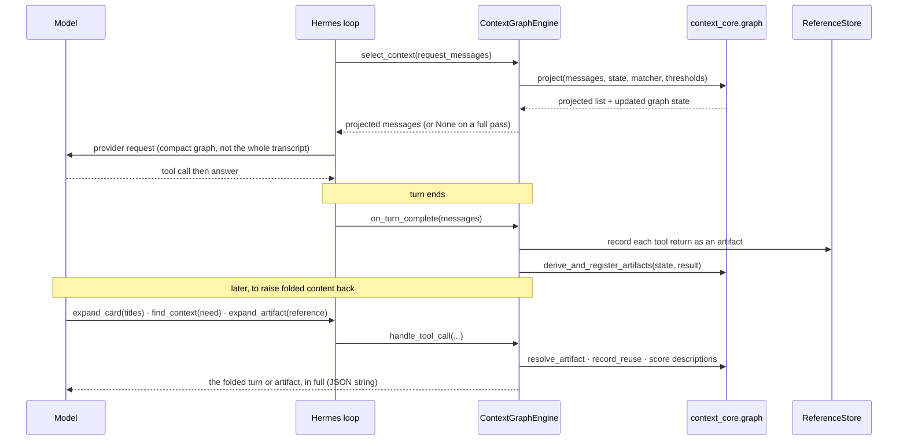

# Practice D — `hermes-context-graph`: Sequence & Integration Design

| Band | Tree | Files |
|------|------|-------|
| **1. Hermes interface** | `hermes-plugins/hermes-context-graph/src/hermes_context_graph/` | `engine.py`, `_base.py`, `_compat.py` |
| **2. Message adapter** | the same package | `_adapter.py` |
| **3. `context-core`** | `context-core/src/context_core/graph/` | `projection.py`, `cards.py`, `scoring.py`, `store.py`, `describe.py`, `matcher.py` |

> **Single-select bonus.** This engine *replaces* Hermes's default lossy `context_compressor`, so the
> "nothing may delete from the history behind the graph" precondition holds structurally — there is no
> co-active summarizer to fight. In LangGraph the middleware can only warn about a co-installed pruning
> middleware. The projection is request-only, so persisted history is never deleted — a mis-cut costs one
> recovery call, never a lost fact.

## 1. What the engine does, mechanically

`class ContextGraphEngine(BaseEngine)` (`engine.py:93`) holds the `GraphState` and the reference store on
the instance (process-local, not Hermes persisted state — the same rationale as the LangGraph binding's
per-conversation store).

- `select_context(request_messages)` (`engine.py:171`): run `context_core.graph.project` over the closed
  turns, return the projected list (Cards at full / description / title). The core returns the input list
  by identity on a full pass, read here as "change nothing" (`return None`). Fail-open.
- `on_turn_complete(messages)` (`engine.py:199`): store each tool return as an artifact under
  `<tool_call_id>_0` (`record_references`) and derive its artifact Cards
  (`derive_and_register_artifacts`, `cards.py:779`). Our own retrieval answers are skipped.
- `get_tool_schemas()` (`engine.py:233`): `[expand_card, expand_artifact, find_context]`;
  `handle_tool_call` (`engine.py:239`) dispatches to `expand_card` (`engine.py:257`), `expand_artifact`
  (`engine.py:287`) and `find_context` (`engine.py:316`), all returning JSON strings.

## 2. Integration table

| # | Member | Defined at | Host call site | Role |
|---|---|---|---|---|
| 1 | `select_context` | `engine.py:171` | `conversation_loop.py:1295` | project closed turns, request-only |
| 2 | `on_turn_complete` | `engine.py:199` | finalization seam | record artifacts, derive artifact Cards |
| 3 | `get_tool_schemas` | `engine.py:233` | `agent_init.py:2138` | register the three recovery tools |
| 4 | `handle_tool_call` | `engine.py:239` | `tool_executor.py:1666` | run expand_card · expand_artifact · find_context |

## 3. The turn

## 4. Documented compromises (mirrors the LangGraph binding)

1. **One projection point.** Card derivation runs from the finished turn's messages in
   `on_turn_complete`, and the projection in `select_context` — the same deterministic inputs (closed
   turns) as the Strands three events.
2. **Artifact content.** Hermes has no Strands context-manager Stash, so the return's own text is stored
   under `<tool_call_id>_0` and `expand_artifact` reads it back; a `stash` (the relevance filter's store)
   is the second resolution layer, which is what `hermes-all-three` wires up.
3. **Frozen choice flattened.** `TurnChoice.by_title` is a `MappingProxyType`; it is flattened to a plain
   dict before the state is carried, and the choice is recomputed each call, so nothing is lost
   (`_persistable`).
