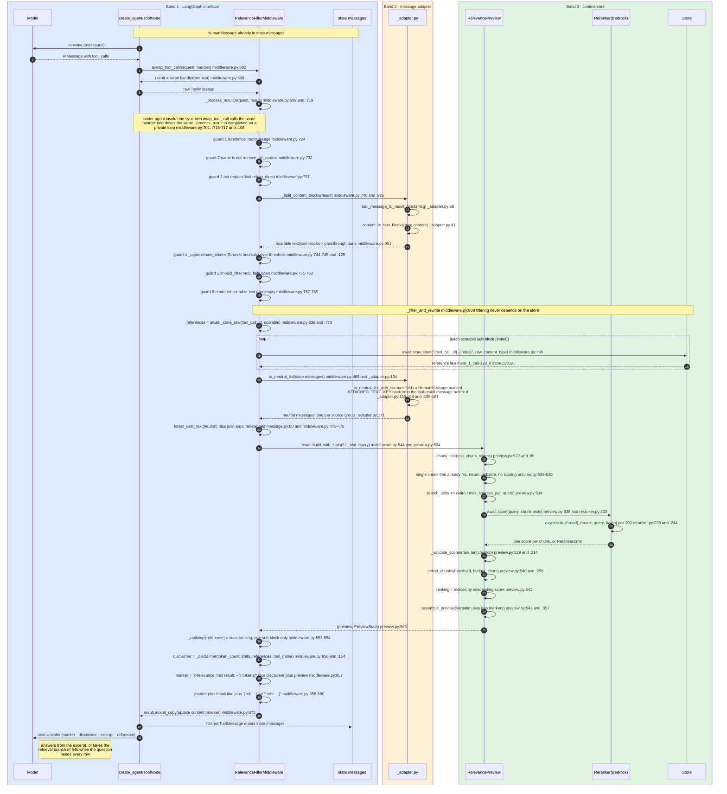
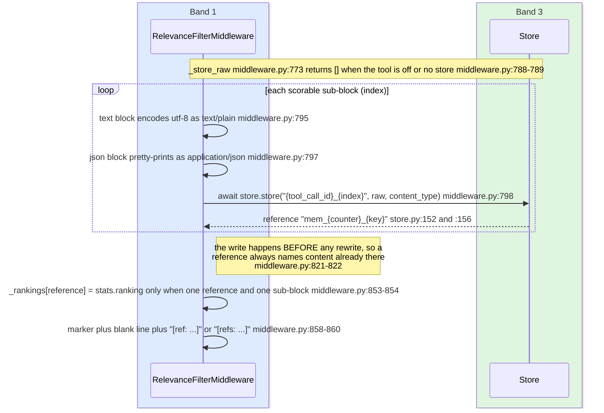
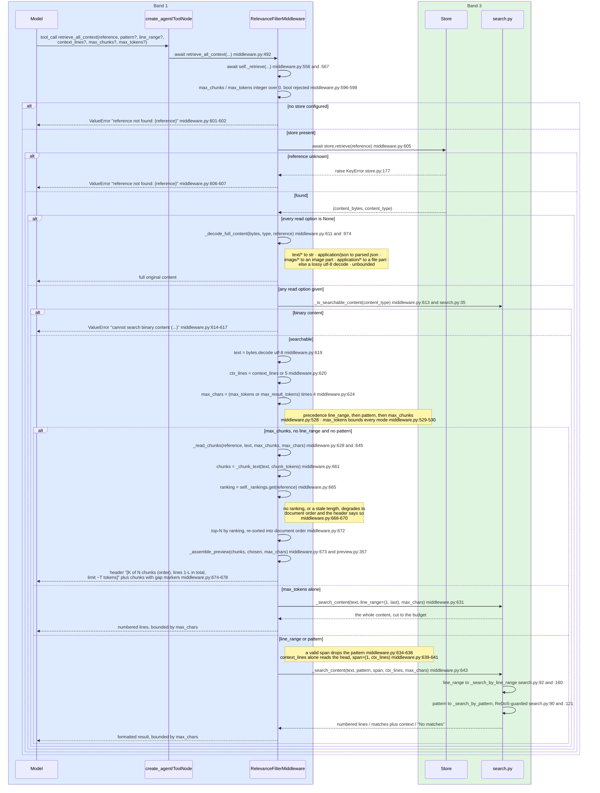
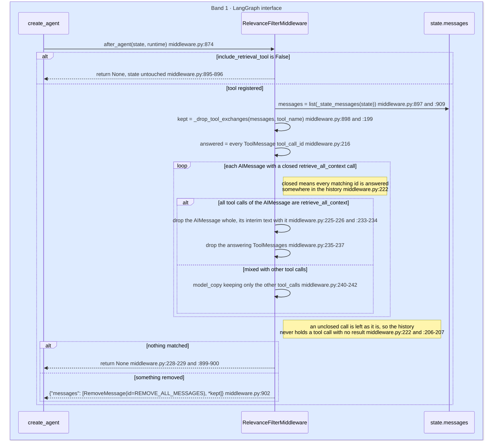

# Practice A — `langgraph-relevance-filter`: Sequence & Integration Design

All line references are into one of three trees, named per reference:

| Band | Tree | Files |
|------|------|-------|
| **1. LangGraph interface** | `langgraph-plugins/langgraph-relevance-filter/src/langgraph_relevance_filter/` | `middleware.py`, `_compat.py` |
| **2. Message adapter** | the same package | `_adapter.py` |
| **3. `context-core`** | `context-core/src/context_core/` | `message.py`, `relevance/preview.py`, `relevance/search.py`, `relevance/store.py`, `relevance/reranker.py`, and `graph/store.py` where §2 and §9 describe the seam the context-graph binding reads |

§8 references `validation/plugins-langgraph/src/` (`runner.py`, `config.py`).

> **The three-band split is the point of this binding.** `context_core` never imports LangChain
> (`message.py:3`) and the binding never leaks a LangChain type into the core — everything crossing
> the boundary is converted in `_adapter.py` (`_adapter.py:3-5`). So the same Practice A that
> `strands-relevance-filter` implements against `AfterToolCallEvent` is here reached through a
> `ToolMessage`, and every *decision about content* is the same code
> (`middleware.py:16-18`).
>
> **Default mode.** `include_retrieval_tool` defaults to **`True`** (`middleware.py:366`). The turn is
> `llm -> tool -> filtered ToolMessage (+ disclaimer + reference) -> llm`, with a retrieval branch the
> model may take when the question needs the whole result. The store is created
> (`middleware.py:397`), a `[ref: ...]` token is emitted (`middleware.py:858-860`), and
> `retrieve_all_context` is put on `self.tools` for LangGraph to compile in (`middleware.py:405`).
> Passing `include_retrieval_tool=False` is the opt-out: no store, no reference token, no tool, no
> cleanup.
>
> **Storage never gates filtering.** Chunking, reranking, selection and the rewrite of the
> `ToolMessage` run identically with or without a store (`_filter_and_rewrite`,
> `middleware.py:808`). The store is a step that runs first (`_store_raw`, `middleware.py:773`) and
> exists only to serve `retrieve_all_context` (`middleware.py:395-397`).
>
> **Four documented deviations from the Strands plugin.** The token count is the Strands default
> `count_tokens` heuristic recomputed in the binding rather than asked of the model
> (`middleware.py:20-25`, `_approximate_tokens` at `middleware.py:125`); the delegation guard reads
> `tool.return_direct` instead of `_AgentAsTool` (`middleware.py:26-28`, guard at
> `middleware.py:737`); the end-of-run cleanup must emit `RemoveMessage(id=REMOVE_ALL_MESSAGES)`
> because the `messages` reducer merges rather than replaces (`middleware.py:883-886`, emitted at
> `middleware.py:902`); and the sync hook has to drive an async pipeline itself — `wrap_tool_call`
> (`middleware.py:701`) runs the same `_process_result` through `_run_to_completion`
> (`middleware.py:108`, called at `middleware.py:717`), which is what makes `invoke` work as well as
> `ainvoke`. Each is expanded in §9.
>
> **One seam that is not a framework attachment.** The `stash` property (`middleware.py:407-415`)
> exposes this filter's store as `retrieve(reference) -> text`, so another plugin's reference
> resolution can answer a `[ref: mem_N_...]` this filter minted. It is the layer the Strands
> `ContextManager` Stash provides there and LangGraph has no equivalent of; the harness passes it to
> the context-graph binding (`runner.py:550`), which hands it to
> `context_core.graph.store.resolve_artifact` as the second resolution layer (`graph/store.py:284-286`).

---

## 1. What the middleware does, mechanically

The middleware subclasses `AgentMiddleware` — `class RelevanceFilterMiddleware`
(`middleware.py:312`) — imported through the one-file compatibility shim `_compat.py`
(`_compat.py:8`), which is pinned to `langchain` 1.4.2 (`_compat.py:3`). It implements **four**
hooks — `awrap_tool_call` (`middleware.py:682`), its sync twin `wrap_tool_call`
(`middleware.py:701`), `after_agent` (`middleware.py:874`) and `aafter_agent`
(`middleware.py:904`) — and ships **one** tool, `retrieve_all_context`, on the `tools` attribute
LangGraph reads at compile time (`middleware.py:405`, built at `middleware.py:480`).

Both tool hooks funnel into one body. `awrap_tool_call` awaits `handler`
(`middleware.py:698`) and passes the result to `_process_result` (`middleware.py:699`, defined at
`middleware.py:719`); `wrap_tool_call` calls the same handler synchronously (`middleware.py:716`) and
drives the same coroutine to completion on a private event loop (`middleware.py:717`,
`_run_to_completion` at `middleware.py:108`). `_process_result` then runs six guards
(`middleware.py:724`, `:732`, `:737`, `:745`, `:751`, `:768`). Past all six, it hands the
`ToolMessage` to the adapter, which renders it as a neutral `toolResult` block
(`_split_content_blocks`, `middleware.py:925`, via `tool_message_to_result_block`,
`_adapter.py:58`), stores the raw scorable sub-blocks (`middleware.py:838`), and asks the core to
chunk, score and select (`build_with_stats`, `preview.py:504`). Selection is verbatim — chosen
chunks are exact substrings of the source (`_select_chunks`, `preview.py:255`; assembly at
`preview.py:357`) — so numbers, currency and tables stay exact.

**Four things travel back to the model.** The rewritten content is a marker, a **disclaimer**, the
verbatim preview, and a reference token (`middleware.py:856-860`). The disclaimer is built from the
`PreviewStats` the selection returned (`_disclaimer`, `middleware.py:154`; called at
`middleware.py:856`) and states how much of the result is on screen, that an answer needing every
row cannot be computed from it, and — with the tool registered — the call and the budgets that reach
the rest (`middleware.py:184-188`).

**The message is never mutated.** The rewrite is `result.model_copy(update={"content": content})`
(`middleware.py:872`), and non-scorable content parts (image, file, audio, video — `middleware.py:103`)
survive verbatim after the filtered block (`middleware.py:871`).

**Opt-out mode (`include_retrieval_tool=False`).** No store is built (`middleware.py:397`),
`_store_raw` returns an empty list at once (`middleware.py:788-789`), so `references` is empty and
the `if references:` branch that appends the token never runs (`middleware.py:858`), no ranking is
memoized (`middleware.py:853`), `self.tools` is empty so LangGraph compiles no tool
(`middleware.py:405`), and `after_agent` returns `None` before touching the state
(`middleware.py:895-896`). The disclaimer takes its other branch and tells the model to say the
result was filtered rather than aggregate the excerpt (`middleware.py:181`). Filtering itself is
unaffected.

---

## 2. Integration table — every LangChain/LangGraph attachment point

The middleware attaches to the LangChain v1 `create_agent` middleware surface only, through
`_compat.py` so an upstream API move touches one file (`_compat.py:1-4`).

| # | Attachment | Defined at | Mechanism / order | Reads | Mutates |
|---|-----------|-----------|-------------------|-------|---------|
| 1 | `awrap_tool_call` — the `AfterToolCallEvent` analog | `middleware.py:682` | Override on `AgentMiddleware`. Wraps the tool: `handler(request)` is awaited **exactly once** (`middleware.py:698`), then `_process_result` (`middleware.py:719`) runs the guards and the rewrite, every guard an early return of the handler's own object. | `request.tool_call` copied and its `name` read (`middleware.py:727-728`), re-read for `args` when the query is built (`middleware.py:842`); `request.tool.return_direct` (`middleware.py:737`); `request.state` for `messages` (`middleware.py:842`, `_state_messages` at `middleware.py:909`); `result.tool_call_id` (`middleware.py:836`) | Nothing in place. Returns either the handler's `ToolMessage` untouched or a `model_copy` of it (`middleware.py:872`). |
| 2 | `wrap_tool_call` — the sync twin | `middleware.py:701` | Override. Calls `handler(request)` synchronously, **exactly once** (`middleware.py:716`), and drives the shared `_process_result` coroutine to completion (`middleware.py:717`) through `_run_to_completion` (`middleware.py:108`): `asyncio.run` on this thread when no loop is running here (`middleware.py:117-120`), on a one-worker `ThreadPoolExecutor` when one is (`middleware.py:121-122`). So `agent.invoke` filters exactly as `agent.ainvoke` does. | Same as #1 | Same as #1 |
| 3 | `after_agent` — the `AfterInvocationEvent` analog | `middleware.py:874` | Override; returns a **state update dict** rather than writing anything. Fires when the run ends. | `self._include_retrieval_tool` (`middleware.py:895`); `state["messages"]` (`middleware.py:897`); `self.retrieval_tool_name` (`middleware.py:898`) | `state["messages"]`, via the returned `{"messages": [RemoveMessage(id=REMOVE_ALL_MESSAGES), *kept]}` (`middleware.py:902`). The reduced list is built by `_drop_tool_exchanges` (`middleware.py:199`). Nothing else. |
| 4 | `aafter_agent` | `middleware.py:904` | Async form. The cleanup is pure list surgery, so it simply delegates to `after_agent` (`middleware.py:906`). | Same as #3 | Same as #3 |
| 5 | `retrieve_all_context` on `self.tools` | `middleware.py:405`, built at `middleware.py:480`, decorated `@tool(_RETRIEVAL_TOOL_NAME)` at `middleware.py:491` | LangGraph reads `tools` at **compile time**; an empty sequence registers nothing, which is how the opt-out drops it (`middleware.py:404-405`). Built **per instance**, not as a class attribute, because it closes over *this* middleware's store and rankings (`middleware.py:483-485`). | `reference`/`pattern`/`line_range`/`context_lines`/`max_chunks`/`max_tokens`; `self._store` (`middleware.py:600`); `self._max_result_tokens` (`middleware.py:624`); `self._rankings` (`middleware.py:665`) | Nothing in state. Returns content to the model. |

**Construction is inert** (`middleware.py:321-323`). `__init__` (`middleware.py:360`) validates
`max_result_tokens > 0` (`middleware.py:386-387`), calls `super().__init__()`
(`middleware.py:389`), and builds no `Reranker` and no `RelevancePreview` — those are created on the
first scoring call (`_resolve_preview`, `middleware.py:419`, guarded at `middleware.py:433`), so a
middleware that never fires needs no AWS credentials merely to be declared
(`middleware.py:422-424`). The only object it may build is the default `InMemoryStore`, and only
when something can read it back (`middleware.py:397`).

There is **no** `before_model`, no `wrap_model_call`, no `after_model`, no `state_schema` extension
and no system-prompt writer anywhere in the source.

**One seam that is not a LangChain attachment: `stash`.** The `stash` property
(`middleware.py:407-415`) returns a `_RelevanceStash` (`middleware.py:295`) wrapping this
middleware's store, whose single `retrieve(reference)` (`middleware.py:305`) decodes `text/*` and
`application/json` to a string and answers `None` for anything else (`middleware.py:307-309`). It is
`None` when no store exists — the opt-out (`middleware.py:415`). Nothing in LangChain reads it: the
consumer is another plugin's reference resolution, which the harness wires by passing it to the
context-graph middleware (`runner.py:550`), where it becomes the `stash=` second layer of
`context_core.graph.store.resolve_artifact` (`graph/store.py:284-286`, consulted only for what that
plugin's own store does not hold, `graph/store.py:306-317`).

---

## 3. Sequence diagram — one full turn, DEFAULT mode, across the three bands

The `box` groupings are the bands: what is framework-specific, what is the adapter, and what is core.
Every step inside band 3 is shared with any other binding of Practice A.



Failure short-circuits that leave the raw `ToolMessage` in state unchanged:

- `RerankerError` from `build_with_stats` → logged at debug, original returned, never re-scored
  (`middleware.py:845-849`).
- A store write raising → caught by `except Exception`, logged as a warning, `None` returned
  (`middleware.py:799-805`), which `_filter_and_rewrite` turns into an early exit
  (`middleware.py:839-840`). A reference is never handed out for content that is not there
  (`middleware.py:821-822`). Unreachable in the opt-out, since nothing is stored.

**Opt-out mode** removes three steps and changes one: the `_store_raw` loop does not run
(`middleware.py:788-789`), the `[ref: ...]` line is skipped (`middleware.py:858`), no ranking is
memoized (`middleware.py:853`), and the disclaimer takes its no-reference branch
(`middleware.py:181`). Everything between `_filter_and_rewrite` and the `model_copy` is
identical.

### 3a. What each band owns

| Step | Band | Why it sits there |
|------|------|-------------------|
| `awrap_tool_call`, `wrap_tool_call`, the six guards, `after_agent`/`aafter_agent`, `self.tools` | 1 | Pure LangChain/LangGraph attachment. `ToolMessage`, `AIMessage`, `RemoveMessage`, `REMOVE_ALL_MESSAGES`, `BaseTool`, `@tool` are the only framework types imported (`middleware.py:43-45`). |
| `tool_message_to_result_block`, `to_neutral`, `to_neutral_list`, `to_neutral_list_with_sources`, `_content_to_text_blocks` | 2 | The single place both worlds are touched (`_adapter.py:3-5`). Maps `ToolMessage` to a neutral `{"toolResult": ...}` block carried on a user-role message (`_adapter.py:19`, `_adapter.py:108-109`). For an `AIMessage` it also drops the provider's content-part copies of a tool call — `tool_use`, `tool_call`, `function_call` (`_CALL_PART_TYPES`, `_adapter.py:88`; `_is_call_part`, `_adapter.py:92`; applied at `_adapter.py:119`) — because `tool_calls` is the canonical form and becomes the `toolUse` block (`_adapter.py:120-129`); a kept copy would survive as an opaque `json` block when a core drops the `toolUse` (`_adapter.py:114-118`). Reading a *list* back is not one-to-one: `to_neutral_list` delegates to `to_neutral_list_with_sources` (`_adapter.py:134-136`), which folds an `ATTACHED_TEXT_KEY`-marked `HumanMessage` onto the tool-result message before it (`_adapter.py:98`, condition at `_adapter.py:159-165`). |
| Marker, disclaimer, reference token, history surgery | 1 | Model-facing *text* and state surgery are binding concerns, named as such at `middleware.py:16-18`. |
| `_chunk_text`, `score`, `_validate_scores`, `_select_chunks`, `_assemble_preview`, `PreviewStats` | 3 | Every decision about *content*. Framework-agnostic by construction — plain strings and dataclasses (`preview.py:8-9`). |
| `Store` / `InMemoryStore` / `FileStore` / `S3Store`, `_search_content`, `_is_searchable_content` | 3 | Offload backends and retrieval search helpers (`relevance/__init__.py:4-5`). |
| `latest_user_text` | 3 | Operates on the neutral shape, so the binding converts first (`message.py:80`, called at `middleware.py:465`). |

### 3b. Reading a list back is not one-to-one — `ATTACHED_TEXT_KEY`

One neutral message can stand for more than one LangChain message, and the adapter says which:
`to_neutral_list` is a thin wrapper over `to_neutral_list_with_sources` (`_adapter.py:134-136`), which
returns the neutral list **and**, for each entry, the LangChain messages it stands for
(`_adapter.py:139-141`, returned at `_adapter.py:171`).

The one case where the mapping collapses is text attached to a tool result. A neutral `user` message
may carry a `toolResult` block *and* text; rendered to LangChain that is `ToolMessage` objects followed
by a `HumanMessage`, and the writer marks that `HumanMessage` with
`ATTACHED_TEXT_KEY = "context_core_attached_to_tool_result"` in `additional_kwargs` (`_adapter.py:98`).
`to_neutral_list_with_sources` folds a marked message back: when the previous neutral message is
`user`-role and carries a `toolResult` block, the marked message's text blocks are appended to it and
its source group gains the `HumanMessage` (`_adapter.py:159-167`). An unmarked `HumanMessage` is left
as a turn of its own (the two conditions at `_adapter.py:160-161`), so a real question is never
absorbed into the tool result before it.

**This binding only reads the mark, never writes one.** The constant is declared identically in all
three `_adapter.py` files precisely so a message one middleware split is rejoined by the next
(`_adapter.py:99-101`); the `to_langchain` the docstring names lives in the sibling adapters, not here —
this module has no message writer at all. The marked message is produced by the context-graph binding,
whose collapsed-turns digest attaches to the latest user-role message, which mid-turn is a tool result.

**What the fold changes for this filter: nothing, by construction.** `latest_user_text` scans backwards
for the newest `user` message with at least one text block (`message.py:83-85`); folded, the tool-result
message itself gains that text block, so `_build_query` (`middleware.py:444`) derives the same query
string either way. The mark cannot reach this filter's own read in the first place under the harness
stack: the graph projects per call with `request.override(messages=...)` and never writes
`state["messages"]`, while `wrap_tool_call` reads `request.state` (`middleware.py:842`, `_state_messages`
at `middleware.py:909`). The fold exists for the middleware *inside* the graph — without it the
disclosure fold read the digest as a fresh user turn, treated the turn's own `get_tool_details`
exchange as closed and folded it away, so the model never saw its load and loaded again every cycle.

Two core privates are imported directly because re-deriving them in the binding would be a second
implementation of core logic: `_assemble_preview`/`_chunk_text` (`middleware.py:62`, rationale at
`middleware.py:58-61`) and `_is_searchable_content`/`_search_content` (`middleware.py:63`).

---

## 4. The retrieval path — `retrieve_all_context`

The tool loads the **whole** of a result the filter cut to an excerpt, for the one question an
excerpt cannot answer: a maximum, minimum, total, count, average, ranking or any comparison across
all of it (docstring `middleware.py:502-503`). Reading a passage the excerpt already shows is
explicitly not its job (`middleware.py:504-505`).

### 4a. The store write inside the turn of §3



The ranking is memoized only for a reference holding exactly the text that was chunked — one
scorable sub-block, stored whole — because the indices index chunks of `full_text`
(`middleware.py:851-852`).

### 4b. The retrieval round trip, and the budgets on it



Notes read from source:

- **Default budget.** With no `max_tokens`, a read is bounded by `max_result_tokens * 4` chars —
  `max_chars` (`middleware.py:624`) — the same threshold that made the result oversized, so reading
  back never costs more context than the original would have (`middleware.py:621-623`). `max_tokens`
  is the model's explicit choice to pay for more, and it bounds **every** mode
  (`middleware.py:529-530`). A full read with no options at all is the one unbounded path
  (`middleware.py:610-611`).
- **`max_chunks` reuses the filter's own ranking.** `_read_chunks` (`middleware.py:645`) re-chunks
  the stored text with the same `chunk_tokens` (`middleware.py:661`) and reads the ranking memoized
  at filter time (`middleware.py:665`); a missing ranking, or one whose length no longer matches,
  degrades to document order and the header says so (`middleware.py:666-670`). The chosen chunks are
  rendered in **document order** with a gap marker for every omitted span
  (`middleware.py:672-673`), so a `max_chunks` at least the chunk count returns the whole result.
- **Argument validation runs before the store is touched.** A `max_chunks`/`max_tokens` that is not
  an integer ≥ 1 — `bool` included, since `True` would pass as `1` — raises `ValueError`
  (`middleware.py:596-598`).
- **A missing store is a missing reference, not a crash.** With `include_retrieval_tool=True` the
  store always exists (`middleware.py:397`), so `middleware.py:601-602` is reached only when a caller
  supplies no store while keeping the tool on.
- `line_range` precedence: a valid span drops the `pattern` (`middleware.py:638`, reason at
  `middleware.py:636-637`); an `end` past the last line is **clamped** by `scope_end`
  (`search.py:84`), not rejected; a bad `start` (<1, >`end`, or >`total_lines`) raises `ValueError`
  (`search.py:77-78`, `search.py:79-80`, `search.py:81-82`).
- Pattern search caps pattern length at `_MAX_PATTERN_LENGTH` = 200 chars (`search.py:15`, applied at
  `search.py:131`) and rejects a nested-quantifier heuristic, `_NESTED_QUANTIFIER`
  (`search.py:17`, checked at `search.py:134`), falling back to an escaped literal on any `re.error`
  (`search.py:137-138`).

### 4c. End of the run — the retrieval exchange leaves the state

A retrieval is for the answer in flight. Kept, its result — possibly the whole of a large tool result
— would ride along on every later model call and be carded by a context graph as evidence of the turn
(`middleware.py:877-881`). What stays is the excerpt with its reference, so the content is still
retrievable later, and the answer, which carries the figures the retrieval served — which is why the
tool description tells the model to state them (`middleware.py:520-521`).



**Why the `RemoveMessage` sentinel is unavoidable here.** The `messages` reducer *merges* a returned
list into the existing one rather than replacing it, so a plain list could never drop a message —
`RemoveMessage(id=REMOVE_ALL_MESSAGES)` clears first, and the reduced list is then appended
(`middleware.py:883-886`, emitted at `middleware.py:902`; `REMOVE_ALL_MESSAGES` imported from
`langgraph.graph.message` at `middleware.py:45`). This is the only place the middleware writes
persisted state, and it only ever removes its own closed retrieval exchanges
(`middleware.py:885-886`).

`_drop_tool_exchanges` returns `None` when nothing matched (`middleware.py:228-229`) and the hook
returns `None` in that case (`middleware.py:899-900`), so a turn with no retrieval produces no state
update at all — the `REMOVE_ALL_MESSAGES` sentinel is never emitted on a clean turn.

**The cleanup shortens the history another middleware counts cycles in.** Progressive tool disclosure
derives its cycle number by counting `AIMessage` objects in the persisted history, so dropping a closed
`retrieve_all_context` exchange lowers that count for every later turn of the same conversation. A tool
whose load was recorded against the longer history then reads as loaded on a cycle *after* the one being
decided, fails the "loaded on an earlier cycle" test and stays uncallable until the count catches up —
and the model reloads it cycle after cycle. The disclosure binding absorbs that in `_last_used`, which
maps such a load to the cycle just before the one being decided — `used if used <= before else before - 1`
(`langgraph-plugins/langgraph-progressive-tool-disclosure/src/langgraph_progressive_tool_disclosure/middleware.py:312`,
rationale at
`langgraph-plugins/langgraph-progressive-tool-disclosure/src/langgraph_progressive_tool_disclosure/middleware.py:307-311`).
A load *on* the decided cycle is left alone, so the same-batch guard still refuses a tool the model only
guessed at. Nothing changes on this side of the boundary: the cleanup remains the only persisted state
this middleware writes and removes only its own closed exchanges (`middleware.py:885-886`).

---

## 5. Expected model behaviour and where the assumption can fail

### 5a. Default mode — five assumptions

1. **Reads the `[Relevance: ...]` marker and the disclaimer as a signal that content was replaced.**
   The marker text (`middleware.py:857`) is the cue and the disclaimer is the instruction
   (`middleware.py:174-188`). *Fails if:* the model ignores both and treats the excerpt as the
   complete tool output — it then answers from a partial view.
2. **Does not aggregate over the excerpt.** The disclaimer names the categories that cannot be
   computed from it — maximum, minimum, total, count, average, ranking, any comparison across the
   whole result (`middleware.py:177-178`). *Fails if:* the model computes the aggregate anyway and is
   confidently wrong, which is the failure the disclaimer exists to prevent
   (`middleware.py:157-159`).
3. **Trusts the verbatim excerpt for the on-target passages.** Selection keeps the highest-scoring
   chunks — `_select_chunks` (`preview.py:255`). *Fails if:* the reranker mis-scored (wrong query,
   poor model), so the needed passage scored below `relevance_threshold` and was cut. There is an
   empty-selection guard that keeps the best chunk anyway when no candidate clears the threshold
   (`preview.py:303-304`), but "best" may still be wrong.
4. **Notices the gap markers and the trailing `[ref: ...]`/`[refs: ...]` token, and calls
   `retrieve_all_context` with that exact reference.** These are the affordances telling the model
   there is more and how to reach it (`_format_gap_marker`, `preview.py:325`; token built at
   `middleware.py:859`; the disclaimer names the call and the reference at `middleware.py:185`).
   *Fails if:* the model does not parse the reference token, or fabricates one that was never issued
   (→ `ValueError` "reference not found", `middleware.py:607`); or it reaches for the tool to re-read
   a passage the excerpt already shows, which the description tells it not to do
   (`middleware.py:504-505`).
5. **States the figures it relied on in the answer.** The retrieval exchange is removed when the run
   ends (`middleware.py:874`, update at `middleware.py:902`), so a figure that lives only in the tool
   result is gone from the next turn. Both the disclaimer (`middleware.py:187-188`) and the tool
   description (`middleware.py:520-521`) say so. *Fails if:* the model answers by pointing at the
   retrieved block instead of restating the number, and a later turn asks a follow-up about it.

A model that turns a gap marker's omitted-line count into a follow-up `line_range` is on supported
ground — the description promises the marker's line numbers match retrieval's
(`middleware.py:526-527`). *It surprises if:* the trailing gap marker over-reports — a truncation
inside the first line of the last chunk makes `first_unshown_line` that line itself
(`preview.py:352`), so `_trailing_gap_marker` reports every source line as omitted (documented at
`preview.py:336-342`); the count is a safe **lower bound**, not an exact tally.

### 5b. Opt-out mode — one assumption replaces four

With `include_retrieval_tool=False` assumptions 4 and 5 are moot and 1–3 stand unchanged, and the
disclaimer's other branch asks for one thing: **say that the result was filtered instead of computing
the aggregate from the excerpt** (`middleware.py:181`). *Fails if:* the model aggregates anyway. There
is no recovery affordance — `self.tools` is empty so LangGraph compiled no such tool
(`middleware.py:405`) and no reference was ever issued (`middleware.py:858`) — so the failure is
unrecoverable within the turn. Gap markers (`_GAP_MARKER`, `preview.py:321`) are still emitted, so
the model can see content is missing; the honest outcome is that it states the result was truncated
rather than inventing a reference.

### 5c. Structural assumptions (both modes)

- **`request.tool` exposes `return_direct`.** The delegation guard is `getattr(request.tool,
  "return_direct", False)` (`middleware.py:737`), so a tool object without the attribute degrades to
  *not delegating* and its result is filtered like any other.
- **The size gate is a heuristic, not a tokenizer.** `_approximate_tokens` reproduces the Strands
  default `count_tokens` arithmetic over the neutral blocks — `ceil(len(text) / 4)` per text block
  (`middleware.py:144-145`), `ceil(len(json.dumps(payload)) / 2)` per JSON block
  (`middleware.py:146-148`), a payload that will not serialize contributing nothing
  (`middleware.py:149-150`), and passthrough binaries not counted at all
  (`middleware.py:141-143`, noted at `middleware.py:742-743`). So the gate flips at the same size as
  the Strands gate does by default, and is off by the same margin: a Strands model configured for
  native token counting would count exactly, and this binding cannot (`middleware.py:23-25`).
- **Either invocation style works.** `awrap_tool_call` (`middleware.py:682`) and `wrap_tool_call`
  (`middleware.py:701`) share one body, so `.invoke()` filters as `.ainvoke()` does; the sync path
  pays for a private event loop per filtered result (`middleware.py:108`, `:717`). The harness still
  drives `ainvoke` (`runner.py:846`), because the reranker protocol is genuinely `async`
  (`reranker.py:104`) and an `await` at the top of the run is cheaper than a loop per tool call
  (`runner.py:277-283`).
- **The `messages` reducer honours `REMOVE_ALL_MESSAGES`.** The cleanup's correctness rests on it
  (`middleware.py:883-886`).
- **The adapter's neutral shape matches what the core expects.** `_adapter.py:7-19` documents the
  mapping against `context_core.message` (`message.py:13-18`); a divergence would misfeed
  `latest_user_text` (`message.py:80`) and `_split_content_blocks` (`middleware.py:925`, whose
  neutral indexing is at `middleware.py:942`). The query path reads the history through the same
  adapter (`middleware.py:465`), which drops a provider's content-part copy of a tool call
  (`_adapter.py:119`) — it carries no scorable question text, so the query is unaffected either way.
- **The list read is one neutral message per *source group*, not per LangChain message.**
  `to_neutral_list` delegates to `to_neutral_list_with_sources` (`_adapter.py:134-136`), so a
  `HumanMessage` marked `ATTACHED_TEXT_KEY` folds onto the tool-result message before it
  (`_adapter.py:159-167`). The assumption is that only a writer that split such a message sets the mark;
  a caller that set it on an ordinary question would have that question absorbed into the preceding tool
  result. This binding never sets it — it has no message writer — and the folded text still satisfies
  `latest_user_text` (`message.py:83-85`), so §7's query is the same folded or not. §3b has the detail.

---

## 6. Verbatim text the model sees (quoted exactly from source)

### 6a. The marker, the disclaimer and the reference token

Built at `middleware.py:856-860`, quoted exactly:

```python
disclaimer = _disclaimer(token_count, stats, references, self.retrieval_tool_name)
marker = f"[Relevance: tool result, ~{token_count:,} tokens]\n{disclaimer}\n\n{preview}"
if references:
    token = f"[ref: {references[0]}]" if len(references) == 1 else f"[refs: {', '.join(references)}]"
    marker = f"{marker}\n\n{token}"
```

The disclaimer itself, `_disclaimer` (`middleware.py:154`), quoted exactly from
`middleware.py:173-189`:

```python
spans = ", ".join(f"{start}-{end}" if start != end else f"{start}" for start, end in stats.shown_spans)
head = (
    f"[Filtered: this is an EXCERPT, not the whole result | original: {stats.total_lines:,} lines, "
    f"{stats.total_chunks} chunks | shown: {len(stats.shown)} chunk(s), lines {spans or 'none'}]\n"
    "An answer that needs every row -- a maximum, minimum, total, count, average, ranking or any "
    "comparison across the whole result -- cannot be computed from this excerpt."
)
if not references:
    return f"{head} Say that the result was filtered instead of computing it from the excerpt."

named = f'reference "{references[0]}"' if len(references) == 1 else f"references {', '.join(references)}"
return (
    f"{head} For such an answer, call `{retrieval_tool}` with {named} and either a `pattern` (regex) "
    f"that matches only the rows you need, or `max_chunks`/`max_tokens` large enough for the whole "
    f"result ({stats.total_chunks} chunks, ~{token_count:,} tokens). What you retrieve is removed from "
    "the conversation once you have answered, so state the figures you relied on in the answer."
)
```

This is **character-for-character the Strands plugin's text**: the band-1 disclaimer builder is the
one piece of model-facing prose the two bindings share by duplication rather than through the core.

`stats.shown_spans` merges adjacent chunks into 1-indexed inclusive line spans
(`preview.py:62-71`), and the numbers come from the `PreviewStats` the selection returned
(`preview.py:45`, built at `preview.py:542`). So the default-mode content reaching the model has the
shape:

```text
[Relevance: tool result, ~8,192 tokens]
[Filtered: this is an EXCERPT, not the whole result | original: 1,204 lines, 5 chunks | shown: 2 chunk(s), lines 1-240, 601-840]
An answer that needs every row -- a maximum, minimum, total, count, average, ranking or any comparison across the whole result -- cannot be computed from this excerpt. For such an answer, call `retrieve_all_context` with reference "mem_1_call-123_0" and either a `pattern` (regex) that matches only the rows you need, or `max_chunks`/`max_tokens` large enough for the whole result (5 chunks, ~8,192 tokens). What you retrieve is removed from the conversation once you have answered, so state the figures you relied on in the answer.

<the verbatim excerpt, with [... N lines omitted ...] gap markers>

[ref: mem_1_call-123_0]
```

The token count is comma-grouped (`{token_count:,}`), the marker line and the disclaimer are
separated by a single newline, and exactly one blank line falls between the disclaimer and the
excerpt (`middleware.py:857`). With more than one stored sub-block the last line is instead:

```text
[refs: mem_1_call-123_0, mem_1_call-123_1]
```

In the opt-out the `if references:` branch never runs (`middleware.py:858`, loop skipped at
`middleware.py:788-789`), so there is no trailing token and the disclaimer ends at its no-reference
sentence (`middleware.py:181`):

```text
... cannot be computed from this excerpt. Say that the result was filtered instead of computing it from the excerpt.
```

Reference shape `mem_{counter}_{key}` comes from `InMemoryStore.store` (`store.py:152`, built at
`store.py:156`); the key is `{tool_call_id}_{index}` (`middleware.py:798`). A `FileStore` reference is
the artifact file path (`store.py:339`, `store.py:343`) and an `S3Store` reference is an `s3://` URI
(`store.py:482`).

**Where the marker lands in the message.** With no passthrough parts the content is the marker
string itself; with any, it becomes a list whose first element is `{"type": "text", "text": marker}`
followed by the non-scorable parts verbatim, in their original order (`middleware.py:871`, rationale
at `middleware.py:869-870`).

### 6b. The gap-marker string inside the excerpt

Template `_GAP_MARKER` (`preview.py:321`), quoted exactly:

```python
_GAP_MARKER = "\n[... {n} lines omitted ...]\n"
```

Rendered by `_format_gap_marker` (`preview.py:325`) as e.g. `\n[... 42 lines omitted ...]\n`. These
markers are emitted in **both** modes, and also inside a `max_chunks` retrieval, where
`_assemble_preview` renders the chosen chunks with a marker for every span left out
(`middleware.py:673`). When the budget cannot hold a chunk at all, the dropped chunk and its
preceding marker are folded into one merged marker (`preview.py:411-419`).

### 6c. `retrieve_all_context` description / docstring

The `@tool` description is the function docstring (`middleware.py:500-554`). The model-facing body,
quoted exactly:

```text
Load the WHOLE of a tool result that the relevance filter cut down to an excerpt.

Use it ONLY when the answer needs every row of that result -- a maximum, minimum, total,
count, average, ranking or a comparison across all of it -- which the excerpt cannot answer.
Do NOT use it to read a passage the excerpt already shows, or when the excerpt answers the
question.

When a tool result was too large to keep in context, its raw content was stored and the
result was rewritten into an excerpt, a disclaimer with its size, and a reference. Pass that
reference here, with a ``pattern`` that matches only the rows you need to aggregate (the
cheapest way), or ``max_chunks``/``max_tokens`` large enough for all of it.

Returns:
  - With line_range: exactly that span of lines, with line numbers
  - With pattern: only the matching lines, with line numbers and surrounding context. Best
    for aggregates: a pattern matching the rows to aggregate returns just those rows
  - With max_chunks: the max_chunks most relevant chunks, in document order, with markers
    for the lines left out. A max_chunks at least the result's chunk count returns all of it
  - Without any of these: the full original content, cut at max_tokens when given

What this tool returns is removed from the conversation once the answer is given, so state
the figures you relied on in the answer itself.

Constraints:
  - pattern/line_range/context_lines/max_chunks/max_tokens only work on text content. For
    binary content, omit them.
  - Line numbers are 1-indexed and are the same ones the excerpt's gap markers report, so a
    "[... N lines omitted ...]" marker can be turned straight into a follow-up line_range.
  - Precedence: line_range, then pattern, then max_chunks.
  - max_tokens bounds the response in every mode. Without it, line_range, pattern and
    max_chunks answer within the filter's own size threshold, and a full read is unbounded.

Examples:
  {"reference": "mem_1_tool-123_0", "pattern": "error"} -> matches with 5 lines of context
  {"reference": "mem_1_tool-123_0", "pattern": "REFUND", "context_lines": 0,
   "max_tokens": 20000} -> every matching row, no context, up to ~20k tokens
  {"reference": "mem_1_tool-123_0", "max_chunks": 3} -> the 3 most relevant chunks
  {"reference": "mem_1_tool-123_0", "max_chunks": 1000, "max_tokens": 50000} -> everything
  {"reference": "mem_1_tool-123_0", "line_range": {"start": 10, "end": 25}} -> lines 10-25
```

In the opt-out the model sees none of it: `self.tools` is empty, so LangGraph compiles no such tool
(`middleware.py:405`).

### 6d. Parameters / inputSchema

There is **no hand-written `inputSchema` literal in source**; the schema is derived by LangChain's
`@tool` decorator (`middleware.py:491`) from the function signature and type hints. The signature —
`async def retrieve_all_context` (`middleware.py:492`) — quoted exactly:

```python
@tool(_RETRIEVAL_TOOL_NAME)
async def retrieve_all_context(
    reference: str,
    pattern: str | None = None,
    line_range: LineRange | None = None,
    context_lines: int | None = None,
    max_chunks: int | None = None,
    max_tokens: int | None = None,
) -> str | dict:
```

There is no `tool_context` parameter: the Strands plugin needs `context=True` to reach the agent, the
LangChain tool closes over the middleware instance instead (`middleware.py:483-485`), so the
model-facing schema is exactly the six arguments above.

`class LineRange` (`middleware.py:288`), quoted exactly:

```python
class LineRange(TypedDict):
    """A span of lines to retrieve (1-indexed, inclusive)."""

    start: int
    end: int
```

Per-argument descriptions the model receives (from the `Args:` block, `middleware.py:540-548`),
quoted exactly:

```text
reference: The reference string from the filtered block (e.g. "mem_1_tool-123_0").
pattern: Regex or keyword to grep for. Returns only matching lines with context.
line_range: Return only this span of lines; a dict with 1-indexed inclusive ``start``
    and ``end`` keys. Takes precedence over ``pattern``.
context_lines: Lines before AND after each match, like ``grep -C``. Defaults to 5.
max_chunks: Number of chunks to return, most relevant first, rendered in document
    order. At least 1.
max_tokens: Approximate size limit of the response, in tokens. At least 1.
```

The `Raises:` block (`middleware.py:550-554`) additionally tells the model that an `end` past the
last line is **not** an error — the span is clamped, the way `sed -n 'start,$p'` behaves.

### 6e. Error strings the model can receive from the retrieval tool

Quoted exactly:

```python
# middleware.py:598
raise ValueError(f"{name} must be an integer >= 1, got {value!r}")
```
```python
# middleware.py:602 and middleware.py:607
raise ValueError(f"reference not found: {reference}")
```
```python
# middleware.py:614-617
raise ValueError(
    f"cannot search binary content ({content_type}). "
    "Omit pattern/line_range/context_lines/max_chunks/max_tokens to retrieve the full content."
)
```

The `max_chunks` header, from `_read_chunks` (`middleware.py:674-677`), quoted exactly:

```python
header = (
    f"[{len(chosen)} of {len(chunks)} chunks ({order}), lines 1-{chunks[-1].end_line} in total, "
    f"limit ~{max_chars // _CHARS_PER_TOKEN:,} tokens]"
)
```

`order` is the literal `"most relevant first"` when the filter's ranking was reused
(`middleware.py:670`) and `"document order"` when it was not (`middleware.py:668`). An empty stored
text answers `"Content is empty (0 lines)."` (`middleware.py:663`).

Search-path messages the model may see, from `search.py`, quoted exactly:

```python
return "Content is empty (0 lines)."                                              # search.py:70
return f"No matches found for pattern '{pattern}'{scope_label} (searched {scope_end - scope_start + 1} lines)."  # search.py:146
header = f"[{len(matched_set)} match{'es' if len(matched_set) > 1 else ''} for /{safe_pattern}/{scope_label}]"    # search.py:154
header = f"[Lines {start + 1}-{end + 1} of {total_lines}]"                        # search.py:163
```

Truncation suffixes are appended by `_truncate` (`search.py:95`) from the messages
`"output truncated, narrow your search"` (`search.py:156`) and
`"output truncated, narrow your range"` (`search.py:165`), rendered as `\n\n[{message}]`
(`search.py:103`). Matched lines are prefixed `>` and non-matched lines by a space, with `---`
between non-contiguous runs (`_format_lines`, `search.py:106`, rendering at `search.py:113-117`).

### 6f. System prompt

**The middleware does NOT write to the system prompt.** There is no `before_model`, no
`wrap_model_call` and no system-message injection anywhere in the source; the only hooks are the ones
in §2. The only text it puts into the conversation is the rewritten `ToolMessage` content (§6a–6b)
and the `retrieve_all_context` return values (§6c–6e) — and the latter are removed again when the run
ends (`middleware.py:902`).

---

## 7. Configuration — constructors and defaults

### `RelevanceFilterMiddleware.__init__` — keyword-only, `def __init__` (`middleware.py:360`)

| Parameter | Default | Source | Controls |
|-----------|---------|--------|----------|
| `store` | `None` → an `InMemoryStore` is created **in the constructor**, since the retrieval tool is on by default | `middleware.py:397` | Backend for the raw sub-blocks, used only by `retrieve_all_context` (and readable by another plugin through `stash`, `middleware.py:408`). Filtering never depends on it; with the tool off no store is built at all. |
| `max_result_tokens` | `8_000` — `_DEFAULT_MAX_RESULT_TOKENS` | `middleware.py:77`, parameter at `middleware.py:364` | Estimated-token threshold above which a textual result is filtered; also the default bound on a retrieval response (`×4` chars, `middleware.py:624`). Must be `> 0` or `ValueError` (`middleware.py:386-387`). |
| `config` | `None` → `{}`, typed by `RelevanceConfig` | `middleware.py:392`, type at `middleware.py:248` | Preview-tuning dict (below); read key-by-key with `dict.get` (`middleware.py:251-252`). |
| `include_retrieval_tool` | **`True`** | `middleware.py:366` | Stores the raw content and puts `retrieve_all_context` on `self.tools`. `False` leaves `tools` empty (`middleware.py:405`), skips the store (`middleware.py:397`, `middleware.py:788-789`), suppresses the reference token (`middleware.py:858`), and short-circuits `after_agent` (`middleware.py:895-896`). Filtering runs the same either way. |
| `should_filter` | `None` | `middleware.py:367`, protocol at `middleware.py:273` | Callback `(tool_name, token_count, **kwargs) -> bool`, sync or async (`middleware.py:754-755`); consulted only for over-threshold results (`middleware.py:751`); raising fails **open** — filtering anyway (`middleware.py:758-763`, rationale at `middleware.py:748-750`). |

`self.retrieval_tool_name` is set from `_RETRIEVAL_TOOL_NAME` = `"retrieve_all_context"`
(`middleware.py:100`, assigned at `middleware.py:403`) and is what every guard and the cleanup match
on.

### `RelevanceConfig` keys (`middleware.py:248`), defaults applied in `_resolve_preview` (`middleware.py:419`)

| Key | Default | Source | Controls |
|-----|---------|--------|----------|
| `reranker` | lazily built `BedrockReranker` | `middleware.py:434` | Scorer ranking chunks vs. query. Supplying one avoids ever building an AWS client (`middleware.py:422-424`). |
| `relevance_threshold` | `0.5` — `_DEFAULT_RELEVANCE_THRESHOLD` | `middleware.py:80`, read at `middleware.py:437` | Minimum `[0,1]` score for a chunk to enter the excerpt. |
| `chunk_tokens` | `2_500` — `_DEFAULT_CHUNK_TOKENS` | `middleware.py:83`, read at `middleware.py:438` | Scoring granularity — approximate token budget of one scored chunk. Also the granularity a `max_chunks` read re-chunks with (`middleware.py:661`). `<1` raises `ValueError` at chunk time (`preview.py:99-100`). |
| `preview_tokens` | `1_000` — `_DEFAULT_PREVIEW_TOKENS` | `middleware.py:86`, read at `middleware.py:439` | Budget for what stays visible; excerpt ≤ `preview_tokens × 4` chars (`preview.py:521`). |
| `summarize_overflow` | `False` | `middleware.py:440` | **Reserved** — accepted and stored but not acted upon (`middleware.py:262-263`, `preview.py:452-453`); the excerpt is always verbatim substrings plus gap markers. |

The config is read key by key and is otherwise unvalidated — a nonsensical value surfaces where it is
used rather than at construction (`middleware.py:427-428`). The builder is memoized
(`middleware.py:433`), which also makes `search_units` a session total (`middleware.py:424-425`,
`preview.py:456-458`).

Three further constants shape the surface without being configurable: `_DEFAULT_CONTEXT_LINES` = `5`,
the `grep -C` width when the model names none (`middleware.py:89`, applied at `middleware.py:620`);
`_MAX_QUERY_CHARS` = `2_000`, the cap on the scoring query (`middleware.py:96`, applied at
`middleware.py:470-476`); and `_CHARS_PER_TOKEN` = `4`, the token→char conversion used for every
budget **and**, unlike in the Strands plugin, inside the gate's own heuristic
(`middleware.py:92-94`, applied at `middleware.py:145`).

`_NON_SCORABLE_BLOCK_TYPES` = `{"image", "image_url", "audio", "video", "file", "document"}`
(`middleware.py:103`) is the set of LangChain content-block `type` values routed to passthrough
(`middleware.py:947-948`).

### `_build_query` — what the reranker is asked (`middleware.py:444`)

The query is the newest human message plus this call's serialized arguments, joined by a newline
(`middleware.py:475`). The tool **name** is deliberately left out — it names the capability, not what
is being looked for, and it biases the ranking toward chunks echoing the name
(`middleware.py:448-450`). The cap keeps the **tail**, so a long question cannot push the arguments
out (`middleware.py:476`, rationale at `middleware.py:452-455`); arguments that alone exceed the cap
are kept as a head (`middleware.py:472-473`); unserializable arguments leave the question tail alone,
falling back to the literal `"{}"` so the reranker never receives an empty query
(`middleware.py:469-470`). The history is converted through the adapter first
(`to_neutral_list`, `middleware.py:465`, `_adapter.py:134`, which delegates to
`to_neutral_list_with_sources`, `_adapter.py:139`) and read by the core's
`latest_user_text` (`message.py:80`), which counts only `user` messages carrying at least one text
block (`message.py:83-85`). The fold that delegation performs leaves the query unchanged: an
`ATTACHED_TEXT_KEY`-marked message's text lands on the tool-result message before it
(`_adapter.py:159-166`), and that message then carries the text block `latest_user_text` looks for.

### `BedrockReranker.__init__` — `def __init__` (`reranker.py:160`)

| Parameter | Default | Source | Controls |
|-----------|---------|--------|----------|
| `model_id` | `"amazon.rerank-v1:0"` — `_DEFAULT_MODEL_ID` | `reranker.py:45`, parameter at `reranker.py:162` | Rerank model id or full ARN; a bare id is resolved to a foundation-model ARN in the client region (`reranker.py:200`). |
| `boto_session` | `None` | `reranker.py:164` | Optional boto3 session; else one is created from `region_name` (`reranker.py:179`). |
| `boto_client_config` | `None` | `reranker.py:165` | Optional botocore config; caller values win (`reranker.py:192`), `user_agent_extra` is extended with `context-core` not replaced (`reranker.py:187-194`, constant at `reranker.py:48`). |
| `region_name` | `None` | `reranker.py:166` | AWS region; used only when no `boto_session`. |
| `max_sources_per_query` (class attr) | `100` — `_MAX_SOURCES_PER_QUERY` | `reranker.py:47`, attribute at `reranker.py:157` | Max chunks per `rerank` call; larger lists are paginated in `score` (`reranker.py:239`). It is also what `search_units` is computed from (`preview.py:534`). |
| connect/read timeout (fixed) | `10` s — `_DEFAULT_TIMEOUT_SECONDS` | `reranker.py:46`, applied at `reranker.py:184-185` | Fail-fast so the agent loop is not stalled; overridable via `boto_client_config`. |

The blocking boto3 call runs on a worker thread — `asyncio.to_thread(self._rerank, query, batch)`
(`reranker.py:244`, `_rerank` at `reranker.py:263`) — which is why `Reranker.score` is `async`
(`reranker.py:104`) and, transitively, why the LangGraph tool hook has to be async.

### `InMemoryStore.__init__` — `def __init__` (`store.py:123`)

| Parameter | Default | Source | Controls |
|-----------|---------|--------|----------|
| `evict_after_turns` | `20` — `_DEFAULT_EVICT_AFTER_TURNS` | `store.py:121`, parameter at `store.py:123` | Cycles of inactivity before an entry is evicted; `None` disables eviction; `<1` raises `ValueError` (`store.py:133-134`). References have the form `mem_{counter}_{key}` (`store.py:156`). |

**Eviction never fires under this binding.** The LangGraph middleware never calls `_bind`
(`store.py:182`) nor `_evict` (`store.py:200`), so `_current_cycle` stays at its initial `0`
(`store.py:138`) and no entry ever reaches the staleness threshold (`store.py:213-214`). The
practical effect: in-memory references live for the life of the process, and the multi-agent
rejection at `store.py:194-198` is never reached either. See §9.

### `FileStore.__init__` — `def __init__` (`store.py:244`)

| Parameter | Default | Source | Controls |
|-----------|---------|--------|----------|
| `artifact_dir` | `"./artifacts"` | `store.py:244` | Directory for artifact files; the reference is the file path (`store.py:339`, `store.py:343`); a `.metadata.json` sidecar records content types (`store.py:372`, `store.py:387`); refs outside the dir are rejected (`store.py:313`, `store.py:368`). **With the retrieval tool off this directory stays empty** — nothing is ever stored. |

### `S3Store.__init__` — `def __init__` (`store.py:415`)

| Parameter | Default | Source | Controls |
|-----------|---------|--------|----------|
| `bucket` | *(required)* | `store.py:417` | S3 bucket for stored objects; the reference is an `s3://` URI (`store.py:482`). |
| `prefix` | `""` | `store.py:418` | Key prefix; retrieval rejects refs outside bucket/prefix (`store.py:505`, `store.py:508`). |
| `boto_session` | `None` | `store.py:419` | Optional boto3 session; else created from `region_name`. |
| `boto_client_config` | `None` | `store.py:420` | Optional botocore config; `user_agent_extra` extended with `context-core` (`store.py:440-447`). |
| `region_name` | `None` | `store.py:421` | AWS region; used only when no `boto_session`. |

---

## 8. How the validation harness configures this arm

References in this section are into `validation/plugins-langgraph/src/`.

| What | Value | Source |
|------|-------|--------|
| Retrieval-tool switch | `RELEVANCE_RETRIEVAL_TOOL` = `os.environ.get("VALIDATION_RELEVANCE_RETRIEVAL_TOOL", "1") != "0"`, read once at import — **on unless explicitly disabled** | `runner.py:212` |
| Passed to the middleware | `include_retrieval_tool = RELEVANCE_RETRIEVAL_TOOL` — **on in every arm**, the combined one included | `runner.py:505`, passed at `runner.py:511` |
| Middleware construction | `RelevanceFilterMiddleware(...)` | `runner.py:508` |
| Store | `FileStore` under `.artifacts/<run tag>/<config>`, namespaced by tag so two concurrent runs cannot serve each other's sub-blocks | `runner.py:510`, `storage_root` at `runner.py:492`, `ARTIFACTS_DIR` at `config.py:575` |
| Thresholds | `max_result_tokens=4_000`, `chunk_tokens=500`, `relevance_threshold=0.02`, `preview_tokens` from the window regime | `runner.py:512-517`; values at `config.py:425`, `config.py:427`, `config.py:428`, `config.py:426` |
| Reference resolution shared with the graph | `stash=relevance.stash` on `ContextGraphMiddleware`, so a `[ref: mem_N_...]` this filter minted resolves through `expand_artifact` as well | `runner.py:550`, recorded at `runner.py:555` |
| Middleware order | outermost first, `[graph, disclosure, relevance]`, a `None` simply absent | `runner.py:575` |
| Disclosure passthrough | `retrieve_all_context` is deliberately **not** in `always_available` — the list is the graph's own tool names plus the literal `list_accounts` | `runner.py:567-570`, rationale at `runner.py:562-566` |
| Invocation style | `await agent.ainvoke(...)`, one per turn against one `thread_id` | `runner.py:846`, reasoning at `runner.py:277-283` |
| Where the end-of-run write lands | the run's `InMemorySaver` (`_checkpointer`), which is what makes the turns one conversation and therefore what receives this middleware's `RemoveMessage(REMOVE_ALL_MESSAGES)` update | `runner.py:256`, stated at `runner.py:259-261`; its serde allowlist is built from the graph state classes rather than a module name (`runner.py:271`, `_graph_state_types` at `runner.py:237`) |
| Loop tripwire in the log | any turn over 20 tool calls is logged as a `long turn` with the five most-called tool names, so a repeated `retrieve_all_context` names itself in the log rather than only in the run JSON | `runner.py:885-890` |
| Arm description | "RelevanceFilter alone: an oversized tool result is stored and replaced by a reranker-scored, verbatim preview plus a reference the model can load in full through retrieve_all_context when a question needs every row" | `config.py:630-632`, arm at `config.py:625-628` |

Three consequences for reading results:

1. **`relevance_threshold` is overridden on numeric grounds, not preference.** The package default of
   `0.5` (`middleware.py:80`) rejects everything under the account's rerank model, whose strong match
   scores ~0.29 and whose unrelated chunk scores ~0.03 — so the harness uses `0.02`
   (`config.py:397-404`, applied at `config.py:428`). A run comparing against the package default
   would measure an empty-selection guard, not a selection.
2. **The `all` arm keeps the retrieval tool, matching the Strands harness.** With disclosure
   installed the tool sits in the catalog and is loaded only for the rare question that needs a whole
   result, which is how the Strands harness leaves it too, and the environment switch is the only way
   to turn it off (`runner.py:502-505`). The choice is recorded on the run either way
   (`runner.py:506`). The graph arm additionally receives this filter's store as its second
   resolution layer (`runner.py:547-550`), so the two strategies no longer mint references the other
   cannot resolve.
3. **The harness drives `ainvoke` for the pipeline's sake, not for a missing hook.** This middleware
   implements both `wrap_tool_call` and `awrap_tool_call` (`middleware.py:701`, `middleware.py:682`)
   and the context-graph binding ships a native `awrap_model_call`, so the harness installs the real
   `ContextGraphMiddleware` with no async wrapper around it (`runner.py:277-283`). `ainvoke`
   remains the invocation style because the reranker protocol is genuinely `async def`
   (`reranker.py:104`), which the sync hook would otherwise pay for with a private event loop per
   filtered result (`middleware.py:717`).

**Measured once in this configuration.** The `relevance` arm of run tag `lg03`
(`validation/plugins-langgraph/results/run-lg03.json`, rendered to `run-lg03.md`) answered 60/60 turns
with 0 errors on `us.anthropic.claude-opus-4-8`, at -19.9% total tokens against the heaviest arm
(the no-plugin baseline) and 30/30 scored turns correct, having fired 7 rerank search units against
`cohere.rerank-v3-5:0` — the model whose score distribution note 1 above is calibrated to. It is a
single replica, so read it as one observation of the wiring working end to end rather than as a
separation between strategies.

---

## 9. The four deviations from the Strands plugin, in full

| # | Deviation | Strands | LangGraph | Source | Consequence |
|---|-----------|---------|-----------|--------|-------------|
| 1 | **Token count recomputed rather than asked of the model** | wraps the result as a message and calls the agent model's `count_tokens`, which a provider may answer natively | `_approximate_tokens` reproduces that method's default heuristic over the neutral blocks: `ceil(chars / 4)` per text block, `ceil(len(json.dumps(payload)) / 2)` per JSON block, binaries not counted | declared `middleware.py:20-25`, implemented `middleware.py:125-151`, applied `middleware.py:744` | The gate flips at the same size as a Strands gate on a model that uses the default heuristic. `wrap_tool_call` exposes no tokenizer — `request` carries the tool, the state and the runtime, not the model — so a Strands model configured with `use_native_token_count` would count exactly where this binding still estimates (`middleware.py:23-25`). A caller needing an exact gate lowers `max_result_tokens`. |
| 2 | **Delegation guard reads `tool.return_direct`** | guards on the private `_AgentAsTool` class, degrading to `None` if the SDK moves it | `getattr(request.tool, "return_direct", False)` | declared `middleware.py:26-28`, guard `middleware.py:737` | LangGraph has no `_AgentAsTool`. `return_direct` carries the same meaning — this result becomes the final answer, so no later model call could retrieve what the filter cut (`middleware.py:735-736`). A tool object missing the attribute degrades to *not delegating*, so its result is filtered. |
| 3 | **`after_agent` returns `RemoveMessage(REMOVE_ALL_MESSAGES)` + the reduced list** | mutates `agent.messages` in place with `messages[:] = kept` | returns a state update the reducer applies | rationale `middleware.py:883-886`, emitted `middleware.py:902`, import `middleware.py:45` | The `messages` reducer *merges* a returned list rather than replacing it, so a plain list could never drop a message: the sentinel clears first and the reduced list is appended. This is the only place the middleware writes persisted state, and only its own closed retrieval exchanges. On a turn with no retrieval nothing is emitted at all (`middleware.py:899-900`). Because the reduced list is shorter, a co-installed progressive-tool-disclosure middleware afterwards counts fewer `AIMessage` cycles in the same conversation, which its `_last_used` absorbs — §4c. |
| 4 | **The sync hook drives the async pipeline itself** | one `@hook` handler, which the SDK drives under either a sync or an async agent call | `awrap_tool_call` awaits the pipeline directly (`middleware.py:698-699`); `wrap_tool_call` runs the same `_process_result` coroutine through `_run_to_completion` | declared `middleware.py:702-707`, hooks `middleware.py:682` and `middleware.py:701`, helper `middleware.py:108` | The core's preview and every `Store` are async — `Reranker.score` is `async def` (`reranker.py:104`) because the boto3 call runs on a worker thread (`reranker.py:244`) — and LangChain does not bridge a sync run to an async hook, so the bridge lives here: `asyncio.run` on the calling thread when it has no running loop (`middleware.py:117-120`), on a one-worker thread pool when it does (`middleware.py:121-122`). `invoke` and `ainvoke` therefore filter identically, the sync path paying for one private event loop per filtered result. The cleanup needs no such bridge and is plain delegation (`middleware.py:904-906`). |

Three further, smaller divergences worth recording because they change observable behaviour:

- **No store binding, and therefore no eviction.** The Strands plugin binds an `InMemoryStore` to the
  agent identity in its `init_agent` callback and the store's cycle counter advances with the agent
  loop. This binding calls neither `_bind` (`store.py:182`) nor `_evict` (`store.py:200`), so
  `_current_cycle` stays `0` (`store.py:138`), the staleness threshold is never crossed
  (`store.py:213-214`), and the shared-across-agents rejection (`store.py:194-198`) is unreachable.
  In-memory references therefore live for the life of the process.
- **No `tool_context` in the retrieval tool's schema.** The Strands tool takes a framework-injected
  `ToolContext` (`context=True`). Here the tool is built per instance and closes over the middleware
  (`middleware.py:480-485`), so the model-facing schema is exactly the six documented arguments
  (`middleware.py:492-499`) and there is no injected parameter to explain away.
- **The Stash equivalent is passed by hand.** In Strands the second layer of a reference resolution is
  discovered on the agent — a `ContextManager` Stash the SDK exposes. LangGraph has nothing to
  discover, so this middleware publishes its store as `stash` (`middleware.py:407-415`) and whoever
  composes the stack hands it over (`runner.py:550`); `resolve_artifact` falls back to host discovery
  only when no `stash` is given, which is what leaves the Strands path unchanged
  (`graph/store.py:310-311`).
