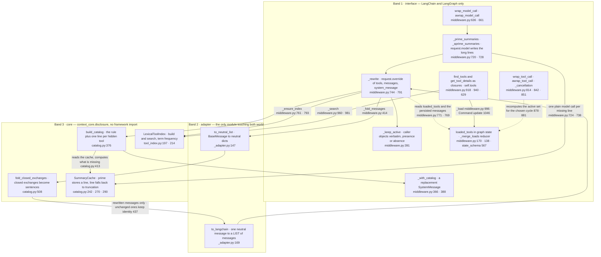
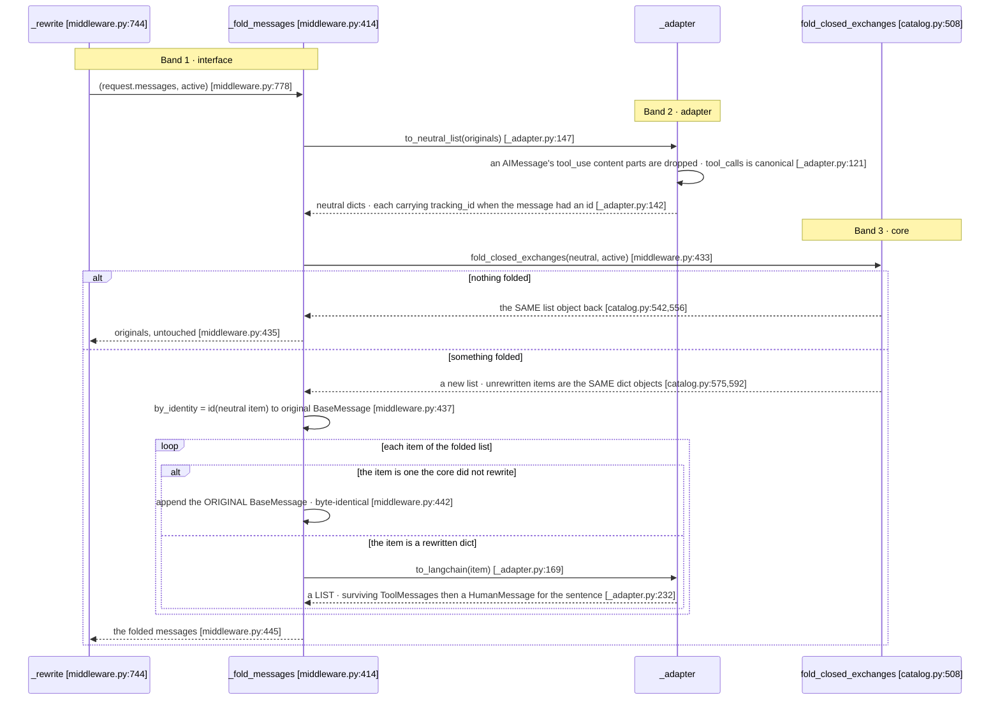
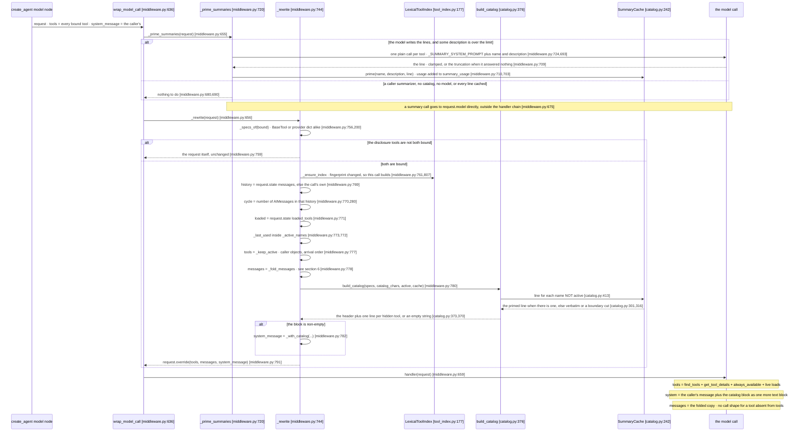
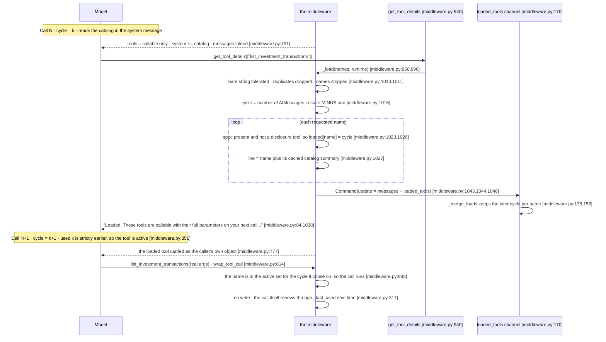
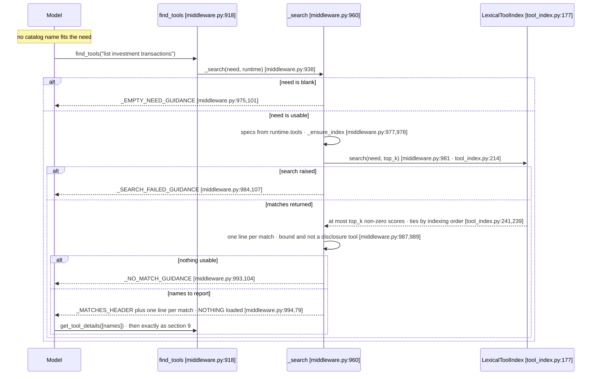
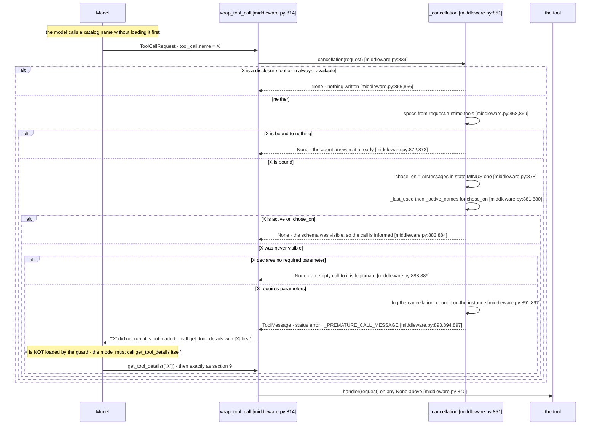
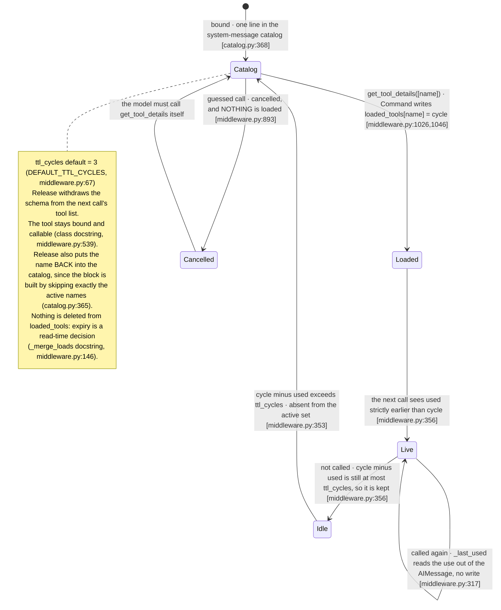

# Sequence B (LangGraph) — Progressive Tool Disclosure

All `file.py:LINE` references resolve into three roots. The **binding** —
`langgraph-plugins/langgraph-progressive-tool-disclosure/src/langgraph_progressive_tool_disclosure/` —
is cited as `middleware.py`, `_adapter.py` and `_compat.py`. The **core** —
`context-core/src/context_core/` — is cited as `catalog.py` and `tool_index.py` (both under
`disclosure/`) and `message.py`. The **harness** — `validation/plugins-langgraph/src/` — is cited as
`runner.py`, once, where a counter this binding does not keep is derived. LangChain and LangGraph symbols
are named in prose, because they sit
outside all three. Every claim below carries a line reference, and every literal string is quoted
verbatim from source.

This is the LangGraph binding of the same practice the Strands document
[`sequence-b-progressive-tool-disclosure.md`](../sequence-b-progressive-tool-disclosure.md) describes.
The decision logic is shared and lives in the core; what differs is everything that touches a framework,
and the differences are structural rather than cosmetic — graph state instead of a per-agent
`WeakKeyDictionary`, a cycle counter derived from the messages instead of read off an event-loop metric,
`request.override` instead of a `replace` on a middleware context, and a wrapped tool call instead of a
`BeforeToolCallEvent` hook.

## 1. What the middleware does, mechanically

On every model call the middleware rewrites **three** fields of the request, all through one
`request.override` (`middleware.py:791`).

`tools` is reduced to the entries callable on this call: the two disclosure tools `find_tools` and
`get_tool_details`, the `always_available` names, and the tools whose schema was **loaded** by a prior
`get_tool_details` and is still live under a TTL measured in cycles (`_active_names`
`middleware.py:322`, applied by `_keep_active` `middleware.py:391`). Every entry kept is the caller's own
object, verbatim — there is no reduced form of a tool in the list, only presence or absence
(`_keep_active` docstring `middleware.py:396`). Every other bound tool reaches the model as **one line of
a catalog appended to the system message** — its name and a summary of its description, at most
`catalog_chars` characters (`build_catalog` `catalog.py:376`, line built at `catalog.py:368`).

`system_message` receives that catalog block, appended as one more text block on a **new**
`SystemMessage` (`_with_catalog` `middleware.py:366`, built at `middleware.py:388`). The override is set
only when the block is non-empty (`middleware.py:781`).

`messages` receives a folded copy: every **closed** exchange of a tool this call does not carry loses its
`toolUse` block, and its `toolResult` becomes one plain sentence — `The tool X was called and the result
was: Y` (`fold_closed_exchanges` `catalog.py:508`, `fold_note` `catalog.py:423`, driven from
`_fold_messages` `middleware.py:414`). The two disclosure tools' own exchanges are dropped outright, with
no sentence (`catalog.py:569`). The graph's own message history is never mutated — the fold produces a
new list for this call only (`middleware.py:438`).

**A loaded tool is released, not retained.** Nothing keeps a tool callable because the messages still
mention it: `_active_names` (`middleware.py:322`) is computed from the load map and the TTL alone, and a
`toolUse` left in the history for a tool absent from `tools` is what the fold exists to remove rather
than what keeps the tool resident (`catalog.py:516`).

There is **one placement** and no mode flag. Nothing reduced is ever put in `tools`, so nothing the
provider is shown asserts an empty parameter schema: a catalog name is not in `tools` at all, and the
rule that governs it arrives in the same block as the name (`CATALOG_PROMPT_HEADER` `catalog.py:83`). The
active tool list and the catalog **partition** the bound set between them — the block is built by
skipping exactly the active names, so no tool appears in both and none is missing from both
(`catalog_prompt_block` `catalog.py:365`, docstring `catalog.py:348`).

**The common path is catalog → `get_tool_details([names])` → call.** The model reads a name in the system
message, calls `get_tool_details` with the names it wants, which records them in `loaded_tools` through a
`Command` state update (`_load` `middleware.py:996`, `Command` at `middleware.py:1046`) and answers with a
short confirmation; the full schemas arrive on the *next* model call. `find_tools` is the **fallback**
for a need no catalog name fits: it ranks the bound specifications through the `LexicalToolIndex`
(`tool_index.py:177`) term-frequency `search` (`tool_index.py:214`) and lists names plus summaries, and
it **writes no state** — loading is `get_tool_details`' one job, so the model takes the same road to a
schema wherever it started (`_search` `middleware.py:960`, docstring `middleware.py:963`).

The guard lives in the tool-call seam rather than in a hook. `wrap_tool_call` (`middleware.py:814`)
cancels a call to a tool the model could not see when that tool requires parameters, and loads
**nothing** on the model's behalf (`_cancellation` `middleware.py:851`, cancellation built at
`middleware.py:893`). Each cancellation counts, on the instance rather than in state
(`premature_cancellations` `middleware.py:892`).

With `summarizer=None` the rewrite is preceded by one more step: the catalog lines that a truncation
would not do justice to are written by **the agent's own model**, through `request.model`, before the
block is built — see section 7.

Every tool stays bound to the agent and stays callable throughout. Release withdraws a schema from the
next call's tool list, it does not unbind anything (class docstring `middleware.py:539`).

## 2. The three bands

The binding is three layers with one rule each: the **interface** band touches LangChain and LangGraph
and nothing else; the **adapter** band is the only module that sees both worlds; the **core** band
imports no framework at all (`catalog.py:23`, `_adapter.py:4`).



Two facts the picture is worth reading for. First, **only `get_tool_details` writes state** — the arrow
into `loaded_tools` has exactly one source, and both the rewrite and the guard are readers
(`middleware.py:771`, `middleware.py:879`). Second, the adapter's return path is **not** symmetric with
its outbound path: `to_neutral_list` converts every message, but only the messages the core actually
rewrote go back through `to_langchain`, because the unchanged ones are mapped back to the original
`BaseMessage` by object identity (`middleware.py:437`, `middleware.py:441`).

`to_langchain_list` (`_adapter.py:237`) exists and is exported (`_adapter.py:37`), but the fold path does
not use it: it would rebuild every message, which is exactly what the identity map exists to avoid. The
middleware imports the singular `to_langchain` and `to_neutral_list` only (`middleware.py:60`).

## 3. Integration table — every LangChain and LangGraph attachment point

| # | Framework seam | `file.py:LINE` | Callback / order | Reads | Mutates |
|---|----------------|----------------|------------------|-------|---------|
| 1 | `AgentMiddleware` base class (subclassed) | `middleware.py:536` `class ProgressiveToolDisclosureMiddleware(AgentMiddleware)` | The base class is reached only through `_compat.py`, which imports `AgentMiddleware`, `AgentState`, `ModelRequest` and `ModelResponse` from `langchain.agents.middleware` (`_compat.py:8`) | — | — |
| 2 | `state_schema` class attribute | `middleware.py:567` | Read by `create_agent` when it builds the graph, so `loaded_tools` becomes part of the thread's checkpointed state | — | Extends the agent state with `DisclosureState` (`middleware.py:162`) |
| 3 | `tools` instance attribute | `middleware.py:629`, set before `super().__init__()` (`middleware.py:630`) | The middleware contributes its two tools to the agent's bound set | — | Adds `find_tools` and `get_tool_details` to the agent |
| 4 | `wrap_model_call` | `middleware.py:636`, priming in `_prime_summaries` (`middleware.py:720`), rewrite in `_rewrite` (`middleware.py:744`) | Wraps the model call. No explicit order — the position in the chain is the order the caller lists the middleware in | `request.tools`, `request.messages` (for the fold), `request.state["messages"]` (for the cycle and the TTL, `middleware.py:769`), `request.state["loaded_tools"]`, `request.system_message`, `request.model` | Returns `request.override(**overrides)` (`middleware.py:791`) carrying new `tools` and `messages`, plus `system_message` when the catalog is non-empty (`middleware.py:781`). Mutates the instance's index and summary cache through `_ensure_index` (`middleware.py:793`) and `build_catalog` (`middleware.py:780`), and the cache plus `summary_usage` through the priming (`middleware.py:710`, `middleware.py:703`). Writes **no** graph state. |
| 5 | `awrap_model_call` | `middleware.py:661` | Async twin. The rewrite itself does no I/O and is the same `_rewrite` call (`middleware.py:669`), so only the priming differs: `_aprime_summaries` (`middleware.py:728`) awaits the summary calls concurrently | Same as row 4 | Same as row 4 |
| 6 | `request.model`, invoked directly | `middleware.py:724` (`invoke`), `middleware.py:738` (`ainvoke`) | The default summarizer's own call, outside the handler chain, so no middleware — this one included — sees it (section comment `middleware.py:675`). Skipped entirely when a caller passed a `summarizer`, when the catalog is suppressed, or when the request carries no model (`middleware.py:680`) | `request.model`, `request.tools` (`middleware.py:682`) | The summary cache (`middleware.py:710`) and `summary_usage` (`middleware.py:703`). Writes **no** graph state, and the call carries no tools, no history and no middleware |
| 7 | `wrap_tool_call` | `middleware.py:814`, decision in `_cancellation` (`middleware.py:851`) | Wraps each tool call. Returns the cancellation instead of calling `handler` when the call was a guess (`middleware.py:839`) | `request.tool_call`, `request.runtime.tools`, `request.state["messages"]`, `request.state["loaded_tools"]`, `self._always_available` | Returns a `ToolMessage` with `status="error"` (`middleware.py:893`). Writes no graph state — the one thing it records is the instance counter `premature_cancellations` (`middleware.py:892`). |
| 8 | `awrap_tool_call` | `middleware.py:842` | Async twin, same decision (`middleware.py:848`) | Same as row 7 | Same as row 7 |
| 9 | `@tool` closure `find_tools` | `middleware.py:918` decorator, `middleware.py:919` function | Built in `_build_tools` (`middleware.py:907`) and handed to the agent through `self.tools`. Receives a `ToolRuntime` injected by the framework | `runtime.tools` (`middleware.py:977`), the `need` argument, the index | **Nothing.** It returns a plain `str` (`middleware.py:994`), so no state update can travel with it. |
| 10 | `@tool` closure `get_tool_details` | `middleware.py:940` decorator, `middleware.py:941` function | Same construction as row 9. Returns a `Command`, which is how a LangGraph tool writes state | `runtime.tools`, `runtime.state["messages"]`, `runtime.tool_call_id` (`middleware.py:1040`), the `names` argument | Returns `Command(update=...)` (`middleware.py:1046`) carrying the answer `ToolMessage` (`middleware.py:1038`) and, only when something was loaded (`middleware.py:1044`), the `loaded_tools` delta. |
| 11 | `Annotated` state reducer | `middleware.py:170`, reducer `_merge_loads` (`middleware.py:138`) | Applied by LangGraph when it merges channel writes at the end of a superstep | The map already in state and the incoming update | Produces a new merged map, keeping the **later** cycle per name (`middleware.py:158`). Neither argument is mutated (`middleware.py:156`). |

Supporting framework imports (the surface used, not attachment points): `AIMessage`, `BaseMessage`,
`HumanMessage`, `SystemMessage` and `ToolMessage` from `langchain_core.messages` (`middleware.py:38`) —
`HumanMessage` carries the ask of a summary call — `BaseTool` and
`tool` from `langchain_core.tools` (`middleware.py:39`), `ToolRuntime` from `langchain.tools`
(`middleware.py:40`), `Command` from `langgraph.types` (`middleware.py:41`), and `ToolCallRequest` from
`langchain.tools.tool_node` via `_compat` (`_compat.py:9`). `_compat.py` exists so that an API move
touches one file, and it records the version it was verified against — `langchain` 1.4.2
(`_compat.py:3`).

**There is no per-agent state object and no `WeakKeyDictionary`.** A LangGraph agent is a graph and its
per-thread facts belong in its state so they survive a checkpoint (module docstring
`middleware.py:23`). What the instance holds is configuration plus two measurements: the four thresholds,
the index, the fingerprint, the summary cache and the flag that records whether the model writes the
catalog lines (`middleware.py:609` through `middleware.py:623`), then `summary_usage` and
`premature_cancellations` (`middleware.py:624`, `middleware.py:627`).

Those two are **instance counters, not graph state**, and the difference is deliberate: both measure the
cost of the strategy over the life of the middleware object rather than a fact about one thread, so
neither is checkpointed and neither is merged by a reducer. `summary_usage` carries `calls`,
`inputTokens` and `outputTokens` of the default summarizer's own calls (`middleware.py:703`,
`middleware.py:705`), which is what lets an operator bill the auxiliary cost next to what the strategy
saves; `premature_cancellations` counts the guessed calls the guard refused (`middleware.py:892`). What
the Strands reference additionally counts as `searches` and `loads`, this binding only logs
(`middleware.py:991`, `middleware.py:1037`) — the harness derives those two from the transcript's tool
calls instead (`runner.py:665`, `runner.py:666`).

## 4. The active set — who is callable on this call

`_active_names` (`middleware.py:322`) is the whole membership decision, and it is a set union of three
terms, every one of them intersected with the names the agent actually has:

| Order | Class | Membership source (`file.py:LINE`) | What the model receives |
|-------|-------|-------------------------------------|--------------------------|
| 1 | `{find_tools, get_tool_details}` | `PLUGIN_TOOL_NAMES` (`catalog.py:66`), first term at `middleware.py:351` | The caller's own tool objects, verbatim — emitted unconditionally, which is what makes the tool list non-empty on every rewritten call |
| 2 | `always_available` | `self._always_available` tuple (`middleware.py:612`), second term at `middleware.py:352` | The caller's own objects on every call |
| 3 | live loads | `loaded_tools` from state (`middleware.py:771`), aged by `_last_used` over the persisted history (`middleware.py:283`, `middleware.py:773`), third term at `middleware.py:353` | The caller's own objects while the load is live under the TTL |
| 4 | catalog residue | every bound name **not** in the active set, skipped while rendering (`catalog.py:365`, `catalog.py:410`) | **Nothing in `tools`.** One line `- name: summary` in the system message (`catalog.py:368`), under the header at `catalog.py:372` |

The `catalog_names` intersection is not incidental: a name outside the bound set is ignored, so a tool
unbound since it was loaded cannot resurrect from a stale `loaded_tools` entry (docstring
`middleware.py:345`, applied at `middleware.py:351`, `middleware.py:352` and `middleware.py:356`).

**Passthrough is structural, not a flag.** `_rewrite` returns the request untouched when the disclosure
tools are not a subset of the bound names (`middleware.py:758`): without `get_tool_details` there is no
way to load a hidden schema and without `find_tools` no way to find one, so there is nothing to hide
(docstring `middleware.py:751`). That single subset test is also what covers the no-tools case, since an
empty bound set cannot contain either name.

Iteration order for the tool list comes from `bound`, the arrival order, not from the active set — two
calls with the same disclosure state then produce the same list and a provider's prompt cache is not
invalidated by a reordering alone (`_keep_active` docstring `middleware.py:394`, loop
`middleware.py:407`). The catalog is rendered over `tool_specs` in the same arrival order
(`catalog.py:363`, `catalog.py:408`).

`_spec_of` (`middleware.py:200`) is what lets both work over a heterogeneous list: `request.tools` is
`list[BaseTool | dict]`, so a `BaseTool` is read through its `tool_call_schema`
(`_schema_of` `middleware.py:178`, `middleware.py:215`) and a provider-native declaration is accepted in
either the OpenAI `{"type": "function", "function": {...}}` envelope or the bare form
(`middleware.py:219` through `middleware.py:221`). An entry with no name is skipped rather than guessed
at (`middleware.py:223`, filtered at `middleware.py:235`), and a schema that cannot be rendered yields an
empty object schema — which reads as "takes no arguments" and therefore **exempts** the tool from the
guard rather than cancelling a legitimate call (`middleware.py:197`, docstring `middleware.py:184`).

## 5. The cycle counter and the TTL — derived, not stored

This is the single biggest structural difference from the Strands binding, which reads
`agent.event_loop_metrics.cycle_count`.

**The cycle counter is not stored at all.** `_cycle` (`middleware.py:267`) is the number of `AIMessage`
objects in the message list it is handed (`middleware.py:280`). Each model call appends exactly one, so counting
them *is* the counter — which makes it a function of the state rather than a second thing to keep in step
with it, and nothing to lose on a checkpoint restore (module docstring `middleware.py:25`, function
docstring `middleware.py:270`).

That derivation forces an off-by-one discipline that is worth stating explicitly, because the two seams
sit on opposite sides of an `AIMessage`:

- At rewrite time, `cycle = _cycle(history)` is the cycle the call **about to go out** will run on
  (`middleware.py:770`) — its `AIMessage` does not exist yet.
- At guard time and inside `_load`, the `AIMessage` carrying the call is **already** in state, so the
  cycle the model chose on is one behind: `max(_cycle(messages) - 1, 0)` (`middleware.py:878`, comment
  `middleware.py:876`; `middleware.py:1016`, comment `middleware.py:1015`).

**`history` is the persisted message list, not the call's.** `_rewrite` counts cycles and reads renewals
off `request.state["messages"]`, falling back to `request.messages` only when state carries none
(`middleware.py:769`), and `_last_used` is given that same list (`middleware.py:773`). The reason is
composition: a middleware wrapping this one — the context graph binding does exactly this — may have
projected the call's messages down to a smaller set, and counting `AIMessage` objects on a projection
yields a cycle **behind** the one `get_tool_details` recorded from state. The load then never satisfies
`used < cycle` in `_active_names` (`middleware.py:356`), the tool never becomes callable, and the model
reloads it forever. Reading the persisted history is what the Strands binding gets for free from
`event_loop_metrics.cycle_count`, which no projection touches either (comment `middleware.py:764`
through `middleware.py:768`).

The two lists are therefore used for different jobs in the same rewrite, and this is the one place the
distinction matters: the **fold** operates on the call's own messages, because what it rewrites is what
this call sends (`middleware.py:778`, `middleware.py:763`), while the **cycle and the TTL** operate on the
thread's history, because what they measure is how far the thread has travelled.

**Renewal is read out of the history, not written when a tool runs.** `_last_used`
(`middleware.py:283`) walks the `AIMessage` objects in order, counting one cycle each
(`middleware.py:318`), and a tool called by the `AIMessage` of cycle *k* counts as used at *k*
(`middleware.py:317`). A tool used across a stretch of cycles therefore keeps renewing itself with **no
state write at all** — which is why there is no post-call hook in this binding at all, where the Strands
reference needs an `AfterToolCallEvent`.

### 5.1 The two renewal-bug fixes

The docstring names them as two restrictions, "each one exists because of a case that breaks without it"
(`middleware.py:290`). Both are one line of code and both are load-bearing.

**Fix 1 — a call is not a load** (`middleware.py:316`, `if name in last`). Only a tool that
`loaded_tools` already holds is renewed. Without the test, renewing on *any* call would let a name the
model guessed at install itself in the live set, which is exactly the shortcut the guard exists to refuse
(`middleware.py:292`). The map `last` is seeded from `loaded` (`middleware.py:307`) precisely so that
membership in it means "was loaded", and `loaded` itself is never mutated (`middleware.py:305`).

**Fix 2 — a use on the cycle being decided for does not count** (`middleware.py:312`,
`if cycle >= before: break`). At model-call time no message is that recent, so the break is a no-op; at
guard time the call being judged is itself an `AIMessage` on the current cycle, and counting it would have
the call **vouch for its own tool** (`middleware.py:295`).

Their companion is the inequality in `_active_names`: a load or a use counts only when it happened on an
**earlier** cycle than the one being decided, `used < cycle` (`middleware.py:356`). That does two jobs at
once — it is trivially true on the normal path, since a tool loaded on cycle *k* is callable from *k+1*,
and it is what makes the guard correct, because a sibling `get_tool_details` that ran in the same batch as
a guessed call recorded the *current* cycle and so cannot make the guess look sanctioned (docstring
`middleware.py:331`). The test suite pins that case by name:
`test_a_load_from_the_same_batch_does_not_sanction_a_guess` in the binding's `tests/test_middleware.py`.

The TTL boundary belongs to the live side: `cycle - used <= ttl_cycles` is kept (`middleware.py:356`,
docstring `middleware.py:337`), matching the reference implementation.

**The load map is never pruned.** Expiry is a read-time decision in `_active_names`, not a deletion, and
the map is bounded by the number of distinct tools ever loaded on the thread (`_merge_loads` docstring
`middleware.py:146`). Keeping the *maximum* cycle is what makes the reducer order-independent: the same
set of loads produces the same map whichever order the writes arrive in (`middleware.py:142`, code
`middleware.py:158`).

## 6. The message fold and the adapter round trip

A `toolUse` block carries the tool's name **and its arguments**. Sitting next to a successful result it
reads as a template, and the model repeats it — which, once that tool has left the tool list, is a call to
a tool it cannot see. So the fold removes the call shape and keeps the evidence
(`fold_closed_exchanges` docstring `catalog.py:516`).

The decision is entirely the core's. What the binding adds is the round trip, and the one thing the round
trip must not lose is **object identity** (`_fold_messages` docstring `middleware.py:418`).

What is folded, and what is not:

- **Only closed turns.** `_current_turn_start` (`catalog.py:444`) returns the index of the last user
  message carrying no `toolResult` (`catalog.py:460`); everything from there on is the turn in flight,
  tool loop and latest assistant message included, and it passes through as **the very same objects**
  (`catalog.py:592`) — the single exception being the user message that opened the turn, which takes the
  folded span's trailing content when there is any (`catalog.py:595`). `messages[0]` is likewise
  untouched (`catalog.py:558`), and a boundary of `0` or `1` means nothing is folded at all
  (`catalog.py:541`).
- **Only closed pairs of non-callable tools.** A `toolUse` is enrolled when its tool is a disclosure tool
  or is not in this call's active set (`catalog.py:550`), and only if a `toolResult` answering it exists
  in the span (`catalog.py:554`). Nothing enrolled returns the caller's list unchanged
  (`catalog.py:556`).
- **The result becomes a sentence.** `fold_note` (`catalog.py:423`) renders `The tool X was called and
  the result was: Y`, or `... failed with: Y` when the result's status is an error (`catalog.py:440`);
  non-text, non-JSON parts of the result are kept as they are (`catalog.py:571`).
- **The disclosure tools' own exchanges go entirely**, with no sentence: they matter on the call right
  after them and are dead weight past that (`catalog.py:569`, `drop_names` default `catalog.py:512`).

The rewrite then has to leave a shape a provider accepts. Emptied messages are dropped
(`catalog.py:579`), same-role neighbours are merged (`catalog.py:584`), and `_tidy` (`catalog.py:483`)
fixes each message for its role: an assistant message that was rewritten loses its `reasoningContent`,
because a modified message can no longer carry a valid signature (`_without_reasoning`
`catalog.py:465`, applied `catalog.py:578`), and a user message puts its `toolResult` blocks first
(`_results_first` `catalog.py:473`) — a provider rejects text placed ahead of the `toolResult` that
answers the previous assistant message (`catalog.py:476`).

The safety net is the fold's own invariant, checked on its output. `pairs_intact` (`catalog.py:489`)
verifies that every `toolUse` is still answered in the very next message; when the fold broke an
adjacency that was intact on the way in, the original messages are returned with one warning
(`catalog.py:599`, `catalog.py:600`). A case the fold did not foresee therefore costs the saving on that
call, never the call itself. The last message is excluded from the check, since an assistant `toolUse`
still waiting for its result is a legitimate tail (`catalog.py:598`).

### 6.1 The round trip, and why it is asymmetric



Four things this makes precise.

**The identity check is `folded is neutral`, not a content comparison** (`middleware.py:434`). The core's
contract is to return the caller's own sequence when it folded nothing (`catalog.py:537`), so the cheap
test is exact.

**A provider's content-part copy of a tool call never crosses into the core** (`_is_call_part`
`_adapter.py:100`, applied `_adapter.py:121`). A provider such as Bedrock reports each call twice on an
`AIMessage`: once in `tool_calls`, and once as a `tool_use` part of `content`. `tool_calls` is the
canonical form and is what becomes the neutral `toolUse` block (`_adapter.py:122`), so `to_neutral` drops
the content copy — every part whose `type` is `tool_use`, `tool_call` or `function_call`
(`_CALL_PART_TYPES` `_adapter.py:96`). The reason is the fold specifically. Kept, that copy reaches the
core as an opaque `json` block the fold has no reason to touch: the fold removes the `toolUse` block and
turns its `toolResult` into a sentence (`catalog.py:564`, `catalog.py:567`), while the `json` twin
survives into the rewritten message's body (`_adapter.py:204`) and restates the call the fold just took
out. The provider then receives a tool call no result answers, and rejects the request (comment
`_adapter.py:116`).

**`to_langchain` returns a list, not a message** (`_adapter.py:169`). The mapping is not one to one in
that direction: a neutral `user` message is the carrier for tool results, and the fold replaces a released
tool's `toolResult` with a text block on that same message. LangChain has no message type holding both,
so one neutral message renders as the surviving `ToolMessage` objects (`_adapter.py:220`) followed by a
`HumanMessage` carrying the text (`_adapter.py:231`). The tool result therefore stays immediately behind
the tool call, which is the ordering a provider requires, and the fold sentence lands behind it
(`_adapter.py:175`).

**Identity survives the trip in two different ways.** For a message the core did not touch, the original
`BaseMessage` object itself is reused (`middleware.py:442`) — which is what keeps a reasoning model's
latest assistant message byte-intact, since a rebuild would invalidate its signature
(`middleware.py:421`). For a message the core *did* rewrite, the LangChain `id` rides through as the
neutral `tracking_id` key and is restored on the way back (`_identified` `_adapter.py:136`, restored
`_adapter.py:191`). When a neutral message splits, the identity goes to the first message out — the one
that existed before the fold — and the synthetic carrier of the folded text gets none, because it is
per-call content rather than a persisted message (`_adapter.py:225`, `_adapter.py:231`, docstring
`_adapter.py:179`).

The neutral shape itself is defined in `message.py`: a message is `{"role": ..., "content": [block, ...]}`
with `NeutralBlock` and `NeutralMessage` aliased to plain dicts (`message.py:40`, `message.py:41`) so an
adapter can hand over a dict without a copy. `_ROLE_BY_TYPE` (`_adapter.py:46`) is the whole role
mapping, and a `ToolMessage` is carried as a `toolResult` block on a **user**-role neutral message
(`_adapter.py:111`, `tool_message_to_result_block` `_adapter.py:66`).

## 7. The catalog block and the summary cache

`build_catalog` (`catalog.py:376`) is the one entry point the binding needs, called with the specs, the
limit, the active names and the instance's cache (`middleware.py:780`). It derives the line of every tool
that is **not** callable on this call — from an explicit `summaries` mapping, else from the cache, else
from `summary_line` — and renders the block (`catalog.py:412`, `catalog.py:413`, `catalog.py:415`).
`catalog_chars=None` suppresses the catalog entirely and returns `""` (`catalog.py:403`), and
`catalog_prompt_block` returns `""` when there is nothing to list, so an empty catalog adds nothing rather
than a header promising a list (`catalog.py:370`, docstring `catalog.py:359`).

**The default summarizer is the agent's own model.** With `summarizer=None` — the constructor default
(`middleware.py:573`) — the binding sets `_model_summarizes` (`middleware.py:623`) and writes the
expensive lines itself, one plain call per tool, exactly as the Strands plugin does. `SummaryCache`
(`catalog.py:242`) still receives that `None` (`middleware.py:620`), so the cache's own summarizer branch
is dead on this path (`catalog.py:307`) and the model-written line arrives through `prime`
(`middleware.py:710`, `catalog.py:270`) *before* `build_catalog` reads the cache. A caller-supplied
summarizer inverts that: `_model_summarizes` is false, the priming does nothing, and the cache calls the
summarizer itself on first ask (`catalog.py:309`).

The priming is a separate pass over the request, ahead of the rewrite, and it is deliberately narrow.
`_missing_summaries` (`middleware.py:678`) returns nothing at all unless the model writes the lines, the
catalog is enabled and the request carries a model (`middleware.py:680`), and nothing either when the two
disclosure tools are not both bound (`middleware.py:683`) — the same passthrough condition `_rewrite`
applies, so a call that will not be rewritten does not pay for summaries. What remains is filtered to the
tools that actually need one: not a disclosure tool, description **longer** than `catalog_chars`, and no
cached line yet (`middleware.py:688` through `middleware.py:690`). A description that already fits is the
best summary of itself and is used verbatim by `summary_line` (`catalog.py:222`, `catalog.py:237`), so it
never reaches the model.

Each call is built by `_summary_messages` (`middleware.py:693`): `_SUMMARY_SYSTEM_PROMPT`
(`middleware.py:115`) as a `SystemMessage` with the limit substituted, and the tool's name and description
as a `HumanMessage` (`middleware.py:696`, `middleware.py:697`). The text is quoted in section 13.9 —
it is verbatim the Strands plugin's (`middleware.py:120`). The call goes to `request.model` directly
(`middleware.py:724`) rather than through the handler chain, so it carries no tools, no history and no
middleware — this one included (section comment `middleware.py:675`).

`_store_summary` (`middleware.py:700`) does the accounting and the caching in one place: it counts the
call and adds the provider's `usage_metadata` input and output tokens to `summary_usage`
(`middleware.py:703` through `middleware.py:707`), reads the answer's text off `text` or `content`
(`middleware.py:708`), clamps it to the limit and falls back to the truncation when the model answered
nothing (`middleware.py:709`), then primes the cache under the description the line summarizes
(`middleware.py:710`). A call that **raises** is not retried on the next model call: `_store_fallback`
(`middleware.py:712`) logs it and primes the truncation instead (`middleware.py:716`), so one unreachable
model costs one call per tool rather than one per tool per turn.

The async twin is the only place the two paths differ. `_prime_summaries` (`middleware.py:720`) is a plain
loop of `invoke` calls; `_aprime_summaries` (`middleware.py:728`) gathers `ainvoke` calls behind an
`asyncio.Semaphore` of `_SUMMARY_CONCURRENCY` (`middleware.py:733`, `middleware.py:112`), which bounds
the burst an index build over many new tools would otherwise fire at once — not the total, which is one
call per tool whichever path ran. Both funnel into the same `_store_summary` and `_store_fallback`, and
the rewrite that follows is the same synchronous `_rewrite` either way.

The cost is therefore real but bounded and one-off per `(name, description)` pair, and the core stays
untouched by it: no framework import, no I/O, no model call anywhere in `catalog.py` (`catalog.py:23`).
The model call lives in the binding, and the line it produces enters the core the same way an operator's
hand-written line would.

A summarizer the caller supplied is tried only when the description does not fit (`catalog.py:307`), its
answer is
clamped (`clamp_summary` `catalog.py:202`, called `catalog.py:309`), and one that raises is logged and
falls back to the same truncation (`catalog.py:311`, `catalog.py:316`) — so no tool is ever left without a
line and no summarizer failure escapes the rewrite. The truncation itself uses a description that already
fits verbatim and cuts a longer one at a sentence or word boundary (`summary_line` `catalog.py:222`,
`truncate_description` `catalog.py:127`).

Lines are cached keyed by `(name, description)` (`SummaryCache.key` `catalog.py:266`, store
`catalog.py:263`), so a tool is summarized once however many calls read it, and a re-registration with a
changed description gets a new line rather than a stale one behind a matching name (docstring
`catalog.py:245`). `prime` (`catalog.py:270`) is how a framework layer with a model injects an expensive
line, which keeps the catalog byte-stable across calls whichever way the line was produced
(`catalog.py:13`).

The search index is built on the same fingerprint. `_ensure_index` (`middleware.py:793`) keeps the
`(name, description)` pairs as a frozenset and compares them on every call (`middleware.py:804`,
`middleware.py:805`), so a tool arriving at runtime — and equally one re-registered with a new
description — triggers exactly one rebuild (`middleware.py:807`). The fingerprint is written **only after
the build returns** (`middleware.py:808`), so a build that raises is retried next call. Nothing is indexed
at construction time, because what the index covers are the specifications of a call and the first rewrite
is what has them (`middleware.py:614`, docstring `middleware.py:796`).



Any failure on the rewrite path is swallowed and logged, and the request goes on **as received** — which
is the behaviour without the middleware (`middleware.py:657`, `middleware.py:658`, docstring
`middleware.py:643`). Nothing is remembered about the failure, so the very next call attempts the rewrite
again (`middleware.py:645`). The priming sits inside that same `try` (`middleware.py:655`), so it is
covered twice over: a summary call that raises is already caught per tool by `_store_fallback`
(`middleware.py:725`, `middleware.py:726`), and anything that escapes that costs the rewrite of one call
rather than the call.

## 8. The system message — no setter, so a replacement is built

`_with_catalog` (`middleware.py:366`) does not append to the existing message; it constructs a new one.
The reason is a hard constraint of `langchain-core`: **`SystemMessage.content_blocks` is a read-only
property**, so the block list is read off it and a replacement message is built from it
(`middleware.py:369`, construction `middleware.py:388`).

Three shapes, each preserved:

- `block` empty → `system_message` back unchanged, **by identity** (`middleware.py:384`, docstring
  `middleware.py:379`).
- `system_message is None` → a new `SystemMessage` carrying only the catalog (`middleware.py:386`,
  `middleware.py:387`).
- otherwise → a new `SystemMessage` whose content is the existing blocks followed by one
  `{"type": "text", "text": block}` (`middleware.py:388`).

The existing blocks are kept as **separate** blocks rather than flattened into one string, because a
caller using the list form is usually placing cache checkpoints between them and collapsing it would move
them (`middleware.py:370`). Appending rather than prepending is deliberate: the caller's own prompt keeps
the opening position, so on a provider that caches by prefix the operator's text stays at a stable offset
(`middleware.py:374`).

## 9. The common path — catalog, load, call

Two model calls and no guessing: the names live in the system message, the schemas arrive through
`get_tool_details`, and use renews the TTL without any write at all.

`_load` (`middleware.py:996`) tolerates the two shapes a model actually sends: a bare string instead of a
list (`middleware.py:1010`) and duplicates, which are de-duplicated with order kept and each name stripped
(`middleware.py:1011`). A call that named nothing usable answers with `_DETAILS_EMPTY_GUIDANCE`
(`middleware.py:1030`). A name the agent does not have — or either disclosure tool, which cannot be loaded
— is collected and reported rather than silently dropped (`middleware.py:1023`, `middleware.py:1034`). The
specification itself is **not** in the result text: it travels in `tools` on the next call, because a tool
result is resident in the history while a tool list is per call and forgettable (docstring
`middleware.py:999`).



`get_tool_details` takes a **list**, which is what keeps a step needing three tools to one cycle rather
than three (docstring `middleware.py:944`). The answer `ToolMessage` is built by the middleware itself
(`middleware.py:1038`) rather than by the framework wrapping a returned string, because the tool's return
type is `Command` — that is the only way a LangGraph tool writes a state channel, and `loaded_tools` is
added to the update **only** when something was actually loaded (`middleware.py:1044`).

## 10. The fallback — `find_tools` searches, it does not load

`find_tools` exists for a need the model cannot map to any listed name. It ranks specifications and
reports names plus summaries, and then stops: the model still goes through `get_tool_details`, so there is
one road to a schema instead of two (docstring `middleware.py:963`).

A blank need is not searched at all and returns guidance (`middleware.py:974`, `middleware.py:975`). A
search that raises returns guidance too, worded the same way as a no-match, because from where the model
stands the two cases are one and the failure is the middleware's to log rather than the model's to reason
about (`middleware.py:982` through `middleware.py:984`, docstring `middleware.py:108`). A match the bound
set does not have, and either disclosure tool, are skipped (`middleware.py:989`).



The index is term-frequency and local, so a search needs no network (`LexicalToolIndex` `tool_index.py:177`,
`build` `tool_index.py:197`, `search` `tool_index.py:214`, constraint `tool_index.py:180`). It scores over
the **distinct** terms of the need, so a need repeating a word does not let that word own the ranking
(`tool_index.py:228`, `tool_index.py:234`, docstring `tool_index.py:183`), and a zero score is not
returned at all — a need sharing no term with any specification yields no matches, which the tool reports
as such instead of offering something arbitrary (`tool_index.py:235`, docstring `tool_index.py:188`).
The indexed text is the specification's **full** text: name, description and the parameter descriptions of
the `inputSchema`, walked to a bounded depth (`_spec_text` `tool_index.py:135`, `_schema_parts`
`tool_index.py:103`, `_MAX_SCHEMA_DEPTH` `tool_index.py:96`) — the parameters are what tell apart two
tools whose one-line summaries read alike. Tokenization treats punctuation and underscores as separators,
so `list_accounts` indexes as `list` plus `accounts` and a need phrased as "list the accounts" reaches it
(`_TOKEN_PATTERN` `tool_index.py:160`, `_tokenize` `tool_index.py:165`).

`ToolIndex` is a structural `Protocol` (`tool_index.py:53`), so any object exposing a callable `build` and
`search` is a valid implementation — which is exactly what `_validate_index` checks, by member rather than
by `isinstance` (`middleware.py:503`, loop `middleware.py:515`). The protocol allows either operation to
return an awaitable (`tool_index.py:66`, `tool_index.py:82`); this binding calls both synchronously
(`middleware.py:807`, `middleware.py:981`), so a network-backed index would have to resolve its own
awaitables.

## 11. The guard — a guessed call does not run

A guessed call is a name the model read in the catalog and called without loading it. The guard does not
consult a stored "what was projected" set; it **recomputes** the active set for the cycle the model chose
on (`middleware.py:878` through `middleware.py:882`). That single choice is what makes two cases come out
right at once: a sibling `get_tool_details` in the same batch recorded the current cycle and so cannot
sanction the guess, and a tool that expired *since* the call was issued is not mistaken for a guess
either (docstring `middleware.py:822`).

The exemptions are dealt with in order. The two disclosure tools and everything in `always_available`
return first (`middleware.py:865`). A name nothing bound has is not this middleware's to judge — the agent
answers it already (`middleware.py:872`, comment `middleware.py:871`). A name in the recomputed active set
returns (`middleware.py:883`). Only then is the parameter test applied (`middleware.py:888`).

**The guard loads nothing on the model's behalf.** It cancels with `_PREMATURE_CALL_MESSAGE`
(`middleware.py:894`), which names the tool and points at `get_tool_details`. A recovery that loaded the
tool and invited an immediate retry would teach the model that calling a catalog name directly works,
which is the very shortcut the catalog rule forbids (docstring `middleware.py:128`).



Only the `required` list decides — `_requires_parameters` (`middleware.py:238`) answers `True` only when
that list is non-empty (`middleware.py:259`): a tool whose parameters are all optional is callable with no
arguments, so an empty call to it is not the symptom of a missing schema (docstring `middleware.py:242`).
Any schema shape the function cannot read is treated as requiring nothing (`middleware.py:254`,
`middleware.py:257`), which errs towards letting the call run — and that is the same direction
`_schema_of` errs in when a schema cannot be rendered at all (`middleware.py:197`).

The guard does **not** require an empty input. Arguments or not, the model could not have known the
parameters, so either way the call is a guess (comment `middleware.py:886`).

Any failure inside `_cancellation` returns `None` and lets the call through, because cancelling a
legitimate call is the worse outcome of the two (`middleware.py:899` through `middleware.py:901`,
docstring `middleware.py:854`).

## 12. One tool's lifecycle



`find_tools` appears nowhere in this diagram on purpose: a search writes no state, so a tool's lifecycle
is driven by `get_tool_details`, by use, and by inactivity.

## 13. Verbatim text the model sees

**Write targets.** `tools` and `messages` always, `system_message` when the catalog block is non-empty,
all through one `request.override` (`middleware.py:776` through `middleware.py:791`). The two tool
answers are **messages**: `find_tools` returns a plain string the framework wraps (`middleware.py:994`),
and `get_tool_details` builds its own `ToolMessage` inside a `Command` (`middleware.py:1038`,
`middleware.py:1046`) — which is why the schema itself is deliberately kept out of it (docstring
`middleware.py:88`), and why the fold drops those two exchanges once they are spent (`catalog.py:569`).

### 13.1 The system-message catalog header — `CATALOG_PROMPT_HEADER` (`catalog.py:83`)

Quoted literally, `{get_tool_details}` and `{find_tools}` being substituted with the two tool names at
`catalog.py:372`:

```text
# Tools available on request

The tools listed below are NOT in your tool list, and you MUST NOT call them directly: their parameters
are not loaded, and a direct call is rejected without running.

To use any of them, always follow these steps:
1. Call `get_tool_details` with the names you need, as a list, in one call.
2. On your next call they are in your tool list with their full parameters. Call them from there.
3. A tool left unused for a few calls is unloaded again. If a call to it is rejected, repeat step 1.

If no name below fits what you need, call `find_tools` with the need in your own words, then go to
step 1 with the names it returns.

The tools that ARE in your tool list for this call you call directly.

```

Immediately followed by one line per non-callable tool, built at `catalog.py:368`:

```python
lines.append(f"- {name}: {summary}" if summary else f"- {name}")
```

So the model sees, for example:

```text
- get_transactions: Transactions of an account over a date range, newest first.
- open_position: Opens a position on an instrument for an account and returns its id.
```

No sigil and no marker: the names are not in `tools`, so nothing in the call claims they are callable and
nothing has to be walked back. Step 3 is what makes release intelligible from the model's side — a
rejected call is a documented state with a documented recovery, not a surprise.

### 13.2 `get_tool_details` docstring — exactly as the model receives it (`middleware.py:942`)

```text
Load the full parameters of one or more tools from the catalog, so you can call them.

Pass every tool you are about to need in one call. They arrive complete in your tool list on
your next call. A tool left unused for a few calls is unloaded; to call it after that, call
this again with its name.

Args:
    names: Exact tool names, as written in the catalog or in a `find_tools` result.
    runtime: Injected by the framework. Not user-facing.

Returns:
    A state update recording what was loaded, and a message naming it plus any requested
    name that is not a tool.
```

Its input schema is not a source literal: it is derived by `@tool` (`middleware.py:940`) from the
signature `get_tool_details(names: list[str], runtime: ToolRuntime)` (`middleware.py:941`). The only
model-facing parameter is `names`, a list of strings — `ToolRuntime` is injected. The tool is a **closure,
not a method**, precisely so that no `self` surfaces as a parameter the model is asked to fill (docstring
`middleware.py:910`, `middleware = self` at `middleware.py:916`).

### 13.3 `find_tools` docstring — exactly as the model receives it (`middleware.py:920`)

```text
Search for tools that can do what you need, when no name in the tool catalog fits.

This only finds tools; it does not load them. It answers with matching tool names and one
line about each. To use any of them, call `get_tool_details` with their names, then call them.

If a name in the catalog already fits what you need, skip this and call `get_tool_details`
directly.

Args:
    need: What you are trying to do, described in your own words. A capability, not a tool
        name — "list the transactions of an investment account" works better than a guess at
        what the tool might be called.
    runtime: Injected by the framework. Not user-facing.

Returns:
    The matching tool names with a one-line summary of each, or guidance to describe the need
    or to reword it when there is nothing to list.
```

Same derivation, from `find_tools(need: str, runtime: ToolRuntime)` (`middleware.py:919`): the only
model-facing parameter is `need`, a string. Both names come from the core rather than from a constructor
knob — `FIND_TOOLS_NAME` (`catalog.py:57`) and `GET_TOOL_DETAILS_NAME` (`catalog.py:60`), collected into
`PLUGIN_TOOL_NAMES` (`catalog.py:66`) — and the second is deliberately not `get_details`: a verb-noun that
generic is one a domain tool can already hold, and a collision would silently shadow one of the two
(`catalog.py:63`).

### 13.4 `get_tool_details` results

Header literal `_DETAILS_LOADED_HEADER` (`middleware.py:84`), which states the release rule in the same
breath as the load:

```python
_DETAILS_LOADED_HEADER = (
    "Loaded. These tools are callable with their full parameters on your next call. A tool left unused for "
    f"a few calls is unloaded; to call it after that, call `{GET_TOOL_DETAILS_NAME}` again:"
)
```

Assembled with one line per loaded tool at `middleware.py:1032`, each line built at `middleware.py:1027`,
and followed when needed by `_DETAILS_UNKNOWN` (`middleware.py:91`, formatted at `middleware.py:1034`):

```python
_DETAILS_UNKNOWN = "Not a tool, ignored: {names}. Use names from the catalog or from `" + FIND_TOOLS_NAME + "`."
```

A call that named nothing usable gets `_DETAILS_EMPTY_GUIDANCE` (`middleware.py:94`, returned at
`middleware.py:1030` and again as the fallback at `middleware.py:1035`):

```python
_DETAILS_EMPTY_GUIDANCE = (
    "Pass the names of the tools you want loaded, as a list. Take them from the catalog, or call `"
    + FIND_TOOLS_NAME
    + "` first."
)
```

### 13.5 `find_tools` results

Header literal `_MATCHES_HEADER` (`middleware.py:79`), which states in the same breath that nothing was
loaded:

```python
_MATCHES_HEADER = (
    f"Tools that match. Nothing is loaded yet: call `{GET_TOOL_DETAILS_NAME}` with the names you want, then call them."
)
```

The full result is assembled at `middleware.py:994` as `"\n".join([_MATCHES_HEADER, *lines])`, each line
built at `middleware.py:987`:

```python
f"- {match.name}: {self._short_description(specs[match.name])}"
```

`_short_description` (`middleware.py:1048`) returns the cached catalog line, falling back to
`DEFAULT_CATALOG_CHARS` as the limit when the catalog is suppressed (`middleware.py:1060`) —
`catalog_chars=None` drops the catalog from the prompt, it does not mean a search result should carry a
full description (docstring `middleware.py:1051`).

### 13.6 `_PREMATURE_CALL_MESSAGE` (`middleware.py:123`)

```python
_PREMATURE_CALL_MESSAGE = (
    "'{name}' did not run: it is not loaded, so its parameters are unknown to you. Call `"
    + GET_TOOL_DETAILS_NAME
    + '` with ["{name}"] first, then call \'{name}\' with its real parameters.'
)
```

Formatted with the tool name at `middleware.py:894` and carried on a `ToolMessage` with
`status="error"` (`middleware.py:897`), answering the guessed call's own id (`middleware.py:895`). It names
the recovery instead of performing it: the tool is **not** loaded by the guard.

### 13.7 The fold sentence — `fold_note` (`catalog.py:423`)

Not a constant: the sentence is assembled from the tool name and the rendered result, with the verb chosen
by the result's status (`catalog.py:440`, `catalog.py:441`):

```python
outcome = "failed with" if result.get("status") == "error" else "the result was"
return f"The tool {name} was called and {outcome}: {' '.join(parts)}"
```

Text parts go in verbatim and JSON parts are serialized with `ensure_ascii=False` (`catalog.py:437`,
`catalog.py:439`). So a closed exchange of a tool that is no longer callable reads, in the messages of the
next call:

```text
The tool get_transactions was called and the result was: {"items": [...], "next": null}
```

It reaches the model as a text block on the neutral message (`catalog.py:570`) and, once
`to_langchain` has rendered it, as a `HumanMessage` following the surviving `ToolMessage` objects
(`_adapter.py:231`).

### 13.8 The remaining guidance strings

- `_EMPTY_NEED_GUIDANCE` (`middleware.py:101`), returned on a blank `need` (`middleware.py:975`):

  ```python
  _EMPTY_NEED_GUIDANCE = "Describe what you are trying to do, in your own words, then call this tool again."
  ```

- `_NO_MATCH_GUIDANCE` (`middleware.py:104`) — returned when nothing usable was found
  (`middleware.py:993`):

  ```python
  _NO_MATCH_GUIDANCE = "No tool matches that description. Try different wording, or answer directly."
  ```

- `_SEARCH_FAILED_GUIDANCE` (`middleware.py:107`) — returned when the search itself raised
  (`middleware.py:984`):

  ```python
  _SEARCH_FAILED_GUIDANCE = "Tool search is unavailable right now. Try a different description, or answer directly."
  ```

### 13.9 The default summarizer's instruction — `_SUMMARY_SYSTEM_PROMPT` (`middleware.py:115`)

This text is not read by the agent's model in its own turn: it is the system prompt of the separate,
tool-free call that writes one catalog line, and `{max_chars}` is substituted with `catalog_chars` at
`middleware.py:696`. Quoted literally:

```text
You write catalog lines for tools. You are given one tool's name and description. Reply with a single summary of what the tool does, at most {max_chars} characters, in the language of the description. Keep what tells this tool apart from similar ones: the object it acts on and what it returns. No preamble, no quotes, no tool name, no trailing period needed.
```

It is verbatim the Strands plugin's instruction, which is what makes a catalog line comparable across the
two bindings (`middleware.py:120`). The ask travels as a `HumanMessage` built at `middleware.py:697`:

```python
HumanMessage(content=f"Tool: {spec['name']}\n\nDescription:\n{spec.get('description') or ''}")
```

Nothing else accompanies it. The call carries no tool list, no conversation history and no middleware, so
what the summarizing model sees is exactly these two messages.

Every constraint in the instruction is enforced afterwards rather than trusted: the answer is normalized to
one line, stripped of wrapping quotes and cut to the limit by `clamp_summary` (`catalog.py:202`,
`catalog.py:218`, `catalog.py:219`), and an answer that survives none of that falls back to the truncation
(`middleware.py:709`). A model that ignores the instruction therefore cannot widen a catalog line.

With the `CATALOG_PROMPT_HEADER` block and its lines, the two tool docstrings, `_MATCHES_HEADER`,
`_DETAILS_LOADED_HEADER`, `_DETAILS_UNKNOWN`, `_DETAILS_EMPTY_GUIDANCE`, `_PREMATURE_CALL_MESSAGE`, the
`fold_note` sentence and `_SUMMARY_SYSTEM_PROMPT` with its ask, that is the complete set of model-facing
text this binding can produce. The
`_ELLIPSIS = "..."` literal (`catalog.py:77`) can appear inside a catalog line that was cut mid-sentence
(`truncate_description` `catalog.py:127`, appended `catalog.py:158`).

## 14. Configuration — every constructor parameter

Constructor: `ProgressiveToolDisclosureMiddleware.__init__` (`middleware.py:569`). All keyword-only (`*`
at `middleware.py:571`). Every check runs before any state is set, so a construction that fails registers
nothing on any agent (`middleware.py:602` through `middleware.py:607`, docstring `middleware.py:599`).

| Parameter | Default (`file.py:LINE`) | Accepts `None`? | Meaning |
|-----------|--------------------------|-----------------|---------|
| `catalog_chars` | `DEFAULT_CATALOG_CHARS = 80` (`catalog.py:70`; ctor `middleware.py:572`) | **Yes** | Character limit of one catalog line's summary. `None` adds no catalog at all (`catalog.py:403`), leaving the two disclosure tools' descriptions as the only hint that other tools exist — the cheapest configuration and the one with the least to go on (docstring `middleware.py:584`). Validated by `_validate_catalog_chars` (`middleware.py:468`) — `None` or int ≥ 1, `0` rejected because a zero-character line fits nothing (`middleware.py:479`). |
| `summarizer` | `None` (`middleware.py:573`) | **Yes** | What writes a line when a description does not fit. Receives `(spec, max_chars)` and must be synchronous (`ToolSummarizer` `middleware.py:73`). `None` means **the agent's own model**: one plain call per tool, primed into the cache before the rewrite reads it (`middleware.py:623`, `middleware.py:724`), with the token cost added to `summary_usage` (`middleware.py:703`). A supplied summarizer is called by the cache itself instead (`catalog.py:309`), and either way a failure falls back to truncation at a sentence or word boundary (`middleware.py:716`, `catalog.py:311`). `_validate_summarizer` (`middleware.py:520`) — `None` or callable. |
| `ttl_cycles` | `DEFAULT_TTL_CYCLES = 3` (`middleware.py:67`; ctor `middleware.py:574`) | No | Cycles a loaded tool survives without a call; a call renews it with no write (`middleware.py:317`). `_validate_positive_int` (`middleware.py:453`) — int ≥ 1, `bool` and `float` rejected (`middleware.py:465`, docstring `middleware.py:456`). |
| `always_available` | `()` empty tuple (`middleware.py:575`) | No | Names callable on every call, skipping the discovery cycle and exempt from the guard (`middleware.py:352`, `middleware.py:865`). `_validate_always_available` (`middleware.py:483`) — a sequence of non-empty strings; a bare string is rejected, since it would configure one name per character (`middleware.py:494`, docstring `middleware.py:487`). Stored as a tuple so the caller's sequence cannot change the configuration after the fact (`middleware.py:612`, comment `middleware.py:611`). |
| `index` | `None` → `LexicalToolIndex()` (`middleware.py:576`; instantiated `middleware.py:616`) | **Yes** | Search implementation behind `find_tools`. `None` selects the default term-frequency index (`tool_index.py:177`), which needs no network. `_validate_index` (`middleware.py:503`) — `None`, or an object with a callable `build` and `search`, checked by member because `ToolIndex` is a structural protocol (docstring `middleware.py:508`). |
| `top_k` | `DEFAULT_TOP_K = 3` (`middleware.py:70`; ctor `middleware.py:577`) | No | How many tools one search lists, passed at `middleware.py:981`. `_validate_positive_int` (`middleware.py:453`) — int ≥ 1. |

Six parameters, none positional, and **no placement flag, no `referenced_source` bridge and no tool-name
knob**. After validation the instance keeps the configuration — the limit, the TTL, the always-available
tuple, `top_k`, the index, the summary cache, a `None` fingerprint the first rewrite fills and the
`_model_summarizes` flag derived from `summarizer` (`middleware.py:609` through `middleware.py:623`) — plus
the two cost counters, `summary_usage` and `premature_cancellations` (`middleware.py:624`,
`middleware.py:627`), and the two tools it contributes (`middleware.py:629`). Everything per-thread lives
in graph state
(`middleware.py:170`), which is what lets a checkpoint restore resume with the same set of tools loaded.
