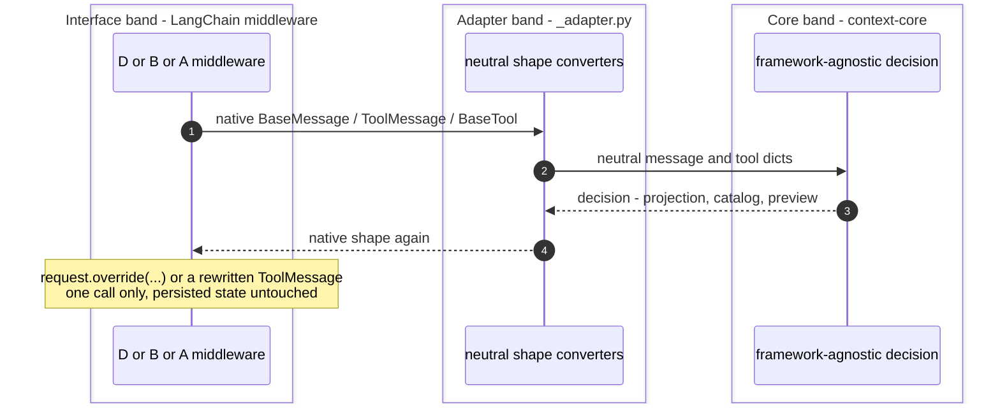
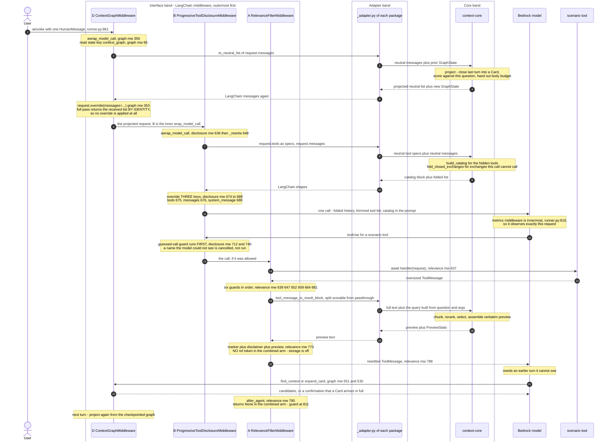

# Combined stack on LangGraph — the three middlewares on one `create_agent`

Scope: how `ContextGraphMiddleware` (D), `ProgressiveToolDisclosureMiddleware` (B) and
`RelevanceFilterMiddleware` (A) compose on a single LangChain v1 `create_agent`, and what one full turn
of that agent does. Every claim carries a `file.py:LINE`. Sources of truth: the three middlewares, the
composition test that asserts the invariants against a mocked agent, the benchmark harness that wires the
`all` arm, and the port's `README` compose section.

> **Reading the references.** All three packages ship a file named `middleware.py`, so a bare
> `middleware.py:LINE` would be ambiguous. Every reference into a middleware is therefore qualified by
> its package directory:
>
> | Prefix | Resolves to |
> |---|---|
> | `langgraph_relevance_filter/middleware.py` | `langgraph-plugins/langgraph-relevance-filter/src/langgraph_relevance_filter/middleware.py` |
> | `langgraph_progressive_tool_disclosure/middleware.py` | `langgraph-plugins/langgraph-progressive-tool-disclosure/src/langgraph_progressive_tool_disclosure/middleware.py` |
> | `langgraph_context_graph/middleware.py` | `langgraph-plugins/langgraph-context-graph/src/langgraph_context_graph/middleware.py` |
> | `runner.py` | `validation/plugins-langgraph/src/runner.py` |
> | `test_composition.py` | `validation/plugins-langgraph/tests/test_composition.py` |
> | `README.md` | `langgraph-plugins/README.md` |
> | `_adapter.py` | the same package as the `middleware.py` last named |

## 1. Three surfaces, one agent

The three middlewares compose because each acts on a different surface of the same call cycle. That is
the port's central claim, stated in the `README` (`README.md:23`–`README.md:24`) and asserted
executably by the composition test (`test_composition.py:1`–`test_composition.py:15`).

- **D acts on the model call, on `messages`.** `ContextGraphMiddleware.wrap_model_call`
  (`langgraph_context_graph/middleware.py:312`) hands the call's messages to
  `context_core.graph.project` (imported at `langgraph_context_graph/middleware.py:46`) and sends the
  projected list out with `request.override(messages=…)`
  (`langgraph_context_graph/middleware.py:353`). Nothing else on the request is touched.
- **B acts on the model call, on `tools` + `system_message` + a further fold of `messages`.**
  `ProgressiveToolDisclosureMiddleware._rewrite`
  (`langgraph_progressive_tool_disclosure/middleware.py:648`) assembles an `overrides` dict
  (`langgraph_progressive_tool_disclosure/middleware.py:674`) carrying `tools`
  (`langgraph_progressive_tool_disclosure/middleware.py:675`), `messages`
  (`langgraph_progressive_tool_disclosure/middleware.py:676`) and, when a catalog was produced,
  `system_message` (`langgraph_progressive_tool_disclosure/middleware.py:680`), then returns
  `request.override(**overrides)` (`langgraph_progressive_tool_disclosure/middleware.py:689`).
- **A acts on the tool surface.** `RelevanceFilterMiddleware.awrap_tool_call`
  (`langgraph_relevance_filter/middleware.py:621`) runs the tool through `handler`, then rewrites the
  returned `ToolMessage`; `after_agent` (`langgraph_relevance_filter/middleware.py:790`) removes the
  middleware's own closed `retrieve_all_context` exchanges at the end of the run. It does **not**
  override `wrap_model_call`: the test asserts the identity
  `type(relevance).wrap_model_call is AgentMiddleware.wrap_model_call`
  (`test_composition.py:78`), so A inherits the base no-op and cannot reach the `ModelRequest` at all.

The `README` mapping table names the same three bindings per practice (`README.md:17`, `README.md:18`,
`README.md:19`).

## 2. The nesting is the list order

On Strands the graph forced itself to index zero of `InvokeModelStage`. On LangGraph there is nothing to
force: **LangChain nests `wrap_*` hooks in list order, so the first entry is the outermost layer**
(`README.md:71`–`README.md:72`, and the harness's own statement of it at `runner.py:13`–`runner.py:16`).

```python
# README.md:85 — the compose block, verbatim in shape
middleware=[
    ContextGraphMiddleware(),                                 # README.md:86  outermost: projects messages
    ProgressiveToolDisclosureMiddleware(),                    # README.md:87  then tools + catalog + fold
    RelevanceFilterMiddleware(include_retrieval_tool=False),  # README.md:88  tool surface; D owns retrieval
]
```

The harness builds the same list. `build_middleware` (`runner.py:473`) constructs each middleware under
its own flag — `if config.graph:` (`runner.py:499`, constructed at `runner.py:510`), `if config.relevance:`
(`runner.py:530`, constructed at `runner.py:552`), `if config.disclosure:` (`runner.py:566`, constructed at
`runner.py:567`) — and returns them in a fixed order regardless of construction order:

```python
# runner.py:584
return [each for each in (graph, disclosure, relevance) if each is not None]
```

`build_agent` (`runner.py:587`) then calls it (`runner.py:601`) and appends one more middleware **after**
the three, so the measurement lands innermost and observes what actually goes on the wire
(`runner.py:19`):

```python
# runner.py:604
agent = create_agent(
    model=_agent_model(session),                        # runner.py:605
    tools=suite,                                        # runner.py:606 — every tool registered upfront
    middleware=[*middleware, MetricsMiddleware(collector)],  # runner.py:610
    checkpointer=_checkpointer(),                       # runner.py:614
)
```

Two consequences of the order, both load-bearing:

1. **On the model call, D wraps B.** D projects the message list first, then B folds tool exchanges
   *within the list D produced* and rewrites `tools` and `system_message`. Same net order as the Strands
   stack reached structurally (`runner.py:480`).
2. **On the tool call, B wraps A.** B also carries a tool-call hook — the guessed-call guard,
   `wrap_tool_call` (`langgraph_progressive_tool_disclosure/middleware.py:712`) and `awrap_tool_call`
   (`langgraph_progressive_tool_disclosure/middleware.py:740`) — and it sits **before** A in the list, so
   B decides whether the call runs at all before A ever reaches a result to rewrite. §6.

`checkpointer=` is a requirement rather than a convenience: A's `after_agent` writes state through
`RemoveMessage(id=REMOVE_ALL_MESSAGES)` (`langgraph_relevance_filter/middleware.py:818`), which needs
somewhere to land, and the saver is also what makes 60 `ainvoke` calls one conversation
(`runner.py:8`–`runner.py:12`, saver built at `runner.py:236`).

## 3. The three bands

Each middleware is a thin LangChain binding: the decision is `context-core`'s, the adaptation is
`_adapter.py`'s, and only the outer band knows what LangChain is.



What each band is, per middleware:

| | Interface band | Adapter band | Core band |
|---|---|---|---|
| **D** | `wrap_model_call` (`langgraph_context_graph/middleware.py:312`), `awrap_model_call` (`langgraph_context_graph/middleware.py:356`) | `to_neutral_list` / `to_langchain_list` (`langgraph_context_graph/_adapter.py:137`, `langgraph_context_graph/_adapter.py:234`; imported at `langgraph_context_graph/middleware.py:50`) | `context_core.graph.project` (`context-core/src/context_core/graph/projection.py:100`) |
| **B** | `wrap_model_call` (`langgraph_progressive_tool_disclosure/middleware.py:612`), `awrap_model_call` (`langgraph_progressive_tool_disclosure/middleware.py:636`), guard at `langgraph_progressive_tool_disclosure/middleware.py:712`, two tools registered at `langgraph_progressive_tool_disclosure/middleware.py:605` | `to_neutral_list` / `to_langchain` (`langgraph_progressive_tool_disclosure/_adapter.py:131`, `langgraph_progressive_tool_disclosure/_adapter.py:153`), plus spec reading `_spec_of` (`langgraph_progressive_tool_disclosure/middleware.py:186`) | `build_catalog` (`context-core/src/context_core/disclosure/catalog.py:376`), `fold_closed_exchanges` (`context-core/src/context_core/disclosure/catalog.py:508`), both imported at `langgraph_progressive_tool_disclosure/middleware.py:42` |
| **A** | `awrap_tool_call` (`langgraph_relevance_filter/middleware.py:621`), `after_agent` (`langgraph_relevance_filter/middleware.py:790`) | `to_neutral_list` / `tool_message_to_result_block` (`langgraph_relevance_filter/_adapter.py:112`, `langgraph_relevance_filter/_adapter.py:58`; imported at `langgraph_relevance_filter/middleware.py:62`) | `RelevancePreview.build_with_stats` (`context-core/src/context_core/relevance/preview.py:504`) |

## 4. Disjoint `ModelRequest` fields

D and B hook the same stage. They do not contend, because they write different fields — and the one
field they share is written in a fixed order.

| `ModelRequest` field | D writes | B writes | Resolution |
|---|---|---|---|
| `messages` | **yes** — the projection, `request.override(messages=…)` (`langgraph_context_graph/middleware.py:353`, async twin `langgraph_context_graph/middleware.py:391`) | **yes** — `_fold_messages` (`langgraph_progressive_tool_disclosure/middleware.py:400`) under the `messages` key (`langgraph_progressive_tool_disclosure/middleware.py:676`) | D is outer, so it decides *which turns* enter the call and at what Resolution; B then folds, inside that list, every tool exchange whose tool this call does not carry |
| `tools` | no | **yes** — `_keep_active` (`langgraph_progressive_tool_disclosure/middleware.py:377`) under the `tools` key (`langgraph_progressive_tool_disclosure/middleware.py:675`) | B's alone |
| `system_message` | no | **yes** — `_with_catalog` (`langgraph_progressive_tool_disclosure/middleware.py:352`) under the `system_message` key (`langgraph_progressive_tool_disclosure/middleware.py:680`) | B's alone. D's `override` names only `messages`, so the system message it received is carried over unchanged and the catalog lands last on an untouched prompt |

The test states the shared-stage / disjoint-field invariant directly
(`test_composition.py:6`–`test_composition.py:8`, asserted at `test_composition.py:63`–`test_composition.py:67`).

**Neither one deletes anything.** D's projection is per call, so `state["messages"]` comes out as it went
in — which is what lets `expand_card` raise a collapsed Card back up. B's fold is per call for the same
reason. The single place either package writes persisted message state is A's `after_agent`, and it only
ever removes its own closed retrieval exchanges
(`langgraph_relevance_filter/middleware.py:799`–`langgraph_relevance_filter/middleware.py:802`).

**Per-turn state each middleware carries.** D's graph travels in agent state under `context_graph`
(`_STATE_KEY`, `langgraph_context_graph/middleware.py:65`; schema `ContextGraphState`,
`langgraph_context_graph/middleware.py:115`, bound at `langgraph_context_graph/middleware.py:239`), and
`TurnChoice.by_title` is flattened out of its `MappingProxyType` by `_persistable`
(`langgraph_context_graph/middleware.py:410`) because LangGraph's state copy cannot carry a proxy. B's
`loaded_tools` map travels under `DisclosureState`
(`langgraph_progressive_tool_disclosure/middleware.py:148`, bound at
`langgraph_progressive_tool_disclosure/middleware.py:553`) with `_merge_loads`
(`langgraph_progressive_tool_disclosure/middleware.py:124`) as its reducer, and B's cycle counter is not
stored at all — it is derived by `_cycle` (`langgraph_progressive_tool_disclosure/middleware.py:253`) as
the number of `AIMessage` objects in the call. So the two state keys are disjoint too.

## 5. One full turn, all three, across the bands

Default combined arm: D outermost, B inside it, A on the tool surface with
`include_retrieval_tool=False`, the metrics middleware innermost, and the whole run under `ainvoke`.



Annotated handlers, in the order the diagram reaches them:

- `ainvoke` per turn against one `thread_id` — `runner.py:848` builds the thread, `runner.py:861` issues
  the call. Sixty turns are sixty invokes on one thread, not sixty calls on one mutable agent
  (`runner.py:832`).
- **D's projection** — `awrap_model_call` (`langgraph_context_graph/middleware.py:356`): read the prior
  graph with `_state_of` (`langgraph_context_graph/middleware.py:397`), convert, call `project`, write the
  new graph back twice — into `request.state` via `_write_back`
  (`langgraph_context_graph/middleware.py:435`) so this turn's retrieval tools see it, and onto the
  response as a `Command` via `_with_state_update` (`langgraph_context_graph/middleware.py:448`) so the
  checkpointer keeps it. The identity short circuit at
  `langgraph_context_graph/middleware.py:353` is the regression probe: with `expand_threshold=0.0` the
  core returns the received list by object identity and no `override` is applied, so the provider sees a
  byte-identical call.
- **B's three-field rewrite** — `_rewrite` (`langgraph_progressive_tool_disclosure/middleware.py:648`).
  It returns the request untouched when the two disclosure tools are not among those bound, computes the
  cycle with `_cycle` (`langgraph_progressive_tool_disclosure/middleware.py:253`) and the callable set
  with `_active_names` (`langgraph_progressive_tool_disclosure/middleware.py:308`), then overrides the
  three keys. Any failure on this path is logged and degrades to the request as received
  (`langgraph_progressive_tool_disclosure/middleware.py:612`, `…:636`) — the behaviour without the
  middleware.
- **B's guard** — `_cancellation` (`langgraph_progressive_tool_disclosure/middleware.py:749`) returns a
  `ToolMessage` carrying `_PREMATURE_CALL_MESSAGE`
  (`langgraph_progressive_tool_disclosure/middleware.py:109`) for a name the model read in the catalog
  and called without loading. It loads nothing on the model's behalf. A guard that cannot decide lets the
  call through.
- **A's rewrite** — `awrap_tool_call` (`langgraph_relevance_filter/middleware.py:621`) awaits the handler
  first (`langgraph_relevance_filter/middleware.py:637`), then runs six early returns: not a
  `ToolMessage` (`…:639`), the retrieval tool's own output (`…:647`), `return_direct` delegation
  (`…:652`), under the size gate (`…:659`), a caller veto (`…:664`), nothing scorable (`…:681`). Past all
  six it calls `_filter_and_rewrite` (`langgraph_relevance_filter/middleware.py:724`): optional store
  write (`…:754`), query from the latest human message plus this call's arguments (`…:758`), the core's
  `build_with_stats` (`…:760`), the disclaimer (`…:772`), the marker (`…:773`), the reference token only
  when there is one (`…:775`), and a copy of the message (`…:788`). The original is never mutated.
- **D's retrieval tools** — `expand_card` (`langgraph_context_graph/middleware.py:530`) and
  `find_context` (`langgraph_context_graph/middleware.py:551`), built as ordinary LangChain tools by
  `_build_tools` (`langgraph_context_graph/middleware.py:521`) and returning a `Command` so the elevation
  outlives the tool call.
- **A's end-of-run cleanup** — `after_agent` (`langgraph_relevance_filter/middleware.py:790`), with
  `aafter_agent` (`langgraph_relevance_filter/middleware.py:820`) delegating to it. In the combined arm it
  returns `None` at its first line (`langgraph_relevance_filter/middleware.py:811`), because
  `include_retrieval_tool` is off and there are no retrieval exchanges to remove. In the A-only arm it
  drops them with `_drop_tool_exchanges` (`langgraph_relevance_filter/middleware.py:165`).

## 6. The tool surface carries two middlewares, in a fixed order

A is not alone on the tool call. B's guard is a `wrap_tool_call` too, and the same list-order rule that
nests the model-call hooks nests these — LangChain nests every `wrap_*` hook in list order
(`README.md:71`–`README.md:72`), and B sits before A (`runner.py:584`), so B is outer here as well.

| Tool-surface hook | Middleware | When it acts | What it can do |
|---|---|---|---|
| `wrap_tool_call` / `awrap_tool_call` (`langgraph_progressive_tool_disclosure/middleware.py:712`, `…:740`) | **B**, outer | **before** the tool runs | Cancel the call, returning `_PREMATURE_CALL_MESSAGE` instead of a result |
| `awrap_tool_call` (`langgraph_relevance_filter/middleware.py:621`) | **A**, inner | **after** the tool runs | Rewrite the returned `ToolMessage` into marker, disclaimer and preview |

They cannot collide. B decides *whether there is a result*; A decides *what a result looks like*. And
because B is outer, a cancelled call never reaches A — the cancellation is a small `ToolMessage` that
would fail A's size gate anyway (`langgraph_relevance_filter/middleware.py:659`), so even the ordering
being reversed would not change the outcome. The invariant the test pins is the complementary one: A
overrides `awrap_tool_call` and does **not** override the model-call hook
(`test_composition.py:74`–`test_composition.py:79`).

## 7. The A+D retrieval collision, and how the combined arm resolves it

Both A and D default to shipping a retrieval tool over their own store:

- A registers `retrieve_all_context` (`_RETRIEVAL_TOOL_NAME`,
  `langgraph_relevance_filter/middleware.py:97`; tool built at
  `langgraph_relevance_filter/middleware.py:419`, decorated at
  `langgraph_relevance_filter/middleware.py:430`) and `include_retrieval_tool` defaults to `True`
  (`langgraph_relevance_filter/middleware.py:315`).
- D registers `expand_card` and `find_context` unconditionally
  (`langgraph_context_graph/middleware.py:294`, built at `langgraph_context_graph/middleware.py:521`).

Two retrieval tools over two different stores is a real failure mode: the model mints a reference with
one and passes it to the other. **The combined arm resolves it by turning A's off**, which is exactly what
the Strands combined configuration does.

In the `README` compose block it is a literal constructor argument (`README.md:88`). In the harness it is
derived, so a single-strategy arm keeps the default:

```python
# runner.py:549
include_retrieval_tool = RELEVANCE_RETRIEVAL_TOOL and not (config.graph and config.disclosure)
config.extra["_relevance_retrieval_tool"] = include_retrieval_tool   # runner.py:550
```

`RELEVANCE_RETRIEVAL_TOOL` is the environment switch, on by default (`runner.py:211`), and the `and not`
clause is what turns the tool off in the `all` arm alone. It is recorded on the run either way, because it
changes what the model could reach.

**What turning it off removes, and what it does not.** `include_retrieval_tool=False` makes
`self.tools` an empty sequence (`langgraph_relevance_filter/middleware.py:354`), leaves `self._store` as
`None` (`langgraph_relevance_filter/middleware.py:346`), makes `_store_raw` return an empty list without
writing (`langgraph_relevance_filter/middleware.py:689`, guard at
`langgraph_relevance_filter/middleware.py:704`), suppresses the `[ref: …]` token
(`langgraph_relevance_filter/middleware.py:775` is only reached with a non-empty `references`), and makes
`after_agent` a no-op (`langgraph_relevance_filter/middleware.py:811`). The disclaimer takes its
nothing-to-retrieve branch (`langgraph_relevance_filter/middleware.py:120`). **Filtering itself is
unchanged** — chunk, rerank, select, assemble, rewrite all run, because storage was never a precondition
of filtering.

The test asserts both halves of the resolution: A ships no `retrieve_all_context`, and D's two tools are
present (`test_composition.py:82`–`test_composition.py:93`, with the stack built at
`test_composition.py:42`–`test_composition.py:51`).

**D's tools are then made always-available on B's side**, so a retrieval tool never costs a discovery
cycle. The list is derived from D's own `tools` rather than hard-coded, so renaming one upstream cannot
leave a stale name behind:

```python
# runner.py:576
always_available=[
    *(each.name for each in (graph.tools if graph is not None else ())),  # runner.py:577
    "list_accounts",                                                      # runner.py:578
]
```

`list_accounts` is the one literal, and it is a domain tool of the scenario rather than any middleware's.

## 8. The cross-cutting fact: async is mandatory, not a preference

**LangChain does not bridge a sync hook to an async run — it raises `NotImplementedError`.** That single
fact decides the invocation style of the whole stack, and it is why B and D each ship an async twin.

The chain of consequences, each verifiable:

1. A's tool hook is **async-only**: the middleware implements `awrap_tool_call`
   (`langgraph_relevance_filter/middleware.py:621`) and no sync `wrap_tool_call`, because the core's
   preview and every `Store` are async. The class docstring says the agent must therefore be driven with
   `ainvoke`/`astream` (`langgraph_relevance_filter/middleware.py:261`).
2. So the combined run is async. The harness drives it that way: `await agent.ainvoke(...)` per turn
   (`runner.py:861`).
3. So D and B must each expose an async model-call hook, or a stack carrying them would raise under
   `ainvoke`. Both do: `ContextGraphMiddleware.awrap_model_call`
   (`langgraph_context_graph/middleware.py:356`, which names the `NotImplementedError` and the relevance
   filter as the reason at `langgraph_context_graph/middleware.py:363`–`langgraph_context_graph/middleware.py:365`)
   and `ProgressiveToolDisclosureMiddleware.awrap_model_call`
   (`langgraph_progressive_tool_disclosure/middleware.py:636`).
4. Neither async twin duplicates a decision. D's `project` is pure and synchronous, so the only
   difference from the sync hook is that the handler is awaited
   (`langgraph_context_graph/middleware.py:366`–`langgraph_context_graph/middleware.py:368`); B's
   `_rewrite` does no I/O and is shared outright
   (`langgraph_progressive_tool_disclosure/middleware.py:636`). B's tool-surface guard is the same
   pattern: `awrap_tool_call` (`langgraph_progressive_tool_disclosure/middleware.py:740`) delegates to
   the same `_cancellation`.

The `README` states the fact as the port's one cross-cutting LangGraph note
(`README.md:51`–`README.md:54`), and the test pins it twice: that D exposes the async hook at all
(`test_composition.py:96`–`test_composition.py:99`) and that both async hooks are genuine coroutine
functions (`test_composition.py:103`–`test_composition.py:110`).

### The harness still carries the bridge that predates D's async twin

One divergence worth naming, because it changes what the benchmark measures. `runner.py:257` defines
`AsyncContextGraphMiddleware(ContextGraphMiddleware)`, whose `awrap_model_call`
(`runner.py:286`) runs the **sync** projection on a worker thread and schedules the handler back onto the
loop:

```python
# runner.py:294
return await asyncio.to_thread(super().wrap_model_call, request, bridged)
```

Its docstring states it is "a workaround for a gap in the middleware packages, not a harness preference,
and it should be deleted once the package closes it" (`runner.py:260`–`runner.py:261`), and gives as the
gap that "`ContextGraphMiddleware` implements `wrap_model_call` only" (`runner.py:265`–`runner.py:266`).

**That gap is closed in the current package**: `ContextGraphMiddleware.awrap_model_call` exists at
`langgraph_context_graph/middleware.py:356`. The subclass is still what the harness constructs
(`runner.py:510`), so the override shadows the package's native async twin and the `all` arm's D layer
runs the sync projection off-loop rather than the async hook. The projection logic is identical either
way — the subclass calls `super().wrap_model_call` and reimplements nothing (`runner.py:276`–`runner.py:280`)
— so no measurement is wrong; what is stale is the subclass's stated reason for existing, and the
deletion its own docstring asks for. Documented here rather than fixed: this document creates no source
change.

## 9. What the composition test asserts

`test_composition.py` is the executable form of §1 through §8, run against a mocked agent with no live
model, reranker or embedder (`test_composition.py:1`–`test_composition.py:4`). The stack it builds is the
combined arm exactly (`test_composition.py:42`–`test_composition.py:51`), using `_MockMatcher`
(`test_composition.py:26`) and `_FakeReranker` (`test_composition.py:31`) so nothing reaches AWS.

Its docstring states the four invariants as prose before any test asserts them: disjoint
`ModelRequest` fields (`test_composition.py:6`), A on the tool surface (`test_composition.py:9`), the
retrieval collision resolved by `include_retrieval_tool=False` (`test_composition.py:11`), and the whole
stack under `ainvoke` (`test_composition.py:14`).

| Test | Line | Invariant |
|---|---|---|
| `test_stack_constructs_with_the_documented_nesting` | `test_composition.py:54` | The list is `ContextGraphMiddleware`, `ProgressiveToolDisclosureMiddleware`, `RelevanceFilterMiddleware`, outermost first (§2) |
| `test_b_and_d_hook_the_same_stage_but_disjoint_request_fields` | `test_composition.py:63` | D and B each expose both the sync and the async model-call hook (§4, §8) |
| `test_a_is_on_the_tool_surface_not_the_model_call_layer` | `test_composition.py:70` | A overrides `awrap_tool_call` and inherits the base `wrap_model_call`, so it cannot touch the `ModelRequest` (§1) |
| `test_only_the_graph_retrieval_tools_are_visible_in_the_combined_arm` | `test_composition.py:82` | `retrieve_all_context` is absent from A's tools; D's `find_context` / `expand_card` are present (§7) |
| `test_graph_async_hook_closes_the_sync_async_gap` | `test_composition.py:96` | D exposes `awrap_model_call` — the regression the harness found (§8) |
| `test_disclosure_and_graph_async_hooks_both_await_the_handler` | `test_composition.py:103` | Both async hooks are coroutine functions, so nesting them under `ainvoke` is coherent (§8) |

## 10. The one precondition the combined stack cannot enforce

D's Strands analog could require a `NullConversationManager`. LangGraph has no such handle, so the
precondition is **advisory**: `_warn_on_pruning_middleware`
(`langgraph_context_graph/middleware.py:498`) matches a co-installed middleware by name against
`_PRUNING_MARKERS` (`langgraph_context_graph/middleware.py:84`) and emits `_PRUNING_WARNING`
(`langgraph_context_graph/middleware.py:92`) once at construction, then registers anyway.

It matters for the combined stack specifically because **two** of the three folds are per-call only. D
folds the projected copy and B folds the same copy further; neither deletes from
`state["messages"]`, which is what keeps a mis-cut recoverable — raising a Card back up finds the
messages still there. A middleware that physically prunes the persisted list removes what both of them
only meant to fold, and no Resolution recovers it. The warning is passed the agent's middleware list, so
passing nothing warns about nothing: silence means "the wiring was not described", not "the wiring is
safe".

Note that neither D nor B is itself such a middleware, by their own design, and `ContextEditingMiddleware`
is deliberately excluded from the markers because it edits the call through `override` the same way
(`langgraph_context_graph/middleware.py:88`–`langgraph_context_graph/middleware.py:90`).
