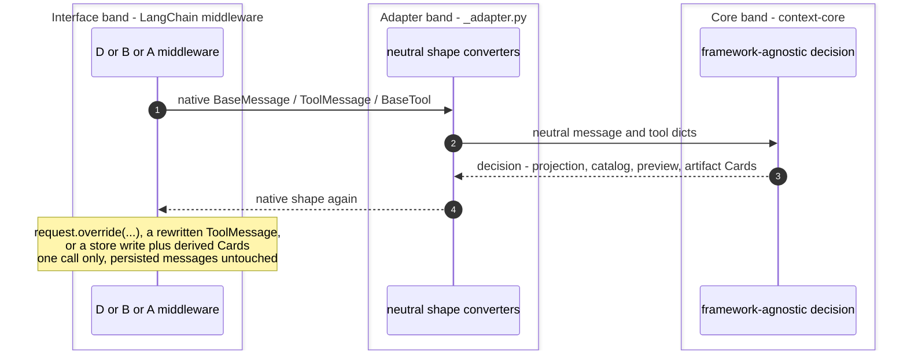
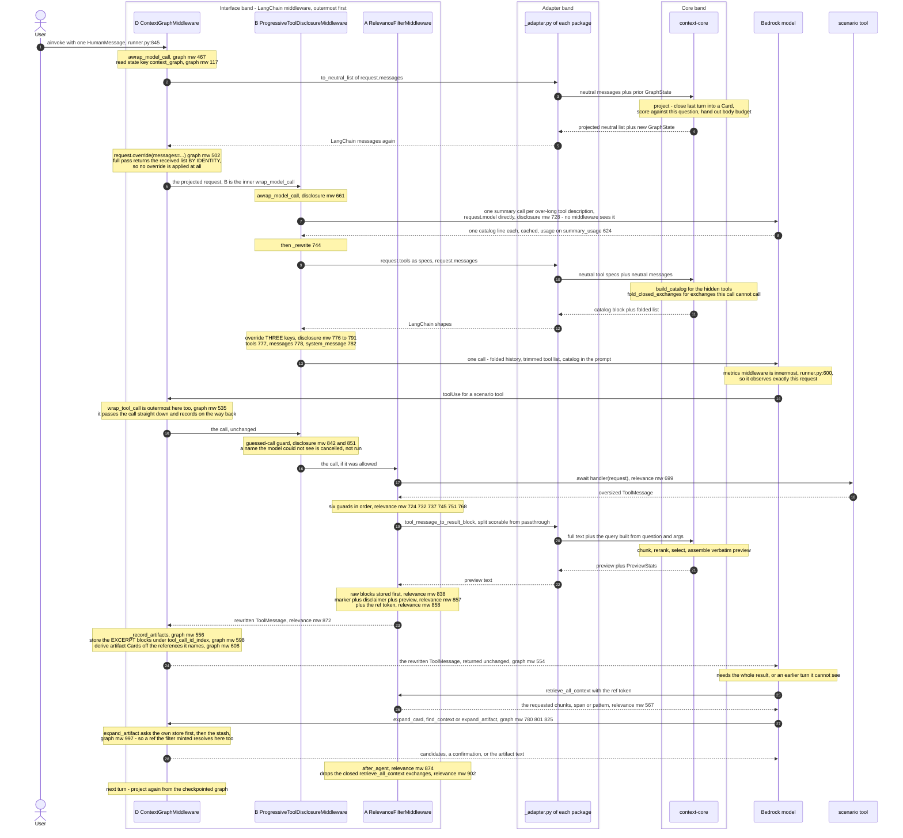

# Combined stack on LangGraph — the three middlewares on one `create_agent`

Scope: how `ContextGraphMiddleware` (D), `ProgressiveToolDisclosureMiddleware` (B) and
`RelevanceFilterMiddleware` (A) compose on a single LangChain v1 `create_agent`, and what one full turn
of that agent does. Every claim carries a `file.py:LINE`. Sources of truth: the three middlewares, the
composition test that asserts the invariants against a mocked agent, the benchmark harness that wires the
`all` arm, and the port's `README` compose section.

> **Reading the references.** All three packages ship a file named `middleware.py`, so a bare
> `middleware.py:LINE` would be ambiguous. Every reference into a middleware is therefore qualified by
> its package directory:
>
> | Prefix | Resolves to |
> |---|---|
> | `langgraph_relevance_filter/middleware.py` | `langgraph-plugins/langgraph-relevance-filter/src/langgraph_relevance_filter/middleware.py` |
> | `langgraph_progressive_tool_disclosure/middleware.py` | `langgraph-plugins/langgraph-progressive-tool-disclosure/src/langgraph_progressive_tool_disclosure/middleware.py` |
> | `langgraph_context_graph/middleware.py` | `langgraph-plugins/langgraph-context-graph/src/langgraph_context_graph/middleware.py` |
> | `runner.py` | `validation/plugins-langgraph/src/runner.py` |
> | `test_composition.py` | `validation/plugins-langgraph/tests/test_composition.py` |
> | `README.md` | `langgraph-plugins/README.md` |
> | `_adapter.py` | the same package as the `middleware.py` last named |

## 1. Two surfaces, three middlewares, one agent

The three middlewares compose because no two of them write the same thing. That is the port's central
claim, stated in the `README` (`README.md:23`–`README.md:24`) and asserted executably by the composition
test (`test_composition.py:1`–`test_composition.py:15`). They are not, however, spread one per surface:
**each of the three carries a model-call hook or a tool-call hook or both**, and the two surfaces are
where the composition has to hold.

- **D acts on the model call, on `messages`, and on the tool call, as a recorder.**
  `ContextGraphMiddleware.wrap_model_call` (`langgraph_context_graph/middleware.py:423`) hands the call's
  messages to `context_core.graph.project` (imported at `langgraph_context_graph/middleware.py:61`) and
  sends the projected list out with `request.override(messages=…)`
  (`langgraph_context_graph/middleware.py:464`). Nothing else on the request is touched. Its
  `wrap_tool_call` (`langgraph_context_graph/middleware.py:507`) and `awrap_tool_call`
  (`langgraph_context_graph/middleware.py:535`) return the handler's answer **unchanged**
  (`langgraph_context_graph/middleware.py:533`, `…:554`) and only record it — `_record_artifacts`
  (`langgraph_context_graph/middleware.py:556`) writes the return's text blocks into the conversation's
  reference store and derives artifact Cards. §6.
- **B acts on the model call, on `tools` + `system_message` + a further fold of `messages`, and on the
  tool call, as a guard.** `ProgressiveToolDisclosureMiddleware._rewrite`
  (`langgraph_progressive_tool_disclosure/middleware.py:744`) assembles an `overrides` dict
  (`langgraph_progressive_tool_disclosure/middleware.py:776`) carrying `tools`
  (`langgraph_progressive_tool_disclosure/middleware.py:777`), `messages`
  (`langgraph_progressive_tool_disclosure/middleware.py:778`) and, when a catalog was produced,
  `system_message` (`langgraph_progressive_tool_disclosure/middleware.py:782`), then returns
  `request.override(**overrides)` (`langgraph_progressive_tool_disclosure/middleware.py:791`).
- **A acts on the tool surface only.** `RelevanceFilterMiddleware.awrap_tool_call`
  (`langgraph_relevance_filter/middleware.py:682`) and its sync twin `wrap_tool_call`
  (`langgraph_relevance_filter/middleware.py:701`) run the tool through `handler`, then rewrite the
  returned `ToolMessage`; `after_agent` (`langgraph_relevance_filter/middleware.py:874`) removes the
  middleware's own closed `retrieve_all_context` exchanges at the end of the run. It does **not**
  override `wrap_model_call`: the test asserts the identity
  `type(relevance).wrap_model_call is AgentMiddleware.wrap_model_call`
  (`test_composition.py:77`), so A inherits the base no-op and cannot reach the `ModelRequest` at all.
  The complementary assertion is on the next line — `awrap_tool_call` *is* overridden
  (`test_composition.py:78`).

The `README` mapping table names each binding's hooks per practice, and names two surfaces for B and D and
one for A (`README.md:17`, `README.md:18`, `README.md:19`).

## 2. The nesting is the list order

On Strands the graph forced itself to index zero of `InvokeModelStage`. On LangGraph there is nothing to
force: **LangChain nests `wrap_*` hooks in list order, so the first entry is the outermost layer**
(`README.md:84`, and the harness's own statement of it at `runner.py:13`–`runner.py:16`).

```python
# README.md:100 — the compose block, verbatim in shape
middleware=[
    ContextGraphMiddleware(stash=relevance.stash),  # README.md:101  outermost: projects messages
    ProgressiveToolDisclosureMiddleware(),          # README.md:102  then tools + catalog + fold
    relevance,                                      # README.md:103  tool surface
]
```

The harness builds the same list. `build_middleware` (`runner.py:461`) constructs each middleware under
its own flag — `if config.relevance:` (`runner.py:487`, constructed at `runner.py:507`), `if config.graph:`
(`runner.py:521`, constructed at `runner.py:532`), `if config.disclosure:` (`runner.py:556`, constructed at
`runner.py:557`) — and returns them in a fixed order regardless of construction order:

```python
# runner.py:574
return [each for each in (graph, disclosure, relevance) if each is not None]
```

**Construction order is not the same question as list order, and one dependency fixes it.** D is
constructed with `stash=relevance.stash if relevance is not None else None` (`runner.py:549`), so the
filter has to exist before the graph is built even though the graph is the outermost entry in the returned
list. That is why `if config.relevance:` (`runner.py:487`) precedes `if config.graph:` (`runner.py:521`) in
the function while `graph` still precedes `relevance` in the return. The compose block in the `README` has
the same shape, binding `relevance` to a name first and passing `relevance.stash` on the line above it
(`README.md:96`, `README.md:101`). §7.

`build_agent` (`runner.py:577`) then calls it (`runner.py:591`) and appends one more middleware **after**
the three, so the measurement lands innermost and observes what actually goes on the wire
(`runner.py:19`):

```python
# runner.py:594
agent = create_agent(
    model=_agent_model(session),                        # runner.py:595
    tools=suite,                                        # runner.py:596 — every tool registered upfront
    middleware=[*middleware, MetricsMiddleware(collector)],  # runner.py:600
    checkpointer=_checkpointer(),                       # runner.py:604
)
```

Three consequences of the order, all load-bearing:

1. **On the model call, D wraps B.** D projects the message list first, then B folds tool exchanges
   *within the list D produced* and rewrites `tools` and `system_message`. Same net order as the Strands
   stack reached structurally (`runner.py:13`–`runner.py:16`).
2. **On the tool call, D wraps B wraps A.** All three carry a tool-call hook, and the same list order
   nests them: B's guessed-call guard (`langgraph_progressive_tool_disclosure/middleware.py:814`) decides
   whether the call runs at all before A ever reaches a result to rewrite, and D's recorder
   (`langgraph_context_graph/middleware.py:507`) sees the result **after** A has rewritten it. §6.
3. **Measurement sees the projection, not the priming.** `MetricsMiddleware` is innermost
   (`runner.py:600`), so it observes the request the three produced. B's default summarizer calls
   `request.model` directly and therefore passes no middleware at all
   (`langgraph_progressive_tool_disclosure/middleware.py:675`), which is why its cost is carried on a
   counter instead (`langgraph_progressive_tool_disclosure/middleware.py:624`, read by the harness at
   `runner.py:672`). §5.

`checkpointer=` is a requirement rather than a convenience: A's `after_agent` writes state through
`RemoveMessage(id=REMOVE_ALL_MESSAGES)` (`langgraph_relevance_filter/middleware.py:902`), which needs
somewhere to land, and the saver is also what makes 60 `ainvoke` calls one conversation
(`runner.py:8`–`runner.py:12`, saver built at `runner.py:255`).

**The saver is also what has to be told about D's state types.** D persists its graph as
`context_core.graph.state` dataclasses, and LangGraph's msgpack serde blocks a type its allowlist does not
name. The allowlist is keyed by `(module, class name)`, so a bare module name matches nothing and makes it
strict and empty at once — every graph type blocked on restore, and the graph and combined arms silently
measuring a conversation that starts from scratch every turn. `_graph_state_types`
(`runner.py:236`) therefore passes the classes themselves, collected out of the module by introspection,
and `_checkpointer` hands them to `JsonPlusSerializer(allowed_msgpack_modules=…)` (`runner.py:270`). The
allowlist belongs to whoever constructs the saver, which is the harness rather than the middleware package
(`runner.py:221`–`runner.py:233`). Failure to build the serde is caught and degrades to a plain
`InMemorySaver`, since an allowlist is an optimisation of the restore path rather than a requirement of it.

## 3. The three bands

Each middleware is a thin LangChain binding: the decision is `context-core`'s, the adaptation is
`_adapter.py`'s, and only the outer band knows what LangChain is.



What each band is, per middleware:

| | Interface band | Adapter band | Core band |
|---|---|---|---|
| **D** | `wrap_model_call` (`langgraph_context_graph/middleware.py:423`), `awrap_model_call` (`langgraph_context_graph/middleware.py:467`), `wrap_tool_call` (`langgraph_context_graph/middleware.py:507`), `awrap_tool_call` (`langgraph_context_graph/middleware.py:535`), three tools built at `langgraph_context_graph/middleware.py:765` | `to_neutral_list` / `to_langchain_list` / `tool_message_to_result_block` (`langgraph_context_graph/_adapter.py:153`, `langgraph_context_graph/_adapter.py:250`, `langgraph_context_graph/_adapter.py:71`; imported at `langgraph_context_graph/middleware.py:77`) | `context_core.graph.project` (`context-core/src/context_core/graph/projection.py:100`), `derive_and_register_artifacts` (imported at `langgraph_context_graph/middleware.py:63`), `resolve_artifact` (`context-core/src/context_core/graph/store.py:284`) |
| **B** | `wrap_model_call` (`langgraph_progressive_tool_disclosure/middleware.py:636`), `awrap_model_call` (`langgraph_progressive_tool_disclosure/middleware.py:661`), guard at `langgraph_progressive_tool_disclosure/middleware.py:814` and `…:842`, two tools returned at `langgraph_progressive_tool_disclosure/middleware.py:958` | `to_neutral_list` / `to_langchain` (`langgraph_progressive_tool_disclosure/_adapter.py:147`, `langgraph_progressive_tool_disclosure/_adapter.py:169`), plus spec reading `_spec_of` (`langgraph_progressive_tool_disclosure/middleware.py:200`) | `build_catalog` (`context-core/src/context_core/disclosure/catalog.py:376`), `fold_closed_exchanges` (`context-core/src/context_core/disclosure/catalog.py:508`), both imported at `langgraph_progressive_tool_disclosure/middleware.py:53` and `…:57` |
| **A** | `awrap_tool_call` (`langgraph_relevance_filter/middleware.py:682`), `wrap_tool_call` (`langgraph_relevance_filter/middleware.py:701`), `after_agent` (`langgraph_relevance_filter/middleware.py:874`) | `to_neutral_list` / `tool_message_to_result_block` (`langgraph_relevance_filter/_adapter.py:128`, `langgraph_relevance_filter/_adapter.py:58`; imported at `langgraph_relevance_filter/middleware.py:65`) | `RelevancePreview.build_with_stats` (`context-core/src/context_core/relevance/preview.py:504`) |

### The adapter boundary drops one content part, and the combined arm is why

All three `_adapter.py` files normalize an `AIMessage`'s tool calls to exactly one representation on the
way into the neutral shape. A provider such as Bedrock carries each call twice — canonically on
`AIMessage.tool_calls`, and again as a `tool_use` part of `content` — so `to_neutral`
(`langgraph_context_graph/_adapter.py:111`) keeps the canonical one, turns it into the neutral `toolUse`
block, and filters the content copy out with `_is_call_part`
(`langgraph_context_graph/_adapter.py:105`) against `_CALL_PART_TYPES`
(`langgraph_context_graph/_adapter.py:101`, the set `tool_use`, `tool_call`, `function_call`). The other two
bindings carry the same three symbols: `langgraph_progressive_tool_disclosure/_adapter.py:96`, `…:100`,
`…:106`, and `langgraph_relevance_filter/_adapter.py:88`, `…:92`, `…:98`.

Keeping both copies is only harmless while nothing removes the `toolUse`. **B's fold removes it**, and the
content copy is an opaque `json` block a core has no reason to touch, so it would survive the fold and the
provider would receive a `toolUse` with no matching `toolResult` — a request Bedrock rejects. The reason is
stated at the filter point itself (`langgraph_context_graph/_adapter.py:126`–`langgraph_context_graph/_adapter.py:130`).
This is a boundary rule rather than a core one: `fold_closed_exchanges` is handed a list in which each call
appears once, so the fold has nothing to leave orphaned. §4.

## 4. Disjoint `ModelRequest` fields

D and B hook the same stage. They do not contend, because they write different fields — and the one
field they share is written in a fixed order.

| `ModelRequest` field | D writes | B writes | Resolution |
|---|---|---|---|
| `messages` | **yes** — the projection, `request.override(messages=…)` (`langgraph_context_graph/middleware.py:464`, async twin `langgraph_context_graph/middleware.py:502`) | **yes** — `_fold_messages` (`langgraph_progressive_tool_disclosure/middleware.py:414`) under the `messages` key (`langgraph_progressive_tool_disclosure/middleware.py:778`) | D is outer, so it decides *which turns* enter the call and at what Resolution; B then folds, inside that list, every tool exchange whose tool this call does not carry |
| `tools` | no | **yes** — `_keep_active` (`langgraph_progressive_tool_disclosure/middleware.py:391`) under the `tools` key (`langgraph_progressive_tool_disclosure/middleware.py:777`) | B's alone |
| `system_message` | no | **yes** — `_with_catalog` (`langgraph_progressive_tool_disclosure/middleware.py:366`) under the `system_message` key (`langgraph_progressive_tool_disclosure/middleware.py:782`) | B's alone. D's `override` names only `messages`, so the system message it received is carried over unchanged and the catalog lands last on an untouched prompt |

The test states the shared-stage / disjoint-field invariant directly
(`test_composition.py:6`–`test_composition.py:8`, asserted at `test_composition.py:62`–`test_composition.py:66`).

One precondition of B folding inside D's list is met at the adapter boundary rather than in either core:
each tool call reaches the fold exactly once, because `to_neutral` drops the provider's content-part copy
of a call it already carries on `tool_calls` (`langgraph_progressive_tool_disclosure/_adapter.py:106`, the
filter at `…:100`). Without that, B's fold would remove the `toolUse` and leave the copy behind as an
orphan the provider rejects. §3.

**B counts cycles on the persisted history, and D is the reason.** `request.messages` is what D projected,
so counting `AIMessage` objects there yields a cycle number behind the one `get_tool_details` recorded from
state — and a load that never becomes callable, which the model answers by reloading forever. `_rewrite`
therefore reads `state["messages"]` for the cycle and the renewals and keeps `request.messages` only for
the fold it returns: `history` (`langgraph_progressive_tool_disclosure/middleware.py:769`), `_cycle(history)`
(`langgraph_progressive_tool_disclosure/middleware.py:770`) and `_last_used(history, …)`
(`langgraph_progressive_tool_disclosure/middleware.py:773`) against `messages`
(`langgraph_progressive_tool_disclosure/middleware.py:763`) under the `messages` override key
(`langgraph_progressive_tool_disclosure/middleware.py:778`). The split is stated at the point it is made
(`langgraph_progressive_tool_disclosure/middleware.py:764`–`langgraph_progressive_tool_disclosure/middleware.py:768`),
including its Strands equivalent: that plugin reads `event_loop_metrics.cycle_count`, which no projection
touches either. So the two middlewares share the `messages` field and read from two different lists on
purpose — B folds what D projected, and counts what the checkpointer holds.

**Neither one deletes anything.** D's projection is per call, so `state["messages"]` comes out as it went
in — which is what lets `expand_card` raise a collapsed Card back up. B's fold is per call for the same
reason. The single place either package writes persisted message state is A's `after_agent`, and it only
ever removes its own closed retrieval exchanges
(`langgraph_relevance_filter/middleware.py:895`–`langgraph_relevance_filter/middleware.py:902`).

**Per-turn state each middleware carries.** D's graph travels in agent state under `context_graph`
(`_STATE_KEY`, `langgraph_context_graph/middleware.py:117`; schema `ContextGraphState`,
`langgraph_context_graph/middleware.py:195`, bound at `langgraph_context_graph/middleware.py:329`), and
`TurnChoice.by_title` is flattened out of its `MappingProxyType` by `_persistable`
(`langgraph_context_graph/middleware.py:654`) because LangGraph's state copy cannot carry a proxy. B's
`loaded_tools` map travels under `DisclosureState`
(`langgraph_progressive_tool_disclosure/middleware.py:162`, bound at
`langgraph_progressive_tool_disclosure/middleware.py:567`) with `_merge_loads`
(`langgraph_progressive_tool_disclosure/middleware.py:138`) as its reducer, and B's cycle counter is not
stored at all — it is derived by `_cycle` (`langgraph_progressive_tool_disclosure/middleware.py:267`) as
the number of `AIMessage` objects in the call. So the two state keys are disjoint too.

**What deliberately does not travel in agent state is content.** D's per-conversation reference store is
held on the middleware instance, keyed by thread id (`langgraph_context_graph/middleware.py:403`, created
on first use by `_store_for`, `langgraph_context_graph/middleware.py:622`), and A's store is a constructor
argument (`langgraph_relevance_filter/middleware.py:397`). Both hold blocks rather than addresses, and
LangGraph deep-copies every state update as it applies it, so a store in the state would be copied on
every superstep and checkpointed at its full size. The Cards and the graph carry the addresses, the stores
carry the bytes, and only the addresses are persisted.

## 5. One full turn, all three, across the bands

Default combined arm: D outermost, B inside it, A on the tool surface with `retrieve_all_context`
registered (`runner.py:504`), the metrics middleware innermost, and the whole run under `ainvoke`.



Annotated handlers, in the order the diagram reaches them:

- `ainvoke` per turn against one `thread_id` — `runner.py:832` builds the thread, `runner.py:845` issues
  the call. Sixty turns are sixty invokes on one thread, not sixty calls on one mutable agent
  (`runner.py:9`–`runner.py:12`).
- **D's projection** — `awrap_model_call` (`langgraph_context_graph/middleware.py:467`): read the prior
  graph with `_state_of` (`langgraph_context_graph/middleware.py:641`), convert, call `project`, write the
  new graph back twice — into `request.state` via `_write_back`
  (`langgraph_context_graph/middleware.py:679`) so this turn's retrieval tools see it, and onto the
  response as a `Command` via `_with_state_update` (`langgraph_context_graph/middleware.py:692`) so the
  checkpointer keeps it. The identity short circuit at
  `langgraph_context_graph/middleware.py:502` is the regression probe: with `expand_threshold=0.0` the
  core returns the received list by object identity and no `override` is applied, so the provider sees a
  byte-identical call.
- **B's catalog priming** — with `summarizer=None` the agent's own model writes the catalog lines.
  `_missing_summaries` (`langgraph_progressive_tool_disclosure/middleware.py:678`) selects the specs that
  need one: over the catalog limit, not a disclosure tool, not cached. `_summary_messages`
  (`langgraph_progressive_tool_disclosure/middleware.py:693`) sends `_SUMMARY_SYSTEM_PROMPT`
  (`langgraph_progressive_tool_disclosure/middleware.py:115`, the Strands text verbatim) as the system
  prompt and the tool's name plus description as the ask, and `_aprime_summaries`
  (`langgraph_progressive_tool_disclosure/middleware.py:728`) awaits them at most `_SUMMARY_CONCURRENCY`
  in flight, with `_prime_summaries` (`langgraph_progressive_tool_disclosure/middleware.py:720`) as the
  sync form. The model-facing instruction is:

  > You write catalog lines for tools. You are given one tool's name and description. Reply with a single
  > summary of what the tool does, at most {max_chars} characters, in the language of the description. Keep
  > what tells this tool apart from similar ones: the object it acts on and what it returns. No preamble, no
  > quotes, no tool name, no trailing period needed.

  A call that fails caches the truncation instead (`_store_fallback`,
  `langgraph_progressive_tool_disclosure/middleware.py:712`), so a failure is paid once rather than on
  every call, and the usage of the ones that succeed is accumulated on `summary_usage`
  (`langgraph_progressive_tool_disclosure/middleware.py:624`, written at `…:703`). Priming runs **before**
  `_rewrite` on both hooks (`…:655` sync, `…:668` async), because the catalog the rewrite renders reads the
  cache those calls filled.
- **B's three-field rewrite** — `_rewrite` (`langgraph_progressive_tool_disclosure/middleware.py:744`).
  It returns the request untouched when the two disclosure tools are not among those bound, computes the
  cycle with `_cycle` (`langgraph_progressive_tool_disclosure/middleware.py:267`) off the persisted history
  rather than off the projected call (§4) and the callable set
  with `_active_names` (`langgraph_progressive_tool_disclosure/middleware.py:322`), then overrides the
  three keys. Any failure on this path is logged and degrades to the request as received
  (`langgraph_progressive_tool_disclosure/middleware.py:636`, `…:661`) — the behaviour without the
  middleware.
- **B's guard** — `_cancellation` (`langgraph_progressive_tool_disclosure/middleware.py:851`) returns a
  `ToolMessage` carrying `_PREMATURE_CALL_MESSAGE`
  (`langgraph_progressive_tool_disclosure/middleware.py:123`) for a name the model read in the catalog
  and called without loading. It loads nothing on the model's behalf, and counts what it cancelled on
  `premature_cancellations` (`langgraph_progressive_tool_disclosure/middleware.py:627`, incremented at
  `…:892`, read by the harness at `runner.py:669`). A guard that cannot decide lets the call through.
- **A's rewrite** — `awrap_tool_call` (`langgraph_relevance_filter/middleware.py:682`) awaits the handler
  first (`langgraph_relevance_filter/middleware.py:699`), then hands the result to `_process_result`
  (`langgraph_relevance_filter/middleware.py:719`), which runs six early returns: not a
  `ToolMessage` (`…:724`), the retrieval tool's own output (`…:732`), `return_direct` delegation
  (`…:737`), under the size gate (`…:745`), a caller veto (`…:751`), nothing scorable (`…:768`). Past all
  six it calls `_filter_and_rewrite` (`langgraph_relevance_filter/middleware.py:808`): the store write
  (`…:838`), query from the latest human message plus this call's arguments (`…:842`), the core's
  `build_with_stats` (`…:844`), the disclaimer (`…:856`), the marker (`…:857`), the reference token
  (`…:858`), and a copy of the message (`…:872`). The original is never mutated.
- **A's size gate** — `_approximate_tokens` (`langgraph_relevance_filter/middleware.py:125`) is the
  Strands default `count_tokens` heuristic recomputed locally, because `wrap_tool_call` exposes no model:
  `ceil(chars / 4)` per text block with `_CHARS_PER_TOKEN` as the divisor
  (`langgraph_relevance_filter/middleware.py:92`), `ceil(len(json.dumps(obj)) / 2)` per JSON block, and
  binary parts not counted at all. The gate therefore flips at the same size as the Strands one
  (`README.md:37`–`README.md:39`), and the threshold it compares against is `max_result_tokens`
  (`langgraph_relevance_filter/middleware.py:745`).
- **D's recorder** — `_record_artifacts` (`langgraph_context_graph/middleware.py:556`) runs after the
  handler answered, so what it records is the `ToolMessage` A already rewrote. It skips anything that is
  not a `ToolMessage` (`langgraph_context_graph/middleware.py:581`) and skips its own retrieval tools'
  answers (`langgraph_context_graph/middleware.py:588`), then stores the return's text blocks under
  `<tool_call_id>_<index>` (`langgraph_context_graph/middleware.py:598`) and derives the artifact Cards
  off the references that text names (`langgraph_context_graph/middleware.py:608`, with the Cards' own
  references noted at `…:618`). A failure on this path is logged and leaves the graph with no artifact
  Card, and the result the model receives is unaffected either way.
- **D's retrieval tools** — three of them, built by `_build_tools`
  (`langgraph_context_graph/middleware.py:765`) in the Strands registration order: `expand_card`
  (`langgraph_context_graph/middleware.py:780`), then `expand_artifact` when `include_artifact_tool` is
  true (`langgraph_context_graph/middleware.py:821`, built at `langgraph_context_graph/middleware.py:825`),
  then `find_context` (`langgraph_context_graph/middleware.py:801`). `expand_card` and `find_context`
  return a `Command` so the elevation outlives the tool call. `expand_artifact` is a `StructuredTool` with
  two bodies (`langgraph_context_graph/middleware.py:858`), one sync and one async, and the description
  the model reads is `_EXPAND_ARTIFACT_DESCRIPTION` (`langgraph_context_graph/middleware.py:166`) rather
  than either body's docstring, so the text cannot depend on which body a run reaches. All three spend
  from one per-turn budget and refuse with `_EXHAUSTED`
  (`langgraph_context_graph/middleware.py:156`) once `max_retrieval_cycles` is reached
  (`_exhausted`, `langgraph_context_graph/middleware.py:1074`).
- **A's end-of-run cleanup** — `after_agent` (`langgraph_relevance_filter/middleware.py:874`), with
  `aafter_agent` (`langgraph_relevance_filter/middleware.py:904`) delegating to it. With
  `retrieve_all_context` registered it drops the closed retrieval exchanges with `_drop_tool_exchanges`
  (`langgraph_relevance_filter/middleware.py:199`) and expresses the removal as
  `RemoveMessage(id=REMOVE_ALL_MESSAGES)` followed by the reduced list
  (`langgraph_relevance_filter/middleware.py:902`), because the `messages` reducer merges a returned list
  rather than replacing it. Its first line is the switch: with the tool off it returns `None`
  (`langgraph_relevance_filter/middleware.py:895`).

## 6. The tool surface carries all three middlewares, in a fixed order

A is not alone on the tool call. B carries the guessed-call guard and D carries the artifact recorder, and
the same list-order rule that nests the model-call hooks nests these — LangChain nests every `wrap_*` hook
in list order (`README.md:84`), and the list is graph, disclosure, relevance (`runner.py:574`), so the
nesting is D outside B outside A.

| Tool-surface hook | Middleware | When it acts | What it can do |
|---|---|---|---|
| `wrap_tool_call` / `awrap_tool_call` (`langgraph_context_graph/middleware.py:507`, `…:535`) | **D**, outermost | **after** the tool runs, and after A rewrote its result | Record the return in the conversation's store and derive artifact Cards. It returns the handler's answer unchanged (`langgraph_context_graph/middleware.py:533`, `…:554`) |
| `wrap_tool_call` / `awrap_tool_call` (`langgraph_progressive_tool_disclosure/middleware.py:814`, `…:842`) | **B**, middle | **before** the tool runs | Cancel the call, returning `_PREMATURE_CALL_MESSAGE` instead of a result |
| `awrap_tool_call` / `wrap_tool_call` (`langgraph_relevance_filter/middleware.py:682`, `…:701`) | **A**, innermost | **after** the tool runs | Rewrite the returned `ToolMessage` into marker, disclaimer, preview and reference token |

The three cannot collide, and each ordering pair is deliberate:

- **B before A.** B decides *whether there is a result*, A decides *what a result looks like*. A cancelled
  call never reaches A, and the cancellation is a small `ToolMessage` that would fail A's size gate anyway
  (`langgraph_relevance_filter/middleware.py:745`), so even a reversed order would not change the outcome.
- **D after A.** D's recorder is documented as deliberately last on the way back
  (`langgraph_context_graph/middleware.py:514`–`langgraph_context_graph/middleware.py:516`): what it
  records is the return an offloader behind it has already had its say on. The consequence is precise —
  D's store holds the **excerpt** blocks, not the original result, and the reference D notes is the bare
  `<tool_call_id>_<index>` key (`langgraph_context_graph/middleware.py:598`). The whole result lives in
  A's store under A's own reference. §7.
- **D returns the result untouched.** It never wraps the answer in a `Command`, because a `Command` would
  make an outer offloader's `isinstance(result, ToolMessage)` guard skip the result entirely and silently
  turn that plugin off (`langgraph_context_graph/middleware.py:518`–`langgraph_context_graph/middleware.py:521`).
  The Cards travel on the graph object already in `request.state` instead.

The invariant the test pins is the complementary one about the model-call layer: A overrides
`awrap_tool_call` and does **not** override `wrap_model_call`
(`test_composition.py:69`–`test_composition.py:78`).

## 7. The A+D retrieval overlap, and how the combined arm resolves it

Both A and D ship a retrieval tool over their own store:

- A registers `retrieve_all_context` (`_RETRIEVAL_TOOL_NAME`,
  `langgraph_relevance_filter/middleware.py:100`; tool built at
  `langgraph_relevance_filter/middleware.py:480`, body at
  `langgraph_relevance_filter/middleware.py:567`) and `include_retrieval_tool` defaults to `True`
  (`langgraph_relevance_filter/middleware.py:366`), which is also what creates the default store
  (`langgraph_relevance_filter/middleware.py:397`) and populates `tools`
  (`langgraph_relevance_filter/middleware.py:405`).
- D registers `expand_card`, `expand_artifact` and `find_context`
  (`langgraph_context_graph/middleware.py:819`–`langgraph_context_graph/middleware.py:822`, built at
  `langgraph_context_graph/middleware.py:765`), the middle one under `include_artifact_tool`.

Two retrieval tools over two stores the other cannot read is the real failure mode: the model mints a
reference with one and passes it to the other. **The combined arm resolves it by making the two tools read
the same content, not by removing one of them.** D takes an explicit `stash` — anything with an awaitable
`retrieve(reference)` — and A publishes exactly that shape:

- `RelevanceFilterMiddleware.stash` (`langgraph_relevance_filter/middleware.py:407`) returns a
  `_RelevanceStash` (`langgraph_relevance_filter/middleware.py:295`) wrapping the filter's store, whose
  `retrieve` (`langgraph_relevance_filter/middleware.py:305`) decodes text and JSON to a string and
  answers `None` for anything else. It is `None` when the filter has no store.
- `ContextGraphMiddleware.__init__` keeps it (`langgraph_context_graph/middleware.py:383`) after
  validating that it has a callable `retrieve`, and `expand_artifact` passes it as the second layer:
  `await resolve_artifact(store, None, reference, stash=self._stash)`
  (`langgraph_context_graph/middleware.py:997`).
- The core's resolution order is own store first, second layer only for what the own store does not hold
  (`context-core/src/context_core/graph/store.py:284`–`context-core/src/context_core/graph/store.py:319`,
  with the explicit `stash` overriding the host discovery at
  `context-core/src/context_core/graph/store.py:310`–`context-core/src/context_core/graph/store.py:311`).
  `agent=None` is passed because the discovery it would otherwise attempt is the Strands `ContextManager`
  Stash, which LangGraph has no equivalent of.

**Why the second layer is reached at all** is the key naming detail. A's reference is minted by its store,
not by the filter: `InMemoryStore` returns `mem_{counter}_{key}`
(`context-core/src/context_core/relevance/store.py:156`) and the harness's `FileStore`
(`context-core/src/context_core/relevance/store.py:226`) returns a path under the artifact directory
(`context-core/src/context_core/relevance/store.py:339`). D, meanwhile, notes the bare
`<tool_call_id>_<index>` key (`langgraph_context_graph/middleware.py:598`). So a reference A minted always
misses D's own store and always falls through to the stash, where the whole original result is — which is
exactly the content D's own store does not have, because D recorded the excerpt A had already produced.
§6.

The `README` states the wiring as one line of the compose block (`README.md:101`) and the reason above it
(`README.md:86`–`README.md:88`), and names it as the D caveat the binding closes explicitly rather than
inherits (`README.md:40`–`README.md:44`).

In the harness the tool is on in every arm, from one environment switch:

```python
# runner.py:504
include_retrieval_tool = RELEVANCE_RETRIEVAL_TOOL
config.extra["_relevance_retrieval_tool"] = include_retrieval_tool   # runner.py:505
```

`RELEVANCE_RETRIEVAL_TOOL` is the switch, on by default (`runner.py:211`), and it is recorded on the run
either way because it changes what the model could reach (`runner.py:687`). Whether the stash was wired is
recorded beside it (`runner.py:554`).

The test asserts both halves of the resolution. First that both retrieval paths are registered: A ships
`retrieve_all_context` and D ships all three of its tools
(`test_composition.py:81`–`test_composition.py:89`, with the stack built at
`test_composition.py:44`–`test_composition.py:50`). Then that the paths meet over one content — a
reference the filter minted for a 4,000-row payload resolves through `expand_artifact`, and the same
reference is absent from a graph built without the stash
(`test_composition.py:93`–`test_composition.py:126`).

**D's tools are then made always-available on B's side**, so a retrieval tool never costs a discovery
cycle. The list is derived from D's own `tools` rather than hard-coded, so renaming one upstream cannot
leave a stale name behind:

```python
# runner.py:566
always_available=[
    *(each.name for each in (graph.tools if graph is not None else ())),  # runner.py:567
    "list_accounts",                                                      # runner.py:568
]
```

`list_accounts` is the one literal, and it is a domain tool of the scenario rather than any middleware's.
`retrieve_all_context` is deliberately not in the list: it stays in the catalog and is loaded only for the
question that needs a whole result, which is the harness's stated reason for leaving it there
(`runner.py:501`–`runner.py:503`).

## 8. The cross-cutting fact: every hook ships both twins

**LangChain does not bridge a sync hook to an async run, or an async hook to a sync run — it raises
`NotImplementedError`.** That single fact decides the shape of every hook in the three packages: each one
exists twice, so the combined stack runs under `invoke` and under `ainvoke` alike
(`README.md:65`–`README.md:67`, and the compose block's own note at `README.md:106`).

The pairs, each verifiable:

| Surface | Sync | Async |
|---|---|---|
| D, model call | `langgraph_context_graph/middleware.py:423` | `langgraph_context_graph/middleware.py:467` |
| D, tool call | `langgraph_context_graph/middleware.py:507` | `langgraph_context_graph/middleware.py:535` |
| D, `expand_artifact` tool body | `langgraph_context_graph/middleware.py:834` | `langgraph_context_graph/middleware.py:846` |
| B, model call | `langgraph_progressive_tool_disclosure/middleware.py:636` | `langgraph_progressive_tool_disclosure/middleware.py:661` |
| B, tool call | `langgraph_progressive_tool_disclosure/middleware.py:814` | `langgraph_progressive_tool_disclosure/middleware.py:842` |
| B, catalog priming | `langgraph_progressive_tool_disclosure/middleware.py:720` | `langgraph_progressive_tool_disclosure/middleware.py:728` |
| A, tool call | `langgraph_relevance_filter/middleware.py:701` | `langgraph_relevance_filter/middleware.py:682` |
| A, end of run | `langgraph_relevance_filter/middleware.py:874` | `langgraph_relevance_filter/middleware.py:904` |

No twin duplicates a decision. D's `project` is pure and synchronous, so the only difference between its
two model-call hooks is that the handler is awaited
(`langgraph_context_graph/middleware.py:465` against `langgraph_context_graph/middleware.py:503`), and its
recorder is shared outright (`langgraph_context_graph/middleware.py:532`, `…:553` both call
`_record_artifacts`). B's `_rewrite` does no I/O and is shared, and its guard delegates to the same
`_cancellation` (`langgraph_progressive_tool_disclosure/middleware.py:848`). A's two tool hooks share
`_process_result` (`langgraph_relevance_filter/middleware.py:719`); the sync one drives that coroutine to
completion through `_run_to_completion` (`langgraph_relevance_filter/middleware.py:717`, helper at
`langgraph_relevance_filter/middleware.py:108`), on this thread when no loop is running here and on a
short-lived worker thread otherwise. A's cleanup is pure list surgery, so `aafter_agent` delegates
(`langgraph_relevance_filter/middleware.py:904`). D's `expand_artifact` resolution is the one genuinely
awaitable step in that package, because the store contract allows a read to cross a process boundary
(`langgraph_context_graph/middleware.py:973`), and the sync tool body drives it with `_driven`
(`langgraph_context_graph/middleware.py:843`).

**The measured stack runs under `ainvoke`**, and not because a hook forces it: the harness drives it
that way (`runner.py:845`) because the relevance filter's reranker protocol is genuinely async
(`runner.py:282`). Both class docstrings say so: `langgraph_relevance_filter/middleware.py:325`–`langgraph_relevance_filter/middleware.py:327`
names both tool-call twins and says the agent "runs under ``invoke`` or ``ainvoke``", and
`langgraph_context_graph/middleware.py:475` gives the async harness, not an async-only hook, as the reason
D's async twin exists. The sync twin itself is at `langgraph_relevance_filter/middleware.py:701`, and the
`README` line at `README.md:106` states the same.

### The harness does not bridge D's model-call hook

The harness holds no `AsyncContextGraphMiddleware` subclass supplying `awrap_model_call` by running the
sync projection on a worker thread. Both the subclass and the need for it are absent: D ships a native
`awrap_model_call` (`langgraph_context_graph/middleware.py:467`), `build_middleware` constructs
`ContextGraphMiddleware` itself (`runner.py:532`), and what remains in the harness is a note recording the
removal (`runner.py:276`–`runner.py:282`). The `all` arm's D layer therefore runs the package's own async
hook rather than a sync projection scheduled off-loop.

## 9. What the composition test asserts

`test_composition.py` is the executable form of §1 through §8, run against a mocked agent with no live
model, reranker or embedder (`test_composition.py:1`–`test_composition.py:4`). The stack it builds is the
combined arm exactly, including `stash=relevance.stash` and the construction order that requires
(`test_composition.py:44`–`test_composition.py:50`), using `_MockMatcher`
(`test_composition.py:26`) and `_FakeReranker` (`test_composition.py:31`) so nothing reaches AWS.

| Test | Line | Invariant |
|---|---|---|
| `test_stack_constructs_with_the_documented_nesting` | `test_composition.py:53` | The list is `ContextGraphMiddleware`, `ProgressiveToolDisclosureMiddleware`, `RelevanceFilterMiddleware`, outermost first (§2) |
| `test_b_and_d_hook_the_same_stage_but_disjoint_request_fields` | `test_composition.py:62` | D and B each expose both the sync and the async model-call hook (§4, §8) |
| `test_a_is_on_the_tool_surface_not_the_model_call_layer` | `test_composition.py:69` | A overrides `awrap_tool_call` and inherits the base `wrap_model_call`, so it cannot touch the `ModelRequest` (§1) |
| `test_the_combined_arm_carries_both_retrieval_paths_over_one_content` | `test_composition.py:81` | `retrieve_all_context` is present on A, and `expand_card` / `expand_artifact` / `find_context` on D (§7) |
| `test_a_reference_the_filter_mints_resolves_through_expand_artifact` | `test_composition.py:93` | A reference A minted resolves through D's `expand_artifact` via the stash, and is absent from a graph built without it (§7) |
| `test_graph_async_hook_closes_the_sync_async_gap` | `test_composition.py:129` | D exposes `awrap_model_call` — the regression the harness found (§8) |
| `test_disclosure_and_graph_async_hooks_both_await_the_handler` | `test_composition.py:136` | Both async model-call hooks are coroutine functions, so nesting them under `ainvoke` is coherent (§8) |

The module docstring states the same invariants: both retrieval paths kept, with D reading A's store through
the stash (`test_composition.py:11`–`test_composition.py:13`), and sync and async twins on every hook
(`test_composition.py:14`), which `langgraph_relevance_filter/middleware.py:701` implements for A.

## 10. The one precondition the combined stack cannot enforce

D's Strands analog could require a `NullConversationManager`. LangGraph has no such handle, so the
precondition is **advisory**: `_warn_on_pruning_middleware`
(`langgraph_context_graph/middleware.py:742`) matches a co-installed middleware by name against
`_PRUNING_MARKERS` (`langgraph_context_graph/middleware.py:136`) and emits `_PRUNING_WARNING`
(`langgraph_context_graph/middleware.py:144`) once at construction, then registers anyway
(`README.md:51`–`README.md:54`).

It matters for the combined stack specifically because **two** of the three folds are per-call only. D
folds the projected copy and B folds the same copy further; neither deletes from
`state["messages"]`, which is what keeps a mis-cut recoverable — raising a Card back up finds the
messages still there. A middleware that physically prunes the persisted list removes what both of them
only meant to fold, and no Resolution recovers it. The warning is passed the agent's middleware list, so
passing nothing warns about nothing: silence means "the wiring was not described", not "the wiring is
safe".

Note that neither D nor B is itself such a middleware, by their own design, and `ContextEditingMiddleware`
is deliberately excluded from the markers because it edits the call through `override` the same way
(`langgraph_context_graph/middleware.py:140`–`langgraph_context_graph/middleware.py:142`). A's
`after_agent` does write the persisted list, but only ever to remove its own closed retrieval exchanges
(`langgraph_relevance_filter/middleware.py:874`, `langgraph_relevance_filter/middleware.py:902`), and the
excerpt it leaves behind keeps the reference that reaches the content again.

## 11. One host symbol the combined stack registers

`context_core.graph.store` names no framework module of its own, so the optional bridges it reads come
from a registry each binding fills at its boundary. D registers one at import:
`HOST_SYMBOLS["search_content"]` -> `context_core.relevance.search._search_content`
(`_register_host_symbols`, `langgraph_context_graph/middleware.py:96`, with the `setdefault` at
`langgraph_context_graph/middleware.py:112`, registry defined at
`context-core/src/context_core/graph/store.py:97`). Without it every `line_range` or `pattern` read through
`expand_artifact` degrades to prose saying targeted reads are unavailable, and whole reads are unaffected.

Two entries are deliberately left empty, and the combined stack is where that matters: `"extract_text"`,
because the core publishes no neutral text-recovery helper and a bare `str` is read as the text it plainly
is, and `"context_manager"`, because there is no LangGraph equivalent of the Strands `ContextManager`
Stash. The second is the gap the explicit `stash=` parameter closes for the combined arm — the registry
entry stays empty and the layer is wired per instance instead (§7).
