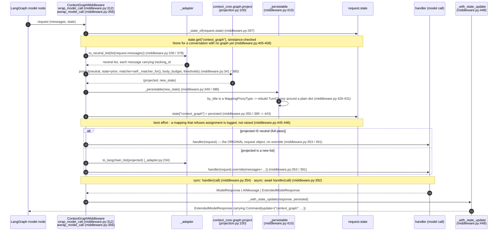
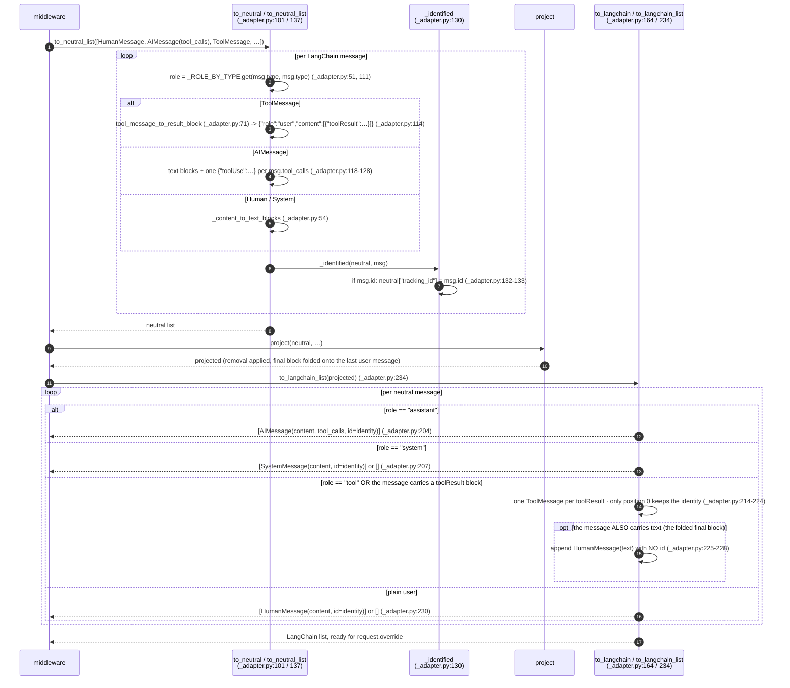
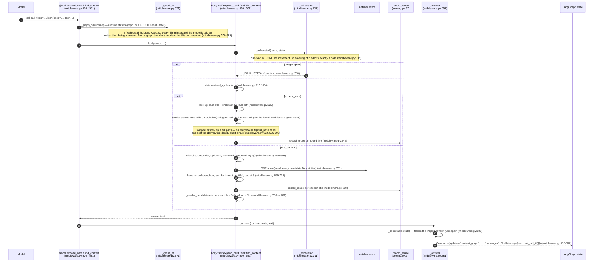
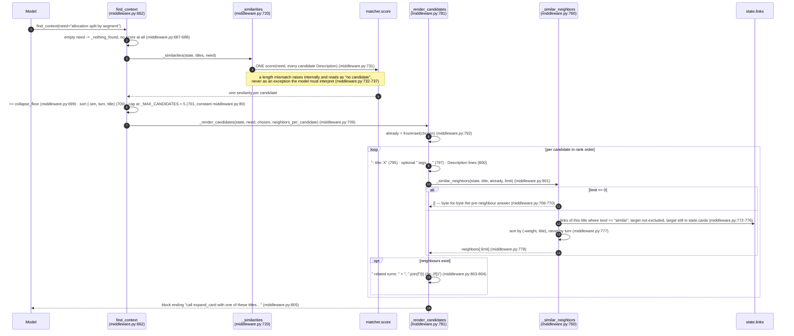

# Sequence Design — Practice D on LangGraph: `langgraph-context-graph`

Authority: `langgraph-plugins/langgraph-context-graph/src/langgraph_context_graph/` for the binding and
`context-core/src/context_core/graph/` for the practice. Every claim carries a `file.py:LINE`. Literal strings are
quoted from source. Where a thing does not exist, it is stated as not existing rather than invented.

Companion document: `docs/design/sequence/sequence-d-context-graph.md`, the Strands binding of the same practice.
This one is **not** a restatement of it — the Card model, the scoring ladder and the compaction are shared code and
are described here only where the LangGraph binding changes what reaches the model.

---

## 1. What the binding does, mechanically

`ContextGraphMiddleware` (`middleware.py:184`) is a LangChain v1 `AgentMiddleware` with **one** engagement surface in
two forms: `wrap_model_call` (`middleware.py:312`) and its async twin `awrap_model_call` (`middleware.py:356`). What
the Strands plugin spreads across three hooks and a middleware stage, LangChain admits in a single place
(`middleware.py:1` module header).

The body of that surface is five statements, identical in both forms:

1. Read the graph carried in the agent state under `context_graph` (`middleware.py:339` → `_state_of`,
   `middleware.py:397`; key constant `middleware.py:65`).
2. Convert the call's LangChain messages to the neutral shape — `to_neutral_list(list(request.messages))`
   (`middleware.py:339`, `_adapter.py:137`).
3. Call `context_core.graph.project` (`middleware.py:341`, core at `projection.py:100`), which does the write half,
   the read half and the delivery in that order — the order the three Strands hooks imposed (`projection.py:134`,
   `projection.py:140`, `projection.py:146`).
4. Flatten the new state to something LangGraph can copy (`_persistable`, `middleware.py:410`) and write it into
   `request.state` for this same turn's retrieval tools (`middleware.py:350`, `_write_back` at `middleware.py:435`).
5. Send the call out, projected or not: `call = request if projected is neutral else request.override(messages=to_langchain_list(projected))`
   (`middleware.py:353`), then attach the durable state write as a `Command` on the response
   (`middleware.py:354` → `_with_state_update`, `middleware.py:448`).

Two retrieval tools — `expand_card` and `find_context` — are built at construction as ordinary LangChain tools
(`_build_tools`, `middleware.py:521`, returned at `middleware.py:569`) and published on `self.tools`
(`middleware.py:294`). **There is no third tool.** `expand_artifact` does not exist in this binding; see §3.4.

Three properties are carried over from the Strands plugin unchanged, because they are the practice rather than the
wiring (`middleware.py:1` header):

- **The persisted history is never touched.** `override` is per call, so `state["messages"]` comes out of a projection
  exactly as it went in. Nothing is deleted, which is why a Card the choice collapsed still has messages to be raised
  back to.
- **A full pass is the identity.** `expand_threshold=0.0` makes the core return the *received* neutral list by object
  identity (`scoring.py:175` → `projection.py:443`), and the middleware reads that identity and calls the handler with
  the **original** request, so no `override` is applied at all (`middleware.py:353`).
- **Nothing derives a Card with a model.** The only remote call in any configuration is the matcher's embedding round,
  one per turn (`projection.py:321`), and the default matcher is built on first need (`_matcher_for`,
  `middleware.py:479`, construction at `middleware.py:492`) so wiring reaches no network.

**Four mechanics are documented below as first-class, not footnotes.** Each is a real finding already visible in the
code, not a hypothetical:

1. **`MappingProxyType` is not picklable, so `_persistable` flattens it.** `TurnChoice.by_title` is a
   `MappingProxyType` (`state.py:167`, docstring at `state.py:160`), which neither `copy.deepcopy` nor `pickle` can
   carry. LangGraph copies every state update as it applies it, so a proxy reaching the agent state fails the
   *superstep*, not merely the persistence. `_persistable` (`middleware.py:410`) rebuilds the choice around a plain
   dict (`middleware.py:426`–`431`). See §4.2.
2. **The adapter must carry `tracking_id`, or the graph is a silent no-op.** `msg.id` travels as the neutral
   `tracking_id` (`_adapter.py:133`), which is the Durable Identity every Card is addressed by. A history whose
   messages carry no id yields **no Card at all** and projects whole — machine-checked at
   `tests/test_middleware.py:178`. See §5.2.
3. **`expand_threshold=collapse_floor=0` is an identity call.** The constructor forbids a floor above the ceiling
   (`middleware.py:270`), so zeroing the threshold forces zeroing the floor; that pair short-circuits
   `warm_up_choice` before the matcher is reached (`scoring.py:175`) and the handler receives *the same request
   object* (`tests/test_middleware.py:259`–`281`). See §4.3.
4. **The elevation `expand_card` writes has a different lifetime here, because `project` runs per model call and not
   per invocation.** The Strands plugin computed the choice once per `BeforeInvocationEvent`; here every model call
   recomputes it at `projection.py:140`, which overwrites the `by_title` entry the tool wrote. What survives the
   boundary is the fed-back note, aged by **turn ordinal** rather than by a cycle counter (`projection.py:139` with
   the comment at `projection.py:136`–`138`). See §7.3.

---

## 2. Integration table — where the binding attaches to LangChain v1

Every framework symbol is funnelled through one file, `_compat.py`, "so an API move touches one file", verified
against `langchain` 1.4.2 (`_compat.py:1`–`3`): `AgentMiddleware`, `AgentState`, `ExtendedModelResponse`,
`ModelRequest`, `ModelResponse` from `langchain.agents.middleware` (`_compat.py:8`–`14`); `ToolCallRequest` and
`ToolRuntime` from `langchain.tools.tool_node` (`_compat.py:15`); `Command` from `langgraph.types` (`_compat.py:16`).

| Attach point | Declared at | What it does | Reads | Mutates |
|---|---|---|---|---|
| `state_schema` | `middleware.py:239` (`state_schema = ContextGraphState`) | Adds the `context_graph` key to the agent state so the graph travels with the conversation | — | The agent's state schema |
| `wrap_model_call` | `middleware.py:312` | The whole engagement surface, sync form | `request.messages`, `request.state` | `request.state[…]` best-effort; returns a NEW call via `override`; never `messages` in state |
| `awrap_model_call` | `middleware.py:356` | Async twin; the model handler is awaited at `middleware.py:392`, everything else is the same synchronous helper | same | same |
| `self.tools` | `middleware.py:294` | Publishes `expand_card` and `find_context` for `create_agent` to register | — | The agent's tool registry |
| `self._thresholds` | `middleware.py:295` | Freezes the core's `Thresholds` for the instance's lifetime, including `retrieval_tools=tuple(each.name for each in self.tools)` (`middleware.py:305`) | `self.tools` | — |
| Wiring notice | `middleware.py:308` → `_warn_on_pruning_middleware` (`middleware.py:498`) | One `warnings.warn` when the agent's middleware list holds a pruner | the passed `middleware` list | Nothing — "not removed, not reordered, not reconfigured" (`middleware.py:92` docstring) |

**There is no hook ordering problem to solve.** The Strands plugin had to move its delivery handler to index 0 of
`InvokeModelStage.Input`; here the nesting is the agent's middleware list and the first entry is the outermost
`wrap_model_call`. The core says the same from its side: the registry reordering, the `contextvars` hand-off and the
`WeakKeyDictionary` lookup "were all mechanism for delivering *inside* an event loop" and are not carried
(`projection.py:36`–`45`).

### 2.1 The async twin, and why it exists

`awrap_model_call` (`middleware.py:356`) is not symmetry for its own sake. Its docstring states the gap it closes
(`middleware.py:362`–`367`):

> LangChain does not bridge a sync ``wrap_model_call`` to an async run — it raises ``NotImplementedError`` — so a
> stack that also carries an async-only middleware (the relevance filter's ``awrap_tool_call``) forces the whole run
> async and needs this twin to exist.

The regression test carries the same reading in its module header (`tests/test_async_hook.py:1`–`5`) and asserts both
hooks are present (`tests/test_async_hook.py:53`–`56`). Because `project` is pure and synchronous, the twin differs
from the sync form in exactly one token: `await handler(call)` (`middleware.py:392`) against `handler(call)`
(`middleware.py:354`).

**One consequence for the harness — now resolved.** An earlier version of the benchmark harness carried an
`AsyncContextGraphMiddleware` subclass that supplied an `awrap_model_call` by running the sync hook on a worker
thread (`asyncio.to_thread`) and bridging the handler back onto the loop, because the package used to implement only
the sync `wrap_model_call`. The package has since closed that gap — `awrap_model_call` at `middleware.py:356` — so the
workaround was **removed**: the harness now wires the real `ContextGraphMiddleware` for the graph arm, and a benchmark
run measures the package's own `awrap_model_call` rather than a thread-hop around the sync hook.

---

## 3. The data model

### 3.1 The neutral shape — the boundary the core never crosses

`context_core.message` defines the contract and forbids a framework import anywhere under `context_core`
(`message.py:1`–`13`). A message is `{"role": …, "content": [block, …]}` and a block carries exactly one of
`{"text"}`, `{"json"}`, `{"toolUse"}`, `{"toolResult"}` (`message.py:14`–`31`). `NeutralBlock` and `NeutralMessage`
are plain dict aliases rather than validated `TypedDict`s, "so an adapter can hand over the framework's own dict
without a copy" (`message.py:38`–`41`).

`_adapter.py` is "the ONLY module in the LangGraph binding that touches both worlds" (`_adapter.py:3`–`5`). §5 is
about that module.

### 3.2 `ContextGraphState` — the graph as ordinary agent state

```python
class ContextGraphState(AgentState):          # middleware.py:115
    context_graph: NotRequired[GraphState]    # middleware.py:123
```

`NotRequired` is load-bearing: "a first call has no graph yet, which the core reads as a fresh one: a conversation
with no Card is a full pass, so an agent whose state carries nothing here is delivered to exactly as one without the
middleware" (`middleware.py:117`–`121`). Machine-checked at `tests/test_middleware.py:354`.

No codec is involved because `_GraphState` is plain data by design: "Every field is plain data (dicts, tuples, floats
and strings), so the state *is* the graph's serialized form — a binding may hand it back verbatim on the next call
without a codec" (`state.py:180`–`182`). Its fields are `cards`, `links`, `choice`, `reuse`, `turn`, `vectors`,
`retrieval_cycles`, `referenced` (`state.py:195`–`202`). The one field that breaks the plain-data promise in practice
is `choice`, and §4.2 is about that.

### 3.3 Card and the four `LinkKind` values

Shared with the Strands binding and unchanged: a `Card` (`state.py:76`) is a frozen dataclass holding **addresses and
derived text, never message content**; its fields are at `state.py:100`–`113`. `LinkKind = Literal["tool",
"artifact", "follows", "similar"]` (`state.py:51`); a `Link` is `(kind, target, weight)` (`state.py:129`–`131`).

| Link kind | Created | Target | Propagates a note? | Traversed by a retrieval path? |
|---|---|---|---|---|
| `tool` | `cards.py:422` | a tool name | Not through `_STRUCTURAL_WEIGHTS`; walked separately by `_spread_over_tool_hubs` (`scoring.py:289`) | No |
| `artifact` | `cards.py:425` | a reference | Yes, weight `_W_ARTIFACT` (`scoring.py:65`, listed `scoring.py:71`) | No — and see §3.4 |
| `follows` | `cards.py:428` | the prior Card's title | Yes, weight `_W_PREVIOUS` (`scoring.py:68`) | No |
| `similar` | `cards.py:435`–`436` (bidirectional, at registration) and `cards.py:1071`–`1072` (`link_newly_measurable`) | a Card title | **No** — `_STRUCTURAL_WEIGHTS` omits it (`scoring.py:71`), and `_spread_over_card_edges` skips any kind the mapping does not name (`scoring.py:283`–`286`) | **Yes** — `_similar_neighbors` (`middleware.py:760`), its only reader anywhere |

`_STRUCTURAL_WEIGHTS` contains exactly `{"follows": _W_PREVIOUS, "artifact": _W_ARTIFACT}` (`scoring.py:71`–`76`) —
verified. Its docstring states the `similar` exclusion outright: "``similar`` targets a Card but inherits no Note at
all (Requirement 8.4): it is an edge a manual search traverses" (`scoring.py:80`–`81`).

### 3.4 Artifact Cards cannot exist in this binding

`cards.py` publishes `derive_artifact_cards` (`cards.py:681`), `register_artifact_cards` (`cards.py:739`) and
`derive_and_register_artifacts` (`cards.py:779`). **Nothing in the LangGraph path calls any of them.**
`projection.py` contains the string `artifact` zero times, and neither `middleware.py` nor `projection.py` imports
`context_core.graph.store`. The reference store (`store.py:135`, `store.py:191`) is reachable only through the
package's `__init__` (`graph/__init__.py:15`) and is wired by no binding code here.

Three consequences, each a live reading of the code rather than a caveat:

- `Card.kind` is `"subject"` for every Card this binding ever holds (`state.py:48`), so the `is_artifact` branches in
  `distribute` (`scoring.py:374`, `scoring.py:381`, `scoring.py:396`) are unreachable.
- The `artifact` Link at `cards.py:425` still forms — it targets a *reference string* scraped out of the messages, not
  an artifact Card — so it propagates a note to a target that is not in `note` and is skipped at `scoring.py:284`.
  The edge is written and carries nothing.
- `_artifact_header` (`describe.py:424`) is never reached, so the artifact Description shapes documented for the
  Strands binding do not occur here.

The tool side matches: the guidance can name at most the two tools that exist (§8.3).

---

## 4. Band 1 — the interface: `wrap_model_call` / `awrap_model_call`



### 4.1 `override` is the whole delivery mechanism

The Strands binding returned a new `InvokeModelContext` out of an `InvokeModelStage.Input` handler. Here the
equivalent is one call: `request.override(messages=to_langchain_list(projected))` (`middleware.py:353`). Because
`override` is per call, `state["messages"]` is untouched — asserted, by object identity of every persisted message,
at `tests/test_middleware.py:284`–`307`.

Nothing is written back to `messages` on either write path: `_write_back` touches only `_STATE_KEY`
(`middleware.py:443`) and `_with_state_update` writes only `_STATE_KEY` into the command
(`middleware.py:458`, `middleware.py:462`, `middleware.py:471`), which is what lets an inner middleware's command
keep its own keys (`middleware.py:452`–`460`, checked at `tests/test_middleware.py:339`).

### 4.2 The state write happens twice, on purpose — and `MappingProxyType` is why `_persistable` exists

Two writes, two different jobs (`middleware.py:330`–`333`):

| Write | Where | Purpose | Failure posture |
|---|---|---|---|
| In-place, into `request.state` | `middleware.py:350` / `389` → `_write_back` (`middleware.py:435`) | So `expand_card` / `find_context` called **out of this very turn** read the graph the choice was taken from | Logged at debug, never raised: "A state that refuses the assignment costs the tools of *this* turn their fresh graph and nothing else" (`middleware.py:439`–`441`) |
| Durable, as a `Command` on the response | `middleware.py:354` / `392` → `_with_state_update` (`middleware.py:448`) | The write the checkpointer keeps | An unrecognised response shape is passed through untouched and logged (`middleware.py:473`–`475`) |

**The finding.** `TurnChoice.by_title` is declared `Mapping[str, CardChoice]` and is always built as a
`MappingProxyType` — `full_pass_choice` (`scoring.py:152`), `distribute`'s return (`scoring.py:407`), and the
default factory of a fresh state (`state.py:197`). The proxy is deliberate: "A ``MappingProxyType``, never a live
dict: the choice is frozen for the whole turn, so the context cannot shift mid-reasoning" (`state.py:160`–`162`).

That freeze is exactly what LangGraph cannot carry. `_persistable`'s docstring states the mechanism
(`middleware.py:412`–`420`):

> ...which is what keeps the turn's decision unwritable for the whole turn — and which neither ``copy.deepcopy`` nor
> ``pickle`` can carry. LangGraph copies every state update as it applies it, so a proxy reaching the agent state
> fails the *superstep*, not just the persistence.

The fix flattens rather than unfreezes, guarded on the concrete type so an already-plain choice is returned untouched:

```python
if type(state.choice.by_title) is not dict:          # middleware.py:426
    state.choice = TurnChoice(                       # middleware.py:427
        by_title=dict(state.choice.by_title),
        full_pass=state.choice.full_pass,
        selected=state.choice.selected,
    )
return state
```

Nothing the freeze protects is lost, and the reason is specific to this binding: "the choice is recomputed by the
next projection rather than read back and extended, so what the proxy protects against — a decision shifting
mid-turn — cannot happen here" (`middleware.py:421`–`423`). The core independently notes the same incompatibility
from its own side, as the reason `_copy_state` is a container copy and not a `deepcopy` (`projection.py:152`–`155`).

`_persistable` mutates in place on purpose, and its docstring names the only two states that reach it: one this
binding just produced, or one a retrieval tool already mutates by design (`middleware.py:429`–`433`). The tool path
calls it too, at `middleware.py:585`.

The regression test is explicit about what it guards — `copy.deepcopy` over the state written both ways
(`tests/test_middleware.py:609`–`628`, docstring at `:612`).

### 4.3 The identity short circuit, end to end

`expand_threshold=0.0` is not a tuning value, it is a probe. The path:

1. The constructor rejects a floor above the ceiling (`middleware.py:270`–`274`), with the comment "a floor above the
   ceiling leaves the middle resolution unreachable" (`middleware.py:268`). So `expand_threshold=0.0` is admissible
   only together with `collapse_floor=0.0`.
2. `warm_up_choice` returns the full-pass choice before the matcher is reached: `if expand_threshold == 0.0 or
   len(state.cards) < min_cards` (`scoring.py:175`), reached from `projection.py:305`.
3. `_deliver` reads `state.choice.full_pass` first and returns the **received** list (`projection.py:443`–`444`).
4. `project` therefore returns its input object, and the middleware reads that by identity: `call = request if
   projected is neutral else …` (`middleware.py:353`).

So the provider sees "the call it would see without the middleware" — byte for byte, not merely equal
(`middleware.py:1` header, `middleware.py:324`–`326`). `tests/test_middleware.py:259`–`281` asserts
`handler.request is request`, `handler.request.messages is request.messages`, and `matcher.calls == []`.

Two other paths reach the same identity, and both matter operationally: `min_cards` not yet met (`scoring.py:175`;
`tests/test_middleware.py:202` asserts the matcher is never called), and an **empty removal request** —
`if not requested: return messages` (`projection.py:447`–`449`).

---

## 5. Band 2 — the adapter: `to_neutral_list` / `to_langchain_list`



### 5.1 The asymmetry: one neutral message, two LangChain messages

`to_neutral` is a function; `to_langchain` returns a **list** (`_adapter.py:164`). The reason is stated in its
docstring (`_adapter.py:167`–`174`):

> A **list**, because the mapping is not one to one in this direction: a neutral ``user`` message is the carrier for
> tool results, and the projection's own compaction appends its final block as a text block to the last ``user``
> message — which in an autonomous tool loop is the message carrying a ``toolResult``. LangChain has no message type
> holding both, so that one neutral message renders as the ``ToolMessage`` followed by a ``HumanMessage`` with the
> appended text.

The two halves of the collision, each verifiable:

- **Inbound.** A `ToolMessage` becomes a **user-role** neutral message whose only block is a `toolResult`
  (`_adapter.py:113`–`114`; `tests/test_adapter.py:53`–`57`).
- **The fold.** `_fold_into_last_user_message` walks backwards for `messages[index]["role"] == "user"`
  (`projection.py:497`–`501`) and appends a text block to *that* message's content (`projection.py:506`–`507`). In a
  tool loop the newest user-role message is the one carrying the tool result, so the folded `<collapsed_turns>` block
  lands on a message that already holds a `toolResult`.

The split preserves the two invariants that matter. Ordering: "The tool result therefore stays immediately behind the
tool call, which is the ordering a provider requires, and the folded text lands behind it as trailing per-call
content" (`_adapter.py:174`–`176`). Identity: the first message out keeps the `tracking_id` and the synthetic carrier
gets none — "it is per-call content, not a persisted message" (`_adapter.py:175`–`177`, code at `_adapter.py:222` and
`_adapter.py:228`). Machine-checked at `tests/test_adapter.py:127`–`151`.

`to_langchain_list` states the direction of the guarantee precisely: the round trip holds outward and back, and it is
"deliberately **not** injective the other way" (`_adapter.py:239`–`242`).

One more asymmetry, in content shape rather than message count: a single text block collapses to a plain string and
anything richer becomes a list of content parts (`_blocks_to_content`, `_adapter.py:145`, mirroring
`_content_to_text_blocks`, `_adapter.py:54`; same rule for a tool result at `result_block_to_content`,
`_adapter.py:83`). An assistant message with neither body nor tool calls renders as **no message at all**, because
"several providers reject an empty message outright" (`_adapter.py:201`–`203`).

### 5.2 `tracking_id` is the whole graph, and losing it is silent

`_identified` is four lines (`_adapter.py:130`–`134`) and is the binding's single point of contact with the Card
model. Its docstring in `to_neutral` states the consequence: "A message without one contributes no identity, so its
turn yields no Card and projects whole — the same quiet direction the core takes everywhere else"
(`_adapter.py:104`–`107`).

Followed through the core, the no-op is total:

1. `_identities_in` collects an identity only from a message that has one (`projection.py:275`), and `_close_turns`
   returns early when a closed turn yields none: "A turn whose messages all lack a Durable Identity: messages without
   a Card, projected whole" (`projection.py:230`–`233`).
2. With no Card, `warm_up_choice` short-circuits on `len(state.cards) < min_cards` (`scoring.py:175`) and the choice
   is a full pass.
3. `_deliver` returns the received list on `full_pass` (`projection.py:443`).

So an id-less history produces **no warning, no error and no measurable difference** — the middleware runs, the
matcher is never called, and every message goes whole. `tests/test_middleware.py:178`–`186` asserts exactly that:
`state["context_graph"].cards == {}` and `handler.messages == messages`.

This is the one failure mode of the binding that cannot be noticed from the model's side, which is why it is stated
here as a first-class mechanic. LangChain assigns message ids in normal operation; the exposure is a hand-assembled
history, a `model_copy(update={"id": None})`, or a middleware upstream that rebuilds messages without carrying ids.

---

## 6. Band 3 — the core: `project()` and its three phases

`project` (`projection.py:100`) is eight statements. The module header names what each phase used to be: the write
half "was `MessageAddedEvent`", the read half "was `BeforeInvocationEvent`", the delivery "was the
`InvokeModelStage.Input` handler" (`projection.py:8`–`24`).

```mermaid
sequenceDiagram
    autonumber
    participant MW as middleware
    participant P as project<br/>(projection.py:100)
    participant CP as _copy_state<br/>(projection.py:149)
    participant W as _close_turns<br/>(projection.py:198)
    participant C as cards.py
    participant D as describe.py
    participant R as _compute_choice<br/>(projection.py:281)
    participant S as scoring.py
    participant MA as matcher
    participant V as _cache_description_vectors<br/>(projection.py:368)
    participant DEL as _deliver<br/>(projection.py:422)
    participant RM as apply_removal<br/>(removal.py:173)
    participant RB as render_final_block<br/>(compaction.py:91)
    participant F as _fold_into_last_user_message<br/>(projection.py:470)

    MW->>P: project(messages, state, matcher, body_budget, thresholds)
    P->>CP: _copy_state(state) or a fresh _GraphState() (projection.py:132)
    Note over CP: container copy, NOT deepcopy — every value is already immutable<br/>and MappingProxyType cannot be pickled at all (projection.py:152-155)

    rect rgb(238,244,255)
    Note over P,D: PHASE 1 — the write half (was MessageAddedEvent)
    P->>W: _close_turns(new_state, messages, thresholds) (projection.py:134)
    W->>C: closed_turn_ranges(messages) (cards.py:161)
    alt no closed turn
        W-->>P: return — nothing to card (projection.py:220-222)
    else state.cards empty -> the restore case
        W->>C: rebuild_into(state, messages, **_card_config) (projection.py:225 -> cards.py:564)
    else incremental
        W->>C: turn_ids = _identities_in(messages[start:stop]) (projection.py:229 -> 261)
        alt no identity in the turn
            W-->>P: return — messages without a Card, projected whole (projection.py:230-233)
        else
            W->>C: derive_and_register(state, messages, turn_ids, len(closed)-1, **_card_config) (projection.py:236 -> cards.py:442)
            C->>C: derive_card (cards.py:306): partition_turn (189), tool_pairs_of (216), references, numeric_lines
            C->>D: compose_description (describe.py:189) · tag_candidates (241) · select_tags (277)
            C->>C: register_card (cards.py:375): tool (422) / artifact (425) / follows (428) · similar (435-436) only if vectors cached
            C->>C: retag(state, messages) (cards.py:439 -> 638) — rarity recount over the graph
        end
    end
    Note over W: any failure logs ONE warning and leaves the state as it was (projection.py:238)
    end

    rect rgb(240,255,243)
    Note over P,V: PHASE 2 — the read half (was BeforeInvocationEvent)
    P->>S: expire_reuse(new_state, new_state.turn) (projection.py:139 -> scoring.py:119)
    Note over P,S: aged by the TURN ORDINAL, not a cycle counter — the neutral<br/>equivalent of agent.event_loop_metrics.cycle_count (projection.py:136-138)
    P->>R: _compute_choice(new_state, messages, matcher, body_budget, thresholds) (projection.py:140)
    R->>S: warm_up_choice(state, expand_threshold, min_cards) (projection.py:305 -> scoring.py:155)
    alt skipped (expand_threshold == 0.0 OR cards < min_cards)
        S-->>R: full_pass_choice() — the matcher is never reached (scoring.py:175)
    else matcher is None
        R-->>P: full_pass_choice() — "score nothing, send everything" (projection.py:315-317)
    else
        R->>R: question = _question_of(messages) — texts of the LAST user message (projection.py:319 -> 344)
        R->>S: compute_notes(state, question, matcher) (projection.py:321 -> scoring.py:195)
        S->>MA: ONE score(question, descriptions) — the turn's only embedding round
        S->>S: Pass 1 = similarity + fed-back note, no factor (scoring.py:225-229)
        S->>S: Pass 2 = _propagate, exactly one jump over follows/artifact + tool hubs (scoring.py:235)
        alt notes empty (matcher failed or malformed)
            R-->>P: full_pass_choice() (projection.py:322-326)
        else
            R->>V: _cache_description_vectors(state, matcher, link_threshold) (projection.py:330)
            V->>MA: matcher.vectors(descriptions) — free, already in the cache under the document purpose
            V->>C: link_newly_measurable(state, newly_measurable, link_threshold) (projection.py:416 -> cards.py:1029)
            C->>C: writes ONLY 'similar' edges (cards.py:1071-1072)
            R->>S: distribute(notes, state, expand_threshold, collapse_floor, body_budget) (projection.py:332 -> scoring.py:320)
            S-->>R: TurnChoice.by_title — a rung per Card, frozen behind MappingProxyType (scoring.py:407)
        end
    end
    Note over R: any failure logs ONE warning and degrades to the full pass (projection.py:340)
    P->>P: new_state.turn += 1 (projection.py:142) · new_state.retrieval_cycles = 0 (projection.py:144)
    end

    rect rgb(255,248,240)
    Note over P,F: PHASE 3 — the delivery (was InvokeModelStage.Input)
    P->>DEL: _deliver(new_state, messages, thresholds) (projection.py:146)
    alt choice.full_pass
        DEL-->>MW: the RECEIVED messages object, by identity (projection.py:443-444)
    else
        DEL->>RM: apply_removal(messages, state, choice, current_turn_ids(messages)) (projection.py:446)
        RM->>RM: removal_ids skips any part at 'full' and subtracts the open turn (removal.py:124-128)
        RM->>RM: remove_messages preserves by pin / first user / tool-pair reconciliation (removal.py:131)
        RM-->>DEL: (removed list, requested ids)
        alt requested empty
            DEL-->>MW: the same list object (projection.py:447-449)
        else
            DEL->>RB: render_final_block(removed, state, requested, description_tokens, retrieval_tools) (projection.py:451)
            RB->>RB: retained read off the removed list · dropped = requested - retained (compaction.py:129)
            RB->>RB: one _entry per Card in ascending (turn, title) (compaction.py:133 -> 196)
            RB-->>DEL: "<collapsed_turns>…</collapsed_turns>\n\n<trailer>" or None
            alt final_block is None
                DEL-->>MW: the removed list as it is — no description to lose (projection.py:458-461)
            else
                DEL->>F: _fold_into_last_user_message(removed, final_block) (projection.py:463)
                F->>F: walk backwards to the last role == "user" (projection.py:497-501)
                F->>F: APPEND a text block, separator "\n\n" (projection.py:504-507)
                F->>F: carry metadata + tracking_id onto the rebuilt message (projection.py:510-513)
                F-->>DEL: NEW list, input never mutated
                DEL-->>MW: folded (projection.py:464)
            end
        end
    end
    Note over DEL: any failure returns the RECEIVED messages, one warning (projection.py:466)
    end
```



### 6.1 The write half — what closes a turn, and the restore case

A turn is closed by what comes after it, so the Card of the last closed turn is derived off the messages themselves —
"Title, Description, Tags and Links together, with no model, no disk and no network" (`projection.py:9`–`11`).

`_close_turns` has three branches and each is a distinct situation (`projection.py:216`–`237`):

| Branch | Condition | Action |
|---|---|---|
| Nothing closed | `not closed` | Return. "Nothing has closed yet: no turn to card, and nothing to rebuild from" (`projection.py:220`) |
| Restore | `not state.cards` | `rebuild_into` — one scan derives the whole graph (`projection.py:225`) |
| Incremental | otherwise | `derive_and_register` on the last closed range (`projection.py:236`) |

The ordinal passed to `derive_and_register` is `len(closed) - 1` and **not** `state.turn`, "so a turn's Card is the
same whether it was derived turn by turn or by one scan" (`projection.py:234`–`235`). `_card_config`
(`projection.py:241`) is the single source of the derivation parameters for both entry points, which is what makes the
two comparable (`projection.py:246`–`248`).

In LangGraph the restore branch is not hypothetical: the graph travels in checkpointed state, and the harness had to
put `context_core.graph.state` on the checkpointer's msgpack allowlist to keep it from being lost
(`runner.py:221`, applied at `runner.py:251`). Without that, the restore branch is what would silently rebuild the
graph on every resume.

`derive_and_register` absorbs a per-Card failure itself — one warning, nothing registered — and `_close_turns` wraps
the lot in a second `try` that logs "closing the turn's card failed | the turn's messages go whole"
(`projection.py:238`). A late write half is a turn with no Card yet, which projects Full Content, i.e. the behaviour
without the feature (`projection.py:207`–`209`).

### 6.2 The read half — one embedding round, and where the `similar` edge gets paid for

`compute_notes` (`scoring.py:195`) invokes the matcher **exactly once** (`scoring.py:203`), over
`titles_in_turn_order` (`scoring.py:180`) so the similarities come back aligned and every later sum walks the same
order — which is where determinism comes from (`scoring.py:186`–`188`). Asserted at
`tests/test_middleware.py:189`–`200`: one call, four descriptions, the question being the last user text.

`_cache_description_vectors` (`projection.py:368`) runs **only** on this path and only after the scoring round, so
the document vectors are already in the matcher's cache and the index fill sends nothing (`projection.py:378`–`380`).
Its docstring states what an unfilled index actually costs, which is not latency:

> Without this the index stays empty, and an empty index is not a slow path but a missing feature: the similarity Link
> is measured from this index alone, by a step Requirement 3.2 keeps free of network calls, so an unfilled index makes
> every pair unmeasurable and the ``similar`` Link never forms at all. The three structural Link kinds still form,
> which is why a graph with no ``similar`` edge looks like a working graph in the counters. (`projection.py:371`–`376`)

This is the sequencing fact behind §7.4: the `similar` edge for a Card cannot form on the turn the Card is registered
(the write half is network-free, so its own vector is not cached yet), and `link_newly_measurable`
(`projection.py:416` → `cards.py:1029`) closes the gap on the **next** projection, writing `similar` edges and
nothing else (`cards.py:1071`–`1072`).

### 6.3 `distribute` — the two axes read different things

Unchanged from the Strands binding; restated because it is what the model's context is made of.
`distribute`'s docstring gives both axes as two bullets (`scoring.py:330`–`344`).

| | Dialogue axis | Evidence axis |
|---|---|---|
| Rungs | **Three** — full / description / title | **Two** — full / description |
| Decided by | the Note (cosine similarity plus the fed-back bonus) | **message order alone** |
| Code | thresholds at `scoring.py:379`, `scoring.py:389`, `scoring.py:392` | `all(pair.consumed for pair in card.pairs)` at `scoring.py:396` |
| Model calls for the decision | zero; one embedding round per turn feeds the Note | **zero**, and zero embeddings — `scoring.py:342` states it |
| Knob that moves it | `expand_threshold`, `collapse_floor`, `body_budget` | **none exists** |

`body_budget=None` is not "no ceiling", it is **the step down turned off**: the branch is
`elif remaining is None or cost <= remaining or in_progress:` (`scoring.py:383`), so with `None` the first disjunct is
permanently true and every Card at or above `expand_threshold` travels whole, however many there are. With a finite
budget a Card that does not fit takes the `else` at `scoring.py:386` and drops **one rung, to Description, never to
Title** — the comment is literally "Budget exhausted: one rung down, never to Title" (`scoring.py:387`).
`tests/test_middleware.py:217` is named for that invariant.

The evidence axis debits the budget but clamps at zero rather than denying the rung: "an unconsumed pair travels whole
regardless, so what would have gone negative is clamped instead of denied" (`scoring.py:400`–`403`).

A Card of the turn in progress is Full Content on both axes whatever its Note (`in_progress`, `scoring.py:375`).

### 6.4 The delivery is one step, or it is nothing

Removal and fold are not two stages that can half-happen. The core states the constraint: Requirement 16.2 "does not
admit the state in between: a removal applied with no block folded is a call that lost content and says nothing about
the loss", so any failure returns the received list by object identity (`projection.py:16`–`21`,
`projection.py:437`–`439`, `projection.py:466`).

The fold **appends**, and the reason is a provider-cache argument rather than a formatting preference: "a trailing run
is the only placement a provider can keep out of its cached prefix — text ahead of the stable conversation would
invalidate the cache from the first block onward" (`projection.py:483`–`486`). The separator is `"\n\n"` unless the
text already starts with a newline, "Some providers concatenate adjacent text blocks, which would run this onto the
user's own words" (`projection.py:504`–`506`). `tracking_id` is carried onto the rebuilt message, because "dropping it
here would make the folded message invisible to the next projection's scan, which reads Cards off exactly these
identities" (`projection.py:511`–`512`).

`tests/test_middleware.py:235`–`257` asserts both halves against the LangChain output: a full Card's `HumanMessage`
survives the `override`, and the folded block arrives on a `HumanMessage`.

---

## 7. Retrieval path — the model calling back in

### 7.1 Two tools, and a `Command` instead of a mutation



Three binding-specific facts:

- **The tools are closures, not bound methods.** `_build_tools` (`middleware.py:521`) closes over `self` "so the
  schema the model sees carries the tool's own arguments and nothing else" (`middleware.py:524`–`525`). The bodies are
  published as `self.expand_card` (`middleware.py:590`) and `self.find_context` (`middleware.py:662`) precisely so
  they are testable without an agent: "a body reachable without a ``ToolRuntime`` is a body that can be tested without
  an agent" (`middleware.py:604`–`605`). `tests/test_middleware.py:368` checks the model-facing schema carries the
  tool arguments only.
- **A tool persists state with a `Command`, never by mutating.** `_answer` (`middleware.py:581`) returns one
  `Command` carrying both the graph update and the `ToolMessage`, "which is how a tool persists a state change in
  LangGraph: the elevation has to outlive the tool call to be read by the next projection"
  (`middleware.py:526`–`528`). `tests/test_middleware.py:503`–`520` asserts the shape.
- **`expand_card` accepts a scalar.** "the schema says array, and a model that sends the scalar anyway should be
  answered rather than corrected" (`middleware.py:619`, docstring `middleware.py:613`–`615`;
  `tests/test_middleware.py:421`).

### 7.2 The retrieval budget

`_exhausted` (`middleware.py:711`) refuses when `state.retrieval_cycles >= self._max_retrieval_cycles`
(`middleware.py:716`), and `state.retrieval_cycles` is reset to `0` by **every projection**
(`projection.py:144`) — "Counted per turn, so it starts each turn at zero" (`projection.py:143`).
`tests/test_middleware.py:485` is named `test_the_retrieval_budget_is_spent_per_turn`.

Note the interaction with §7.3: because `project` runs per model call, the budget resets on every model call of an
agent loop, not once per `invoke`. A ceiling of 8 is therefore 8 calls per **model call**, which is a looser bound in
LangGraph than the same number was in Strands.

### 7.3 The elevation's lifetime — the finding

`expand_card`'s docstring says the elevation "ends with the turn: the next projection recomputes the choice from the
graph, and the fed-back note is what carries the request across that boundary" (`middleware.py:594`–`596`). Followed
through the LangGraph control flow, that sentence is precise and its consequence is sharper than it first reads.

The sequence, in code:

1. The tool rewrites `state.choice.by_title` with `dialogue="full", evidence="full"` (`middleware.py:633`–`643`) and
   returns it in a `Command` (`middleware.py:582`–`587`).
2. LangGraph applies the update, so `state["context_graph"]` now holds the elevated choice.
3. The agent loops back to the model node, which calls `wrap_model_call` again → `project` → `_compute_choice`
   (`projection.py:140`), which **assigns** `new_state.choice` unconditionally.

So no delivery ever reads the `by_title` entry the tool wrote: the elevation is overwritten before the next
`_deliver` runs. The whole graph has exactly two readers of `choice` — `_deliver` (`projection.py:443`,
`projection.py:446`) and `render_final_block` beneath it (`compaction.py:131`, `compaction.py:141`) — and both sit
*downstream* of the assignment at `projection.py:140`. Nothing in the read half reads the prior choice: `_copy_state`
carries it across (`projection.py:166`) and `_compute_choice` replaces it unread.

What crosses the boundary is `record_reuse` (`middleware.py:645`, `middleware.py:707` →
`scoring.py:97`), which stores `(_REUSE_BONUS, cycle + reuse_ttl_cycles)` (`scoring.py:116`) with `_REUSE_BONUS = 1.0`
undecayed (`scoring.py:92`). That bonus is added in Pass 1 of the next `compute_notes` (`scoring.py:229`), and since
`expand_threshold` is validated into `[0.0, 1.0]` (`_validate_ratio`, `middleware.py:127`), a note of at least `1.0`
clears any admissible threshold — the constant's docstring says so: "it clears any admissible ``expand_threshold`` on
the turn the model asked: the request the model made is not a hint to be outvoted" (`scoring.py:92`–`94`).

Two differences follow, and both are readings of the code rather than measurements:

- **The bonus lifts the dialogue axis only.** The evidence axis is decided by `pair.consumed`
  (`scoring.py:396`) and no note touches it. `expand_card`'s confirmation promises "its messages and its tool results
  together" (`middleware.py:653`–`656`); the dialogue half of that promise is delivered by the bonus, and the evidence
  half was delivered by the elevation the next projection discards. A Card whose pairs are all consumed therefore
  returns with its dialogue whole and its evidence at Description.
- **`reuse_ttl_cycles=0` makes the tool a text-only no-op.** `record_reuse` returns before writing when the TTL is
  zero (`scoring.py:113`), so nothing crosses the boundary and the elevation is discarded — the model gets the
  confirmation string and no content. In Strands the same setting still left the direct elevation working for the rest
  of the invocation.

**The clock is the turn ordinal.** `expire_reuse` is called as `expire_reuse(new_state, new_state.turn)`
(`projection.py:139`) with the comment naming the substitution: "The plugin reads
``agent.event_loop_metrics.cycle_count``; with no agent to read, the turn ordinal is the neutral equivalent —
monotonic, incremented once per projection, and never advanced by a burst of messages inside one turn"
(`projection.py:136`–`138`). The ordinal is incremented after the choice (`projection.py:142`), and `expire_reuse`
drops an entry only when `cycle > expiry_cycle` (`scoring.py:141`–`143`). Since the ordinal advances once per
projection and a projection is one model call, a TTL of 5 is five **model calls** here, not five agent invocations.

### 7.4 `find_context` and the `similar` edge

`_similar_neighbors` (`middleware.py:760`) is "The only reader of the ``similar`` edge: it is measured on the write
path and stored with its similarity as the weight, propagates no note by design, and without this traversal is paid
for and read by nothing" (`middleware.py:763`–`765`).



Three deliberate decisions, each verified:

1. **A candidate is never listed as another candidate's neighbour.** `already = frozenset(chosen)`
   (`middleware.py:792`) is computed once over the **whole** chosen list and passed on every call
   (`middleware.py:801`), filtered at `middleware.py:775`. The reason is at `middleware.py:790`–`791`: a candidate is
   already being rendered in full, so offering it again would spend tokens to say nothing. The exclusion is therefore
   symmetric and independent of rank order.
2. **A neighbour gets no fed-back note.** `record_reuse` is called only over `chosen` (`middleware.py:706`–`707`),
   *before* `_render_candidates` is reached (`middleware.py:709`). Nothing in `_similar_neighbors` or
   `_render_candidates` touches `state.reuse` or `state.choice`. A neighbour is a **hint, not evidence**: it does not
   raise, it does not persist, and its content does not arrive. The model must call `expand_card` with that title,
   which is what the closing line tells it to do (`middleware.py:805`).
3. **`0` reproduces the pre-neighbour answer byte for byte.** At `0`, `_similar_neighbors` returns `[]` on its first
   guard (`middleware.py:769`), `neighbors` is falsy and the append is skipped (`middleware.py:802`). This is why the
   parameter is validated with `floor=0` (`middleware.py:277`) rather than by the default `floor=1`.

**Why the edge answers something the ranking cannot.** `find_context` scores each Description against the *question*
and never against another Description — one `score` call at `middleware.py:731`. Two turns covering the same ground in
different words are invisible to each other in that ranking; the `similar` edge holds exactly that
Description-to-Description relation, already measured. The argument is recorded at `middleware.py:785`–`788`.

**And the one-turn delay.** Per §6.2, a Card's `similar` edges cannot form on the turn it is registered, so the first
projection after a Card appears renders no `related turns:` line for it. Not a failure path — the list is empty and
the line is skipped.

---

## 8. Verbatim text the model sees

**System prompt:** the middleware writes **nothing** to it. There is no system-prompt hook in the class; the only
text placed in front of the model is the folded `<collapsed_turns>` block on the last user message, plus the two tool
schemas and their return values.

### 8.1 The two tool descriptions — copied exactly

The `@tool` decorator derives the description from the docstring and the schema from the typed signature. Signatures:
`expand_card(titles: list[str], runtime: ToolRuntime)` (`middleware.py:531`) and
`find_context(need: str, runtime: ToolRuntime, tag: str | None = None)` (`middleware.py:552`). `runtime` is
framework-injected and is **not** documented in the `Args:` block, unlike the Strands version which documented
`tool_context` as "Injected by the framework. Not user-facing."

`expand_card` (`middleware.py:532`–`547`):

```text
Bring back the full content of one or more earlier turns, by their titles.

Earlier turns may reach you as a title and a short description instead of their messages. When
a description is not enough to answer, call this with the titles exactly as they were shown and
those turns arrive in full for the rest of this turn.

Ask for every turn you need in ONE call: a list of titles costs one retrieval where the same
titles one at a time cost one each, and each extra call grows the conversation you are about to
reason over.

Args:
    titles: Titles of the turns you want back, copied as they were shown to you.

Returns:
    Confirmation that the turns will arrive in full, or an error naming the title asked for.
```

`find_context` (`middleware.py:553`–`565`):

```text
Find earlier turns of this conversation that match what you need, described in your words.

Use this when you suspect the conversation already covered something but you cannot see it in
what reached you. Describe the need, not a title.

Args:
    need: What you are looking for, in your own words.
    tag: Restrict the search to turns carrying this tag.

Returns:
    Up to five candidate turns with their title, tags and description, or an empty result
    naming the need received.
```

There is no third tool: `_build_tools` returns exactly `[expand_card, find_context]` (`middleware.py:569`).

### 8.2 A rendered Card — the literal shape

A subject Card's Description is assembled by `compose_description` (`describe.py:189`) as a header
(`_subject_header`, `describe.py:401`) followed by the Card's numeric lines copied verbatim
(`describe.py:220`–`222`). The header is the Title, then a tools line when there are tools, then a references line
when there are references — an absent line is left out rather than rendered empty, because "``tools:`` with nothing
after it spends budget to say nothing" (`describe.py:407`–`408`, code at `describe.py:413`–`419`):

```text
Where does the S000 allocation land
tools: query_ledger (2), fetch_segment (1)
references: ref-7f21
S000 allocation 12,400.00 reais
segment split 61.0% / 39.0%
(+3 numeric lines omitted)
```

The `tools:` line is `"tools: " + ", ".join(f"{name} ({count})" …)` (`describe.py:415`), the `references:` line is
`"references: " + ", ".join(references)` (`describe.py:419`), and the omission line is
`_OMISSION = "(+{count} numeric lines omitted)"` (`describe.py:111`), emitted only when the budget cut lines
(`describe.py:235`).

The contract on that cut is `startswith`-verifiable: strip the omission line and what remains is a literal prefix of
the Description the same Card yields with an unbounded budget (`describe.py:207`–`209`). Only when the header alone
overruns does the cut fall back to sentence, then word, then character boundary — and with no ellipsis, "which would
cost the prefix property" (`describe.py:204`–`206`).

Inside the folded block, `_entry` (`compaction.py:196`) renders a Card as `- <title>` followed by its fragments
indented two spaces (`compaction.py:234`), with the Card's own title removed from the fragments because "The title
line already carries the title, so the description's own first line is a duplicate"
(`compaction.py:223`–`224`). Constants: `_ENTRY_PREFIX = "- "` (`compaction.py:84`),
`_FRAGMENT_INDENT = "  "` (`compaction.py:87`). So the same Card, at dialogue `description`:

```text
- Where does the S000 allocation land
  tools: query_ledger (2), fetch_segment (1)
  references: ref-7f21
  S000 allocation 12,400.00 reais
  segment split 61.0% / 39.0%
```

At dialogue `title` the entry is the `- <title>` line alone, no fragment — and the line is still emitted, because
"omitting it would drop the Card's address from the call" (`compaction.py:206`–`208`).

Evidence at `description` contributes its own fragments (`_evidence_fragments`, `compaction.py:253`): a
`tools: name (count), …` line (`compaction.py:276`), a `references: …` line (`compaction.py:279`), the numeric lines,
then an omission line if any were cut (`compaction.py:289`). A part that stayed contributes **nothing**, because a
part contributes only when all of its identities left (`_part_left`, `compaction.py:237`; `dropped` at
`compaction.py:129`).

### 8.3 The block markers and the guidance trailer

Markers: `_HEADER = "<collapsed_turns>"` (`compaction.py:49`), `_FOOTER = "</collapsed_turns>"`
(`compaction.py:53`). A marker and not a sentence, because "the block is appended to the user's own words, so the
model must be able to tell where its message ends and the graph's summary begins" (`compaction.py:50`–`51`).

Preamble (`compaction.py:56`):

```text
The turns above left this call in collapsed form; their numeric lines are copied literally.
```

`_RETRIEVAL_PHRASES` (`compaction.py:59`–`63`) holds three clauses, keyed by registered tool name:

```text
expand_card: call expand_card with a title to get that turn's messages back
expand_artifact: call expand_artifact with a reference to read an artifact
find_context: call find_context with what you need to search the turns by description
```

**Only two of the three can ever be emitted in this binding.** `guidance` filters on
`name in retrieval_tools` (`compaction.py:167`), and `retrieval_tools` is
`tuple(each.name for each in self.tools)` (`middleware.py:305`) — `("expand_card", "find_context")`. The mechanism
matters and is not incidental: the mapping is keyed rather than concatenated because "a tool can be de-registered
after this plugin is built, and a guidance block that names a tool the agent does not have sends the model after
something it cannot call", with the measured cost recorded — "with the artifact tool removed to avoid a two-store
collision, the guidance still advertised it, and the model spent a whole turn alternating between the remaining paths
— 31 tool calls, no answer" (`compaction.py:64`–`70`). Here the filter is doing that job structurally: the artifact
clause is data that no configuration can reach.

Assembly (`compaction.py:170`–`176`): one clause → `f"{_PREAMBLE} To close the gap, {clauses}."`; several → joined
with `", "` and a final `", or "`. With both tools registered, the literal trailer is therefore:

```text
The turns above left this call in collapsed form; their numeric lines are copied literally. To close the gap, call expand_card with a title to get that turn's messages back, or call find_context with what you need to search the turns by description.
```

When no retrieval tool is registered, `_NOTHING_TO_CALL` (`compaction.py:72`) is used instead:

```text
No retrieval tool is registered, so the summary above is all that is available -- answer from it and say what it does not cover.
```

Naming the dead end is deliberate: "Silence would read as 'the evidence is somewhere', which is the state that
produces an unbounded hunt" (`compaction.py:76`–`78`).

`_SEARCHABLE` (`compaction.py:79`) announces a selection gap:

```text
{count} earlier turn(s) of this conversation are not shown above.
```

rendered by `_trailer` as `_SEARCHABLE.format(count=…) + " " + guidance(...)` (`compaction.py:193`). Note that
`TurnChoice.selected` is `None` on every choice this binding produces — `full_pass_choice` (`scoring.py:152`) and
`distribute` (`scoring.py:407`) both leave it defaulted (`state.py:169`) — so `unaddressed` is `0`
(`compaction.py:146`) and this line does not currently appear. The whole block is joined as
`"\n".join((*body, "", trailer)).lstrip("\n")` (`compaction.py:154`).

### 8.4 `find_context`'s answer

First line (`middleware.py:789`):

```text
find_context | {len(chosen)} earlier turn(s) match '{need}', best first:
```

Per candidate: `- title: {title}` (`middleware.py:795`), an optional `  tags: {', '.join(card.tags)}`
(`middleware.py:797`), the Description lines indented two spaces with blank lines dropped
(`middleware.py:799`–`800`), then the neighbour line when there is one (`middleware.py:804`):

```text
  related turns: {title} ({weight:.2f}), {title} ({weight:.2f})
```

Two spaces, the literal words `related turns: `, then `", "`-joined `TITLE (0.71)` pairs, strongest first
(ordering at `middleware.py:777`), weights to exactly two decimals. One candidate renders as:

```text
- title: Reconcile the segment totals
  tags: allocation, segment, s000
  tools: query_ledger (2)
  references: ref-7f21
  related turns: Where does the S000 allocation land (0.71), Segment split for Q3 (0.64)
```

Closing line (`middleware.py:805`):

```text
call expand_card with one of these titles to bring that turn back in full
```

Empty result (`_nothing_found`, `middleware.py:746`, assembled `middleware.py:755`–`759`), with `{narrowed}` =
`", among the turns tagged '{tag}'"` when a tag was given, else empty (`middleware.py:754`):

```text
find_context | nothing in this conversation matches '{need}'{narrowed} | the titles already in front of you are the whole conversation, so what you need was either never discussed or is in a turn you can name directly with expand_card
```

Naming both is deliberate: it "lets the model tell 'nothing in this conversation is about that' from 'nothing
carrying that tag is about that', and only the second has an obvious next move" (`middleware.py:749`–`750`).
Reached on three paths — a blank `need` (`middleware.py:687`), an unusable matcher (`middleware.py:697`), and nothing
clearing the floor (`middleware.py:703`–`704`).

### 8.5 `expand_card`'s answers

No title given (`middleware.py:621`):

```text
expand_card | no title given | pass the titles you need, copied exactly as they were shown to you
```

No match (`middleware.py:648`–`651`):

```text
expand_card | no earlier turn of this conversation is titled {_quoted(missing)} | copy a title exactly as it was shown to you, or use find_context to describe what you need
```

Success (`middleware.py:653`–`656`):

```text
expand_card | {_quoted(found)} arrives in full for the rest of this turn, its messages and its tool results together
```

with, when some titles missed (`middleware.py:658`): ` | no turn is titled {_quoted(missing)}, so nothing was raised
for it`. `_quoted` wraps each title in single quotes, comma-separated (`middleware.py:741`–`743`). The partial batch
is checked at `tests/test_middleware.py:410`.

### 8.6 The retrieval-budget refusal

`_EXHAUSTED` (`middleware.py:104`–`107`):

```text
{tool} | this turn has already spent its {spent} retrieval calls | no further recovery is available on this turn: answer from what the summary and the messages already give you, and state plainly which part you could not verify
```

Worded as an instruction rather than an error "because the failure mode it exists to stop is a model that keeps
asking: every retrieval miss on these tools answers with text, so 'not found' reads as 'try differently'"
(`middleware.py:109`–`112`).

### 8.7 The one string that does NOT reach the model

`_PRUNING_WARNING` (`middleware.py:92`–`96`) goes to the **developer** through `warnings.warn`
(`middleware.py:510`), not to the model:

```text
context_graph=<pruning_middleware> | middleware=<{middleware}> prunes or summarizes the persisted message list | a middleware that rewrites state['messages'] removes messages this middleware only meant to fold, so raising a Card's Resolution back up then recovers nothing | drop it, or accept that a collapsed turn may be unrecoverable
```

It is the LangGraph analog of the Strands `NullConversationManager` precondition, "matched by name because a
middleware that returns ``RemoveMessages`` declares nothing this could be checked by" — markers
`("summariz", "summaris", "prun", "trim", "compact")` (`middleware.py:84`), matched case-folded against a candidate's
`name` or class name (`_name_of`, `middleware.py:514`; match at `middleware.py:509`).

`ContextEditingMiddleware` is **deliberately absent** from the markers, "because it edits the call through
``override`` like this one, so it removes nothing from ``state["messages"]`` and breaks no recovery"
(`middleware.py:89`–`90`).

Three properties of the notice: at most one per construction, naming the first offender (`middleware.py:510` returns);
the middleware never warns about itself (`middleware.py:506`, checked at `tests/test_middleware.py:574`); and passing
no list warns about nothing — "silence here is 'the wiring was not described', not 'the wiring is safe'"
(`middleware.py:503`–`504`, checked at `tests/test_middleware.py:565`). Fired exactly once:
`tests/test_middleware.py:549`.

---

## 9. Configuration — every constructor parameter

`__init__` (`middleware.py:241`). Every check runs before the first attribute is assigned, "so a ``ValueError``
leaves an instance that was never handed to an agent", and nothing is built beyond plain attributes and the two tool
objects — "no network call, no model client, no matcher" (`middleware.py:259`–`262`).

| Parameter | Default (source) | Validation | Accepts `None`? |
|---|---|---|---|
| `expand_threshold` | `0.55` (`middleware.py:68`) | `_validate_ratio` (`middleware.py:127`, `:264`) — finite real in `[0.0, 1.0]`, `bool` rejected explicitly | No |
| `collapse_floor` | `0.45` (`middleware.py:69`) | ratio (`:265`), plus `collapse_floor <= expand_threshold` (`:270`) | No |
| `description_tokens` | `100` (`middleware.py:70`) | `_validate_count` (`middleware.py:145`, `:275`) — int ≥ 1 | No |
| `tags_per_card` | `5` (`middleware.py:71`) | int ≥ 1 (`:276`) | No |
| `neighbors_per_candidate` | `3` (`middleware.py:72`) | int ≥ **0** (`:277`, `floor=0`) — `0` must be admissible so the pre-neighbour answer is reproducible | No |
| `body_budget` | `None` (`middleware.py:73`) | `_validate_optional_count` (`middleware.py:155`, `:280`) | **Yes** — and `None` disables the step down (§6.3) |
| `min_cards` | `3` (`middleware.py:74`) | int ≥ 1 (`:279`) | No |
| `link_threshold` | `0.50` (`middleware.py:75`) | ratio (`:266`) — governs which `similar` edges exist at all | No |
| `reuse_ttl_cycles` | `5` (`middleware.py:76`) | int ≥ **0** (`:278`) — `0` writes no fed-back note at all (`scoring.py:113`), see §7.3 | No |
| `max_retrieval_cycles` | `8` (`middleware.py:77`) | optional count (`:281`) | **Yes** — unbounded (`middleware.py:716`) |
| `rarity_weight` | `0.70` (`middleware.py:78`) | ratio (`:267`) | No |
| `matcher` | `None` → `EmbeddingSimilarityMatcher` on first need (`middleware.py:479`, built `:492`) | `_validate_matcher` (`middleware.py:169`, `:282`) — checked by **member**, not `isinstance`: "the matcher contract is structural… which is what lets a test pass a mock and reach no network" (`middleware.py:173`–`175`) | **Yes** |
| `middleware` | `None` | none; only read by `_warn_on_pruning_middleware` (`:308`) | **Yes** |

Two absences against the Strands plugin's constructor, both real:

- **No `include_artifact_tool`.** There is no artifact tool to exclude (§3.4).
- **No `name`.** The Strands plugin published `"strands:context-graph"`; here the middleware's identity is its class.

`_validate_ratio` rejects `bool` explicitly (`middleware.py:135`), and the reason is stated: it "passes as a number in
Python, and ``True`` silently meaning ``1.0`` is configuration that looks like it works"
(`middleware.py:130`–`131`). Refusals are parameterized at `tests/test_middleware.py:604`.

The default matcher's knobs are the core's: `model_id = "cohere.embed-multilingual-v3"` (`matcher.py:37`),
`cache_size = 512` (`matcher.py:49`), timeout 10s (`matcher.py:56`), Cohere batch cap 96 (`matcher.py:46`). Its
`bedrock-runtime` client is built lazily on first `score` (`matcher.py:284`), so `EmbeddingSimilarityMatcher()` at
`middleware.py:492` still performs no I/O — "Its client is built lazily too, so this construction is still free of
I/O" (`middleware.py:491`). `tests/test_middleware.py:631` asserts the default is never built when one is supplied.

---

## 10. How the validation harness configures the graph

Authority: `validation/plugins-langgraph/src/`. Its `config.py` is "a verbatim copy of the Strands
harness's ``config.py``" apart from one paragraph (`config.py:20`), so the tuning argument is the same one; what
differs is the wiring in `runner.py`.

### 10.1 One tuning, not two

`GRAPH_TUNING` (`config.py:505`) is a single set for every arm the graph appears in. `build_middleware` reads it
unconditionally — `tuning = GRAPH_TUNING` (`runner.py:507`) — and records
`config.extra["_graph_tuning"] = "unified"` (`runner.py:508`). The ruling is a design argument, recorded in
`GraphTuning`'s docstring (`config.py:437`–`453`): the relevance filter acts on a tool result *before* it enters the
history, the graph acts at delivery on a history that *already exists*, so the filter makes the graph's input smaller
rather than different in kind, and a knob deciding how aggressively to fold a history has no business reading whether
another plugin trimmed it first.

| Knob | Value | Env override | Note |
|---|---|---|---|
| `expand_threshold` | 0.62 | `VALIDATION_GRAPH_EXPAND` (`config.py:506`) | above the package's 0.55 — moves mass off Full Content onto a richer Description |
| `collapse_floor` | 0.45 | `VALIDATION_GRAPH_COLLAPSE` (`config.py:507`) | package default |
| `link_threshold` | 0.50 | `VALIDATION_GRAPH_LINK` (`config.py:508`) | package default; decides which `similar` edges exist |
| `description_tokens` | 250 tight / 100 large | `VALIDATION_GRAPH_DESCRIPTION_TOKENS` (`config.py:509`) | from the regime: `TIGHT_WINDOW` (`config.py:328`, `:330`) vs `LARGE_WINDOW` (`config.py:305`, `:307`), selected into `BUDGETS` (`config.py:363`) |
| `body_budget` | **40000** (package default `None`) | `VALIDATION_GRAPH_BODY_BUDGET` (`config.py:510`), `=none` restores the measured configuration (`config.py:552`) | this is what makes the step down (`scoring.py:386`) an exercised path rather than dead code |
| `max_retrieval_cycles` | 4 tight / 8 large | `VALIDATION_GRAPH_MAX_RETRIEVAL_CYCLES` (`config.py:511`) | `config.py:331` / `config.py:308` |
| `reuse_ttl_cycles` | 5 | `VALIDATION_GRAPH_REUSE_TTL` (`config.py:512`) | package default, restated so a sweep can reach it |
| `tags_per_card` | 5 | `VALIDATION_GRAPH_TAGS` (`config.py:513`) | what `find_context` filters on |
| `neighbors_per_candidate` | **0** (package default 3) | `VALIDATION_GRAPH_NEIGHBORS` (`config.py:514`), `=3` turns the edge on for a sweep (`config.py:502`) | held at `0` so figures stay comparable with every published one, all produced with the edge unread |

These reach the middleware one-for-one at `runner.py:510`–`521`, with `min_cards` coming from `THRESHOLDS`
(`config.py:424`) rather than from the graph tuning, and the matcher being a metered subclass
(`_MeteredMatcher`, `runner.py:509`; embedding model `EMBED_MODEL_ID` at `config.py:207`).

### 10.2 Three things the harness has to do that the Strands harness did not

1. **Put the graph's state types on the checkpointer's allowlist.** `_GRAPH_STATE_MODULES =
   ("context_core.graph.state",)` (`runner.py:221`), applied as `allowed_msgpack_modules` (`runner.py:251`). The
   comment calls it "A future-breakage fix, not cosmetics": without it the serde would not warn, "it would lose the
   graph on every restore, and the graph arm would silently measure a" no-op (`runner.py:224`–`229`). This is the same
   silence as §5.2 reached from the other end — a lost graph looks exactly like a working one.
2. **Record `include_artifact_tool` as not taken.** `config.extra["_graph_artifact_tool_dropped"] = False`
   (`runner.py:528`), because "The LangGraph middleware has no ``include_artifact_tool`` switch: its two tools,
   ``expand_card`` and ``find_context``, are always registered", recorded as `False` "so the key the Strands JSON
   carries is present with its true value rather than missing" (`runner.py:524`–`527`).
3. **The sync/async gap is closed in the package.** The graph arm wires the real `ContextGraphMiddleware`, whose
   native `awrap_model_call` (`middleware.py:356`) lets the combined stack run under `ainvoke`. An earlier harness
   subclass that bridged the sync hook onto a worker thread was removed once the package shipped the twin — see §2.1.

Ordering is a list rather than a handler index: `build_middleware` returns the middleware "outermost first"
(`runner.py:474`, `:492`), and the `all` arm reads graph, disclosure, relevance — "the graph folds the history first,
disclosure then folds the exchanges of every tool the call" carries (`runner.py:480`–`484`). That is the same nesting
the Strands stack reached by moving its own handler to index zero.

### 10.3 How to read the numbers in `config.py`

Read every quantity in those tuning docstrings as a **direction, not a settled number** — one replay each. The file
says so itself, and the comparison it reports has a baseline row that drifted with no plugin installed at all, which
is the floor below which nothing there is attributable. The `body_budget` change in particular is justified by a peak
call moving 49,943 → 81,065 tokens "while the graph's resolution ladder barely moved (full 20/9/4 → 19/8/7)"
(`config.py:317`–`318`) — i.e. every rung was carrying more, not a different rung being chosen.
