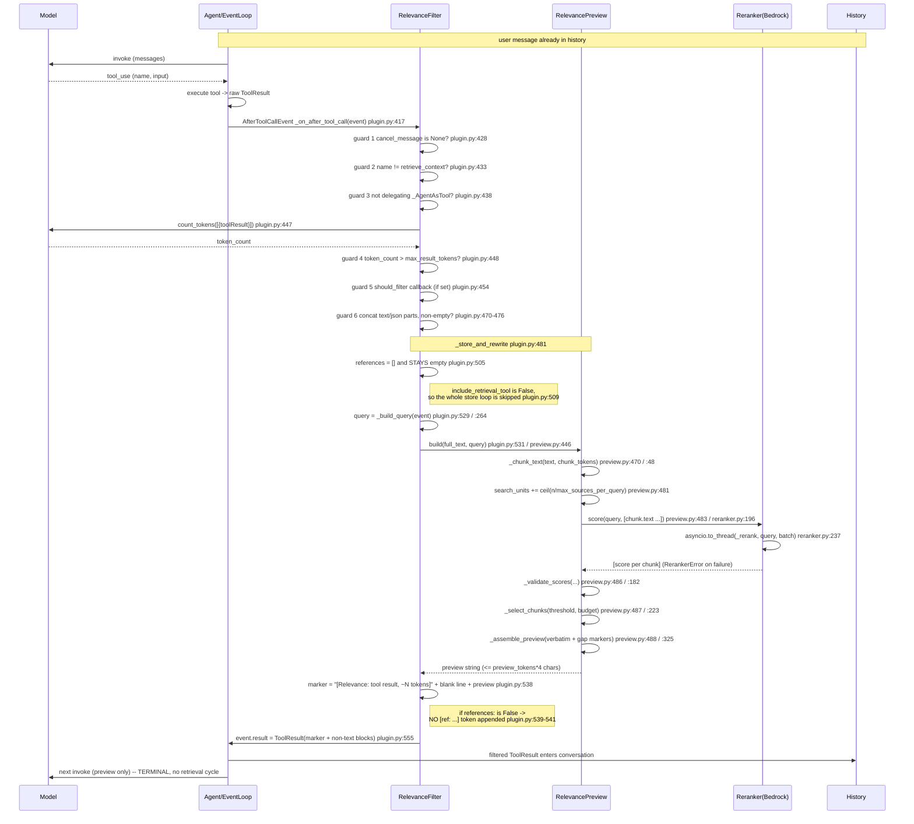
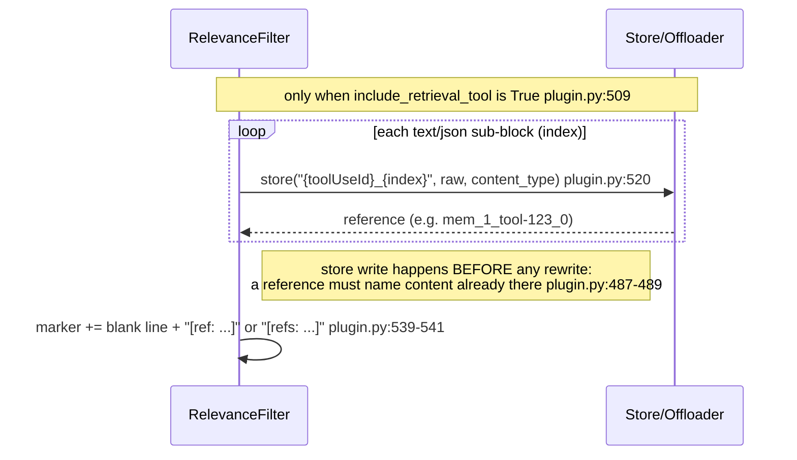
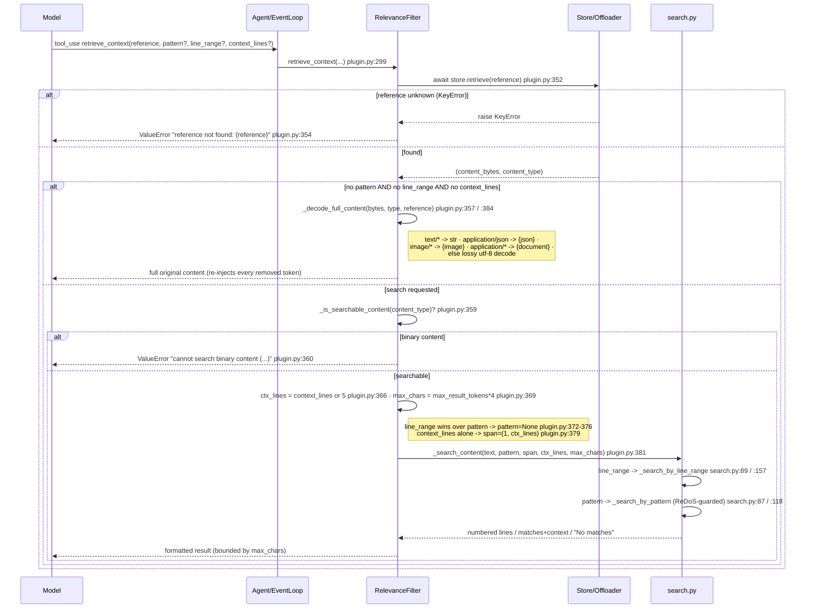

# Practice A — `strands-relevance-filter`: Sequence & Integration Design

All line references are into
`community-plugins/strands-relevance-filter/src/strands_relevance_filter/`
(`plugin.py`, `preview.py`, `reranker.py`, `store.py`, `search.py`), except §8, which is into
`validation/community-plugin-A-B-D/src/runner.py`.

> **Default mode.** `include_retrieval_tool` defaults to **`False`** (`plugin.py:187`).
> In the default configuration the plugin is **terminal**: `llm -> tool -> filtered result -> llm`.
> There is no retrieval tool, **no store write**, and **no `[ref: ...]` token** — nothing could
> resolve a reference, so none is promised. The retrieval path (§4) is an opt-in behind
> `include_retrieval_tool=True`.

---

## 1. What the plugin does, mechanically

The plugin registers exactly one SDK hook on `AfterToolCallEvent` (`plugin.py:416`) and, **only when
`include_retrieval_tool=True`**, one `@tool` (`retrieve_context`, `plugin.py:299`). After any tool
call completes, the hook wraps the result as a message and asks the agent's own model to count its
tokens (`plugin.py:447`); if the count exceeds `max_result_tokens` (default 8,000) and six guards
pass, it chunks the concatenated text, sends the chunks to a `Reranker` (default Amazon Bedrock
`rerank`) scored against a query built from the newest user question plus the tool-call arguments
(`plugin.py:529` via `_build_query` at `plugin.py:264`), selects the highest-scoring verbatim chunks
that fit a `preview_tokens` budget, and overwrites `event.result` in place (`plugin.py:555`) with a
`[Relevance: ...]` marker plus the verbatim preview. Selection is verbatim — no summarization — so
numbers/currency/tables stay exact.

**Default mode (terminal).** With the retrieval tool off, the store loop is skipped entirely
(`plugin.py:509`) and `references` stays empty (`plugin.py:505`), so the `if references:` branch that
appends the reference token never runs (`plugin.py:539`). The model receives the marker + preview and
nothing else; the omitted content is gone from the conversation for good. The rationale is cost: the
filter's contract ends at the tool result, and a retrieval cycle's own result becomes a conversation
message that is re-sent on **every** later model call, so a chunk read back is paid for repeatedly.
That is what made this arm cost **+21.6% more** than running no plugin at all on Haiku 4.5, while
still saving on Opus.

**Opt-in mode (`include_retrieval_tool=True`).** Each scorable (`text`/`json`) sub-block of the
result is written verbatim into the bound `store` before anything is rewritten (`plugin.py:520`), and the
marker gains a trailing `[ref: ...]`/`[refs: ...]` token (`plugin.py:540`) the model passes back to
`retrieve_context` to read the omitted content by span or pattern.

---

## 2. Integration table — every SDK attachment point

The plugin attaches to the Strands SDK **public extension surface only**. It subclasses
`strands.plugins.Plugin` — `class RelevanceFilter` (`plugin.py:140`). The base `Plugin.__init__`
scans the instance for `@hook`- and `@tool`-decorated methods, and that scan is invoked **last** in
the constructor (`plugin.py:217`) so it sees the fully built instance.

| # | Attachment | Registered at | Mechanism / order | Reads | Mutates |
|---|-----------|---------------|-------------------|-------|---------|
| 1 | `AfterToolCallEvent` handler — `_on_after_tool_call` | `plugin.py:417`, decorated at `plugin.py:416` | Subscribed via `@hook`; the event type is inferred from the handler's type hint resolved at decoration time (`plugin.py:17`). **No explicit `order` value is set** — a bare `@hook` with no arguments. | `cancel_message` (`plugin.py:428`); `tool_use` name (`plugin.py:433`), `toolUseId` (`plugin.py:442`), `input` (`plugin.py:288`); `selected_tool` + `.delegate` (`plugin.py:438`); `result` (`plugin.py:441`); `agent.messages` via `_latest_question` (`plugin.py:72`); `count_tokens` (`plugin.py:447`) | `event.result` — reassigned to a new `ToolResult` (`plugin.py:555`). The docstring states this is the only field ever written — `result` (`plugin.py:425`). |
| 2 | `retrieve_context` tool — **OPT-IN, not registered by default** | `plugin.py:299`, decorated `@tool(context=True)` at `plugin.py:298` | Auto-discovered into `self._tools` by the base `Plugin` scan, then **removed again** in `init_agent` unless `include_retrieval_tool=True` (`plugin.py:233`). `context=True` injects `tool_context: ToolContext`. | `reference`/`pattern`/`line_range`/`context_lines`; the bound `store` (`plugin.py:347`); `_max_result_tokens` (`plugin.py:369`). | Nothing in history/state. Returns content to the model; does **not** write `event.result` or the store. |

**Conditional de-registration is now the default path.** `init_agent` drops the auto-discovered tool
by matching `retrieval_tool_name` (`plugin.py:235`) and rebuilding `_tools` without it
(`plugin.py:236`). Because `include_retrieval_tool` defaults to `False` (`plugin.py:187`), attachment
#2 is absent unless the caller explicitly asks for it — so the default agent surface gains **zero**
tools from this plugin.

`init_agent` (`plugin.py:219`) is the SDK bind callback: it lazily creates the default
`InMemoryStore` (`plugin.py:230`) and, for an `InMemoryStore`, `_bind`s it to `id(agent)`
(`plugin.py:232`, store `_bind` at `store.py:171`). It does **not** register additional
hooks/events. Note the store is still *constructed* in default mode — it is simply never written to
(`plugin.py:509`).

In the default configuration there is exactly **one** callback registered (the hook); with the
retrieval tool on there are two. No `MessageAddedEvent`, no `BeforeInvokeModel`/`InvokeModelContext`,
no middleware stage, and no system-prompt writer is registered anywhere in the source.

---

## 3. Sequence diagram — one full turn, DEFAULT mode (`include_retrieval_tool=False`)

The flow is terminal: the filtered result goes back to the model and the cycle ends. There is no
store write, no reference token, and no retrieval branch.



Failure short-circuits that leave the raw result in history unchanged:
- `RerankerError` from `build` → logged, original kept, never re-scored (`plugin.py:532`).
- (Opt-in mode only) a store write raising → caught by `except Exception`, logged, original kept
  (`plugin.py:521`, `logger.warning` at `plugin.py:522`, `return` at `plugin.py:527`). In default
  mode this path is unreachable because nothing is stored.

---

## 4. OPTIONAL — the retrieval path (`include_retrieval_tool=True` only)

Everything in this section is off unless the caller passes `include_retrieval_tool=True`. In default
mode the store loop never runs (`plugin.py:509`), no reference token is emitted (`plugin.py:539`),
and `retrieve_context` is not even registered as a tool (`plugin.py:233`).

### 4a. What the opt-in adds to the turn in §3



### 4b. The retrieval round trip



Notes read from source:
- Retrieval responses are bounded by `max_result_tokens * 4` chars — `max_chars` (`plugin.py:369`),
  so reading back can never cost more context than the original result would have. This bounds a
  single read, **not** the cumulative cost: every read is a new conversation message that rides along
  on all later calls, which is the reason the tool is off by default.
- `line_range` precedence: a valid span drops the `pattern` (`plugin.py:376`); an `end` past the last
  line is **clamped** by `scope_end` (`search.py:81`), not rejected; a bad `start` (<1, >`end`, or
  >`total_lines`) raises `ValueError` (`search.py:75`, `search.py:77`, `search.py:79`).
- Pattern search caps pattern length at `_MAX_PATTERN_LENGTH` = 200 chars (`search.py:128`) and
  rejects a nested-quantifier heuristic, `_NESTED_QUANTIFIER` (`search.py:131`), falling back to an
  escaped literal on any `re.error` (`search.py:135`).

---

## 5. Expected model behaviour and where the assumption can fail

### 5a. Default mode — only two assumptions remain

1. **Reads the `[Relevance: ...]` marker as a signal that content was replaced.** The literal marker
   text (`plugin.py:538`) is the only cue. *Fails if:* the model ignores the bracketed marker and
   treats the preview as the complete tool output — it then answers from a partial view. In default
   mode there is **no recovery affordance**, so this failure is unrecoverable within the turn: that
   is the deliberate trade, paid for by never re-sending recovered chunks on later calls.
2. **Trusts the verbatim preview for the on-target passages.** Selection keeps the highest-scoring
   chunks — `_select_chunks` (`preview.py:487`). *Fails if:* the reranker mis-scored (wrong query,
   poor model), so the needed passage scored below `relevance_threshold` and was cut. There is an
   empty-selection guard that keeps the best chunk anyway when no `candidates` clear the threshold
   (`preview.py:271`), but "best" may still be wrong.

A model that has seen `[... N lines omitted ...]` gap markers (`_GAP_MARKER`, `preview.py:289`) may
still *try* to recover in default mode. It cannot: `retrieve_context` is not in its tool list
(`plugin.py:233`), and no reference was ever issued (`plugin.py:539`). The honest failure mode is
that the model states the content was truncated rather than silently inventing a reference.

### 5b. Opt-in mode — the three additional assumptions

3. **Notices the gap markers and the trailing `[ref: ...]`/`[refs: ...]` token.** These are the only
   affordances telling the model there is more and how to reach it (`_format_gap_marker`,
   `preview.py:293`; token built at `plugin.py:540`). *Fails if:* the model does not parse the
   reference token, or fabricates a reference that was never issued (→ `ValueError` "reference not
   found", `plugin.py:354`).
4. **Calls `retrieve_context` with that exact reference to fetch omissions.** *Fails if:* the model
   passes `pattern`/`line_range` on binary content (→ `ValueError` at `plugin.py:360`), or reads the
   whole thing back with no `pattern`/`line_range` (`plugin.py:357`), re-injecting every removed
   token — the docstring explicitly warns "use sparingly" (`plugin.py:316`).
5. **Turns a gap marker's omitted-line count into a follow-up `line_range`.** The docstring promises
   the marker's line numbers match retrieval's (`plugin.py:322`). *Fails / surprises if:* the
   trailing gap marker over-reports — a truncation inside the first line of the last chunk makes
   `first_unshown_line` that line itself (`preview.py:320`), so `_trailing_gap_marker` reports every
   source line as omitted (documented at `preview.py:304-310`); the count is a safe **lower bound**,
   not an exact tally, so a model computing an exact residual span may ask for too little.

### 5c. Structural assumptions (both modes)

The delegation guard depends on the private `_AgentAsTool` class existing; if the SDK renames or
moves it, the import degrades to `None` (`plugin.py:34`, fallback assignment at `plugin.py:38`) and
delegation results are no longer recognized — they fall through to the caller's `should_filter` or
get filtered. The size gate assumes `count_tokens` is available and meaningful (`plugin.py:447`).

---

## 6. Verbatim text the model sees (quoted exactly from source)

### 6a. The marker / placeholder text that replaces a filtered payload

Built at `plugin.py:538-541`, quoted exactly:

```python
marker = f"[Relevance: tool result, ~{token_count:,} tokens]\n\n{preview}"
if references:
    token = f"[ref: {references[0]}]" if len(references) == 1 else f"[refs: {', '.join(references)}]"
    marker = f"{marker}\n\n{token}"
```

**In default mode `references` is empty (`plugin.py:505`, loop skipped at `plugin.py:509`), so the
`if references:` branch never runs and the model sees literally only:**

```text
[Relevance: tool result, ~8,192 tokens]

<the verbatim preview, with [... N lines omitted ...] gap markers>
```

The count is comma-grouped (`{token_count:,}`) and the marker is followed by exactly one blank line
before the preview. With `include_retrieval_tool=True` a further blank line and one of these is
appended (`plugin.py:540`):

```text
[ref: mem_1_tool-123_0]
```
```text
[refs: mem_1_tool-123_0, mem_1_tool-123_1]
```

Reference shape `mem_{counter}_{key}` comes from `InMemoryStore.store` (`store.py:145`).

### 6b. The gap-marker string inside the preview

Template `_GAP_MARKER` (`preview.py:289`), quoted exactly:

```python
_GAP_MARKER = "\n[... {n} lines omitted ...]\n"
```

Rendered by `_format_gap_marker` (`preview.py:295`) as e.g. `\n[... 42 lines omitted ...]\n`. These
markers are emitted in **both** modes — in default mode they tell the model content is missing
without offering any way to fetch it.

### 6c. `retrieve_context` description / docstring — OPT-IN ONLY

The model sees none of the following unless `include_retrieval_tool=True` (`plugin.py:233`). The
`@tool` description is the method docstring (`plugin.py:307-345`), quoted exactly:

```text
Read back content that the relevance filter replaced with a preview.

When a tool result was too large to keep in context, its raw content was stored and the result
was rewritten into a preview plus a reference. Use this tool with that reference to reach the
parts the preview left out.

Returns:
  - With line_range: exactly that span of lines, with line numbers
  - With pattern: only the matching lines, with line numbers and surrounding context
  - Without pattern/line_range/context_lines: the full original content (use sparingly — this
    re-injects every token the filter removed)

Constraints:
  - pattern/line_range/context_lines only work on text content. For binary content, omit them.
  - Line numbers are 1-indexed and are the same ones the preview's gap markers report, so a
    "[... N lines omitted ...]" marker can be turned straight into a follow-up line_range.
  - A valid line_range wins over a pattern: the span is returned and the pattern is ignored.

Examples:
  {"reference": "mem_1_tool-123_0", "pattern": "error"} -> matches with 5 lines of context
  {"reference": "mem_1_tool-123_0", "pattern": "error|warning", "context_lines": 3} -> regex
  {"reference": "mem_1_tool-123_0", "line_range": {"start": 10, "end": 25}} -> lines 10-25
```

### 6d. Parameters / inputSchema (opt-in only)

There is **no hand-written `inputSchema` literal in source**; the schema is derived by the `@tool`
decorator (`plugin.py:298`) from the method signature and type hints. The signature — `def
retrieve_context` (`plugin.py:299`) — quoted exactly:

```python
@tool(context=True)
async def retrieve_context(
    self,
    reference: str,
    tool_context: ToolContext,
    pattern: str | None = None,
    line_range: LineRange | None = None,
    context_lines: int | None = None,
) -> dict | str:
```

`class LineRange` (`plugin.py:133`), quoted exactly:

```python
class LineRange(TypedDict):
    """A span of lines to retrieve (1-indexed, inclusive)."""

    start: int
    end: int
```

Per-argument descriptions the model receives (from the `Args:` block, `plugin.py:331-337`), quoted
exactly:

```text
reference: The reference string from the filtered block (e.g. "mem_1_tool-123_0").
tool_context: Injected by the framework. Not user-facing.
pattern: Regex or keyword to grep for. Returns only matching lines with context — never the
    full content.
line_range: Return only this span of lines; a dict with 1-indexed inclusive ``start`` and
    ``end`` keys. Takes precedence over ``pattern``.
context_lines: Lines before AND after each match, like ``grep -C``. Defaults to 5.
```

(`tool_context` is injected by the framework and is not part of the model-facing schema —
`context=True`, `plugin.py:298`.)

### 6e. Error strings the model can receive from the retrieval tool (opt-in only)

Quoted exactly:

```python
# plugin.py:349 and plugin.py:354
raise ValueError(f"reference not found: {reference}")
```
```python
# plugin.py:360-363
raise ValueError(
    f"cannot search binary content ({content_type}). "
    "Omit pattern/line_range/context_lines to retrieve the full content."
)
```

Search-path messages the model may see, from `search.py`, quoted exactly:

```python
return "Content is empty (0 lines)."                                              # search.py:67
return f"No matches found for pattern '{pattern}'{scope_label} (searched {scope_end - scope_start + 1} lines)."  # search.py:143
header = f"[{len(matched_set)} match{'es' if len(matched_set) > 1 else ''} for /{safe_pattern}/{scope_label}]"    # search.py:151
header = f"[Lines {start + 1}-{end + 1} of {total_lines}]"                        # search.py:160
```

Truncation suffixes are appended by `_truncate` (`search.py:92`) from the messages
`"output truncated, narrow your search"` (`search.py:153`) and
`"output truncated, narrow your range"` (`search.py:162`), rendered as `\n\n[{message}]`.

### 6f. System prompt

**The plugin does NOT write to the system prompt.** There is no system-prompt read or write anywhere
in the source — no `system_prompt` reference, no `MessageAddedEvent`/system-message injection. The
only text the plugin injects into the conversation is via `event.result` (§6a–6b) and, when the tool
is enabled, via `retrieve_context` return values (§6c–6e). In default mode §6a and §6b are the
**entire** model-facing surface of the plugin.

---

## 7. Configuration — constructors and defaults

### `RelevanceFilter.__init__` — keyword-only, `def __init__` (`plugin.py:181`)

| Parameter | Default | Source | Controls |
|-----------|---------|--------|----------|
| `store` | `None` → created during agent bind as an `InMemoryStore` | `plugin.py:230` | Backend for the raw sub-blocks. **Constructed even in default mode, but never written to** — see `include_retrieval_tool` (`plugin.py:509`). |
| `max_result_tokens` | `8_000` — `_DEFAULT_MAX_RESULT_TOKENS` | `plugin.py:49` | Token threshold above which a textual result is filtered; also caps retrieval response chars (`×4`). Must be `> 0` or `ValueError` (`plugin.py:207`). |
| `config` | `None` → `{}`, typed by `RelevanceConfig` | `plugin.py:93` | Preview-tuning dict (below); read key-by-key with `dict.get`. |
| `include_retrieval_tool` | **`False`** | `plugin.py:187` | Registers `retrieve_context`. `False` (default) drops the tool at bind time — `_include_retrieval_tool` (`plugin.py:233`) — skips the store write (`plugin.py:509`), and suppresses the reference token (`plugin.py:539`). |
| `should_filter` | `None` | `plugin.py:188` | Callback `(tool_name, token_count, **kwargs) -> bool`, sync or async; consulted only for over-threshold results (`plugin.py:454`); raising fails **open** (filters anyway). |

`name = "strands-community:relevance-filter"` (`plugin.py:177`) — the plugin name, overridable on a
subclass.

### `RelevanceConfig` keys (`plugin.py:93`), defaults applied in `_resolve_preview` (`plugin.py:238`)

| Key | Default | Source | Controls |
|-----|---------|--------|----------|
| `reranker` | lazily built `BedrockReranker` | `plugin.py:254` | Scorer ranking chunks vs. query. Supplying one avoids ever building an AWS client. |
| `relevance_threshold` | `0.5` — `_DEFAULT_RELEVANCE_THRESHOLD` | `plugin.py:52` | Minimum `[0,1]` score for a chunk to enter the preview. |
| `chunk_tokens` | `2_500` — `_DEFAULT_CHUNK_TOKENS` | `plugin.py:55` | Scoring granularity — approx token budget of one scored chunk. `<1` raises `ValueError` at chunk time. |
| `preview_tokens` | `1_000` — `_DEFAULT_PREVIEW_TOKENS` | `plugin.py:58` | Budget for what stays visible; preview ≤ `preview_tokens × 4` chars. |
| `summarize_overflow` | `False` | `plugin.py:260` | **Reserved** — accepted and stored but not acted upon; preview is always verbatim substrings + gap markers. |

### `BedrockReranker.__init__` — `def __init__` (`reranker.py:153`)

| Parameter | Default | Source | Controls |
|-----------|---------|--------|----------|
| `model_id` | `"amazon.rerank-v1:0"` — `_DEFAULT_MODEL_ID` | `reranker.py:45` | Rerank model id or full ARN; a bare id is resolved to a foundation-model ARN in the client region (`reranker.py:193`). |
| `boto_session` | `None` | `reranker.py:157` | Optional boto3 session; else one is created from `region_name`. |
| `boto_client_config` | `None` | `reranker.py:158` | Optional botocore config; caller values win, `user_agent_extra` is extended with `strands-agents` not replaced (`reranker.py:187`). |
| `region_name` | `None` | `reranker.py:159` | AWS region; used only when no `boto_session`. |
| `max_sources_per_query` (class attr) | `100` — `_MAX_SOURCES_PER_QUERY` | `reranker.py:47` | Max chunks per `rerank` call; larger lists are paginated in `score` (`reranker.py:232`). |
| connect/read timeout (fixed) | `10` s — `_DEFAULT_TIMEOUT_SECONDS` | `reranker.py:46` | Fail-fast so the agent loop is not stalled (applied at `reranker.py:177`); overridable via `boto_client_config`. |

### `InMemoryStore.__init__` — `def __init__` (`store.py:112`)

| Parameter | Default | Source | Controls |
|-----------|---------|--------|----------|
| `evict_after_turns` | `20` — `_DEFAULT_EVICT_AFTER_TURNS` | `store.py:110` | Cycles of inactivity before an entry is evicted; `None` disables eviction; `<1` raises `ValueError` (`store.py:123`). References have the form `mem_{counter}_{key}` (`store.py:145`). Bound to one agent via `_bind` (`store.py:171`). |

### `FileStore.__init__` — `def __init__` (`store.py:233`)

| Parameter | Default | Source | Controls |
|-----------|---------|--------|----------|
| `artifact_dir` | `"./artifacts"` | `store.py:233` | Directory for artifact files; reference is the file path; a `.metadata.json` sidecar records content types; refs outside the dir are rejected (`store.py:302`). **In default mode this directory stays empty** — nothing is ever stored. |

### `S3Store.__init__` — `def __init__` (`store.py:404`)

| Parameter | Default | Source | Controls |
|-----------|---------|--------|----------|
| `bucket` | *(required)* | `store.py:406` | S3 bucket for stored objects; reference is an `s3://` URI. |
| `prefix` | `""` | `store.py:407` | Key prefix; retrieval rejects refs outside bucket/prefix. |
| `boto_session` | `None` | `store.py:408` | Optional boto3 session; else created from `region_name`. |
| `boto_client_config` | `None` | `store.py:409` | Optional botocore config; `user_agent_extra` extended with `strands-agents` (`store.py:432`). |
| `region_name` | `None` | `store.py:410` | AWS region; used only when no `boto_session`. |

---

## 8. How the validation harness configures this arm

References in this section are into `validation/community-plugin-A-B-D/src/runner.py`.

| What | Value | Source |
|------|-------|--------|
| Retrieval-tool switch | `RELEVANCE_RETRIEVAL_TOOL` = `os.environ.get("VALIDATION_RELEVANCE_RETRIEVAL_TOOL") == "1"`, read once at import | `runner.py:198` |
| Passed to the plugin | `include_retrieval_tool=RELEVANCE_RETRIEVAL_TOOL` | `runner.py:368` |
| Plugin construction | `RelevanceFilter(...)` | `runner.py:359` |
| Store | `FileStore` under `artifacts/<run tag>/<config>`; stays empty while the tool is off | `runner.py:363` |
| Disclosure passthrough | `retrieve_context` is **no longer** in `always_available` — the list is now only the graph's retrieval tools plus the literal `list_accounts` | `runner.py:433` |

Two consequences for reading results:

1. **Every published figure for this arm was measured with the tool ON.** The default is now off, so
   a fresh run is not directly comparable to the published numbers. Set
   `VALIDATION_RELEVANCE_RETRIEVAL_TOOL=1` to reproduce them (`runner.py:198`).
2. With the tool off the arm measures **preview quality alone** — a single filtered result against
   the model's answer, with no recovery cycle to rescue a bad cut and no recovered chunk riding along
   on later calls.
