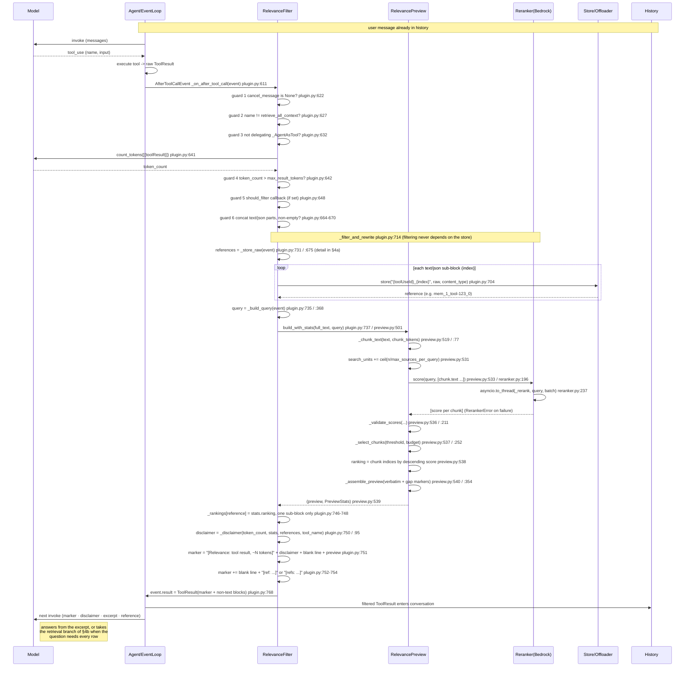
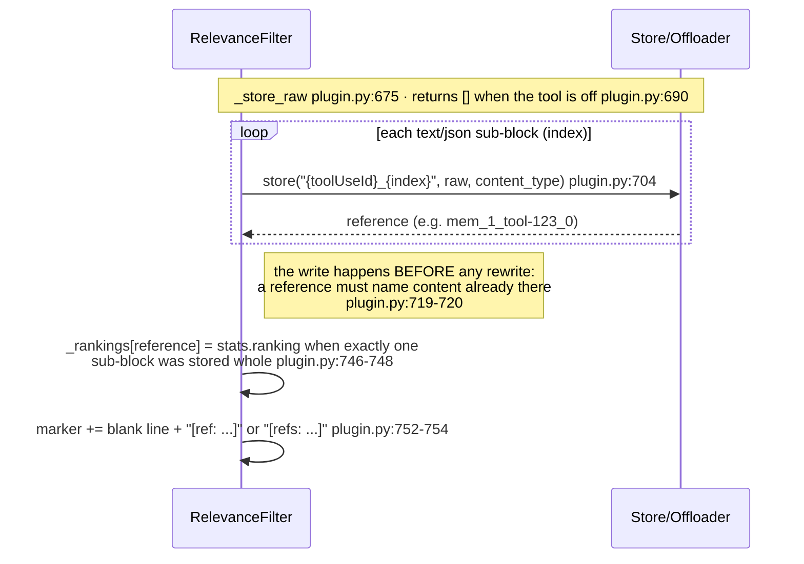
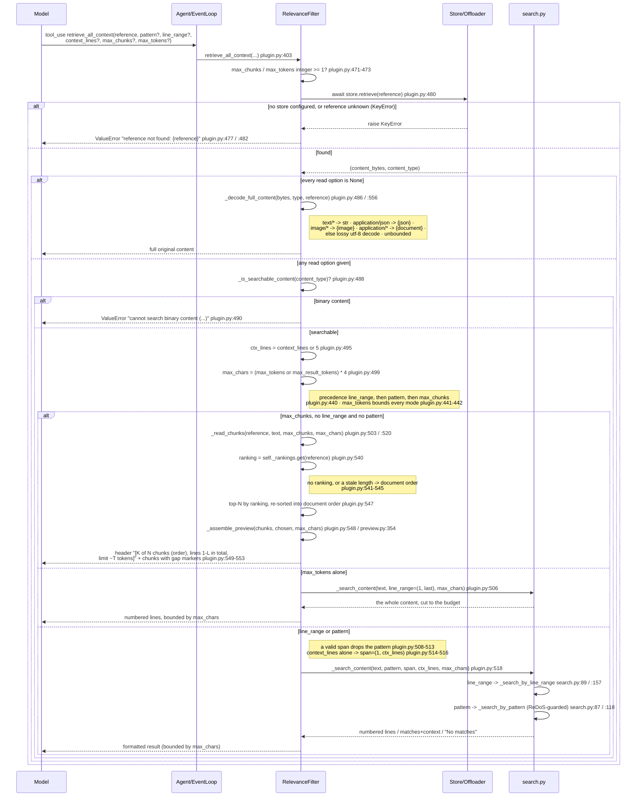
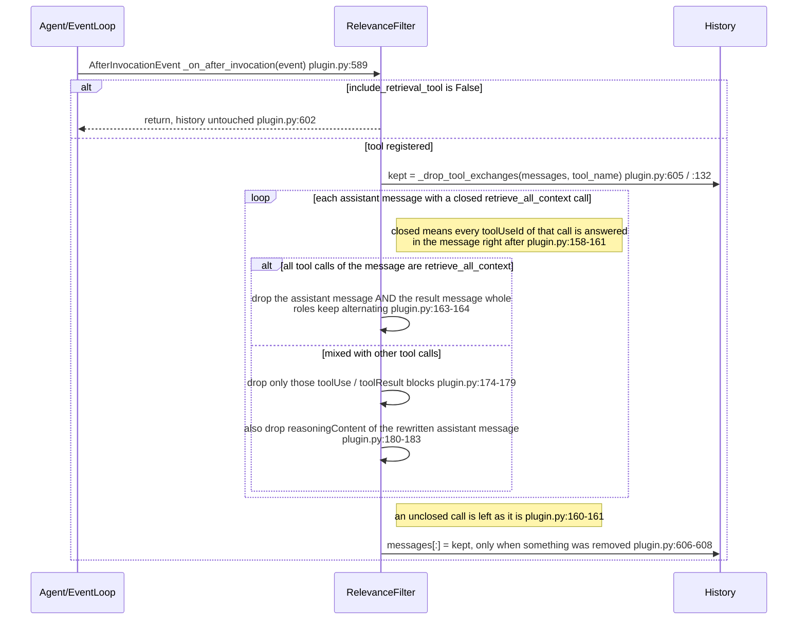

# Practice A — `strands-relevance-filter`: Sequence & Integration Design

All line references are into
`community-plugins/strands-relevance-filter/src/strands_relevance_filter/`
(`plugin.py`, `preview.py`, `reranker.py`, `store.py`, `search.py`), except §8, which is into
`validation/community-plugin-A-B-D/src/` (`runner.py`, `config.py`).

> **Default mode.** `include_retrieval_tool` defaults to **`True`** (`plugin.py:286`).
> In the default configuration the turn is `llm -> tool -> filtered result (+ disclaimer + reference)
> -> llm`, with a retrieval branch the model may take when the question needs the whole result. The
> store is written, a `[ref: ...]` token is emitted, and `retrieve_all_context` is registered
> (`plugin.py:403`). Passing `include_retrieval_tool=False` is the **opt-out**: no store, no reference
> token, no tool (`plugin.py:337-340`).
>
> **What a retrieval costs is bounded to one turn.** A closed `retrieve_all_context` exchange is
> removed from `agent.messages` when the invocation ends (`_on_after_invocation`, `plugin.py:589`), so
> a read back is paid for in the turn that asked for it and not re-sent on every later call.
>
> **Storage never gates filtering.** Chunking, reranking, selection and the rewrite of `event.result`
> run identically with or without a store (`_filter_and_rewrite`, `plugin.py:714`). The store is a
> step that runs first (`_store_raw`, `plugin.py:675`) and exists only to serve
> `retrieve_all_context`.

---

## 1. What the plugin does, mechanically

The plugin registers **two** SDK hooks — `AfterToolCallEvent` (`plugin.py:611`, decorated at
`plugin.py:610`) and `AfterInvocationEvent` (`plugin.py:589`, decorated at `plugin.py:588`) — and one
`@tool`, `retrieve_all_context` (`plugin.py:403`), which is registered unless the caller opts out.

After any tool call completes, the first hook wraps the result as a message and asks the agent's own
model to count its tokens (`plugin.py:641`); if the count exceeds `max_result_tokens` (default 8,000)
and six guards pass, it chunks the concatenated text, sends the chunks to a `Reranker` (default Amazon
Bedrock `rerank`) scored against a query built from the newest user question plus the tool-call
arguments (`plugin.py:735` via `_build_query` at `plugin.py:368`), selects the highest-scoring
verbatim chunks that fit a `preview_tokens` budget, and overwrites `event.result` in place
(`plugin.py:768`). Selection is verbatim — no summarization — so numbers/currency/tables stay exact.

**Three things travel with the excerpt.** The rewritten text is a marker, a **disclaimer**, the
verbatim preview, and a reference token (`plugin.py:751-754`). The disclaimer is built from the
`PreviewStats` the selection returned (`build_with_stats`, `preview.py:501`) and states how much of
the result is on screen, that an answer needing every row cannot be computed from it, and — with the
tool registered — the call and the budgets that reach the rest (`_disclaimer`, `plugin.py:95`; called
at `plugin.py:750`).

**Default mode (tool on).** `_store_raw` writes each scorable (`text`/`json`) sub-block of the result
verbatim into the bound `store` (`plugin.py:704`) before anything is rewritten, so a reference always
names content that is already there. When exactly one scorable sub-block was stored whole, the chunk
ranking is memoized against its reference (`self._rankings`, `plugin.py:748`) so a later `max_chunks`
read needs no second scoring call. The marker then gains a trailing `[ref: ...]`/`[refs: ...]` token
(`plugin.py:752-754`) the model passes back to `retrieve_all_context` to load the whole result by
span, pattern, chunk count or token budget.

**Opt-out mode (`include_retrieval_tool=False`).** `_store_raw` returns an empty list at once
(`plugin.py:690`) — no store is even built (`plugin.py:333`) — so `references` is empty
(`plugin.py:731`), the `if references:` branch that appends the reference token never runs
(`plugin.py:752`), the tool is dropped from `_tools` at bind time (`plugin.py:337-340`), and
`_on_after_invocation` (`plugin.py:589`) returns before touching the history (`plugin.py:602`). The
disclaimer takes its
other branch and tells the model to say the result was filtered rather than aggregate the excerpt
(`plugin.py:121-122`). Filtering itself is unaffected. This mode measures **preview quality alone**:
one filtered result against the model's answer, with no recovery cycle to rescue a bad cut.

---

## 2. Integration table — every SDK attachment point

The plugin attaches to the Strands SDK **public extension surface only**. It subclasses
`strands.plugins.Plugin` — `class RelevanceFilter` (`plugin.py:235`). The base `Plugin.__init__`
scans the instance for `@hook`- and `@tool`-decorated methods, and that scan is invoked **last** in
the constructor (`plugin.py:319`) so it sees the fully built instance.

| # | Attachment | Registered at | Mechanism / order | Reads | Mutates |
|---|-----------|---------------|-------------------|-------|---------|
| 1 | `AfterToolCallEvent` handler — `_on_after_tool_call` | `plugin.py:611`, decorated at `plugin.py:610` | Subscribed via `@hook`; the event type is inferred from the handler's type hint resolved at decoration time (`plugin.py:19`). **No explicit `order` value is set** — a bare `@hook` with no arguments. | `cancel_message` (`plugin.py:622`); `tool_use` name (`plugin.py:627`), `toolUseId` (`plugin.py:636`), `input` (`plugin.py:392`); `selected_tool` + `.delegate` (`plugin.py:632`); `result` (`plugin.py:635`); `agent.messages` via `_latest_question` (`plugin.py:74`); `count_tokens` (`plugin.py:641`) | `event.result` — reassigned to a new `ToolResult` (`plugin.py:768`). The docstring states this is the only field ever written — `result` (`plugin.py:619`). |
| 2 | `AfterInvocationEvent` handler — `_on_after_invocation` | `plugin.py:589`, decorated at `plugin.py:588` | Subscribed via the same bare `@hook`; `AfterInvocationEvent` is imported at runtime for that inference (`plugin.py:22`). Fires when the invocation ends, which is **before** the next user message closes the turn. | `self._include_retrieval_tool` (`plugin.py:602`); `event.agent.messages` (`plugin.py:604`); `retrieve_all_context.tool_name` (`plugin.py:605`) | `agent.messages` **in place** — `messages[:] = kept` (`plugin.py:608`), the new list built by `_drop_tool_exchanges` (`plugin.py:132`). Nothing else. |
| 3 | `retrieve_all_context` tool — registered by default | `plugin.py:403`, decorated `@tool(context=True)` at `plugin.py:402` | Auto-discovered into `self._tools` by the base `Plugin` scan, and **removed again** in `init_agent` only when `include_retrieval_tool=False` (`plugin.py:337-340`). `context=True` injects `tool_context: ToolContext`. | `reference`/`pattern`/`line_range`/`context_lines`/`max_chunks`/`max_tokens`; the bound `store` (`plugin.py:475`); `_max_result_tokens` (`plugin.py:499`); `self._rankings` (`plugin.py:540`). | Nothing in history/state. Returns content to the model; does **not** write `event.result` or the store. |

**Conditional de-registration is the opt-out path.** `init_agent` drops the auto-discovered tool by
matching `retrieval_tool_name` (`plugin.py:339`) and rebuilding `_tools` without it (`plugin.py:340`).
Because `include_retrieval_tool` defaults to `True` (`plugin.py:286`), attachment #3 is present unless
the caller explicitly asks for it to go.

`init_agent` (`plugin.py:321`) is the SDK bind callback: it lazily creates the default `InMemoryStore`
(`plugin.py:333-334`) when the retrieval tool is on and no store was supplied, and for an
`InMemoryStore` it `_bind`s it to `id(agent)` (`plugin.py:336`, store `_bind` at `store.py:171`). It
does **not** register additional hooks/events. In the opt-out no store is constructed at all — the
filter does not need one (`plugin.py:690`).

In the default configuration there are exactly **two** callbacks registered (both hooks) plus one
tool. No `MessageAddedEvent`, no `BeforeInvokeModel`/`InvokeModelContext`, no middleware stage, and no
system-prompt writer is registered anywhere in the source.

---

## 3. Sequence diagram — one full turn, DEFAULT mode (`include_retrieval_tool=True`)

The store write runs before the rewrite, the disclaimer is composed from what the selection did, and
the reference token closes the marker. The retrieval branch the model may take from here is §4b, and
its removal from the history is §4c.



Failure short-circuits that leave the raw result in history unchanged:
- `RerankerError` from `build_with_stats` → logged, original kept, never re-scored (`plugin.py:738`).
- A store write raising → caught by `except Exception`, logged, original kept (`plugin.py:705`,
  `logger.warning` at `plugin.py:706`, `return None` at `plugin.py:711`, which `_filter_and_rewrite`
  turns into an early exit at `plugin.py:732`). In the opt-out this path is unreachable because
  nothing is stored.

**Opt-out mode** removes three steps from the diagram and changes one: the `_store_raw` loop does not
run (`plugin.py:690`), the `[ref: ...]` line is skipped (`plugin.py:752`), no ranking is memoized, and
the disclaimer takes its no-reference branch (`plugin.py:121-122`). Everything between
`_filter_and_rewrite` and `event.result` is identical.

---

## 4. The retrieval path — `retrieve_all_context`

The tool loads the **whole** of a result the filter cut to an excerpt, for the one question an excerpt
cannot answer: a maximum, minimum, total, count, average, ranking or any comparison across all of it
(docstring `plugin.py:413-417`). Reading a passage the excerpt already shows is explicitly not its
job.

### 4a. The store write inside the turn of §3



### 4b. The retrieval round trip, and the budgets on it



Notes read from source:
- **Default budget.** With no `max_tokens`, a read is bounded by `max_result_tokens * 4` chars —
  `max_chars` (`plugin.py:499`) — the same threshold that made the result oversized, so reading back
  never costs more context than the original would have. `max_tokens` is the model's explicit choice
  to pay for more, and it bounds **every** mode (`plugin.py:441-442`). A full read with no options at
  all is the one unbounded path (`plugin.py:486`).
- **`max_chunks` reuses the filter's own ranking.** `_read_chunks` (`plugin.py:520`) re-chunks the
  stored text with the same `chunk_tokens` (`plugin.py:536`) and reads the ranking memoized at filter
  time (`plugin.py:540`); a missing ranking, or one whose length no longer matches, degrades to
  document order and the header says so (`plugin.py:541-545`). The chosen chunks are rendered in
  **document order** with a gap marker for every omitted span (`plugin.py:547-548`), so a
  `max_chunks` at least the chunk count returns the whole result.
- **Argument validation runs before the store is touched.** A `max_chunks`/`max_tokens` that is not an
  integer ≥ 1 — `bool` included — raises `ValueError` (`plugin.py:471-473`).
- `line_range` precedence: a valid span drops the `pattern` (`plugin.py:512`); an `end` past the last
  line is **clamped** by `scope_end` (`search.py:81`), not rejected; a bad `start` (<1, >`end`, or
  >`total_lines`) raises `ValueError` (`search.py:75`, `search.py:77`, `search.py:79`).
- Pattern search caps pattern length at `_MAX_PATTERN_LENGTH` = 200 chars (`search.py:128`) and
  rejects a nested-quantifier heuristic, `_NESTED_QUANTIFIER` (`search.py:131`), falling back to an
  escaped literal on any `re.error` (`search.py:134`).

### 4c. End of the invocation — the retrieval exchange leaves the history

A retrieval is for the answer in flight. Kept, its result — possibly the whole of a large tool result
— would ride along on every later model call and be read by a context graph as evidence of the turn.
The second hook removes it at the end of the invocation, which is **before** the next user message
closes the turn, so a graph deriving that turn's Card never sees it (`plugin.py:590-597`). What stays
is the excerpt with its reference, so the content is still retrievable later, and the answer, which
carries the figures the retrieval served — which is why the tool description tells the model to state
them (`plugin.py:432-433`).



`_drop_tool_exchanges` returns `messages` itself when nothing matched (`plugin.py:166-167`), and the
hook compares by identity before writing (`plugin.py:606`), so a turn with no retrieval leaves the
list object untouched.

---

## 5. Expected model behaviour and where the assumption can fail

### 5a. Default mode — five assumptions

1. **Reads the `[Relevance: ...]` marker and the disclaimer as a signal that content was replaced.**
   The marker text (`plugin.py:751`) is the cue and the disclaimer is the instruction
   (`plugin.py:114-130`). *Fails if:* the model ignores both and treats the excerpt as the complete
   tool output — it then answers from a partial view.
2. **Does not aggregate over the excerpt.** The disclaimer names the categories that cannot be
   computed from it — maximum, minimum, total, count, average, ranking, any comparison across the
   whole result (`plugin.py:118-119`). *Fails if:* the model computes the aggregate anyway and is
   confidently wrong, which is the failure the disclaimer exists to prevent (`plugin.py:98-100`).
3. **Trusts the verbatim excerpt for the on-target passages.** Selection keeps the highest-scoring
   chunks — `_select_chunks` (`preview.py:252`). *Fails if:* the reranker mis-scored (wrong query,
   poor model), so the needed passage scored below `relevance_threshold` and was cut. There is an
   empty-selection guard that keeps the best chunk anyway when no `candidates` clear the threshold
   (`preview.py:299`), but "best" may still be wrong.
4. **Notices the gap markers and the trailing `[ref: ...]`/`[refs: ...]` token, and calls
   `retrieve_all_context` with that exact reference.** These are the affordances telling the model
   there is more and how to reach it (`_format_gap_marker`, `preview.py:322`; token built at
   `plugin.py:753`; the disclaimer names the call and the reference at `plugin.py:126`). *Fails if:*
   the model does not parse the reference token, or fabricates one that was never issued (→
   `ValueError` "reference not found", `plugin.py:482`); or it reaches for the tool to re-read a
   passage the excerpt already shows, which the description tells it not to do (`plugin.py:417`).
5. **States the figures it relied on in the answer.** The retrieved exchange is removed when the
   invocation ends (`plugin.py:589`), so a figure that lives only in the tool result is gone from the
   next turn. Both the disclaimer (`plugin.py:128-129`) and the tool description
   (`plugin.py:432-433`) say so. *Fails if:* the model answers by pointing at the retrieved block
   instead of restating the number, and a later turn asks a follow-up about it.

A model that turns a gap marker's omitted-line count into a follow-up `line_range` is on supported
ground — the description promises the marker's line numbers match retrieval's (`plugin.py:438-439`).
*It surprises if:* the trailing gap marker over-reports — a truncation inside the first line of the
last chunk makes `first_unshown_line` that line itself (`preview.py:349`), so `_trailing_gap_marker`
reports every source line as omitted (documented at `preview.py:333-339`); the count is a safe **lower
bound**, not an exact tally.

### 5b. Opt-out mode — one assumption replaces four

With `include_retrieval_tool=False` assumptions 4 and 5 are moot and 1–3 stand unchanged, and the
disclaimer's other branch asks for one thing: **say that the result was filtered instead of computing
the aggregate from the excerpt** (`plugin.py:122`). *Fails if:* the model aggregates anyway. There is
no recovery affordance — `retrieve_all_context` is not in its tool list (`plugin.py:340`) and no
reference was ever issued (`plugin.py:752`) — so the failure is unrecoverable within the turn. Gap
markers (`_GAP_MARKER`, `preview.py:318`) are still emitted, so the model can see content is missing;
the honest outcome is that it states the result was truncated rather than inventing a reference.

### 5c. Structural assumptions (both modes)

The delegation guard depends on the private `_AgentAsTool` class existing; if the SDK renames or
moves it, the import degrades to `None` (`plugin.py:36`, fallback assignment at `plugin.py:40`) and
delegation results are no longer recognized — they fall through to the caller's `should_filter` or
get filtered. The size gate assumes `count_tokens` is available and meaningful (`plugin.py:641`). The
end-of-turn removal assumes `AfterInvocationEvent` fires before the next user message is appended,
which is what keeps a context graph from carding the retrieval (`plugin.py:594-596`).

---

## 6. Verbatim text the model sees (quoted exactly from source)

### 6a. The marker, the disclaimer and the reference token

Built at `plugin.py:750-754`, quoted exactly:

```python
disclaimer = _disclaimer(token_count, stats, references, self.retrieve_all_context.tool_name)
marker = f"[Relevance: tool result, ~{token_count:,} tokens]\n{disclaimer}\n\n{preview}"
if references:
    token = f"[ref: {references[0]}]" if len(references) == 1 else f"[refs: {', '.join(references)}]"
    marker = f"{marker}\n\n{token}"
```

The disclaimer itself, `_disclaimer` (`plugin.py:95`), quoted exactly from `plugin.py:114-130`:

```python
spans = ", ".join(f"{start}-{end}" if start != end else f"{start}" for start, end in stats.shown_spans)
head = (
    f"[Filtered: this is an EXCERPT, not the whole result | original: {stats.total_lines:,} lines, "
    f"{stats.total_chunks} chunks | shown: {len(stats.shown)} chunk(s), lines {spans or 'none'}]\n"
    "An answer that needs every row -- a maximum, minimum, total, count, average, ranking or any "
    "comparison across the whole result -- cannot be computed from this excerpt."
)
if not references:
    return f"{head} Say that the result was filtered instead of computing it from the excerpt."

named = f'reference "{references[0]}"' if len(references) == 1 else f"references {', '.join(references)}"
return (
    f"{head} For such an answer, call `{retrieval_tool}` with {named} and either a `pattern` (regex) "
    f"that matches only the rows you need, or `max_chunks`/`max_tokens` large enough for the whole "
    f"result ({stats.total_chunks} chunks, ~{token_count:,} tokens). What you retrieve is removed from "
    "the conversation once you have answered, so state the figures you relied on in the answer."
)
```

`stats.shown_spans` merges adjacent chunks into 1-indexed inclusive line spans (`preview.py:60`), and
the numbers come from the `PreviewStats` the selection returned (`preview.py:43`, built at
`preview.py:539`). So the default-mode block reaching the model has the shape:

```text
[Relevance: tool result, ~8,192 tokens]
[Filtered: this is an EXCERPT, not the whole result | original: 1,204 lines, 5 chunks | shown: 2 chunk(s), lines 1-240, 601-840]
An answer that needs every row -- a maximum, minimum, total, count, average, ranking or any comparison across the whole result -- cannot be computed from this excerpt. For such an answer, call `retrieve_all_context` with reference "mem_1_tool-123_0" and either a `pattern` (regex) that matches only the rows you need, or `max_chunks`/`max_tokens` large enough for the whole result (5 chunks, ~8,192 tokens). What you retrieve is removed from the conversation once you have answered, so state the figures you relied on in the answer.

<the verbatim excerpt, with [... N lines omitted ...] gap markers>

[ref: mem_1_tool-123_0]
```

The token count is comma-grouped (`{token_count:,}`), the marker line and the disclaimer are separated
by a single newline, and exactly one blank line falls between the disclaimer and the excerpt
(`plugin.py:751`). With more than one stored sub-block the last line is instead:

```text
[refs: mem_1_tool-123_0, mem_1_tool-123_1]
```

In the opt-out the `if references:` branch never runs (`plugin.py:752`, loop skipped at
`plugin.py:690`), so there is no trailing token and the disclaimer ends at its no-reference sentence
(`plugin.py:122`):

```text
... cannot be computed from this excerpt. Say that the result was filtered instead of computing it from the excerpt.
```

Reference shape `mem_{counter}_{key}` comes from `InMemoryStore.store` (`store.py:145`).

### 6b. The gap-marker string inside the excerpt

Template `_GAP_MARKER` (`preview.py:318`), quoted exactly:

```python
_GAP_MARKER = "\n[... {n} lines omitted ...]\n"
```

Rendered by `_format_gap_marker` (`preview.py:322`) as e.g. `\n[... 42 lines omitted ...]\n`. These
markers are emitted in **both** modes, and also inside a `max_chunks` retrieval, where
`_assemble_preview` renders the chosen chunks with a marker for every span left out
(`plugin.py:548`).

### 6c. `retrieve_all_context` description / docstring

The `@tool` description is the method docstring (`plugin.py:413-469`). The model-facing body, quoted
exactly:

```text
Load the WHOLE of a tool result that the relevance filter cut down to an excerpt.

Use it ONLY when the answer needs every row of that result -- a maximum, minimum, total, count,
average, ranking or a comparison across all of it -- which the excerpt cannot answer. Do NOT use
it to read a passage the excerpt already shows, or when the excerpt answers the question.

When a tool result was too large to keep in context, its raw content was stored and the result
was rewritten into an excerpt, a disclaimer with its size, and a reference. Pass that reference
here, with a ``pattern`` that matches only the rows you need to aggregate (the cheapest way),
or ``max_chunks``/``max_tokens`` large enough for all of it.

Returns:
  - With line_range: exactly that span of lines, with line numbers
  - With pattern: only the matching lines, with line numbers and surrounding context. Best for
    aggregates: a pattern matching the rows to aggregate returns just those rows
  - With max_chunks: the max_chunks most relevant chunks, in document order, with markers for
    the lines left out. A max_chunks at least the result's chunk count returns all of it
  - Without any of these: the full original content, cut at max_tokens when given

What this tool returns is removed from the conversation once the answer is given, so state the
figures you relied on in the answer itself.

Constraints:
  - pattern/line_range/context_lines/max_chunks/max_tokens only work on text content. For
    binary content, omit them.
  - Line numbers are 1-indexed and are the same ones the excerpt's gap markers report, so a
    "[... N lines omitted ...]" marker can be turned straight into a follow-up line_range.
  - Precedence: line_range, then pattern, then max_chunks.
  - max_tokens bounds the response in every mode. Without it, line_range, pattern and
    max_chunks answer within the filter's own size threshold, and a full read is unbounded.

Examples:
  {"reference": "mem_1_tool-123_0", "pattern": "error"} -> matches with 5 lines of context
  {"reference": "mem_1_tool-123_0", "pattern": "REFUND", "context_lines": 0, "max_tokens": 20000}
    -> every matching row, no context, up to ~20k tokens
  {"reference": "mem_1_tool-123_0", "max_chunks": 3} -> the 3 most relevant chunks
  {"reference": "mem_1_tool-123_0", "max_chunks": 1000, "max_tokens": 50000} -> everything
  {"reference": "mem_1_tool-123_0", "line_range": {"start": 10, "end": 25}} -> lines 10-25
```

In the opt-out the model sees none of it: the tool is dropped at bind time (`plugin.py:340`).

### 6d. Parameters / inputSchema

There is **no hand-written `inputSchema` literal in source**; the schema is derived by the `@tool`
decorator (`plugin.py:402`) from the method signature and type hints. The signature — `def
retrieve_all_context` (`plugin.py:403`) — quoted exactly:

```python
@tool(context=True)
async def retrieve_all_context(
    self,
    reference: str,
    tool_context: ToolContext,
    pattern: str | None = None,
    line_range: LineRange | None = None,
    context_lines: int | None = None,
    max_chunks: int | None = None,
    max_tokens: int | None = None,
) -> dict | str:
```

`class LineRange` (`plugin.py:228`), quoted exactly:

```python
class LineRange(TypedDict):
    """A span of lines to retrieve (1-indexed, inclusive)."""

    start: int
    end: int
```

Per-argument descriptions the model receives (from the `Args:` block, `plugin.py:453-461`), quoted
exactly:

```text
reference: The reference string from the filtered block (e.g. "mem_1_tool-123_0").
tool_context: Injected by the framework. Not user-facing.
pattern: Regex or keyword to grep for. Returns only matching lines with context.
line_range: Return only this span of lines; a dict with 1-indexed inclusive ``start`` and
    ``end`` keys. Takes precedence over ``pattern``.
context_lines: Lines before AND after each match, like ``grep -C``. Defaults to 5.
max_chunks: Number of chunks to return, most relevant first, rendered in document order.
    At least 1.
max_tokens: Approximate size limit of the response, in tokens. At least 1.
```

(`tool_context` is injected by the framework and is not part of the model-facing schema —
`context=True`, `plugin.py:402`.)

### 6e. Error strings the model can receive from the retrieval tool

Quoted exactly:

```python
# plugin.py:473
raise ValueError(f"{name} must be an integer >= 1, got {value!r}")
```
```python
# plugin.py:477 and plugin.py:482
raise ValueError(f"reference not found: {reference}")
```
```python
# plugin.py:489-492
raise ValueError(
    f"cannot search binary content ({content_type}). "
    "Omit pattern/line_range/context_lines/max_chunks/max_tokens to retrieve the full content."
)
```

The `max_chunks` header, from `_read_chunks` (`plugin.py:549-552`), quoted exactly:

```python
header = (
    f"[{len(chosen)} of {len(chunks)} chunks ({order}), lines 1-{chunks[-1].end_line} in total, "
    f"limit ~{max_chars // _CHARS_PER_TOKEN:,} tokens]"
)
```

`order` is the literal `"most relevant first"` when the filter's ranking was reused, and
`"document order"` when it was not (`plugin.py:543`, `plugin.py:545`). An empty stored text answers
`"Content is empty (0 lines)."` (`plugin.py:538`).

Search-path messages the model may see, from `search.py`, quoted exactly:

```python
return "Content is empty (0 lines)."                                              # search.py:67
return f"No matches found for pattern '{pattern}'{scope_label} (searched {scope_end - scope_start + 1} lines)."  # search.py:143
header = f"[{len(matched_set)} match{'es' if len(matched_set) > 1 else ''} for /{safe_pattern}/{scope_label}]"    # search.py:151
header = f"[Lines {start + 1}-{end + 1} of {total_lines}]"                        # search.py:160
```

Truncation suffixes are appended by `_truncate` (`search.py:92`) from the messages
`"output truncated, narrow your search"` (`search.py:153`) and
`"output truncated, narrow your range"` (`search.py:162`), rendered as `\n\n[{message}]`.

### 6f. System prompt

**The plugin does NOT write to the system prompt.** There is no system-prompt read or write anywhere
in the source — no `system_prompt` reference, no `MessageAddedEvent`/system-message injection. The
only text the plugin injects into the conversation is via `event.result` (§6a–6b) and via
`retrieve_all_context` return values (§6c–6e) — and the latter is removed again when the invocation
ends (`plugin.py:605`).

---

## 7. Configuration — constructors and defaults

### `RelevanceFilter.__init__` — keyword-only, `def __init__` (`plugin.py:280`)

| Parameter | Default | Source | Controls |
|-----------|---------|--------|----------|
| `store` | `None` → an `InMemoryStore` is created at agent bind, since the retrieval tool is on by default | `plugin.py:333-334` | Backend for the raw sub-blocks, used only by `retrieve_all_context`. Filtering never depends on it; with the tool off no store exists (`plugin.py:690`). |
| `max_result_tokens` | `8_000` — `_DEFAULT_MAX_RESULT_TOKENS` | `plugin.py:51` | Token threshold above which a textual result is filtered; also the default bound on a retrieval response (`×4` chars, `plugin.py:499`). Must be `> 0` or `ValueError` (`plugin.py:305`). |
| `config` | `None` → `{}`, typed by `RelevanceConfig` | `plugin.py:188` | Preview-tuning dict (below); read key-by-key with `dict.get`. |
| `include_retrieval_tool` | **`True`** | `plugin.py:286` | Stores the raw content and registers `retrieve_all_context`. `False` drops the tool at bind time — `retrieval_tool_name` (`plugin.py:339`) — skips the store (`plugin.py:690`), suppresses the reference token (`plugin.py:752`), and short-circuits the end-of-turn removal (`plugin.py:602`). Filtering runs the same either way. |
| `should_filter` | `None` | `plugin.py:287` | Callback `(tool_name, token_count, **kwargs) -> bool`, sync or async; consulted only for over-threshold results (`plugin.py:648`); raising fails **open** (filters anyway). |

`name = "strands-community:relevance-filter"` (`plugin.py:276`) — the plugin name, overridable on a
subclass.

### `RelevanceConfig` keys (`plugin.py:188`), defaults applied in `_resolve_preview` (`plugin.py:342`)

| Key | Default | Source | Controls |
|-----|---------|--------|----------|
| `reranker` | lazily built `BedrockReranker` | `plugin.py:358` | Scorer ranking chunks vs. query. Supplying one avoids ever building an AWS client. |
| `relevance_threshold` | `0.5` — `_DEFAULT_RELEVANCE_THRESHOLD` | `plugin.py:54` | Minimum `[0,1]` score for a chunk to enter the excerpt. |
| `chunk_tokens` | `2_500` — `_DEFAULT_CHUNK_TOKENS` | `plugin.py:57` | Scoring granularity — approx token budget of one scored chunk. Also the granularity a `max_chunks` read re-chunks with — `_chunk_text` (`plugin.py:536`). `<1` raises `ValueError` at chunk time. |
| `preview_tokens` | `1_000` — `_DEFAULT_PREVIEW_TOKENS` | `plugin.py:60` | Budget for what stays visible; excerpt ≤ `preview_tokens × 4` chars (`preview.py:518`). |
| `summarize_overflow` | `False` | `plugin.py:364` | **Reserved** — accepted and stored but not acted upon; the excerpt is always verbatim substrings + gap markers. |

Two further constants shape the surface without being configurable: `_DEFAULT_CONTEXT_LINES` = `5`,
the `grep -C` width when the model names none (`plugin.py:63`), and `_MAX_QUERY_CHARS` = `2_000`, the
cap on the scoring query (`plugin.py:69`). `_CHARS_PER_TOKEN` = `4` is the token→char conversion used
for every budget (`plugin.py:66`).

### `BedrockReranker.__init__` — `def __init__` (`reranker.py:153`)

| Parameter | Default | Source | Controls |
|-----------|---------|--------|----------|
| `model_id` | `"amazon.rerank-v1:0"` — `_DEFAULT_MODEL_ID` | `reranker.py:45` | Rerank model id or full ARN; a bare id is resolved to a foundation-model ARN in the client region (`reranker.py:193`). |
| `boto_session` | `None` | `reranker.py:157` | Optional boto3 session; else one is created from `region_name`. |
| `boto_client_config` | `None` | `reranker.py:158` | Optional botocore config; caller values win, `user_agent_extra` is extended with `strands-agents` not replaced (`reranker.py:187`). |
| `region_name` | `None` | `reranker.py:159` | AWS region; used only when no `boto_session`. |
| `max_sources_per_query` (class attr) | `100` — `_MAX_SOURCES_PER_QUERY` | `reranker.py:47` | Max chunks per `rerank` call; larger lists are paginated in `score` (`reranker.py:232`). |
| connect/read timeout (fixed) | `10` s — `_DEFAULT_TIMEOUT_SECONDS` | `reranker.py:46` | Fail-fast so the agent loop is not stalled (applied at `reranker.py:177`); overridable via `boto_client_config`. |

### `InMemoryStore.__init__` — `def __init__` (`store.py:112`)

| Parameter | Default | Source | Controls |
|-----------|---------|--------|----------|
| `evict_after_turns` | `20` — `_DEFAULT_EVICT_AFTER_TURNS` | `store.py:110` | Cycles of inactivity before an entry is evicted; `None` disables eviction; `<1` raises `ValueError` (`store.py:123`). References have the form `mem_{counter}_{key}` (`store.py:145`). Bound to one agent via `_bind` (`store.py:171`). |

### `FileStore.__init__` — `def __init__` (`store.py:233`)

| Parameter | Default | Source | Controls |
|-----------|---------|--------|----------|
| `artifact_dir` | `"./artifacts"` | `store.py:233` | Directory for artifact files; reference is the file path; a `.metadata.json` sidecar records content types; refs outside the dir are rejected (`store.py:302`). **With the retrieval tool off this directory stays empty** — nothing is ever stored. |

### `S3Store.__init__` — `def __init__` (`store.py:404`)

| Parameter | Default | Source | Controls |
|-----------|---------|--------|----------|
| `bucket` | *(required)* | `store.py:406` | S3 bucket for stored objects; reference is an `s3://` URI. |
| `prefix` | `""` | `store.py:407` | Key prefix; retrieval rejects refs outside bucket/prefix. |
| `boto_session` | `None` | `store.py:408` | Optional boto3 session; else created from `region_name`. |
| `boto_client_config` | `None` | `store.py:409` | Optional botocore config; `user_agent_extra` extended with `strands-agents` (`store.py:432`). |
| `region_name` | `None` | `store.py:410` | AWS region; used only when no `boto_session`. |

---

## 8. How the validation harness configures this arm

References in this section are into `validation/community-plugin-A-B-D/src/`.

| What | Value | Source |
|------|-------|--------|
| Retrieval-tool switch | `RELEVANCE_RETRIEVAL_TOOL` = `os.environ.get("VALIDATION_RELEVANCE_RETRIEVAL_TOOL", "1") != "0"`, read once at import — **on unless explicitly disabled** | `runner.py:200` |
| Passed to the plugin | `include_retrieval_tool=RELEVANCE_RETRIEVAL_TOOL` | `runner.py:315` |
| Plugin construction | `RelevanceFilter(...)` | `runner.py:308` |
| Store | `FileStore` under `.artifacts/<run tag>/<config>`, namespaced by tag so two concurrent runs cannot serve each other's sub-blocks | `runner.py:311`, `storage_root` at `runner.py:297`, `ARTIFACTS_DIR` at `config.py:566` |
| Disclosure passthrough | `retrieve_all_context` is deliberately **not** in `always_available` — the list is the graph's retrieval tools plus the literal `list_accounts` | `runner.py:379`, `list_accounts` at `runner.py:381` |
| Arm description | "an oversized tool result is stored and replaced by a reranker-scored, verbatim preview plus a reference the model can load in full through `retrieve_all_context` when a question needs every row" | `config.py:621-623` |

Two consequences for reading results:

1. **The harness default matches the plugin default**, so a run needs no environment variable to
   exercise the store, the reference, the disclaimer and the removal. Set
   `VALIDATION_RELEVANCE_RETRIEVAL_TOOL=0` to measure the excerpt alone (`runner.py:200`).
2. **The tool is reached through the catalog in the disclosure arm, not held open.** Keeping it out of
   `always_available` is the point: it is for the rare question that needs a whole result, so its
   schema stays off every call until such a question comes up (`runner.py:373`). The harness comment
   records why the exchanges are removed at the end of the turn — every retrieval used to be re-sent
   on every later call, which is what once made this arm dearer than no plugin at all on Haiku 4.5
   (+21.6%) (`runner.py:312-314`).
