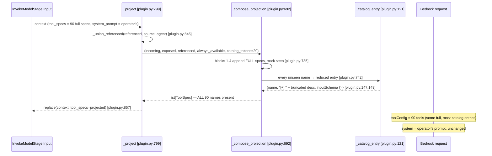
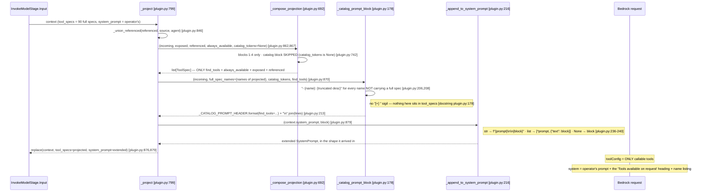
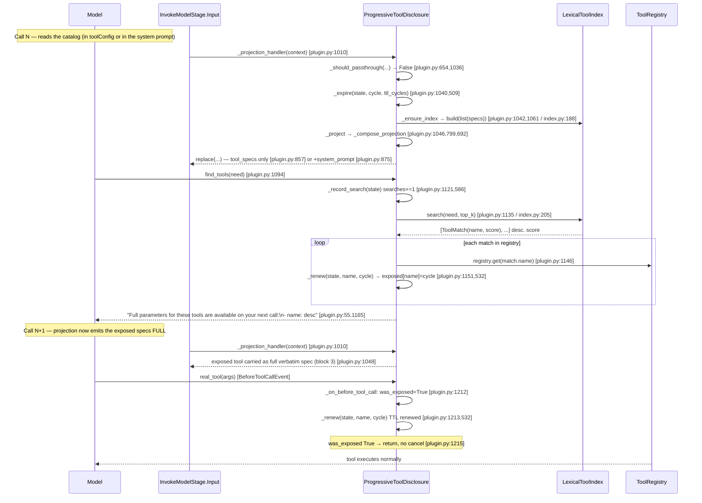
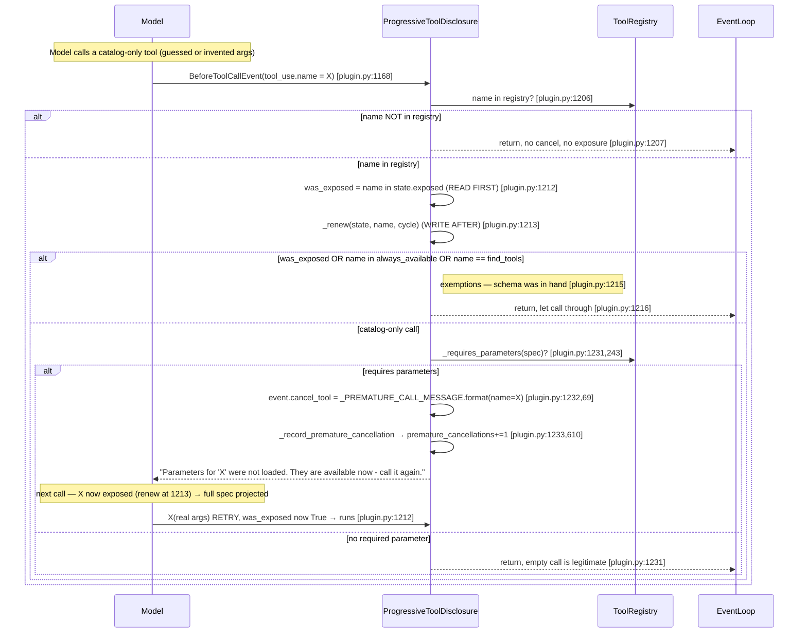
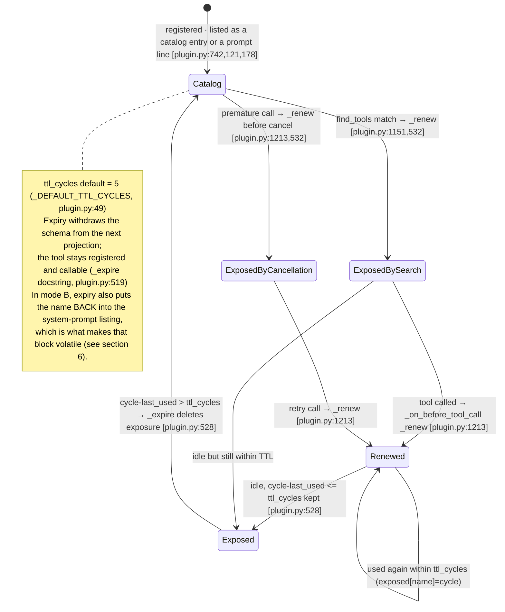

# Sequence B — Progressive Tool Disclosure

All `file.py:LINE` references are into
`community-plugins/strands-progressive-tool-disclosure/src/strands_progressive_tool_disclosure/`
(`plugin.py`, `index.py`) unless the prose names another package. Harness references are into
`validation/community-plugin-A-B-D/src/` (`runner.py`, `config.py`); the ordering section additionally
cites the context-graph package (`projection.py`) and the installed Strands SDK, whose paths are given
in prose because they sit outside the reference checker's roots. Every claim below carries a line
reference; literal strings are quoted verbatim from source.

## 1. What the plugin does, mechanically

On every model call the plugin rewrites the `tool_specs` the provider is shown, emitting the full
verbatim spec only for a fixed set — the search tool `find_tools`, the `always_available` names, the
tools whose schema a prior search **exposed** (live under a TTL measured in event-loop cycles), and
the tools the retained message history still **references** — and reducing everything else to a
**catalog** (`_compose_projection` `plugin.py:692`, `_project` `plugin.py:799`, `_projection_handler`
`plugin.py:1010`).

**There are two placements for that catalog**, selected by the constructor parameter
`catalog_in_system_prompt` (`plugin.py:924`, default `False`):

- **Mode A — catalog in the tool schema (default).** Every remaining tool stays in `tool_specs` as a
  reduced **catalog entry**: name, a description prefixed with the `[+] ` sigil and truncated to the
  budget, and an empty closed `inputSchema` (`_catalog_entry` `plugin.py:121`).
- **Mode B — catalog in the system prompt.** `tool_specs` carries **only the callable tools** (the
  four full-spec blocks) and every remaining name arrives as **prose appended to the system prompt**
  under a header that states the rule (`_catalog_prompt_block` `plugin.py:178`,
  `_append_to_system_prompt` `plugin.py:216`). No sigil is used, because nothing in the listing is
  pretending to be callable.

The discovery loop is the same in both modes: the model calls `find_tools` with a natural-language
need, the plugin's `LexicalToolIndex` term-frequency search (`index.py:168`) ranks the specs and the
plugin records those names as exposed (`find_tools` `plugin.py:1094`); the full schemas arrive on the
*next* model call. A `BeforeToolCallEvent` hook (`_on_before_tool_call` `plugin.py:1168`) renews a
called tool's TTL and, when the model calls a still-catalog-only tool that requires parameters,
cancels that call with a retry message after having exposed it. Every registered tool stays in the
`ToolRegistry` and stays callable in both modes.

Mode A writes nothing to the system prompt; the usage instruction lives entirely in `find_tools`' own
description (class docstring, `plugin.py:893`; `init_agent` docstring, `plugin.py:988`). Mode B is the
only path on which this plugin writes `system_prompt` at all.

## 2. Integration table — every SDK attachment point

| # | SDK seam | `file.py:LINE` | Callback / order | Reads | Mutates |
|---|----------|----------------|------------------|-------|---------|
| 1 | `Plugin` base class (subclassed) | `plugin.py:883` `class ProgressiveToolDisclosure(Plugin)` | `Plugin` auto-registers `@hook` and `@tool` members but NOT middleware (per docstring `plugin.py:991`) | — | — |
| 2 | `init_agent(agent)` lifecycle callback | `plugin.py:988` | Called by SDK when an agent is initialized | `agent._middleware_registry` | Adds one middleware to `InvokeModelStage.Input` (`plugin.py:1008`) |
| 3 | `InvokeModelStage.Input` middleware — the projection | `plugin.py:1008` (registration), `_projection_handler` `plugin.py:1010` (handler) | Middleware stage `InvokeModelStage.Input`; the seam is reached only through `_compat.py` (`_compat.py:1-14`, imports `InvokeModelContext`, `InvokeModelStage` from `strands._middleware.stages`). **No explicit order is set** — the handler is appended in wiring order, so it runs after any middleware that forced itself to the front (see §5). | `context.tool_specs`, `context.messages`, `context.system_prompt`, `context.agent`, `agent.tool_registry.registry`, `agent.event_loop_metrics.cycle_count` | Returns a NEW context via `replace(context, tool_specs=projected)` (`plugin.py:857`) in mode A, or `replace(context, tool_specs=..., system_prompt=...)` (`plugin.py:879`) in mode B; mutates per-agent `_DisclosureState` (`_expire` `plugin.py:509`, index fingerprint via `_ensure_index` `plugin.py:1061`). Does NOT touch the registry or the messages. |
| 4 | `@tool(context=True)` vended tool `find_tools` | `plugin.py:1093` decorator, `plugin.py:1094` method | Auto-registered by `Plugin`. Registered by the `_PluginRegistry` AFTER `init_agent` returns (`plugin.py:988` docstring), so early calls can arrive without it — covered by `_should_passthrough` (`plugin.py:654`). | `tool_context.agent`, `agent.event_loop_metrics.cycle_count`, `agent.tool_registry.registry`, the `need` argument | Increments `state.searches` (`_record_search` `plugin.py:586`); writes `state.exposed` via `_renew` (`plugin.py:532`) for each match. Returns a text result string. |
| 5 | `BeforeToolCallEvent` hook | `plugin.py:1167` `@hook`, `_on_before_tool_call` `plugin.py:1168` | Sync hook (the `# type: ignore` note at `plugin.py:1167` says the `@hook` overloads only infer async). Auto-registered by `Plugin`. Fires before each tool call. No numeric order documented. | `event.tool_use["name"]`, `event.agent`, `agent.tool_registry.registry`, `state.exposed`, `agent.event_loop_metrics.cycle_count`, `_requires_parameters(spec)` (`plugin.py:243`) | Writes `state.exposed` via `_renew` (`plugin.py:1213`); on a premature call sets `event.cancel_tool` (`plugin.py:1232`) and increments `state.premature_cancellations` (`_record_premature_cancellation` `plugin.py:610`, called `plugin.py:1233`). Never touches `event.tool_use` or the registry. |

Supporting SDK type imports (not attachment points, but the surface used): `BeforeToolCallEvent`,
`Plugin`, `hook`, `tool`, `Messages`, `SystemPrompt`, `ToolContext`, `ToolSpec` (`plugin.py:30`);
`InvokeModelStage` / `InvokeModelContext` via `_compat` — `InvokeModelContext` (`_compat.py:9`). `SystemPrompt` is a new
import — it is the type of the field mode B writes.

Per-agent state is held in a `WeakKeyDictionary` keyed by agent (`_DisclosureStates` `plugin.py:474`,
`_new_disclosure_states` `plugin.py:479`), so one plugin instance serves many agents without keeping
any alive; state never reaches `agent.state` or session storage (`_DisclosureState` docstring
`plugin.py:448`).

## 3. The projection model — five tool classes

`_compose_projection` (`plugin.py:692`) visits blocks in a **fixed order**; the first four emit the
full verbatim spec, the fifth (catalog) emits only whatever names are left. A name emitted by an
earlier block is added to `seen` and never re-emitted as a reduced entry (`plugin.py:735`,
`plugin.py:742`). `_project` at `plugin.py:799` is the entry point that calls it.

| Order | Class | Membership source (`file.py:LINE`) | What the model receives |
|-------|-------|-------------------------------------|--------------------------|
| 1 | `{find_tools}` | literal set `{find_tools_name}` in the block tuple `plugin.py:735` (name from `FIND_TOOLS_NAME` `plugin.py:43`) | **Full verbatim spec** — emitted first and unconditionally, which is what makes the projection non-empty on every projected path |
| 2 | `always_available` | `self._always_available` tuple, passed at `plugin.py:1050`; set in ctor `plugin.py:979` | **Full verbatim spec** on every call |
| 3 | `exposed` | `state.exposed` map (post-`_expire` `plugin.py:509`), passed at `plugin.py:1048` | **Full verbatim spec** while the exposure is live under the TTL |
| 4 | `referenced` | `_tool_names_referenced_in(context.messages)` (`plugin.py:625`, called `plugin.py:1044`) unioned with the optional `referenced_source` via `_union_referenced` (`plugin.py:752`) | **Full verbatim spec** — a `toolUse` in retained history without its definition is a protocol error |
| 5 | catalog residue | every incoming name not in `seen`, only when `catalog_tokens is not None` (`plugin.py:742`) | **Mode A:** a catalog entry from `_catalog_entry` (`plugin.py:121`) inside `tool_specs`. **Mode B:** nothing in `tool_specs`; the name is listed in the system-prompt block instead (`plugin.py:870`) |

Iteration inside every block follows `incoming` order, not the container's, for prompt-cache
stability (`_compose_projection` docstring, `plugin.py:692`; loop `plugin.py:736`).

**Exact catalog-entry `inputSchema` literal** (`plugin.py:149`, inside `_catalog_entry`):

```python
# plugin.py:149
"inputSchema": {"json": {"type": "object", "properties": {}, "additionalProperties": False}},
```

The sigil is added AFTER truncation and is NOT charged against `catalog_tokens` (`plugin.py:147`;
`_catalog_entry` docstring, `plugin.py:121`).

## 4. The two placement modes

`_project` (`plugin.py:799`) branches once, at `plugin.py:848`:

```python
# plugin.py:848
if catalog_tokens is None or not catalog_in_system_prompt:
```

`catalog_tokens=None` already means *no catalog at all*, so mode B is not consulted in that case —
the parameter is documented as ignored there (ctor docstring `plugin.py:945`).

### 4.1 Mode A — catalog inside `toolConfig` (default, `catalog_in_system_prompt=False`)

The single write is `tool_specs`; `system_prompt` is carried over untouched.



### 4.2 Mode B — catalog in the system prompt (`catalog_in_system_prompt=True`)

Two writes: `tool_specs` (callable tools only) and `system_prompt` (the appended block).
`_compose_projection` is called with `catalog_tokens=None` — the same code path that suppresses the
catalog is the one that makes room for it in the prompt, so the two placements can never both emit a
name (comment `plugin.py:860`, call `plugin.py:864`).



`_catalog_prompt_block` returns `""` when every incoming tool is already carrying a full
specification (`plugin.py:210`), and `_append_to_system_prompt` returns the prompt unchanged **by
identity** on an empty block (`plugin.py:235`) — an empty catalog adds nothing rather than a header
promising a list. Appending rather than prepending is deliberate: the operator's own text keeps the
opening position and, on a provider that caches by prefix, stays at a stable offset
(`_append_to_system_prompt` docstring, `plugin.py:216`).

## 5. Ordering guarantee — the context graph can never eat the catalog

Mode B writes into `system_prompt` from a handler on the *same* stage another plugin in this stack
rewrites: the context-graph plugin's delivery also registers on `InvokeModelStage.Input`. The
guarantee that the disclosure catalog survives is **structural**, and it rests on three facts, each
verified by reading source:

1. **The graph forces itself to index 0.** In
   `community-plugins/strands-context-graph/src/strands_context_graph/projection.py`, `register`
   (`projection.py:150`) adds its handler (`projection.py:172`) and then immediately moves it to the
   front (`projection.py:175`):

   ```python
   # projection.py:175
   handlers.insert(0, handlers.pop())
   ```

2. **The SDK builds the chain BACK TO FRONT, so index 0 is the OUTERMOST layer and runs FIRST.** In
   the installed SDK, `strands/_middleware/registry.py`, `compose` iterates the sorted handler list
   in reverse (line 128 seeds `current` with the terminal, line 129 walks downward), wrapping each
   handler *around* what was built so far:

   ```python
   # strands/_middleware/registry.py, lines 128-129
   current: MiddlewareNext = terminal
   for i in range(len(sorted_handlers) - 1, -1, -1):
   ```

   The last handler wrapped — index 0 — is the outermost layer, so it is entered first.

3. **The disclosure plugin sets no order, so it is appended and runs LAST.** `init_agent`
   (`plugin.py:988`) calls `add_middleware` plainly (`plugin.py:1008`) with no reordering, so it sits
   after the graph's forced-front handler and is entered after it.

Net effect: by the time `_projection_handler` (`plugin.py:1010`) appends the catalog block, the graph
has **already** folded the messages and returned. And even in the reverse arrangement the catalog
would survive, because the graph only ever rewrites `messages`: its delivery does
`replace(context, messages=removed)` (`projection.py:217`), and the SDK fold primitive it reuses does
`replace(context, messages=folded, dynamic_trailing_blocks=...)`
(`strands/injection/_message_injection.py`, line 95). Neither writes `system_prompt`, so the field
mode B appends to is not a field the graph touches.

This is worth stating explicitly because the intuition runs the wrong way twice over: "index 0"
reads as *innermost* until you read `compose`, and "the graph compacts the context" reads as *the
graph might drop my text* until you read which field it replaces.

## 6. Cache consequence of mode B — stated honestly

Mode B trades prompt-cache stability for placement. The system-prompt catalog block **changes on
almost every turn**: a tool that gets exposed by a search leaves the listing (it is now in
`full_spec_names`, `plugin.py:208`) and returns to it when its exposure expires (`_expire`
`plugin.py:509`). The block is therefore volatile by construction, not by accident.

On Bedrock the cacheable prefix is ordered **system → tools → messages**. A volatile system prompt
sits at the very front of that prefix, so it invalidates *everything after it* — the tool schemas and
the whole message history included. Mode A puts its volatility in the middle segment (tool schemas),
which leaves the system prefix stable; mode B moves that same volatility to the front.

Two consequences follow, and both are real:

- A run with mode B on and prompt caching on can pay **more** than mode A despite sending fewer tool
  schemas, because the cache write is re-paid each turn over the full prefix.
- The `_compose_projection` ordering discipline that exists specifically to protect the cache
  (`plugin.py:711`) still holds for `tool_specs`, but it no longer buys a stable prefix when the
  block above it moves.

Mode B is off by default for exactly this kind of reason: every published figure was measured with
the catalog inside the tool schema, and the mode is explicitly labelled **unmeasured** in the harness
(`catalog_in_system_prompt` `config.py:414`).

## 7. Harness wiring

The validation harness threads the flag from an environment variable to the constructor, with no
intermediate default of its own:

| Layer | `file.py:LINE` | What it does |
|-------|----------------|--------------|
| Threshold field | `catalog_in_system_prompt` (`config.py:414`) | `bool = False`, documented as unmeasured and as off-by-default because every published figure predates it |
| Environment read | `catalog_in_system_prompt` (`config.py:445`) | `_env_bool("VALIDATION_CATALOG_IN_SYSTEM_PROMPT", False)` inside the `THRESHOLDS` construction |
| Plugin construction | `catalog_in_system_prompt` (`runner.py:438`) | `catalog_in_system_prompt=THRESHOLDS.catalog_in_system_prompt` on the `ProgressiveToolDisclosure(...)` built at `runner.py:420` |

So a mode-B run is `VALIDATION_CATALOG_IN_SYSTEM_PROMPT=1` in the environment and nothing else.

Note the harness comment at `runner.py:426-428`: the retrieval tools are put in `always_available`
precisely *because* a catalog entry carries an empty `inputSchema`, so a hidden retrieval tool gets
called with no arguments and cancelled by the premature-call guard before it runs. That comment is
about the defect §9 describes — under mode B that particular pressure is lower, but the
`always_available` wiring is unchanged.

## 8. Mermaid sequence — happy path (discovery)



## 9. Mermaid sequence — premature-cancellation path

`was_exposed` is read at `plugin.py:1212` **before** `_renew` writes at `plugin.py:1213`; the comment
at `plugin.py:1210` states the renewal erases the distinction, so the read must precede it. The
`find_tools` exemption is the `FIND_TOOLS_NAME` test (`plugin.py:1215`): `find_tools` travels full
on every call but is never written to `exposed`, so without the exemption the guard would cancel the
very call that opens discovery (docstring `plugin.py:1187`).

The guard no longer requires an empty input. Any call to a tool whose schema was never projected is
cancelled when the tool requires parameters, because invented arguments against an unseen schema are
the *worse* failure — they can satisfy a permissive tool and return a confidently wrong answer
(comment `plugin.py:1222`).



**Mode B weakens this recovery path, and the constructor docstring says so** (`plugin.py:945`): a
name outside `tool_specs` is a name the provider does not know, so a model that calls it anyway may
be refused by the provider *before* `_on_before_tool_call` is reached. The cancellation-and-retry
round trip is a guarantee in mode A and only a best case in mode B.

## 10. Mermaid state diagram — one tool's lifecycle

TTL parameter: `ttl_cycles`, default `_DEFAULT_TTL_CYCLES = 5` (`plugin.py:49`; ctor
`plugin.py:919`). Age is measured against `agent.event_loop_metrics.cycle_count` only — no wall clock
(`_expire` docstring `plugin.py:512`). Boundary is inclusive on the live side:
`cycle - last_used == ttl_cycles` is KEPT; expiry is `cycle - last_used > ttl_cycles`
(`plugin.py:528`).



## 11. Expected model behaviour vs observed — the open defect

**Design expectation** (`find_tools` docstring `plugin.py:1095`, `_CATALOG_SIGIL` docstring
`plugin.py:106`): the model sees a description starting with `[+] `, understands that entry is a
*listing* whose parameters are not loaded, calls `find_tools` with a natural-language need, receives
the matching names, and only THEN calls the real tool once its full schema has arrived on the next
turn. A tool listed without `[+]` is complete and callable straight away.

**The defect stands, and mode A is still the default, so it is still what ships.** A catalog entry
carries `inputSchema: {"type": "object", "properties": {}}` (`plugin.py:149`), which tells the model
the tool **takes no arguments** — a positive, false claim, not an absence of information. The denial
lives in a **sibling tool's description**, `find_tools`' own docstring (`plugin.py:1095`), which is
not the text the model is reading at the moment it decides to call. The `_CATALOG_SIGIL` docstring
states it directly: "The only statement that the list is incomplete lives in ``find_tools``'s own
description -- a sibling tool's prose, not the entry the model is looking at when it decides."
(`plugin.py:108`), and "The model does not disbelieve the catalog; it has no reason to suspect it."
(`plugin.py:118`).

**Observed failure modes (MEASURED — attributed as measurements, not source):**

- On **Claude Opus 4.8**, one 60-turn run recorded **22 `find_tools` searches AND 19 premature
  cancellations in the same run** — the model follows the instruction and guesses at the same time.
  Each guess is a round trip of roughly 31,000 tokens carrying no information
  (`catalog_in_system_prompt` docstring `config.py:414`).
- On **GLM 4.7 Flash without the `[+]` sigil**, a run recorded **searches = 0 with 17
  cancellations** and one tool exposed at the end (`_CATALOG_SIGIL` docstring, `plugin.py:105`).

**What mode B changes about the defect, and what it does not.** Mode B removes the false
`inputSchema` claim (the name is not in `tool_specs` at all, so nothing asserts it is callable) and
co-locates the rule with the names (`_CATALOG_PROMPT_HEADER` docstring, `plugin.py:153`). It does
**not** make the defect measured — mode B is unmeasured by its own documentation
(`catalog_in_system_prompt` `config.py:414`) — and it introduces the two costs already stated: the
cache invalidation of §6 and the weaker recovery path of §9.

One inconsistency is worth recording: `find_tools`' docstring is unconditional, so under mode B the
model is still told "Any tool whose description begins with `[+]`is a listing" (`plugin.py:1097`)
while **no description carries the sigil** — `_catalog_prompt_block` deliberately omits it
(docstring, `plugin.py:178`). The instruction is not wrong, it is vacuous, and the rule the model
actually needs arrives from the prompt header instead.

## 12. Verbatim text the model sees

**Write targets.** Mode A writes `tool_specs` only. Mode B writes `tool_specs` *and*
`system_prompt`. In both modes the `find_tools` result string and the cancellation message are
returned as **tool-result messages**, resident in message history (`find_tools` return comment
`plugin.py:1163`: "a tool result is a message, and a message is resident").

### 12.1 The mode-B system-prompt header — `_CATALOG_PROMPT_HEADER` (`plugin.py:153`)

Quoted literally, `{find_tools}` being substituted with the search tool's name at `plugin.py:213`:

```text
# Tools available on request

The tools listed below are NOT in your tool list for this call. They exist and they work, but their
parameters have not been loaded, so you cannot call them yet — a call to a name from this list will be
refused, not executed.

To use one, call `find_tools` first and describe what you are trying to do in your own words. The
tools that match arrive complete, with their parameters, in your tool list on the next turn, and you
call the one you want from there.

Your tool list for this call is complete and callable as it stands. Anything in it, you call directly.
Anything only in the list below, you reach through `find_tools`.

```

Immediately followed by one line per non-callable tool, built at `plugin.py:206`:

```python
f"- {spec['name']}: {_truncate_description(spec['description'], catalog_tokens)}"
```

So the model sees, for example:

```text
- get_transactions: Return the transactions of an account over a date range.
- open_position: Open a position on an instrument for an account.
```

No `[+] ` sigil appears here, deliberately (`_catalog_prompt_block` docstring, `plugin.py:178`).

### 12.2 `find_tools` docstring — exactly as the model receives it (`plugin.py:1095`)

```text
Find the tools that can do what you need.

Any tool whose description begins with `[+]` is a listing, not a full specification: you are
seeing its name and one line about it, and its parameters have not been loaded. Calling one of
those directly does not work, because you would be guessing its arguments.

Call this tool instead, with a description of what you are trying to do in your own words. The
tools that match arrive with their full parameters on your next turn, and then you call the one
you want. A tool listed without `[+]` is complete and you can call it straight away.

Args:
    need: What you are trying to do, described in your own words. A capability, not a tool
        name — "list the transactions of an investment account" works better than a guess at
        what the tool might be called.
    tool_context: Injected by the framework. Not user-facing.

Returns:
    The matching tool names with a short description of each, or guidance to describe the
    need or to reword it when there is nothing to list.
```

### 12.3 `find_tools` inputSchema

Not a source literal — it is derived by the `@tool(context=True)` decorator (`plugin.py:1093`) from
the signature `find_tools(self, need: str, tool_context: ToolContext)` (`plugin.py:1094`). The only
model-facing parameter is `need` (a `str`); `tool_context` is framework-injected and marked "Not
user-facing" (`plugin.py:1107`). The exact serialized JSON Schema is produced by the SDK's decorator
and does not appear as a literal in this package.

### 12.4 `_CATALOG_SIGIL` value and its docstring (`plugin.py:105`)

```python
# plugin.py:105
_CATALOG_SIGIL = "[+] "
```

```text
Prefix marking a description as a catalog entry whose parameters are not loaded.

A catalog entry is otherwise indistinguishable from a tool that genuinely takes no arguments: the name
is real, the description reads whole, and ``inputSchema`` is a valid empty object. The only statement
that the list is incomplete lives in ``find_tools``'s own description -- a sibling tool's prose, not the
entry the model is looking at when it decides. Measured on GLM 4.7 Flash over 60 turns, that gap costs
the whole search path: ``searches: 0`` with seventeen premature cancellations, and one tool exposed at
the end. The model does not disbelieve the catalog; it has no reason to suspect it.

Four characters, so the signal is attached where the decision happens while the explanation stays in one
place. Ninety catalog entries pay about ninety tokens per call between them, against a search round trip
each time the model guesses instead.
```

Mode A entry description is `_CATALOG_SIGIL + _truncate_description(spec["description"], catalog_tokens)`
(`plugin.py:147`), so the model sees `[+] ` followed by a truncated prefix of the real description.

### 12.5 `_PREMATURE_CALL_MESSAGE` (`plugin.py:69`)

```python
_PREMATURE_CALL_MESSAGE = "Parameters for '{name}' were not loaded. They are available now - call it again."
```

Formatted with the tool name at `plugin.py:1232` before being assigned to `event.cancel_tool`.

### 12.6 `find_tools` success result — header + one line per match

Header literal `_MATCHES_HEADER` (`plugin.py:55`):

```python
_MATCHES_HEADER = "Full parameters for these tools are available on your next call:"
```

Full result assembled at `plugin.py:1165` as `"\n".join([_MATCHES_HEADER, *lines])`, each line built
at `plugin.py:1153`:

```python
lines.append(f"- {match.name}: {self._short_description(registered.tool_spec)}")
```

So the model sees, e.g.:

```text
Full parameters for these tools are available on your next call:
- <tool_name>: <short description>
```

### 12.7 Every other literal string the plugin puts in front of the model

- `_EMPTY_NEED_GUIDANCE` (`plugin.py:58`), returned when `need` is blank (`plugin.py:1125`), at
  `_EMPTY_NEED_GUIDANCE` (`plugin.py:1127`):

  ```python
  _EMPTY_NEED_GUIDANCE = "Describe what you are trying to do, in your own words, then call this tool again."
  ```

- `_NO_MATCH_GUIDANCE` (`plugin.py:61`) — returned when nothing usable was found, `_NO_MATCH_GUIDANCE` (`plugin.py:1161`):

  ```python
  _NO_MATCH_GUIDANCE = "No tool matches that description. Try different wording, or answer directly."
  ```

- `_SEARCH_FAILED_GUIDANCE` (`plugin.py:64`) — returned when the search itself raised, `_SEARCH_FAILED_GUIDANCE` (`plugin.py:1140`):

  ```python
  _SEARCH_FAILED_GUIDANCE = "Tool search is unavailable right now. Try a different description, or answer directly."
  ```

With the `_CATALOG_PROMPT_HEADER` block (`plugin.py:153`), the `[+] `-prefixed catalog description,
the `find_tools` docstring, `_MATCHES_HEADER`, and `_PREMATURE_CALL_MESSAGE`, that is the complete set
of model-facing text the plugin can produce. The `_ELLIPSIS = "..."` literal (`plugin.py:76`) can
appear inside a truncated description when the cut lands mid-sentence (`_truncate_description`
`plugin.py:271`).

## 13. Configuration — every constructor parameter

Constructor: `ProgressiveToolDisclosure.__init__` (`plugin.py:915`). All keyword-only (`*` at
`plugin.py:917`). Validation runs before any state is set — `_validate_catalog_tokens` (`plugin.py:964`).

| Parameter | Default (`file.py:LINE`) | Accepts `None`? | Meaning |
|-----------|--------------------------|-----------------|---------|
| `catalog_tokens` | `_DEFAULT_CATALOG_TOKENS = 20` (`plugin.py:46`; ctor `plugin.py:918`) | **Yes** | Description budget in tokens per catalog entry or per prompt line. `None` drops the catalog entirely, leaving `find_tools`' description as the only hint that other tools exist; validated by `_validate_catalog_tokens` (`plugin.py:369`) — must be `None` or int ≥ 1 (0 rejected). |
| `ttl_cycles` | `_DEFAULT_TTL_CYCLES = 5` (`plugin.py:49`; ctor `plugin.py:919`) | No | Cycles an exposure survives after its last use. `_validate_positive_int` (`plugin.py:347`) — int ≥ 1, `bool` and `float` rejected. |
| `always_available` | `()` empty tuple (`plugin.py:920`) | No | Names carrying their full spec on every call, skipping discovery. `_validate_always_available` (`plugin.py:387`) — sequence of non-empty strings; a bare string is rejected. Stored as a tuple (`plugin.py:979`). |
| `index` | `None` → `LexicalToolIndex()` (`plugin.py:921`; instantiated `plugin.py:982`) | **Yes** | Search implementation. `None` means the default term-frequency `LexicalToolIndex` (`index.py:168`), which needs no network. `_validate_index` (`plugin.py:410`) — `None`, or an object with callable `build` and `search`. |
| `top_k` | `_DEFAULT_TOP_K = 3` (`plugin.py:52`; ctor `plugin.py:922`) | No | How many tools one search exposes. `_validate_positive_int` (`plugin.py:347`) — int ≥ 1. |
| `referenced_source` | `None` (`plugin.py:923`) | **Yes** | Callable `(Agent) -> Iterable[str]` returning extra names to carry full specs this call, on top of history-referenced ones (`ReferencedSource` `plugin.py:82`). `None` composes referenced names from retained history alone. `_validate_referenced_source` (`plugin.py:430`) — `None` or callable. |
| `catalog_in_system_prompt` | `False` (`plugin.py:924`) | No | `True` moves the catalog out of `tool_specs` and into a system-prompt block; `tool_specs` then carries only the callable tools. Validated inline (`plugin.py:970`) with `"catalog_in_system_prompt=<{!r}> | must be True or False"` — a non-`bool` is rejected, not coerced, and `_catalog_in_system_prompt` is stored (`plugin.py:984`). **Ignored when `catalog_tokens is None`** (`plugin.py:848`), which already means there is no catalog to place. Default is `False` because every published figure was measured with the catalog in the tool schema (ctor docstring, `plugin.py:915`). |

No parameter is positional; there is no `find_tools_name` constructor knob — the search-tool name is
the module constant `FIND_TOOLS_NAME = "find_tools"` (`plugin.py:43`), threaded as a defaulted
argument through `_compose_projection` / `_project` / `_should_passthrough` / `_catalog_prompt_block`
but not exposed on the constructor.
