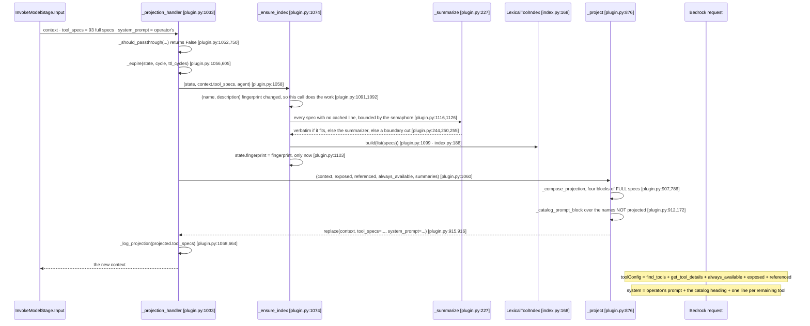
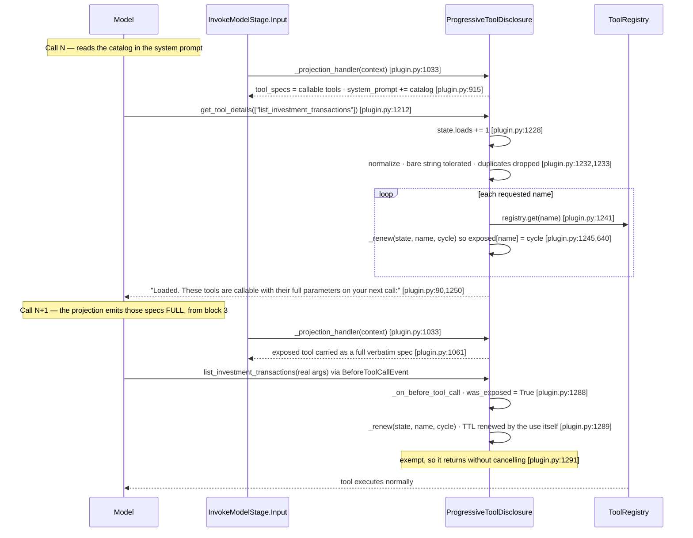
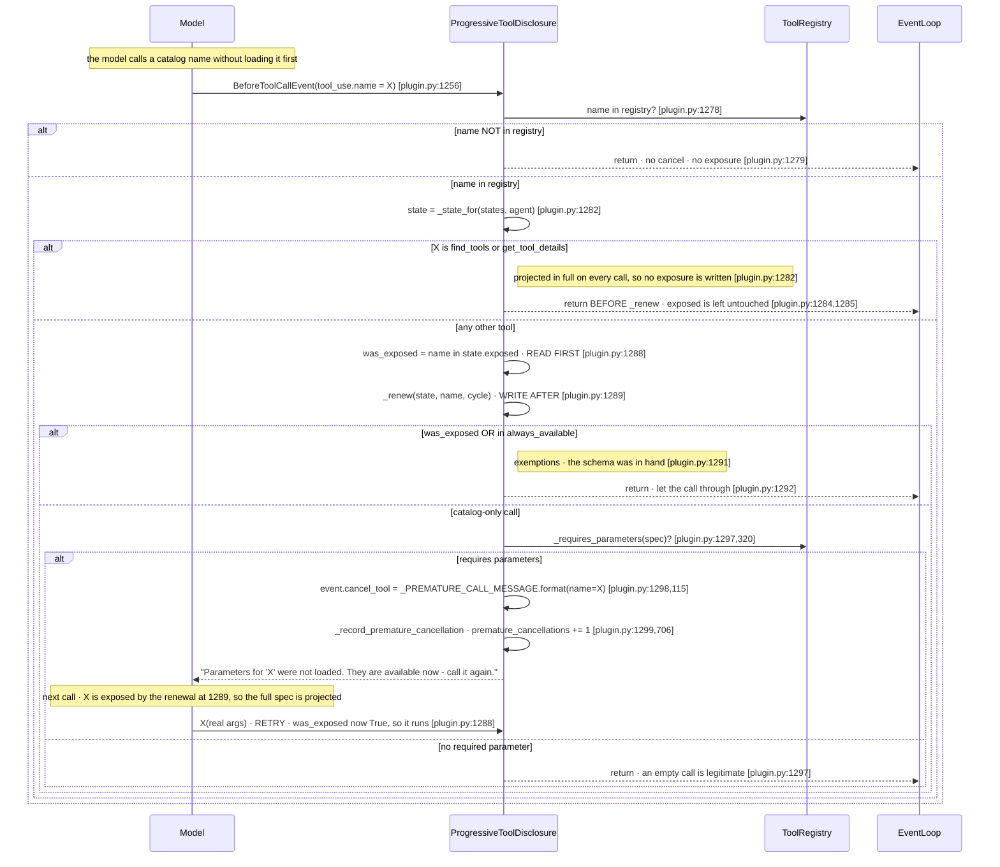
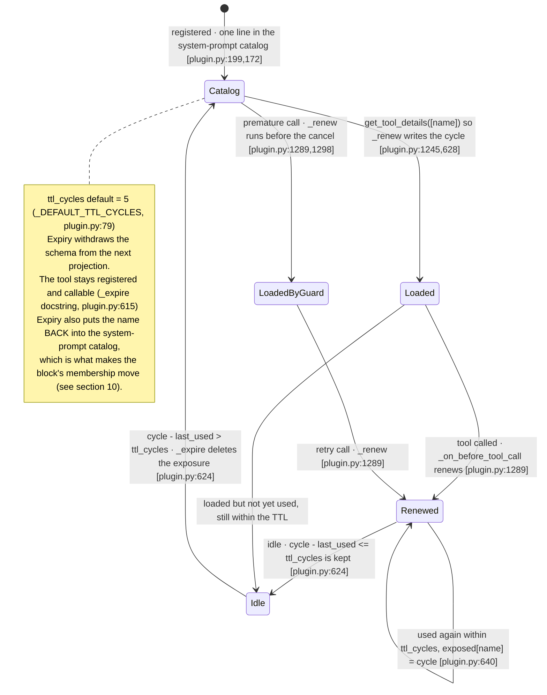

# Sequence B — Progressive Tool Disclosure

All `file.py:LINE` references are into
`community-plugins/strands-progressive-tool-disclosure/src/strands_progressive_tool_disclosure/`
(`plugin.py`, `index.py`, `_compat.py`) unless the prose names another package. Harness references are
into `validation/community-plugin-A-B-D/src/` (`runner.py`, `config.py`); the ordering section
additionally cites the context-graph package (`projection.py`) and the installed Strands SDK, whose
paths are given in prose because they sit outside the reference checker's roots. Every claim below
carries a line reference; literal strings are quoted verbatim from source.

## 1. What the plugin does, mechanically

On every model call the plugin rewrites **two** fields of the invocation context. `tool_specs` is
reduced to the tools that are callable on this call, each one a **full verbatim spec**: the two plugin
tools `find_tools` and `get_tool_details`, the `always_available` names, the tools whose schema was
**loaded** by a prior `get_tool_details` and is still live under a TTL measured in event-loop cycles,
and the tools the retained message history still **references**. Every other registered tool reaches
the model as **one line of a catalog appended to the system prompt** — its name and a summary of its
description, at most `catalog_chars` characters (`_compose_projection` `plugin.py:786`, `_project`
`plugin.py:876`, `_catalog_prompt_block` `plugin.py:172`, `_projection_handler` `plugin.py:1033`).

There is **one placement** and no mode flag. Nothing reduced is ever put in `tool_specs`, so nothing
the provider is shown asserts an empty `inputSchema`: a catalog name is not in `tool_specs` at all, and
the rule that governs it arrives in the same block as the name (`_CATALOG_PROMPT_HEADER`
`plugin.py:151`). The projection and the catalog **partition** the registry between them — the block
is built from the projection's own names, so no tool appears in both and none is missing from both
(`plugin.py:912`, `_catalog_prompt_block` docstring `plugin.py:172`).

**The common path is catalog → `get_tool_details([names])` → call.** The model reads a name in the
system prompt, calls `get_tool_details` with the names it wants, which renews them into `state.exposed`
(`_renew` `plugin.py:1245`) and answers with a short confirmation; the full schemas arrive on the *next*
model call. `find_tools` is the **fallback** for a need no catalog name fits: it ranks the specs through
the `LexicalToolIndex` term-frequency search (`index.py:205`) and lists names plus summaries, and it
**exposes nothing** — loading is `get_tool_details`' one job, so the model takes the same road to a
schema wherever it started (`find_tools` `plugin.py:1152`, comment `plugin.py:1207`).

A `BeforeToolCallEvent` hook (`_on_before_tool_call` `plugin.py:1256`) renews a called tool's TTL and,
when the model calls a catalog-only tool that requires parameters, cancels that call with a retry
message after having exposed it. The two plugin tools return before any of that
(`plugin.py:1284`), so they are never written to `exposed` at all. The cancellation is a **safety
net**, not a path: a catalog name is not in `tool_specs`, so the common flow never reaches it
(docstring `plugin.py:1257`).

Every registered tool stays in the `ToolRegistry` and stays callable throughout. Expiry withdraws a
schema from the next projection, it does not unregister anything (`_expire` docstring `plugin.py:605`).

## 2. Integration table — every SDK attachment point

| # | SDK seam | `file.py:LINE` | Callback / order | Reads | Mutates |
|---|----------|----------------|------------------|-------|---------|
| 1 | `Plugin` base class (subclassed) | `plugin.py:920` `class ProgressiveToolDisclosure(Plugin)` | `Plugin` auto-registers `@hook` and `@tool` members but NOT middleware (per docstring `plugin.py:1017`) | — | — |
| 2 | `init_agent(agent)` lifecycle callback | `plugin.py:1014` | Called by the SDK when an agent is initialized | `agent._middleware_registry` | Adds one middleware to `InvokeModelStage.Input` (`plugin.py:1031`) |
| 3 | `InvokeModelStage.Input` middleware — the projection | `plugin.py:1031` (registration), `_projection_handler` `plugin.py:1033` (handler) | Middleware stage `InvokeModelStage.Input`; the seam is reached only through `_compat.py`, which imports `InvokeModelContext` and `InvokeModelStage` from `strands._middleware.stages` (`_compat.py:9`). **No explicit order is set** — the handler is appended in wiring order, so it runs after any middleware that forced itself to the front (see §9). | `context.tool_specs`, `context.messages`, `context.system_prompt`, `context.agent`, `agent.tool_registry.registry`, `agent.event_loop_metrics.cycle_count`, `agent.model` (default summarizer) | Returns a NEW context via `replace(context, tool_specs=projected, system_prompt=...)` (`plugin.py:915`), or `tool_specs` alone when the catalog is suppressed (`plugin.py:910`); mutates per-agent `_DisclosureState` (`_expire` `plugin.py:605`) and the shared summary cache and index fingerprint (`_ensure_index` `plugin.py:1074`). Does NOT touch the registry or the messages. |
| 4 | `@tool(context=True)` vended tool `get_tool_details` | `plugin.py:1211` decorator, `plugin.py:1212` method | Auto-registered by `Plugin`, by the `_PluginRegistry` AFTER `init_agent` returns (`plugin.py:1024` docstring), so early calls can arrive without it — covered by `_should_passthrough` (`plugin.py:750`). | `tool_context.agent`, `agent.event_loop_metrics.cycle_count`, `agent.tool_registry.registry`, the `names` argument | Increments `state.loads` (`plugin.py:1228`); writes `state.exposed` via `_renew` for each known name (`plugin.py:1245`). Returns a text result string. |
| 5 | `@tool(context=True)` vended tool `find_tools` | `plugin.py:1151` decorator, `plugin.py:1152` method | Auto-registered by `Plugin`, same post-`init_agent` window as row 4. | `tool_context.agent`, `agent.tool_registry.registry`, the `need` argument, the index | Increments `state.searches` (`_record_search` `plugin.py:682`, called `plugin.py:1175`). **Writes no exposure** — it only reads the index and the registry. |
| 6 | `BeforeToolCallEvent` hook | `plugin.py:1255` `@hook`, `_on_before_tool_call` `plugin.py:1256` | Sync hook (the `# type: ignore` note at `plugin.py:1255` says the `@hook` overloads only infer async). Auto-registered by `Plugin`. Fires before each tool call. No numeric order documented. | `event.tool_use["name"]`, `event.agent`, `agent.tool_registry.registry`, `state.exposed`, `agent.event_loop_metrics.cycle_count`, `_requires_parameters(spec)` (`plugin.py:320`) | Writes `state.exposed` via `_renew` (`plugin.py:1289`); on a premature call sets `event.cancel_tool` (`plugin.py:1298`) and increments `state.premature_cancellations` (`_record_premature_cancellation` `plugin.py:706`, called `plugin.py:1299`). Never touches `event.tool_use` or the registry. |

Supporting SDK type imports (not attachment points, but the surface used): `BeforeToolCallEvent`,
`Plugin`, `hook`, `tool`, `Messages`, `SystemPrompt`, `ToolContext`, `ToolSpec` (`plugin.py:29-33`);
`InvokeModelStage` via `_compat` (`plugin.py:35`), `InvokeModelContext` under `TYPE_CHECKING`
(`plugin.py:42`). `SystemPrompt` is the type of the field the catalog is appended to.

Per-agent state is held in a `WeakKeyDictionary` keyed by agent (`_DisclosureStates` `plugin.py:570`,
`_new_disclosure_states` `plugin.py:575`), so one plugin instance serves many agents without keeping any
alive; state never reaches `agent.state` or session storage (`_DisclosureState` docstring
`plugin.py:538`). Summaries are the one thing shared across agents, because a summary depends on the
description alone (`self._summaries` `plugin.py:1010`, `init_agent` docstring `plugin.py:1022`).

## 3. The projection model — four full-spec blocks, then the catalog

`_compose_projection` (`plugin.py:786`) visits four blocks in a **fixed order** and every name it emits
carries its full verbatim spec. A name emitted by an earlier block is added to `seen` and never
re-emitted (`plugin.py:819`, `plugin.py:824`). `_project` at `plugin.py:876` is the entry point that
calls it and then places whatever is left into the system prompt.

| Order | Class | Membership source (`file.py:LINE`) | What the model receives |
|-------|-------|-------------------------------------|--------------------------|
| 1 | `{find_tools, get_tool_details}` | frozenset `_PLUGIN_TOOL_NAMES` (`plugin.py:55`), first block of the tuple `plugin.py:819` (names from `FIND_TOOLS_NAME` `plugin.py:46` and `GET_TOOL_DETAILS_NAME` `plugin.py:49`) | **Full verbatim spec** — emitted first and unconditionally, which is what makes the projection non-empty on every projected path |
| 2 | `always_available` | `self._always_available` tuple, passed at `plugin.py:1064`; set in ctor `plugin.py:1002` | **Full verbatim spec** on every call |
| 3 | `exposed` | `state.exposed` map (post-`_expire` `plugin.py:605`), passed at `plugin.py:1062`; written only by `_renew` (`plugin.py:628`) from `get_tool_details` (`plugin.py:1245`) and from the pre-call hook (`plugin.py:1289`) | **Full verbatim spec** while the exposure is live under the TTL |
| 4 | `referenced` | `_tool_names_referenced_in(context.messages)` (`plugin.py:721`, called `plugin.py:1063`) unioned with the optional `referenced_source` via `_union_referenced` (`plugin.py:829`) | **Full verbatim spec** — a `toolUse` in retained history without its definition is a protocol error |
| 5 | catalog residue | every incoming name **not** in the projection, computed from the projection itself (`plugin.py:912`); skipped entirely when `catalog_chars is None` (`plugin.py:909`) | **Nothing in `tool_specs`.** One line `- name: summary` in the system prompt (`plugin.py:199`), under the header at `plugin.py:203` |

Iteration inside every block follows `incoming` order, not the container's, for prompt-cache stability
(`_compose_projection` docstring, `plugin.py:786`; loop `plugin.py:820`).

`_catalog_prompt_block` returns `""` when every incoming tool is already carrying a full specification
(`plugin.py:200`), and `_append_to_system_prompt` returns the prompt unchanged **by identity** on an
empty block (`plugin.py:311`) — an empty catalog adds nothing rather than a header promising a list.
Appending rather than prepending is deliberate: the operator's own text keeps the opening position and,
on a provider that caches by prefix, stays at a stable offset (`_append_to_system_prompt` docstring,
`plugin.py:293`). The three shapes of `SystemPrompt` are each preserved: `None` becomes the block
(`plugin.py:313`), a `str` is joined with a blank line (`plugin.py:315`), and a list gains one text
block rather than being flattened (`plugin.py:317`).

**Passthrough is structural, not a flag.** `_should_passthrough` (`plugin.py:750`) returns `True` when
any incoming name is absent from the registry — forced structured output swaps in a synthetic spec —
and when **either** plugin tool is missing from the call: without `get_tool_details` there is no way to
load a hidden schema and without `find_tools` no way to find one, so there is nothing to hide
(`plugin.py:783`).

## 4. The first projection — index build and the catalog lines

Neither the index nor a summary can be produced at construction time: both need the specifications of a
call, and the first projection is what has them (`_ensure_index` docstring `plugin.py:1075`). The
incoming `(name, description)` **pairs** are kept as a fingerprint and compared on every projection, so
an MCP tool or a `register_dynamic_tool` arriving at runtime — and equally a tool **re-registered with a
new description** — triggers exactly one rebuild (`plugin.py:1091`, `plugin.py:1092`, written at
`plugin.py:1103` only after the build returns, so a build that raises is retried next call). Keying on
the description as well as the name is what makes the fingerprint agree with the summary cache, which is
keyed the same way: a changed description invalidates both together instead of leaving a stale line
behind a matching name (`plugin.py:1080`).

A catalog line is produced in three tiers, in this order of preference (`_summarize` `plugin.py:227`):

1. **Verbatim.** A description that already fits `catalog_chars` is the best summary of itself and costs
   no call (`plugin.py:243`, `plugin.py:244`).
2. **Summarized.** A longer one goes to the summarizer, sync or async (`plugin.py:247`,
   `plugin.py:248`), and the answer is clamped to the limit with whitespace collapsed and wrapping
   quotes dropped (`_clamp_summary` `plugin.py:207`, `plugin.py:223`, `plugin.py:224`). The default
   summarizer is one plain call to the agent's own model with no tools and no history, so it passes
   through no agent middleware and cannot recurse into this projection (`_model_summarizer`
   `plugin.py:258`, `model.stream` `plugin.py:280`); its usage is accumulated into
   `state.summary_usage` (`plugin.py:279`, field `plugin.py:567`).
3. **Truncated.** A summarizer that raises or answers nothing falls back to a cut at a sentence or word
   boundary (`plugin.py:251`, `plugin.py:255`, `_truncate_description` `plugin.py:348`). No tool is ever
   left without a line and no summarizer failure escapes the projection.

Lines are cached on the plugin instance keyed by `(name, description)` (`plugin.py:1010`), so a tool is
summarized once however many agents and calls read it, and a re-registration with a changed description
gets a new line. Missing lines are requested concurrently under a semaphore of `_SUMMARY_CONCURRENCY`
(`plugin.py:62`, gate `plugin.py:1126`, gather `plugin.py:1133`), and only for catalog-eligible specs —
the two plugin tools are excluded (`plugin.py:1116`).



## 5. The common path — catalog, load, call

Two model calls and no guessing: the names live in the system prompt, the schemas arrive through
`get_tool_details`, and the call itself renews the TTL.

`get_tool_details` tolerates the two shapes a model actually sends: a bare string instead of a list
(`plugin.py:1232`) and duplicates, which are de-duplicated with order kept (`plugin.py:1233`). A call
that named nothing usable answers with `_DETAILS_EMPTY_GUIDANCE` (`plugin.py:1235`). A name the registry
does not have is collected and reported rather than silently dropped (`plugin.py:1243`,
`plugin.py:1252`). The specification itself is **not** in the result text — it travels in `tool_specs`
on the next call, because a tool result is resident in the history while a projection is per call and
forgettable (`_DETAILS_LOADED_HEADER` docstring `plugin.py:90`).



`get_tool_details` takes a **list**, which is what keeps a step that needs three tools to one cycle
rather than three (docstring `plugin.py:1213`).

## 6. The fallback — `find_tools` searches, it does not load

`find_tools` exists for a need the model cannot map to any listed name. It ranks specs and reports
names plus summaries, and then stops: the model still goes through `get_tool_details`, so there is one
road to a schema instead of two (comment `plugin.py:1207`).

Every invocation is counted, including a blank need and a failed search, because each costs the cycle
just the same (`plugin.py:1175`, comment `plugin.py:1174`). A blank need is not searched at all and
returns guidance (`plugin.py:1178`, `plugin.py:1180`). A search that raises returns guidance too, worded
the same way as a no-match because from where the model stands the two cases are one
(`plugin.py:1186`, `plugin.py:1189`, `_SEARCH_FAILED_GUIDANCE` docstring `plugin.py:110`). A match the
registry does not have, and either plugin tool, are skipped (`plugin.py:1195`, `plugin.py:1197`).


The index is term-frequency and local, so a search needs no network (`LexicalToolIndex` `index.py:168`,
`build` `index.py:188`, `search` `index.py:205`). It is a structural protocol, so any object exposing a
callable `build` and `search` can replace it (`ToolIndex` `index.py:44`, `_validate_index`
`plugin.py:500`), and both operations are allowed to be awaitable for a network-backed implementation
(`plugin.py:1099`, `plugin.py:1185`).

## 7. The safety net — premature-call cancellation

The two plugin tools are dealt with **first**, by an early return at `plugin.py:1284` that sits after the
state is fetched (`plugin.py:1282`) and **before** `_renew` — so `find_tools` and `get_tool_details` are
never written to `exposed` at all. They are projected in full on every call, so an exposure entry for
them would carry no information and would only age out for nothing (comment `plugin.py:1282`). The
later condition at `plugin.py:1291` still lists `_PLUGIN_TOOL_NAMES` among its exemptions, but a plugin
tool can no longer reach it.

For every other tool, `was_exposed` is read at `plugin.py:1288` **before** `_renew` writes at
`plugin.py:1289`; the comment at `plugin.py:1286` states the renewal erases the distinction, so the read
must precede it. That is what tells a normal call apart from a call made off the catalog.

The guard does not require an empty input. Any call to a tool whose schema was never projected is
cancelled when the tool requires parameters, because invented arguments against an unseen schema are the
*worse* failure — they can satisfy a permissive tool and return a confidently wrong answer that nothing
in the run marks as suspect (comment `plugin.py:1294`).



Only the `required` list decides (`_requires_parameters` `plugin.py:344`): a tool whose parameters are
all optional is callable with no arguments, so an empty call to it is not the symptom of a missing
schema. Any schema shape the function cannot read is treated as requiring nothing (`plugin.py:320`
docstring), which errs towards letting the call run.

The counter this path increments is the one worth watching. Under this design it should be near zero,
because the catalog names are not in `tool_specs` at all; a high `premature_cancellations`
(`plugin.py:566`) means the model is calling names it read in the prompt without loading them, which is
a catalog-wording problem rather than a mechanism failure.

## 8. One tool's lifecycle and expiry

TTL parameter: `ttl_cycles`, default `_DEFAULT_TTL_CYCLES = 5` (`plugin.py:79`; ctor `plugin.py:955`).
Age is measured against `agent.event_loop_metrics.cycle_count` only — no wall clock, no message count,
no tool-call count (`_expire` docstring `plugin.py:608`). The boundary belongs to the live side:
`cycle - last_used == ttl_cycles` is KEPT, and expiry is `cycle - last_used > ttl_cycles`
(`plugin.py:624`).



`find_tools` appears nowhere in this diagram on purpose: a search changes no exposure state, so a tool's
lifecycle is driven by `get_tool_details`, by use, and by inactivity.

## 9. Ordering guarantee — the context graph can never eat the catalog

The catalog is written into `system_prompt` from a handler on the *same* stage another plugin in this
stack rewrites: the context-graph plugin's delivery also registers on `InvokeModelStage.Input`. Since
the catalog is no longer optional, this guarantee is load-bearing on every projected call rather than on
one mode. It is **structural**, and it rests on three facts, each verified by reading source:

1. **The graph forces itself to index 0.** In
   `community-plugins/strands-context-graph/src/strands_context_graph/projection.py`, `register`
   (`projection.py:150`) adds its handler (`projection.py:172`) and then immediately moves it to the
   front (`projection.py:175`):

   ```python
   # projection.py:175
   handlers.insert(0, handlers.pop())
   ```

2. **The SDK builds the chain BACK TO FRONT, so index 0 is the OUTERMOST layer and runs FIRST.** In the
   installed SDK, `strands/_middleware/registry.py`, `compose` iterates the sorted handler list in
   reverse (line 128 seeds `current` with the terminal, line 129 walks downward), wrapping each handler
   *around* what was built so far:

   ```python
   # strands/_middleware/registry.py, lines 128-129
   current: MiddlewareNext = terminal
   for i in range(len(sorted_handlers) - 1, -1, -1):
   ```

   The last handler wrapped — index 0 — is the outermost layer, so it is entered first.

3. **The disclosure plugin sets no order, so it is appended and runs LAST.** `init_agent`
   (`plugin.py:1014`) calls `add_middleware` plainly (`plugin.py:1031`) with no reordering, so it sits
   after the graph's forced-front handler and is entered after it.

Net effect: by the time `_projection_handler` (`plugin.py:1033`) appends the catalog block, the graph
has **already** folded the messages and returned. And even in the reverse arrangement the catalog would
survive, because the graph only ever rewrites `messages`: its delivery does
`replace(context, messages=removed)` (`projection.py:217`), and the SDK fold primitive it reuses does
`replace(context, messages=folded, dynamic_trailing_blocks=...)`
(`strands/injection/_message_injection.py`, line 95). Neither writes `system_prompt`, so the field the
catalog is appended to is not a field the graph touches.

This is worth stating explicitly because the intuition runs the wrong way twice over: "index 0" reads as
*innermost* until you read `compose`, and "the graph compacts the context" reads as *the graph might drop
my text* until you read which field it replaces.

## 10. Cache consequence of a system-prompt catalog

Two properties decide this, and they pull in opposite directions.

**The lines themselves do not drift.** A summary is computed once per `(name, description)` and cached
for the life of the plugin instance (`plugin.py:1010`), so the same tool yields byte-identical text on
every call. Nothing in the block is re-derived per call, which is exactly what a per-call truncation or
a per-call model summary would have cost (module docstring `plugin.py:8`).

**The block's membership does move.** A tool that gets loaded leaves the listing, because the block is
built over the names that are *not* carrying a full specification (`plugin.py:196`, computed from the
projection at `plugin.py:912`), and it returns to the listing when its exposure expires
(`_expire` `plugin.py:605`).

On Bedrock the cacheable prefix is ordered **tools → system → messages**, and a change in an earlier
section invalidates the later ones (the AWS statement is quoted in
[`how-to/02-community-plugins-agent-sample.md`](../../../how-to/02-community-plugins-agent-sample.md)).
That ordering is what makes the placement cache-neutral rather than costly: the catalog's membership
changes **only** on an event that also changes `tool_specs` — a load adds a full spec, an expiry removes
one — and `tool_specs` sits ahead of `system` in the prefix, so the invalidation was already paid. The
two fields are written in one `replace` (`plugin.py:915`) precisely because they describe one decision.

What follows from that:

- The number of cache invalidations per session is driven by how often the exposure set changes, not by
  where the catalog is placed. Loading several tools in one `get_tool_details` call is therefore cheaper
  than loading them one at a time, which is the cache argument for the list-shaped signature
  (`plugin.py:1212`).
- The `_compose_projection` ordering discipline that exists to protect the cache (docstring
  `plugin.py:786`) still holds for `tool_specs`: two calls with the same state produce the same list in
  the same order.
- The summary calls are an auxiliary cost that has to be read next to the saving, which is why they are
  counted rather than hidden (`state.summary_usage` `plugin.py:567`, accumulated at `plugin.py:279`).

## 11. Harness wiring

The validation harness threads three knobs from environment variables into the constructor, with no
intermediate default of its own:

| Layer | `file.py:LINE` | What it does |
|-------|----------------|--------------|
| Threshold fields | `catalog_chars` (`config.py:398`), `ttl_cycles` (`config.py:401`), `top_k` (`config.py:404`) | `80`, `5`, `4` — the catalog line budget in characters, the exposure TTL in cycles, and the matches one search lists |
| Environment read | `config.py:420`, `config.py:421`, `config.py:422` | `_env_int("VALIDATION_CATALOG_CHARS", 80)` and its two siblings, inside the `THRESHOLDS` construction |
| Plugin construction | `runner.py:422` | `ProgressiveToolDisclosure(catalog_chars=..., ttl_cycles=..., top_k=...)` (`runner.py:423`, `runner.py:424`, `runner.py:425`) |
| `always_available` | `runner.py:433` | The graph's retrieval tools plus the one literal domain tool `list_accounts`, derived from the plugins rather than hard-coded (`runner.py:434`, `runner.py:435`) |
| `referenced_source` | `runner.py:437` | `_graph_referenced_source(graph)` (`runner.py:271`) when the graph is installed, else `None` |

There is no environment switch for the placement, because there is only one placement.

The harness reads four counters plus the summary usage off the per-agent state (`runner.py:513`):
`searches` (`runner.py:517`), `loads` (`runner.py:518`), `premature_cancellations` (`runner.py:520`),
`exposed_at_end` (`runner.py:521`) and `summary_usage` (`runner.py:524`), which `compare.py` bills at
the agent's own rates (comment `runner.py:523`).

Note the harness comment at `runner.py:426-428`: the retrieval tools are put in `always_available`
precisely so that a cycle spent loading them is not charged to the strategy. That is a measurement
decision, not a workaround for a defect in the projection.

## 12. Verbatim text the model sees

**Write targets.** `tool_specs` and `system_prompt`, both in one `replace` (`plugin.py:915`), or
`tool_specs` alone when `catalog_chars is None` (`plugin.py:910`). The two tool results are returned as
**tool-result messages**, resident in message history, which is why the schema itself is deliberately
kept out of them (`_DETAILS_LOADED_HEADER` docstring `plugin.py:90`).

### 12.1 The system-prompt catalog header — `_CATALOG_PROMPT_HEADER` (`plugin.py:151`)

Quoted literally, `{get_tool_details}` and `{find_tools}` being substituted with the two tool names at
`plugin.py:203`:

```text
# Tools available on request

The tools listed below are NOT in your tool list for this call. They exist and they work, but their
parameters have not been loaded, so you cannot call them yet.

To use one or more of them, call `get_tool_details` with their names as a list. They arrive complete,
with their parameters, in your tool list on the next call, and you call them from there. If none of the
names below fits what you need, call `find_tools` and describe the need in your own words.

Your tool list for this call is complete and callable as it stands. Anything in it, you call directly.

```

Immediately followed by one line per non-callable tool, built at `plugin.py:199`:

```python
f"- {name}: {summary}" if summary else f"- {name}"
```

So the model sees, for example:

```text
- get_transactions: Transactions of an account over a date range, newest first.
- open_position: Opens a position on an instrument for an account and returns its id.
```

No sigil and no marker: the names are not in `tool_specs`, so nothing in the call claims they are
callable and nothing has to be walked back.

### 12.2 `get_tool_details` docstring — exactly as the model receives it (`plugin.py:1213`)

```text
Load the full parameters of one or more tools from the catalog, so you can call them.

Pass every tool you are about to need in one call. They arrive complete in your tool list on
your next call, and stay there while you keep using them.

Args:
    names: Exact tool names, as written in the catalog or in a `find_tools` result.
    tool_context: Injected by the framework. Not user-facing.

Returns:
    The tools that were loaded, and any requested name that is not a tool.
```

Its `inputSchema` is not a source literal: it is derived by the `@tool(context=True)` decorator
(`plugin.py:1211`) from the signature `get_tool_details(self, names: list[str], tool_context:
ToolContext)` (`plugin.py:1212`). The only model-facing parameter is `names`, a list of strings.

### 12.3 `find_tools` docstring — exactly as the model receives it (`plugin.py:1153`)

```text
Search for tools that can do what you need, when no name in the tool catalog fits.

This only finds tools; it does not load them. It answers with matching tool names and one line
about each. To use any of them, call `get_tool_details` with their names, then call them.

If a name in the catalog already fits what you need, skip this and call `get_tool_details`
directly.

Args:
    need: What you are trying to do, described in your own words. A capability, not a tool
        name — "list the transactions of an investment account" works better than a guess at
        what the tool might be called.
    tool_context: Injected by the framework. Not user-facing.

Returns:
    The matching tool names with a one-line summary of each, or guidance to describe the need
    or to reword it when there is nothing to list.
```

Same derivation for its schema, from `find_tools(self, need: str, tool_context: ToolContext)`
(`plugin.py:1152`): the only model-facing parameter is `need`, a string.

### 12.4 `get_tool_details` results

Header literal `_DETAILS_LOADED_HEADER` (`plugin.py:90`):

```python
_DETAILS_LOADED_HEADER = "Loaded. These tools are callable with their full parameters on your next call:"
```

Assembled with one line per loaded tool at `plugin.py:1250`, each line built at `plugin.py:1246`, and
followed when needed by `_DETAILS_UNKNOWN` (`plugin.py:94`, formatted at `plugin.py:1252`):

```python
_DETAILS_UNKNOWN = "Not a tool, ignored: {names}. Use names from the catalog or from `find_tools`."
```

A call that named nothing usable gets `_DETAILS_EMPTY_GUIDANCE` (`plugin.py:97`, returned at
`plugin.py:1235`):

```python
_DETAILS_EMPTY_GUIDANCE = (
    "Pass the names of the tools you want loaded, as a list. Take them from the catalog, or call `find_tools` first."
)
```

### 12.5 `find_tools` results

Header literal `_MATCHES_HEADER` (`plugin.py:85`), which states in the same breath that nothing was
loaded:

```python
_MATCHES_HEADER = (
    "Tools that match. Nothing is loaded yet: call `get_tool_details` with the names you want, then call them."
)
```

The full result is assembled at `plugin.py:1209` as `"\n".join([_MATCHES_HEADER, *lines])`, each line
built at `plugin.py:1200`:

```python
lines.append(f"- {match.name}: {self._short_description(registered.tool_spec)}")
```

`_short_description` (`plugin.py:1301`) returns the cached catalog line, or a boundary truncation at the
default limit when the catalog is suppressed — `catalog_chars=None` drops the catalog from the prompt,
it does not mean a search result should carry a full description.

### 12.6 `_PREMATURE_CALL_MESSAGE` (`plugin.py:115`)

```python
_PREMATURE_CALL_MESSAGE = "Parameters for '{name}' were not loaded. They are available now - call it again."
```

Formatted with the tool name at `plugin.py:1298` before being assigned to `event.cancel_tool`.

### 12.7 The remaining guidance strings

- `_EMPTY_NEED_GUIDANCE` (`plugin.py:104`), returned on a blank `need` (`plugin.py:1180`):

  ```python
  _EMPTY_NEED_GUIDANCE = "Describe what you are trying to do, in your own words, then call this tool again."
  ```

- `_NO_MATCH_GUIDANCE` (`plugin.py:107`) — returned when nothing usable was found (`plugin.py:1205`):

  ```python
  _NO_MATCH_GUIDANCE = "No tool matches that description. Try different wording, or answer directly."
  ```

- `_SEARCH_FAILED_GUIDANCE` (`plugin.py:110`) — returned when the search itself raised
  (`plugin.py:1189`):

  ```python
  _SEARCH_FAILED_GUIDANCE = "Tool search is unavailable right now. Try a different description, or answer directly."
  ```

With the `_CATALOG_PROMPT_HEADER` block and its lines, the two tool docstrings, `_MATCHES_HEADER`,
`_DETAILS_LOADED_HEADER`, `_DETAILS_UNKNOWN`, `_DETAILS_EMPTY_GUIDANCE` and
`_PREMATURE_CALL_MESSAGE`, that is the complete set of model-facing text the plugin can produce. The
`_ELLIPSIS = "..."` literal (`plugin.py:122`) can appear inside a line that fell back to truncation when
the cut lands mid-sentence (`_truncate_description` `plugin.py:348`).

One text is model-facing in a different sense: `_SUMMARY_SYSTEM_PROMPT` (`plugin.py:65`) is the
instruction the default summarizer sends, with `{max_chars}` substituted at `plugin.py:280`. It asks for
what tells a tool apart from its neighbours — the object it acts on and what it returns — because that is
what the model reading the catalog needs in order to decide whether to load it.

## 13. Configuration — every constructor parameter

Constructor: `ProgressiveToolDisclosure.__init__` (`plugin.py:950`). All keyword-only (`*` at
`plugin.py:952`). Every check runs before any state is set, so a construction that fails leaves no
handler, hook or tool registered (`plugin.py:990` onwards).

| Parameter | Default (`file.py:LINE`) | Accepts `None`? | Meaning |
|-----------|--------------------------|-----------------|---------|
| `catalog_chars` | `_DEFAULT_CATALOG_CHARS = 80` (`plugin.py:58`; ctor `plugin.py:953`) | **Yes** | Character limit of one catalog line's summary. `None` drops the catalog entirely (`plugin.py:909`), leaving the two plugin tools' descriptions as the only hint that other tools exist. Validated by `_validate_catalog_chars` (`plugin.py:445`) — `None` or int ≥ 1, `0` rejected because a zero-character line fits nothing. |
| `summarizer` | `None` (`plugin.py:954`) | **Yes** | What writes a line when a description does not fit. Receives `(spec, max_chars)`, sync or async (`ToolSummarizer` `plugin.py:73`). `None` uses the agent's own model, one plain call per tool, cached (`_model_summarizer` `plugin.py:258`, selected at `plugin.py:1125`). `_validate_summarizer` (`plugin.py:463`) — `None` or callable. |
| `ttl_cycles` | `_DEFAULT_TTL_CYCLES = 5` (`plugin.py:79`; ctor `plugin.py:955`) | No | Cycles an exposure survives after its last use. `_validate_positive_int` (`plugin.py:423`) — int ≥ 1, `bool` and `float` rejected. |
| `always_available` | `()` empty tuple (`plugin.py:956`) | No | Names carrying their full spec on every call, skipping the load cycle. `_validate_always_available` (`plugin.py:477`) — a sequence of non-empty strings; a bare string is rejected, since it would configure one name per character. Stored as a tuple (`plugin.py:1002`). |
| `index` | `None` → `LexicalToolIndex()` (`plugin.py:957`; instantiated `plugin.py:1006`) | **Yes** | Search implementation behind `find_tools`. `None` means the default term-frequency index (`index.py:168`), which needs no network. `_validate_index` (`plugin.py:500`) — `None`, or an object with callable `build` and `search`. |
| `top_k` | `_DEFAULT_TOP_K = 3` (`plugin.py:82`; ctor `plugin.py:958`) | No | How many tools one search lists. `_validate_positive_int` (`plugin.py:423`) — int ≥ 1. |
| `referenced_source` | `None` (`plugin.py:959`) | **Yes** | Callable `(Agent) -> Iterable[str]` returning extra names to carry full specs this call, on top of the history-referenced ones (`ReferencedSource` `plugin.py:128`). `None` returns the history names by identity (`plugin.py:854`). `_validate_referenced_source` (`plugin.py:520`) — `None` or callable. |

No parameter is positional, and there is no placement flag and no `find_tools_name` knob — the two tool
names are the module constants `FIND_TOOLS_NAME = "find_tools"` (`plugin.py:46`) and
`GET_TOOL_DETAILS_NAME = "get_tool_details"` (`plugin.py:49`), collected into `_PLUGIN_TOOL_NAMES`
(`plugin.py:55`) and threaded through the projection, the passthrough test and the guard rather than
exposed on the constructor. The second name is deliberately not `get_details`: a verb-noun that generic
is one a domain tool can already hold, and a collision would silently shadow one of the two in the
registry (`plugin.py:50`).
