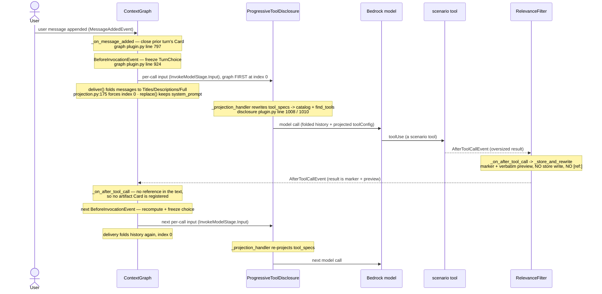

# Combined Stack — how the three community plugins are wired together

Scope: how the community-plugin validation harness (`validation/community-plugin-A-B-D`) assembles
`RelevanceFilter` (A), `ContextGraph` (B/D), and `ProgressiveToolDisclosure` into one agent, and how
those three interact at runtime. Every claim carries a `file.py:LINE`. Source of truth: `runner.py`
and `config.py` in that harness, plus the three plugins' `plugin.py` registration sites for the
ordering contract.

> **Reading the references.** The three packages each ship a file named `plugin.py`. A bare
> `plugin.py:LINE` in this document resolves to the **relevance filter's**
> (`community-plugins/strands-relevance-filter/src/strands_relevance_filter/plugin.py`). References
> into the graph's and the disclosure plugin's `plugin.py` are spelled out with their package path and
> a prose line number, never as `plugin.py:LINE`, so nothing here can be read against the wrong file.

## 1. A pipeline, not a competition

The three plugins act at three different moments of the SDK call cycle, on three different materials.
They are **in series**, and the earlier framing — that the filter and the graph "compete for the same
job of deciding what of a large payload survives" — was wrong:

- **`RelevanceFilter` acts on `AfterToolCallEvent`**, on a payload that has **not entered the history
  yet**. Its job ends at the tool result: decide what of that payload is worth writing down
  (`plugin.py:417`, the `@hook`-decorated `_on_after_tool_call`).
- **`ContextGraph` acts at delivery**, on a history that **already exists**. It never sees a payload;
  it sees whatever was written down, and folds it to Titles / Descriptions / Full Content.
- **`ProgressiveToolDisclosure` acts at delivery too**, but on the other field: it rewrites the call's
  `tool_specs` down to a lean catalog plus a search tool, and never touches `messages`.

So the filter makes the graph's input *smaller*, not *different in kind*. This is stated as the design
argument in `GraphTuning`'s own docstring (`config.py:450` onward).

**The consequence in code.** The harness used to select one of two graph tunings by asking whether the
filter was installed — the line read `tuning = GRAPH_WITH_RELEVANCE if config.relevance else
GRAPH_ALONE`, i.e. the graph inspecting whether some other plugin had trimmed its input first. Both
objects are gone. There is now one `GRAPH_TUNING` (`config.py:518`) used by every arm the graph appears
in, read at `runner.py:391` as the unconditional `tuning = GRAPH_TUNING`, with
`config.extra["_graph_tuning"] = "unified"` recorded beside it at `runner.py:392` so a run's provenance
says which regime produced it.

## 2. The wiring — how each of the five benchmark configurations is built

All plugin construction is in `build_plugins` (`runner.py:325`), which returns `[]` for the baseline
(`plugins: list[Any] = []` at `runner.py:341` with no appends taken). The five default configurations
are defined in `RUN_CONFIGS` (`config.py:614`) with the boolean flags `disclosure` / `relevance` /
`graph` on each `RunConfig` (`config.py:602`), and `build_plugins` reads those flags.

Construction order inside `build_plugins`, and what each plugin is attached with:

- **Relevance filter** — built under `if config.relevance:` (`runner.py:343`). Constructed at
  `runner.py:362` as `RelevanceFilter(...)` with `store=FileStore(str(storage_root))`
  (`runner.py:366`), **`include_retrieval_tool=RELEVANCE_RETRIEVAL_TOOL` (`runner.py:371`)**,
  `max_result_tokens=THRESHOLDS.max_result_tokens` (`runner.py:372`), and a `config={...}` dict
  carrying `reranker` (`runner.py:371`), `relevance_threshold`, `chunk_tokens`, `preview_tokens`.
  Appended at `runner.py:378`. The reranker is `_MeteredDensityReranker` or `_MeteredReranker`,
  selected at `runner.py:351` by `DENSITY_RERANK` (`runner.py:190`).
- **Context graph** — built under `if config.graph:` (`runner.py:383`), **after** the relevance filter
  and **before** disclosure, because disclosure needs the graph as its referenced-source bridge
  (comment at `runner.py:380`–`runner.py:381`). Constructed at `runner.py:397` as `ContextGraph(...)`
  taking every threshold off the one `tuning` — `expand_threshold` (`runner.py:398`) through
  `body_budget` (`runner.py:402`), `reuse_ttl_cycles`, `tags_per_card`, and
  `neighbors_per_candidate=tuning.neighbors_per_candidate` (`runner.py:407`) — plus
  `min_cards=THRESHOLDS.min_cards` (`runner.py:403`), `include_artifact_tool=True`
  (`runner.py:413`), and `matcher=matcher` (`runner.py:414`, the `_MeteredMatcher` built at
  `runner.py:384`). Appended at `runner.py:418`.
- **Progressive tool disclosure** — built under `if config.disclosure:` (`runner.py:420`), appended and
  constructed at `runner.py:421`–`runner.py:422` as `ProgressiveToolDisclosure(...)` with
  `catalog_tokens=THRESHOLDS.catalog_tokens` (`runner.py:421`), `ttl_cycles`, `top_k`, the
  `always_available=[...]` list (`runner.py:433`, composition in §6),
  `referenced_source=_graph_referenced_source(graph) if graph is not None else None` (`runner.py:437`,
  the bridge defined at `runner.py:268`), and
  `catalog_in_system_prompt=THRESHOLDS.catalog_in_system_prompt` (`runner.py:438`).

The five configurations, expressed as which of the above three branches fire:

| Config | disclosure | relevance | graph | Plugins attached (construction order) |
|---|---|---|---|---|
| `baseline` (`config.py:615`) | no | no | no | none (`runner.py:341`) |
| `relevance` (`config.py:626`) | no | yes | no | `RelevanceFilter` |
| `disclosure` (`config.py:636`) | yes | no | no | `ProgressiveToolDisclosure` |
| `graph` (`config.py:646`) | no | no | yes | `ContextGraph` |
| `all` (`config.py:656`) | yes | yes | yes | `RelevanceFilter`, `ContextGraph`, `ProgressiveToolDisclosure` |

Every arm the graph appears in uses the same `GRAPH_TUNING` (`runner.py:391`), so the tuning column the
earlier version of this table carried no longer exists.

(The harness also accepts three leave-one-out arms — `no-disclosure`, `no-relevance`, `no-graph`,
`config.py:669`, `config.py:683`, `config.py:695` — not run by default; `DEFAULT_CONFIGURATIONS` at
`config.py:708`, `CONFIGURATIONS` at `config.py:717`.)

**Conversation-manager requirement.** Every configuration builds its agent with
`conversation_manager=NullConversationManager()` (`runner.py:464`). This is a documented precondition of
the graph, not a preference: `ContextGraph` never mutates `agent.messages`; it only folds the per-call
copy handed to `InvokeModelStage`. Any non-null manager (a sliding window, a summarizer) edits the
**live** message list before the call is assembled, so it can physically drop a message the graph only
meant to fold — and raising that Card's resolution back up then recovers nothing. The plugin enforces
this by warning: `_warn_on_destructive_manager`
(`community-plugins/strands-context-graph/src/strands_context_graph/plugin.py`, defined at line 702,
called from `init_agent` at line 644) emits `_MANAGER_WARNING` (line 161) unless the manager is a
`NullConversationManager`. The runner's module docstring states the same at `runner.py:29`. It is also a
comparison-hygiene reason: it keeps history handling from being a confounding variable across
configurations (comment at `runner.py:462`–`runner.py:463`).

The measurement middleware is registered **after** construction at `runner.py:471`
(`agent._middleware_registry.add_middleware(InvokeModelStage, collector.middleware())`), so it runs last
in the stage and observes the projection the plugins produced rather than the pre-plugin baseline.

## 3. Plugin order is a structural guarantee, not a wiring accident

Two facts, read together, fix the delivery order regardless of what the `plugins=[...]` list says.

**The graph forces itself to index 0.** `Projection.register`
(`community-plugins/strands-context-graph/src/strands_context_graph/projection.py`, defined at line 150)
calls the public `registry.add_middleware(InvokeModelStage.Input, self.deliver)` at line 172, then moves
its own handler to the front of the stage's list with `handlers.insert(0, handlers.pop())` —
`InvokeModelStage` (`projection.py:175`). That one line is the only private read in the registration and
the only part allowed to fail: on failure the delivery stays registered in wiring order and `register`
returns `False`, which the caller turns into the ordering notice (`plugin.py` of the graph, line 650 for
the call, line 741–744 for the warning).

**The SDK builds the chain back to front.** `MiddlewareRegistry.compose`
(`strands/_middleware/registry.py`, line 117 in the pinned SDK) walks the sorted handlers with
`for i in range(len(sorted_handlers) - 1, -1, -1)` — line 129 — wrapping each one around the chain built
so far. The **last** handler becomes the innermost layer and the **first** becomes the outermost. So
index 0 runs *first*.

Therefore, in the `all` configuration:

1. **`ContextGraph` delivery runs first** (index 0) and folds `messages`.
2. **`ProgressiveToolDisclosure._projection_handler` runs next** (appended at
   `strands-progressive-tool-disclosure/.../plugin.py`, line 1008 in `init_agent`) and rewrites
   `tool_specs`.
3. **The catalog block, when it is in the system prompt, is appended last.** The graph's delivery
   returns `await self._fold(replace(context, messages=removed))` (`projection.py:217`), a
   `dataclasses.replace` that substitutes `messages` and carries **every other field over unchanged** —
   `system_prompt` included. With `catalog_in_system_prompt` on, the disclosure handler then appends its
   block via `_append_to_system_prompt(context.system_prompt, block)`
   (`strands-progressive-tool-disclosure/.../plugin.py`, line 879, helper at line 216). Because
   disclosure runs after the graph and the graph preserved the prompt, the catalog lands on an untouched
   system prompt and lands last.

The two delivery-side plugins do not contend for a field: the graph only folds `messages`, disclosure
only rewrites `tool_specs` (its docstring at line 1013 states it is "the only place `tool_specs` is ever
rewritten"). Index 0 is load-bearing for the graph-vs-memory-manager rule
(`_delivery_precedes_memory_fold`, graph `plugin.py` line 284), not for graph-vs-disclosure.

## 4. The hook-order table

Strands orders callbacks for one event by callback `order` (default `0`), then by registration order;
for `After*` events the SDK reverses within a group. None of the three plugins passes a non-default
`order` at its registration site, so within each event the tie-break is **registration order**, which
follows the `plugins=[...]` list order — per §2: `RelevanceFilter`, then `ContextGraph`, then
`ProgressiveToolDisclosure`.

Registration sites:

- `RelevanceFilter`: `AfterToolCallEvent` only, via the `@hook`-decorated `_on_after_tool_call`
  (`plugin.py:417`; event imported at `plugin.py:20`). Its `retrieve_context` `@tool` (`plugin.py:299`)
  is **de-registered in `init_agent`** unless the tool is switched on — see §5.
- `ContextGraph`: four engagement points in `init_agent`
  (`strands-context-graph/.../plugin.py`, line 616): `agent.add_hook(self._on_before_invocation,
  BeforeInvocationEvent)` (line 647), `agent.add_hook(self._on_message_added, MessageAddedEvent)`
  (line 648), `agent.add_hook(self._on_after_tool_call, AfterToolCallEvent)` (line 649), and
  `self._projection.register(agent)` (line 650), which inserts its delivery handler at index zero of
  `InvokeModelStage`. Plus three `@tool` members — `expand_card` (line 1074), `expand_artifact`
  (line 1102), `find_context` (line 1145) — of which `expand_artifact` is dropped when
  `include_artifact_tool` is false (lines 668–672).
- `ProgressiveToolDisclosure`: one `InvokeModelStage.Input` middleware handler
  (`strands-progressive-tool-disclosure/.../plugin.py`, line 1008) plus the `@hook`-decorated
  `_on_before_tool_call` on `BeforeToolCallEvent` (line 1168), and the `find_tools` `@tool` (line 1094).

Events with more than one subscriber in the `all` configuration:

| SDK event | Subscribers, in SDK call order | Load-bearing? | Why |
|---|---|---|---|
| `AfterToolCallEvent` | `RelevanceFilter._on_after_tool_call` and `ContextGraph._on_after_tool_call` — registration order is relevance-first, and `After*` is reversed within the group, so the graph runs first at call time | **No — the graph is engineered not to depend on it.** | The filter rewrites `event.result` into a marker + preview; the graph's `_on_after_tool_call` reads references off that text to register artifact Cards. Running before the rewrite, it sees no reference on the fast path. The graph's own docstring settles it (graph `plugin.py`, line 880): the hook is "the fast path, not the only one", because the rebuild scan reads the same references off the same preview text later, which "makes this hook's registration order against the offloader's irrelevant, costing at most a turn of latency". **In the default configuration the question is moot**: no reference token is emitted at all (§5), and "a result naming no reference registers nothing and logs nothing" (same docstring, line 883). |
| `InvokeModelStage.Input` (middleware, not a hook, but a shared stage) | `ContextGraph` delivery at index 0, then `ProgressiveToolDisclosure._projection_handler`, then the harness's measurement middleware (`runner.py:471`) | **Yes — and guaranteed, not incidental.** | Per §3: index 0 plus back-to-front composition means the graph folds `messages` first, disclosure projects `tool_specs` second, and the catalog block (when in the prompt) is appended last on a `system_prompt` the graph carried over unchanged. |

Events with a single subscriber: `MessageAddedEvent` → `ContextGraph._on_message_added` (graph
`plugin.py`, line 797) only; `BeforeInvocationEvent` → `ContextGraph._on_before_invocation` (line 924)
only; `BeforeToolCallEvent` → `ProgressiveToolDisclosure._on_before_tool_call` only.

## 5. The headline change: in the default configuration there is only one retrieval tool

**`RelevanceFilter.include_retrieval_tool` now defaults to `False`** — the signature default at
`plugin.py:187`, documented at `plugin.py:198`. In `init_agent` the plugin removes its own
auto-discovered tool when the flag is off, matched by `tool_name` rather than by a literal
(`plugin.py:233`–`plugin.py:236`). The harness passes the flag through from the environment:
`include_retrieval_tool=RELEVANCE_RETRIEVAL_TOOL` (`runner.py:368`), where
`RELEVANCE_RETRIEVAL_TOOL = os.environ.get("VALIDATION_RELEVANCE_RETRIEVAL_TOOL") == "1"`
(`runner.py:198`).

With the flag off, three things do not happen — all in `_store_and_rewrite` (`plugin.py:481`):

1. **Nothing is stored.** The store-write loop sits under `if self._include_retrieval_tool:`
   (`plugin.py:509`), so the `FileStore` directory stays empty (the comment at `runner.py:363`–
   `runner.py:365` says exactly this).
2. **No reference token is minted.** `references` stays empty, so the `[ref: …]` / `[refs: …]` suffix
   (`plugin.py:540`) is never appended: the rewritten result is the `[Relevance: …]` marker plus the
   verbatim preview and nothing else (`plugin.py:538`).
3. **No `retrieve_context` tool is registered**, so nothing exists to resolve a reference — which is why
   the plugin suppresses the other two: "a reference would be a promise nothing can keep"
   (`plugin.py:200`).

**So the two-retrieval-tool hazard does not arise in the default configuration.** The README's
accuracy-regression section — two plausible artifact-retrieval tools for one job, over two stores that
cannot read each other, the model calling `expand_artifact` with a reference the filter minted and
getting an unresolvable one back — describes a configuration with the filter's tool **on**. In the
default `all` arm:

- the filter registers no `retrieve_context` and mints no reference;
- the graph keeps its `expand_artifact`, because the old `include_artifact_tool=not config.relevance`
  drop was removed once the collision it guarded against stopped existing — it is now
  `include_artifact_tool=True` (`runner.py:413`);
- so the artifact path is the graph's alone, unambiguously, alongside its `expand_card` and
  `find_context`, which reach back into the conversation's own turns — a different job the filter
  does not do (`_GRAPH_ARTIFACT_TOOL`, `runner.py:244`).

**`VALIDATION_RELEVANCE_RETRIEVAL_TOOL=1` brings the tool and the hazard back**, and that is the mode
**every published figure in the README was measured in** (`runner.py:198` docstring says so: off by
default, "set `VALIDATION_RELEVANCE_RETRIEVAL_TOOL=1` to reproduce the published figures, which were all
measured with the tool present"). Two consequences of turning it on, both documented at
`runner.py:364`–`runner.py:367`: the store fills, references appear in the preview text — and every
recovered chunk becomes a conversation message that is re-sent on every later call, which is what made
the relevance arm cost **more** than no plugin on Haiku 4.5 (+21.6%) while saving on Opus. With the tool
on, the de-duplication at `runner.py:411` is load-bearing again, and the ordering discussion in §4's
`AfterToolCallEvent` row stops being moot.

## 6. Sequence diagram — one full turn, all three plugins, default configuration

Default configuration means `include_retrieval_tool=False` and `catalog_in_system_prompt=False`: one
tool result filtered to a preview with **no reference token**, the graph folding history, the disclosure
plugin projecting `toolConfig` last.



Annotated arrows / handlers:

- user message → `ContextGraph._on_message_added` — graph `plugin.py`, line 797 (write half: close the
  prior turn's Card).
- freeze choice → `ContextGraph._on_before_invocation` — graph `plugin.py`, line 924 (computes and
  freezes the Turn Choice; advances the turn ordinal).
- history fold on the call → the graph's delivery handler, registered at index 0 by
  `self._projection.register(agent)` (graph `plugin.py`, line 650); body is `deliver`
  (`projection.py`, line 185), which returns `replace(context, messages=removed)` folded
  (`projection.py:217`).
- `tool_specs` projection → `ProgressiveToolDisclosure._projection_handler` — disclosure `plugin.py`,
  line 1010, registered on `InvokeModelStage.Input` at line 1008.
- oversized tool result intercepted → `RelevanceFilter._on_after_tool_call` (`plugin.py:417`) →
  `_store_and_rewrite` (`plugin.py:481`): guards, then — with the retrieval tool off — no store write
  (`plugin.py:509`), a `[Relevance: …]` marker plus preview (`plugin.py:538`), no reference suffix
  (`plugin.py:540` skipped), and `event.result` replaced (`plugin.py:555`).
- graph sees the rewritten result → `ContextGraph._on_after_tool_call` (graph `plugin.py`, line 872):
  with no reference in the text it registers nothing, which is the ordinary nothing-offloaded path
  (docstring, line 883).

The premature-call guard (`ProgressiveToolDisclosure._on_before_tool_call`, disclosure `plugin.py`,
line 1168) sits on the `toolUse` edge: if the model calls a tool whose schema was only a catalog entry,
it cancels the call and exposes the schema — one recovered cycle.

`always_available` is what keeps a retrieval tool off that edge — `runner.py:433`–`runner.py:436`:

```python
always_available=[
    *(graph.retrieval_tool_names if graph is not None else ()),   # runner.py:434
    "list_accounts",                                               # runner.py:435
]
```

Two things changed here. `"retrieve_context"` **was removed** — with the filter's tool off by default
there is no such tool to protect, and when the env var turns it back on the plugin's own guidance text
is what names it. And the composition is now the graph's `retrieval_tool_names` (graph `plugin.py`,
property at line 675, returning `expand_card`, `find_context`, and `expand_artifact` only when it was
not de-registered) plus **one literal, `list_accounts`** — which is a **domain tool of the scenario, not
a plugin's** (comment at `runner.py:430`–`runner.py:432`). These names must be always-available because a
catalog entry carries an **empty** `inputSchema`, so a hidden tool needing arguments is called with none
and cancelled by the premature-call guard before it runs (`runner.py:424`–`runner.py:428`; the same
argument from the plugin's side at graph `plugin.py`, lines 678–683).

## 7. The graph's one tuning

`GRAPH_TUNING` (`config.py:518`) is the whole of the graph's configuration, for every arm it appears in.
Values as constructed, each one env-overridable:

| Knob | Value | Reader |
|---|---:|---|
| `expand_threshold` | `0.62` | `config.py:519` |
| `collapse_floor` | `0.45` | `config.py:520` |
| `link_threshold` | `0.50` | `config.py:521` |
| `description_tokens` | `BUDGETS.graph_description_tokens` — `100` large / `250` tight | `config.py:522` |
| `body_budget` | `40_000` | `config.py:523` |
| `max_retrieval_cycles` | `BUDGETS.graph_max_retrieval_cycles` — `8` large / `4` tight | `config.py:524` |
| `reuse_ttl_cycles` | `5` | `config.py:525` |
| `tags_per_card` | `5` | `config.py:526` |
| `neighbors_per_candidate` | `3` | `config.py:527` |

Three of these are new or newly non-literal and cross the stack:

- **`body_budget` is `40_000`, not `None`.** The dataclass field is `int | None` (`config.py:495`) and
  the combined arm used to run it unbounded on the grounds that its peak call sat below any worthwhile
  ceiling. That premise is dead — the same arm on Opus 4.8 now peaks at 75,000–81,000, and the growth is
  message mass (25,598 → 38,507 tokens of messages against a flat 7,963 of tool schema). `None` is not
  "no ceiling" but *the step-down turned off*: `distribute` moves a Card down a rung only when the
  remaining budget cannot fit it, so with `None` every Card at or above `expand_threshold` travels at
  full content however many there are. A Card that does not fit steps down **one** rung, to Description,
  never to Title. Full argument at `config.py:551`–`config.py:565`;
  `VALIDATION_GRAPH_BODY_BUDGET=none` restores the measured configuration.
- **`neighbors_per_candidate` is `3`.** The `similar` edge had no reader before this — measured on the
  write path, stored with its similarity as the weight, propagating no Note, traversed by no retrieval
  path. It answers what candidate ranking cannot: ranking scores each Description against the
  **question**, never against another Description, so two turns covering the same ground in different
  words are invisible to each other (`config.py:505`–`config.py:515`). **Unmeasured** — every published
  figure was produced with the edge unread, so a run above zero is not comparable on tokens;
  `VALIDATION_GRAPH_NEIGHBORS=0` reproduces them.
- **`description_tokens` is no longer a literal.** It comes from the window regime (§9). The `250` that
  was measured for the graph-alone arm was measured on a 200K-window model, i.e. the tight regime, where
  the unified set still gives `250`; on a large-window model that arm now gets `100`.
  `VALIDATION_GRAPH_DESCRIPTION_TOKENS=250` restores it.

What the unification costs in confidence, stated by the `GraphTuning` docstring (`config.py:450`, the
"Unmeasured as a unified set" paragraph at line 474): the set is **unmeasured as a unified set** —
these are the graph's own measured optimum, measured with no
filter beside it. The measurement that justified the old split is itself confounded: applying the
graph-alone values with the filter present lost five materially correct turns, but that run had
`preview_tokens` at 800 against payloads ten to thirty times that, so the Cards were starved by the
**first** cut in the chain (`config.py:468`–`config.py:472`). The preview is 2,000 in the tight regime
now, so the condition that produced the result no longer holds.

## 8. The env-var override surface

Every `VALIDATION_*` variable `config.py` reads (via `_env` / `_env_int` / `_env_float` / `_env_bool`
(`config.py:79`) / `_env_opt_int` (`config.py:96`); the `none`/`off` column applies to `_env_opt_int`,
which accepts `none/null/off/unbounded`):

| Variable | Plugin knob it overrides | Default | Accepts `none`/`off`? | Reader |
|---|---|---|---|---|
| `VALIDATION_ACCOUNT_ID` | account guard (not a plugin knob) | `""` | no | `config.py:111` |
| `VALIDATION_AWS_PROFILE` | AWS profile (not a plugin knob) | `None` | no | `config.py:123` |
| `VALIDATION_AGENT_MODEL_ID` | agent model id (not a plugin knob) | `"us.anthropic.claude-opus-4-8"` | no | `config.py:133` |
| `VALIDATION_MAX_OUTPUT_TOKENS` | model `max_tokens` (not a plugin knob) | `4_096` | no | `config.py:156` |
| `VALIDATION_WINDOW_REGIME` | regime selector (drives §9 budgets) | derived (`tight`/`large`) | no | `config.py:341` |
| `VALIDATION_MAX_RESULT_TOKENS` | RelevanceFilter `max_result_tokens` | `4_000` | no | `config.py:437` |
| `VALIDATION_PREVIEW_TOKENS` | RelevanceFilter `preview_tokens` | `BUDGETS.preview_tokens` (`800`/`2_000`) | no | `config.py:438` |
| `VALIDATION_CHUNK_TOKENS` | RelevanceFilter `chunk_tokens` | `500` | no | `config.py:439` |
| `VALIDATION_RELEVANCE_THRESHOLD` | RelevanceFilter `relevance_threshold` | `0.02` | no | `config.py:440` |
| `VALIDATION_CATALOG_TOKENS` | ProgressiveToolDisclosure `catalog_tokens` | `20` | no | `config.py:441` |
| `VALIDATION_TTL_CYCLES` | ProgressiveToolDisclosure `ttl_cycles` | `5` | no | `config.py:442` |
| `VALIDATION_TOP_K` | ProgressiveToolDisclosure `top_k` | `4` | no | `config.py:443` |
| `VALIDATION_MIN_CARDS` | ContextGraph `min_cards` | `3` | no | `config.py:444` |
| **`VALIDATION_CATALOG_IN_SYSTEM_PROMPT`** | ProgressiveToolDisclosure `catalog_in_system_prompt` | `False` | no (`_env_bool`) | `config.py:445` |
| `VALIDATION_GRAPH_EXPAND` | ContextGraph `expand_threshold` | `0.62` | no | `config.py:519` |
| `VALIDATION_GRAPH_COLLAPSE` | ContextGraph `collapse_floor` | `0.45` | no | `config.py:520` |
| `VALIDATION_GRAPH_LINK` | ContextGraph `link_threshold` | `0.50` | no | `config.py:521` |
| `VALIDATION_GRAPH_DESCRIPTION_TOKENS` | ContextGraph `description_tokens` | `BUDGETS.graph_description_tokens` (`100`/`250`) | no | `config.py:522` |
| **`VALIDATION_GRAPH_BODY_BUDGET`** | ContextGraph `body_budget` | `40_000` | **yes** | `config.py:523` |
| `VALIDATION_GRAPH_MAX_RETRIEVAL_CYCLES` | ContextGraph `max_retrieval_cycles` | `BUDGETS.graph_max_retrieval_cycles` (`8`/`4`) | **yes** | `config.py:524` |
| `VALIDATION_GRAPH_REUSE_TTL` | ContextGraph `reuse_ttl_cycles` | `5` | no | `config.py:525` |
| `VALIDATION_GRAPH_TAGS` | ContextGraph `tags_per_card` | `5` | no | `config.py:526` |
| **`VALIDATION_GRAPH_NEIGHBORS`** | ContextGraph `neighbors_per_candidate` | `3` | no | `config.py:527` |
| `VALIDATION_CACHE` | agent prompt-cache TTL (not a plugin knob) | `None` | no | `config.py:950` |

Two experiment switches are read in `runner.py`, not `config.py`:

| Variable | Plugin knob it overrides | Default | Reader |
|---|---|---|---|
| **`VALIDATION_RELEVANCE_RETRIEVAL_TOOL`** | RelevanceFilter `include_retrieval_tool` — and with it the store write and the reference token (§5) | off | `runner.py:198`, applied at `runner.py:368` |
| `VALIDATION_DENSITY_RERANK` | selects the density-prior reranker subclass | off | `runner.py:190`, applied at `runner.py:351` |

`_env_bool` (`config.py:79`) **raises** on a value that is neither truthy nor falsy rather than falling
back to the default, so a typo in a sweep variable cannot silently measure the default configuration
under the variant's name (`config.py:82`–`config.py:93`). The standard `AWS_REGION` /
`AWS_DEFAULT_REGION` / `AWS_PROFILE` are read at `config.py:123` but are not `VALIDATION_*` variables.

Unlike the old two-tuning arrangement, **every graph knob is now reachable from the environment in every
arm the graph appears in** — there is no longer a literals-only tuning that a sweep cannot touch.

## 9. The window-regime split

`config.py` derives a `LARGE_WINDOW` / `TIGHT_WINDOW` regime from the agent model's context window.

- **Cut-off value.** `TIGHT_WINDOW_CEILING = 300_000` (`config.py:220`). A model whose context window is
  at or below this many tokens is in the tight regime.
- **The derivation.** `CONTEXT_WINDOWS` (`config.py:241`) maps model id → window; `WINDOW_REGIME`
  (`config.py:341`) is `tight` when `CONTEXT_WINDOWS.get(AGENT_MODEL_ID)` (defaulting to
  `TIGHT_WINDOW_CEILING + 1` when the model is absent, `config.py:343`) is `<= TIGHT_WINDOW_CEILING`,
  else `large`. `BUDGETS` (`config.py:354`) is then `TIGHT_WINDOW if WINDOW_REGIME == "tight" else
  LARGE_WINDOW`.
- **The three knobs that differ between regimes** (the `BudgetRegime` fields, `config.py:276`):

  | Knob | `LARGE_WINDOW` (`config.py:296`) | `TIGHT_WINDOW` (`config.py:319`) |
  |---|---|---|
  | `preview_tokens` (→ RelevanceFilter `preview_tokens`) | `800` (`config.py:297`) | `2_000` (`config.py:320`) |
  | `graph_description_tokens` (→ ContextGraph `description_tokens`) | `100` (`config.py:298`) | `250` (`config.py:321`) |
  | `graph_max_retrieval_cycles` (→ ContextGraph `max_retrieval_cycles`) | `8` (`config.py:299`) | `4` (`config.py:322`) |

  They reach the plugins through `THRESHOLDS.preview_tokens` (`config.py:438`) and the `GRAPH_TUNING`
  readers (`config.py:522`, `config.py:524`). Two of the three are now graph knobs of **every** arm, not
  just of a with-relevance tuning — that is the second change the unification made.
- **Why they are held as one set.** All three were reverted together in the Opus 4.8 comparison, so the
  aggregate is attributable and the individual contributions are not (`BudgetRegime` docstring,
  `config.py:280`–`config.py:283`). The two budgets are also in series — payload → preview budget → the
  message → the Card's numeric lines → Description budget (`config.py:335`) — so raising the second
  while the first starves buys nothing.
- **Where the regime is recorded in the run JSON.** `run.py:294` writes
  `"window_regime": config.WINDOW_REGIME` into the run metadata, alongside
  `"sweep_overrides": config.sweep_overrides()` at `run.py:291` and `"context_window"` at `run.py:295`.
- **The override variable.** `VALIDATION_WINDOW_REGIME` (`config.py:341`) — an explicit `tight` or
  `large` overrides the derived value; an empty/unset value falls through to the derivation.
