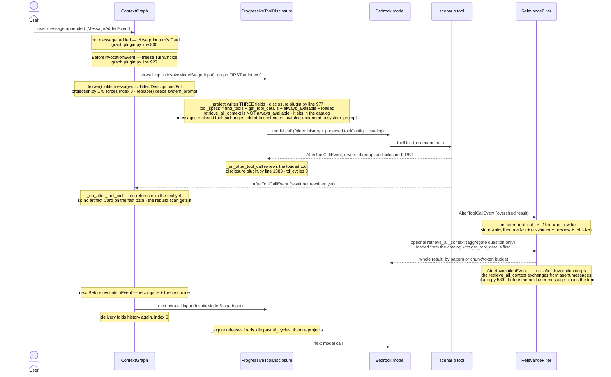

# Combined Stack — how the three community plugins are wired together

Scope: how the community-plugin validation harness (`validation/community-plugin-A-B-D`) assembles
`RelevanceFilter` (A), `ContextGraph` (B/D), and `ProgressiveToolDisclosure` into one agent, and how
those three interact at runtime. Every claim carries a `file.py:LINE`. Source of truth: `runner.py`
and `config.py` in that harness, plus the three plugins' `plugin.py` registration sites for the
ordering contract.

> **Reading the references.** The three packages each ship a file named `plugin.py`. A bare
> `plugin.py:LINE` in this document resolves to the **relevance filter's**
> (`community-plugins/strands-relevance-filter/src/strands_relevance_filter/plugin.py`). References
> into the graph's and the disclosure plugin's `plugin.py` are spelled out with their package path and
> a prose line number, never as `plugin.py:LINE`, so nothing here can be read against the wrong file.

## 1. A pipeline, not a competition

The three plugins act at three different moments of the SDK call cycle, on three different materials.
They are **in series**, and the earlier framing — that the filter and the graph "compete for the same
job of deciding what of a large payload survives" — was wrong:

- **`RelevanceFilter` acts on `AfterToolCallEvent`**, on a payload that has **not entered the history
  yet**: it decides what of that payload is worth writing down (`plugin.py:611`, the
  `@hook`-decorated `_on_after_tool_call`). It has one second engagement point, and it is a clean-up
  rather than a decision about a payload: `_on_after_invocation` (`plugin.py:589`) removes its own
  `retrieve_all_context` exchanges from `agent.messages` once the turn has ended (§5).
- **`ContextGraph` acts at delivery**, on a history that **already exists**. It never sees a payload;
  it sees whatever was written down, and folds it to Titles / Descriptions / Full Content.
- **`ProgressiveToolDisclosure` acts at delivery too**, and writes **three** fields of the call: it cuts
  `tool_specs` down to the tools that are callable on it, moves every other tool to a one-line catalog
  in `system_prompt`, and folds out of `messages` every tool exchange whose tool this call does not
  carry (`_project`, disclosure `plugin.py`, line 977).

So the filter makes the graph's input *smaller*, not *different in kind*. This is stated as the design
argument in `GraphTuning`'s own docstring (`config.py:428` onward).

**The consequence in code.** The harness used to select one of two graph tunings by asking whether the
filter was installed — the line read `tuning = GRAPH_WITH_RELEVANCE if config.relevance else
GRAPH_ALONE`, i.e. the graph inspecting whether some other plugin had trimmed its input first. Both
objects are gone. There is now one `GRAPH_TUNING` (`config.py:496`) used by every arm the graph appears
in, read at `runner.py:338` as the unconditional `tuning = GRAPH_TUNING`, with
`config.extra["_graph_tuning"] = "unified"` recorded beside it at `runner.py:339` so a run's provenance
says which regime produced it.

## 2. The wiring — how each of the five benchmark configurations is built

All plugin construction is in `build_plugins` (`runner.py:274`), which returns `[]` for the baseline
(`plugins: list[Any] = []` at `runner.py:290` with no appends taken). The five default configurations
are defined in `RUN_CONFIGS` (`config.py:604`) with the boolean flags `disclosure` / `relevance` /
`graph` on each `RunConfig` (`config.py:592`), and `build_plugins` reads those flags.

Construction order inside `build_plugins`, and what each plugin is attached with:

- **Relevance filter** — built under `if config.relevance:` (`runner.py:292`). Constructed at
  `runner.py:308` as `RelevanceFilter(...)` with `store=FileStore(str(storage_root))`
  (`runner.py:311`), **`include_retrieval_tool=RELEVANCE_RETRIEVAL_TOOL` (`runner.py:315`)**,
  `max_result_tokens=THRESHOLDS.max_result_tokens` (`runner.py:316`), and a `config={...}` dict
  carrying `reranker` (`runner.py:318`), `relevance_threshold`, `chunk_tokens`, `preview_tokens`.
  Appended at `runner.py:325`. The store root is namespaced by run tag as well as configuration
  (`runner.py:297`), so two runs executing at once cannot serve each other's stored sub-blocks back
  through `retrieve_all_context` (comment at `runner.py:293`–`runner.py:296`). The reranker is
  `_MeteredDensityReranker` or `_MeteredReranker`, selected at `runner.py:300` by `DENSITY_RERANK`
  (`runner.py:192`).
- **Context graph** — built under `if config.graph:` (`runner.py:330`), **after** the relevance filter
  and **before** disclosure. The ordering is load-bearing for one line: disclosure's
  `always_available` list reads `graph.retrieval_tool_names` (`runner.py:380`), so the graph has to be
  bound before the disclosure branch runs (comment at `runner.py:327`–`runner.py:328`). Constructed at
  `runner.py:341` as `ContextGraph(...)` taking every threshold off the one `tuning` —
  `expand_threshold` (`runner.py:342`) through `body_budget` (`runner.py:346`), `reuse_ttl_cycles`,
  `tags_per_card`, and `neighbors_per_candidate=tuning.neighbors_per_candidate` (`runner.py:351`) —
  plus `min_cards=THRESHOLDS.min_cards` (`runner.py:347`), `include_artifact_tool=True`
  (`runner.py:357`), and `matcher=matcher` (`runner.py:358`, the `_MeteredMatcher` built at
  `runner.py:331`). Appended at `runner.py:362`, with
  `config.extra["_graph_artifact_tool_dropped"] = False` recorded at `runner.py:360`.
- **Progressive tool disclosure** — built under `if config.disclosure:` (`runner.py:364`), appended and
  constructed at `runner.py:365`–`runner.py:366` as `ProgressiveToolDisclosure(...)` with
  `catalog_chars=THRESHOLDS.catalog_chars` (`runner.py:367`), `ttl_cycles` (`runner.py:368`, default
  `3` — `config.py:421`), `top_k` (`runner.py:369`) and the `always_available=[...]` list
  (`runner.py:379`, composition in §6). Those four arguments are the whole call: the constructor
  signature (disclosure `plugin.py`, line 1048) carries no `referenced_source` parameter (§3) and no
  placement flag — the catalog always goes to the system prompt.

The five configurations, expressed as which of the above three branches fire:

| Config | disclosure | relevance | graph | Plugins attached (construction order) |
|---|---|---|---|---|
| `baseline` (`config.py:605`) | no | no | no | none (`runner.py:290`) |
| `relevance` (`config.py:616`) | no | yes | no | `RelevanceFilter` |
| `disclosure` (`config.py:626`) | yes | no | no | `ProgressiveToolDisclosure` |
| `graph` (`config.py:636`) | no | no | yes | `ContextGraph` |
| `all` (`config.py:646`) | yes | yes | yes | `RelevanceFilter`, `ContextGraph`, `ProgressiveToolDisclosure` |

Every arm the graph appears in uses the same `GRAPH_TUNING` (`runner.py:338`), so the tuning column the
earlier version of this table carried no longer exists.

(The harness also accepts three leave-one-out arms — `no-disclosure`, `no-relevance`, `no-graph`,
`config.py:657`, `config.py:671`, `config.py:683` — not run by default; `DEFAULT_CONFIGURATIONS` at
`config.py:696`, `CONFIGURATIONS` at `config.py:705`.)

**The baseline alone gets a session manager.** `_session_manager` (`runner.py:389`) returns a
`FileSessionManager` only for the arm with none of the three flags set, and `None` for every plugin
arm: the baseline stands for the agent as it ships, and an agent as it ships persists its messages.
It is attached conditionally in `build_agent` (`runner.py:440`). The session id is fresh on every
agent — configuration plus a random suffix under the run tag — because an existing id is *restored*,
which would start the agent on a history it did not build. `VALIDATION_SESSION=off` removes it from
the baseline too (`SESSION_MANAGER`, `config.py:582`). What lands on disk is the live history, so the
filter's cuts are in it and the graph's folds are not (`config.py:577`–`config.py:579`).

**Conversation-manager requirement.** Every configuration builds its agent with
`conversation_manager=NullConversationManager()` (`runner.py:437`). This is a documented precondition of
the graph, not a preference: `ContextGraph` never mutates `agent.messages`; it only folds the per-call
copy handed to `InvokeModelStage`. Any non-null manager (a sliding window, a summarizer) edits the
**live** message list before the call is assembled, so it can physically drop a message the graph only
meant to fold — and raising that Card's resolution back up then recovers nothing. The plugin enforces
this by warning: `_warn_on_destructive_manager`
(`community-plugins/strands-context-graph/src/strands_context_graph/plugin.py`, defined at line 705,
called from `init_agent` at line 644) emits `_MANAGER_WARNING` (line 161) unless the manager is a
`NullConversationManager`. The runner's module docstring states the same at `runner.py:26`. It is also a
comparison-hygiene reason: it keeps history handling from being a confounding variable across
configurations (comment at `runner.py:435`–`runner.py:436`). The same precondition now covers disclosure
too, for the same reason: its fold also rewrites only the per-call copy.

The measurement middleware is registered **after** construction at `runner.py:445`
(`agent._middleware_registry.add_middleware(InvokeModelStage, collector.middleware())`), so it runs last
in the stage and observes the projection the plugins produced rather than the pre-plugin baseline.

## 3. Plugin order is a structural guarantee, not a wiring accident

Two facts, read together, fix the delivery order regardless of what the `plugins=[...]` list says.

**The graph forces itself to index 0.** `Projection.register`
(`community-plugins/strands-context-graph/src/strands_context_graph/projection.py`, defined at line 150)
calls the public `registry.add_middleware(InvokeModelStage.Input, self.deliver)` at line 172, then moves
its own handler to the front of the stage's list with `handlers.insert(0, handlers.pop())` —
`InvokeModelStage` (`projection.py:175`). That one line is the only private read in the registration and
the only part allowed to fail: on failure the delivery stays registered in wiring order and `register`
returns `False`, which the caller turns into the ordering notice (`plugin.py` of the graph, line 650 for
the registration call, line 651 handing the verdict to `_warn_on_memory_fold_ordering`, line 747 for the
warning itself).

**The SDK builds the chain back to front.** `MiddlewareRegistry.compose`
(`strands/_middleware/registry.py`, line 117 in the pinned SDK) walks the sorted handlers with
`for i in range(len(sorted_handlers) - 1, -1, -1)` — line 129 — wrapping each one around the chain built
so far. The **last** handler becomes the innermost layer and the **first** becomes the outermost. So
index 0 runs *first*.

Therefore, in the `all` configuration:

1. **`ContextGraph` delivery runs first** (index 0) and folds `messages` to Titles / Descriptions / Full
   Content.
2. **`ProgressiveToolDisclosure._projection_handler` runs next** (registered at
   `strands-progressive-tool-disclosure/.../plugin.py`, line 1122 in `init_agent`, body at line 1124)
   and writes `tool_specs`, `system_prompt` and `messages`.
3. **The catalog block is appended last.** The graph's delivery
   returns `await self._fold(replace(context, messages=removed))` (`projection.py:217`), a
   `dataclasses.replace` that substitutes `messages` and carries **every other field over unchanged** —
   `system_prompt` included. The disclosure handler then appends its
   block via `_append_to_system_prompt(context.system_prompt, block)`
   (`strands-progressive-tool-disclosure/.../plugin.py`, called at line 1013, helper at line 308).
   Because disclosure runs after the graph and the graph preserved the prompt, the catalog lands on an
   untouched system prompt and lands last. This is not conditional: the catalog is the only placement,
   so the guarantee carries every projected call rather than one opt-in mode.

**The two delivery-side plugins now both write `messages`, and they compose rather than contend —
because the order above is fixed.** The graph decides *which turns* enter the call and *at what
resolution*. Disclosure then takes the list the graph produced and, inside the **closed** turns of it,
folds every tool exchange whose tool is absent from this call's `tool_specs`: the `toolUse` block is
dropped and its `toolResult` becomes one plain sentence from `_fold_note` (disclosure `plugin.py`,
line 723). Two different cuts on the same field, applied in a fixed order, and the second one carries
its own safety net (`_pairs_intact`, line 788): if the fold ever breaks a `toolUse`/`toolResult`
adjacency the received messages are sent instead and one warning is logged (lines 892–893).
`agent.messages` is untouched by both.

`tool_specs` and `system_prompt` remain disclosure's alone (its `_projection_handler` docstring at
line 1127 states it is "the only place either field is ever rewritten"). Index 0 is load-bearing for the
graph-vs-memory-manager rule (`_delivery_precedes_memory_fold`, graph `plugin.py` line 284), and now
also for the order of the two folds.

## 4. The hook-order table

Strands orders callbacks for one event by callback `order` (default `0`), then by registration order;
for `After*` events the SDK reverses within a group. None of the three plugins passes a non-default
`order` at its registration site, so within each event the tie-break is **registration order**, which
follows the `plugins=[...]` list order — per §2: `RelevanceFilter`, then `ContextGraph`, then
`ProgressiveToolDisclosure`.

Registration sites:

- `RelevanceFilter`: **two** `@hook`-decorated methods — `_on_after_tool_call` on `AfterToolCallEvent`
  (`plugin.py:611`) and `_on_after_invocation` on `AfterInvocationEvent` (`plugin.py:589`); both events
  imported at `plugin.py:22`. Plus one `@tool` member, `retrieve_all_context` (`plugin.py:403`,
  decorator at `plugin.py:402`), which is registered by default and **de-registered in `init_agent`**
  (`plugin.py:321`) only when the flag is off — see §5.
- `ContextGraph`: four engagement points in `init_agent`
  (`strands-context-graph/.../plugin.py`, line 616): `agent.add_hook(self._on_before_invocation,
  BeforeInvocationEvent)` (line 647), `agent.add_hook(self._on_message_added, MessageAddedEvent)`
  (line 648), `agent.add_hook(self._on_after_tool_call, AfterToolCallEvent)` (line 649), and
  `self._projection.register(agent)` (line 650), which inserts its delivery handler at index zero of
  `InvokeModelStage`. Plus three `@tool` members — `expand_card` (line 1077), `expand_artifact`
  (line 1105), `find_context` (line 1148) — of which `expand_artifact` is dropped when
  `include_artifact_tool` is false (`_drop_artifact_tool_if_excluded`, line 653, called at line 645,
  guard at line 668).
- `ProgressiveToolDisclosure`: one `InvokeModelStage.Input` middleware handler
  (`strands-progressive-tool-disclosure/.../plugin.py`, registered at line 1122) plus **two**
  `@hook`-decorated methods — `_on_before_tool_call` on `BeforeToolCallEvent` (line 1347) and
  `_on_after_tool_call` on `AfterToolCallEvent` (line 1383) — and two `@tool` members, `find_tools`
  (line 1242) and `get_tool_details` (line 1302).

Events with more than one subscriber in the `all` configuration:

| SDK event | Subscribers, in SDK call order | Load-bearing? | Why |
|---|---|---|---|
| `AfterToolCallEvent` | three: registration order is relevance, graph, disclosure, and `After*` is reversed within the group, so at call time it is `ProgressiveToolDisclosure._on_after_tool_call`, then `ContextGraph._on_after_tool_call`, then `RelevanceFilter._on_after_tool_call` | **No.** | Disclosure's hook only renews the TTL of a tool that actually ran, writing nothing but its own per-agent exposure map (line 1383), so its position in the group cannot matter. For the other two: the filter rewrites `event.result` into a marker, a disclaimer, a preview and a reference token, and the graph's `_on_after_tool_call` reads references off that text to register artifact Cards. Running before the rewrite, the graph sees no reference on the fast path. The graph's own docstring settles it (graph `plugin.py`, line 883): the hook is "the fast path, not the only one", because the rebuild scan reads the same references off the same preview text later, which "makes this hook's registration order against the offloader's irrelevant, costing at most a turn of latency". A result naming no reference — the filter off, or a result under threshold — "registers nothing and logs nothing" (same docstring, line 886). |
| `InvokeModelStage.Input` (middleware, not a hook, but a shared stage) | `ContextGraph` delivery at index 0, then `ProgressiveToolDisclosure._projection_handler`, then the harness's measurement middleware (`runner.py:445`) | **Yes — and guaranteed, not incidental.** | Per §3: index 0 plus back-to-front composition means the graph folds `messages` first, disclosure re-folds the closed turns of that same list and projects `tool_specs` second, and the catalog block is appended last on a `system_prompt` the graph carried over unchanged. |

Events with a single subscriber: `MessageAddedEvent` → `ContextGraph._on_message_added` (graph
`plugin.py`, line 800) only; `BeforeInvocationEvent` → `ContextGraph._on_before_invocation` (line 927)
only; `BeforeToolCallEvent` → `ProgressiveToolDisclosure._on_before_tool_call` only;
`AfterInvocationEvent` → `RelevanceFilter._on_after_invocation` (`plugin.py:589`) only.

## 5. The two retrieval tools, and what keeps them from being one job

**`RelevanceFilter.include_retrieval_tool` defaults to `True`** — the signature default at
`plugin.py:286`, documented in the class docstring at `plugin.py:256` and in `__init__`'s at
`plugin.py:297`. So in the default configuration the filter **does** store the raw sub-blocks and
**does** mint a reference token, and `retrieve_all_context` is registered alongside the graph's own
three tools. The harness passes the flag through from the environment:
`include_retrieval_tool=RELEVANCE_RETRIEVAL_TOOL` (`runner.py:315`), where
`RELEVANCE_RETRIEVAL_TOOL = os.environ.get("VALIDATION_RELEVANCE_RETRIEVAL_TOOL", "1") != "0"`
(`runner.py:200`).

Three things make that safe, and none of them is "only one tool exists".

**1. The tool was narrowed and renamed.** `retrieve_context` is gone; `retrieve_all_context`
(`plugin.py:403`) loads the **whole** of one filtered result, for the one question an excerpt cannot
answer — a maximum, a total, a count, a ranking across every row. Its docstring says so in the
imperative, and the filter's own disclaimer says the same where the model reads the excerpt: `_disclaimer`
(`plugin.py:95`) states that an aggregate cannot be computed from the excerpt (`plugin.py:115`–
`plugin.py:120`), then names the call, the reference, and the budgets that reach the rest of the result —
a `pattern` for the rows to aggregate, or `max_chunks`/`max_tokens` large enough for all of it
(`plugin.py:124`–`plugin.py:130`). With no reference to hand out it says only that the result was
filtered (`plugin.py:121`–`plugin.py:122`). That disclaimer sits between the `[Relevance: tool result,
~N tokens]` marker and the preview: the rewritten result is marker, disclaimer, preview
(`plugin.py:751`), then the `[ref: …]` / `[refs: …]` suffix when there is one (`plugin.py:752`–
`plugin.py:754`), and `event.result` is replaced with that (`plugin.py:768`). `max_chunks` and
`max_tokens` are parameters of the tool itself (`plugin.py:410`–`plugin.py:411`), which is what lets one
call ask for the whole result instead of paging.

**2. A retrieval does not ride along.** `_on_after_invocation` (`plugin.py:589`) removes this plugin's
own `retrieve_all_context` exchanges from `agent.messages` as the invocation ends — `_drop_tool_exchanges`
(`plugin.py:132`) drops the `toolUse` and its `toolResult` as a pair, whole messages when a message
holds nothing else, dropping `reasoningContent` from any assistant message it rewrites. The removal
happens **before the next user message closes the turn**, so a context graph deriving that turn's Card
never sees the retrieved content (docstring, `plugin.py:592`–`plugin.py:597`). What stays is the excerpt
with its reference — so the content can be retrieved again later — and the answer, which carries the
figures. The hook is a no-op when the tool is off (`plugin.py:602`). The harness names the cost this
removes at `runner.py:312`–`runner.py:314`: every retrieval re-sent on every later call, which once
made this arm dearer than no plugin on Haiku 4.5 (+21.6%).

**3. It is deliberately kept out of `always_available`.** In the disclosure arm the tool is a catalog
name like any other, reached through `get_tool_details`, so its schema is off every call until an
aggregate question comes up (`runner.py:370`–`runner.py:374`). The graph's own
`retrieval_tool_names` property states the same exclusion from the other side (graph `plugin.py`,
lines 691–692).

**So the graph keeps its `expand_artifact`.** The old `include_artifact_tool=not config.relevance` drop
was removed once the collision it guarded against stopped existing — it is now
`include_artifact_tool=True` (`runner.py:357`), recorded as not dropped at `runner.py:360`. That drop
was measured, not assumed, and `_GRAPH_ARTIFACT_TOOL` (`runner.py:245`) is kept as the record of it: on
the first 60-turn run the `all` configuration was the only one that could not answer A5, and the model
said why — it had called `expand_artifact` with a reference the relevance filter had minted, over a
store `expand_artifact` cannot read. What changed is not the store topology but the presentation: the
filter's tool now names a different job in its own description and in the disclaimer that points at it,
and it is loaded from the catalog rather than sitting in `tool_specs` beside `expand_artifact`. Whether
the model still confuses the two is measured by the `all` arm, not assumed (`runner.py:245` docstring).
The graph's `expand_card` and `find_context` were never part of this: they reach back into the
conversation's own turns, a different job again.

**`VALIDATION_RELEVANCE_RETRIEVAL_TOOL=0` measures the excerpt alone.** Filtering itself — chunk,
rerank, preview, rewrite in `_filter_and_rewrite` (`plugin.py:714`) — runs unchanged, because storage is
optional. Three things then do not happen:

1. **Nothing is stored.** `_store_raw` (`plugin.py:675`) returns early when the tool is off (guard at
   `plugin.py:689`), so the `FileStore` directory stays empty.
2. **No reference token is minted.** `references` stays empty, so the `[ref: …]` suffix
   (`plugin.py:752`–`plugin.py:754`) is never appended and the disclaimer takes its
   nothing-to-retrieve branch (`plugin.py:121`–`plugin.py:122`).
3. **No `retrieve_all_context` tool is registered.** `init_agent` drops the auto-discovered tool,
   matched by `tool_name` rather than by a literal (`plugin.py:337`–`plugin.py:340`) — which is why the
   plugin suppresses the other two: "a reference would be a promise nothing can keep"
   (`plugin.py:298`–`plugin.py:299`).

In that mode the `AfterToolCallEvent` ordering discussion in §4 is moot, since no reference token is
emitted at all for the graph's hook to read.

## 6. Sequence diagram — one full turn, all three plugins, default configuration

Default configuration means `include_retrieval_tool=True`: one tool result filtered to a marker, a
disclaimer and a preview **with** a reference token, the graph folding history, the disclosure plugin
projecting `toolConfig`, folding the closed turns' tool exchanges and appending its catalog to the
system prompt — and `retrieve_all_context` reachable only from that catalog.



Annotated arrows / handlers:

- user message → `ContextGraph._on_message_added` — graph `plugin.py`, line 800 (write half: close the
  prior turn's Card).
- freeze choice → `ContextGraph._on_before_invocation` — graph `plugin.py`, line 927 (computes and
  freezes the Turn Choice; advances the turn ordinal).
- history fold on the call → the graph's delivery handler, registered at index 0 by
  `self._projection.register(agent)` (graph `plugin.py`, line 650); body is `deliver`
  (`projection.py`, line 185), which returns `replace(context, messages=removed)` folded
  (`projection.py:217`).
- the three-field projection → `ProgressiveToolDisclosure._projection_handler` — disclosure
  `plugin.py`, line 1124, registered on `InvokeModelStage.Input` at line 1122. It expires stale loads
  (`_expire`, line 607, called at line 1147), calls `_project` (line 977), and records the names the
  projection carried in `state.projected` (line 1157) for the guard below.
- oversized tool result intercepted → `RelevanceFilter._on_after_tool_call` (`plugin.py:611`) →
  `_filter_and_rewrite` (`plugin.py:714`): guards, then the store write (`_store_raw`, `plugin.py:675`),
  the `[Relevance: …]` marker with the disclaimer and preview (`plugin.py:751`), the reference suffix
  (`plugin.py:752`–`plugin.py:754`), and `event.result` replaced (`plugin.py:768`). The chunk ranking is
  kept per reference (`plugin.py:747`–`plugin.py:748`) so a later `max_chunks` read hands back chunks in
  relevance order without scoring the text again (`_read_chunks`, `plugin.py:520`).
- graph sees the unrewritten result → `ContextGraph._on_after_tool_call` (graph `plugin.py`, line 875):
  it runs before the filter rewrites, so there is no reference in the text for it yet and the rebuild
  scan picks it up a turn later (docstring, line 883).
- turn ends → `RelevanceFilter._on_after_invocation` (`plugin.py:589`): the retrieval exchanges leave
  `agent.messages` via `_drop_tool_exchanges` (`plugin.py:132`).

**What `tool_specs` carries, and for how long.** The projection is the union of three blocks, in a fixed
order and each name at most once — the two plugin tools, `always_available`, and the tools currently
loaded (`_compose_projection`, disclosure `plugin.py`, line 934). **The tools the history merely
mentions are not among them.** Bedrock Converse accepts a history `toolUse` whose tool is absent from
`toolConfig` — probed on Claude Haiku 4.5, Claude Opus 4.8, GLM 4.7 Flash and Qwen3 Next (module
docstring, lines 14–16) — so retaining them bought nothing and made `tool_specs` grow with every tool
the conversation had ever touched (line 947). The `referenced` block, its two helpers and the
`referenced_source` constructor parameter are gone, and with them the harness's
`_graph_referenced_source` bridge; the runner's module docstring records the removal at
`runner.py:20`–`runner.py:24`.

A load lives `ttl_cycles` cycles without use — `_DEFAULT_TTL_CYCLES = 3` in the plugin (line 89), and
`3` from the harness too (`config.py:421`). `get_tool_details` loads (line 1302, `_renew` at line 630
called from line 1336), `_on_after_tool_call` renews on every call that **actually ran** — a cancelled
call renews nothing (line 1383) — and `_expire` drops anything idle for more than `ttl_cycles`
(line 607). The `BeforeToolCall` hook renews nothing at all any more.

**How the model is told to use the catalog.** `_CATALOG_PROMPT_HEADER` (line 162, rendered by
`_catalog_prompt_block` at line 187) states the rule where the names are read: the listed tools are NOT
in the tool list and MUST NOT be called directly, a direct call is rejected without running, and then
three numbered steps — call `get_tool_details` with the names as a list, call them on the next call, and
repeat step 1 if a call is rejected because the tool was unloaded. `find_tools` is named as the fallback
for a need no listed name fits. The loading tool's own result header repeats the expiry
(`_DETAILS_LOADED_HEADER`, line 100).

**The premature-call guard** (`ProgressiveToolDisclosure._on_before_tool_call`, disclosure `plugin.py`,
line 1347) sits on the `toolUse` edge. It skips a name the registry does not have, the two plugin tools
and anything in `always_available`; it allows a name in `state.projected`, the names the **last**
projection actually carried (read at line 1372), so a tool that expired between the projection and the
call is never mistaken for a guess. Otherwise, if the tool has a required parameter
(`_requires_parameters`, line 335) the call is cancelled with `_PREMATURE_CALL_MESSAGE` (line 128,
applied at line 1379), which points the model at `get_tool_details`. It does **not** load the tool on
the model's behalf: the old "they are available now — call it again" recovery taught the model that
calling a catalog name directly works, which is the one shortcut the catalog rule forbids.

`always_available` is what keeps a retrieval tool off that edge — `runner.py:379`–`runner.py:382`:

```python
always_available=[
    *(graph.retrieval_tool_names if graph is not None else ()),   # runner.py:380
    "list_accounts",                                               # runner.py:381
]
```

Two things about this composition. `"retrieve_context"` **was removed** and its successor
`retrieve_all_context` was **not** put back: it is for the rare question that needs a whole result, so
it stays in the catalog and costs a load only then (`runner.py:370`–`runner.py:374`, and the graph's own
`retrieval_tool_names` docstring at lines 691–692). And what remains is derived, not literal — the
graph's `retrieval_tool_names` (graph `plugin.py`, property at line 675, returning `expand_card`,
`find_context`, and `expand_artifact` only when it was not de-registered) plus **one literal,
`list_accounts`** — which is a **domain tool of the scenario, not a plugin's** (comment at
`runner.py:376`–`runner.py:378`). The graph's three must be always-available because a tool that is only
in the catalog is not in `tool_specs` at all and has to be loaded with `get_tool_details` before it can
be called, so a retrieval tool left to discovery would cost a cycle learning what the folded-context
guidance already told the model to do (`runner.py:370`–`runner.py:372`; the same argument from the
plugin's side at graph `plugin.py`, lines 678–683).

**Why the fold is shaped the way it is.** `_fold_tool_exchanges` (disclosure `plugin.py`, line 807) folds
**only closed turns**: `_current_turn_start` (line 743) is the last user message carrying no
`toolResult`, and the first message plus everything from that boundary on — the turn in flight, tool
loop included — pass through as the very same objects. Three provider constraints dictate the rest. A
`toolUse` with real arguments sitting next to a success is a template the model repeats once the tool has
left `tool_specs`, so the `toolUse` goes and the `toolResult` becomes `_fold_note`'s sentence — `The tool
X was called and the result was: Y`, or `... failed with: Y` on an error (line 723, outcome chosen at
line 739) — with image and document parts kept. Reasoning models reject a modified latest assistant
message, which is why the turn in flight is untouched and why a rewritten or merged assistant message
loses its `reasoningContent` (`_without_reasoning`, line 764). And Converse rejects text placed before
the `toolResult` answering the previous assistant message, so user messages put their `toolResult`
blocks first (`_results_first`, line 772 — both applied by `_tidy` at line 782, which picks by role at
line 784). The plugin's own `find_tools` / `get_tool_details` exchanges are dropped outright, with no
sentence (line 816). Emptied messages are dropped and same-role neighbours merged; if the folded span
ends with a user message it is joined into the opening user message of the turn in flight (line 886–889).

## 7. The graph's one tuning

`GRAPH_TUNING` (`config.py:496`) is the whole of the graph's configuration, for every arm it appears in.
Values as constructed, each one env-overridable:

| Knob | Value | Reader |
|---|---:|---|
| `expand_threshold` | `0.62` | `config.py:497` |
| `collapse_floor` | `0.45` | `config.py:498` |
| `link_threshold` | `0.50` | `config.py:499` |
| `description_tokens` | `BUDGETS.graph_description_tokens` — `100` large / `250` tight | `config.py:500` |
| `body_budget` | `40_000` | `config.py:501` |
| `max_retrieval_cycles` | `BUDGETS.graph_max_retrieval_cycles` — `8` large / `4` tight | `config.py:502` |
| `reuse_ttl_cycles` | `5` | `config.py:503` |
| `tags_per_card` | `5` | `config.py:504` |
| `neighbors_per_candidate` | `0` | `config.py:505` |

Three of these are new or newly non-literal and cross the stack:

- **`body_budget` is `40_000`, not `None`.** The dataclass field is `int | None` (`config.py:473`) and
  the combined arm used to run it unbounded on the grounds that its peak call sat below any worthwhile
  ceiling. That premise is dead — the same arm on Opus 4.8 now peaks at 75,000–81,000, and the growth is
  message mass (25,598 → 38,507 tokens of messages against a flat 7,963 of tool schema). `None` is not
  "no ceiling" but *the step-down turned off*: `distribute` moves a Card down a rung only when the
  remaining budget cannot fit it, so with `None` every Card at or above `expand_threshold` travels at
  full content however many there are. A Card that does not fit steps down **one** rung, to Description,
  never to Title. Full argument at `config.py:529`–`config.py:543`;
  `VALIDATION_GRAPH_BODY_BUDGET=none` restores the measured configuration.
- **`neighbors_per_candidate` is `0`, and the knob is the news rather than the value.** The `similar`
  edge has no reader at that default — it is measured on the write path, stored with its similarity as
  the weight, omitted from `_STRUCTURAL_WEIGHTS` so it propagates no Note, and traversed by no retrieval
  path. Read, it answers what candidate ranking cannot: ranking scores each Description against the
  **question**, never against another Description, so two turns covering the same ground in different
  words are invisible to each other (`config.py:483`–`config.py:493`). It stays at `0` because every
  published figure was produced with the edge unread and a run above zero is not comparable on tokens;
  `VALIDATION_GRAPH_NEIGHBORS=3` turns it on for a sweep.
- **`description_tokens` is no longer a literal.** It comes from the window regime (§9). The `250` that
  was measured for the graph-alone arm was measured on a 200K-window model, i.e. the tight regime, where
  the unified set still gives `250`; on a large-window model that arm now gets `100`.
  `VALIDATION_GRAPH_DESCRIPTION_TOKENS=250` restores it.

What the unification costs in confidence, stated by the `GraphTuning` docstring (`config.py:428`, the
"Unmeasured as a unified set" paragraph at line 452): the set is **unmeasured as a unified set** —
these are the graph's own measured optimum, measured with no
filter beside it. The measurement that justified the old split is itself confounded: applying the
graph-alone values with the filter present lost five materially correct turns, but that run had
`preview_tokens` at 800 against payloads ten to thirty times that, so the Cards were starved by the
**first** cut in the chain (`config.py:446`–`config.py:450`). The preview is 2,000 in the tight regime
now, so the condition that produced the result no longer holds.

## 8. The env-var override surface

Every `VALIDATION_*` variable `config.py` reads (via `_env` (`config.py:60`) / `_env_int` / `_env_float`
/ `_env_bool` (`config.py:79`) / `_env_opt_int` (`config.py:96`); the `none`/`off` column applies to
`_env_opt_int`, which accepts `none/null/off/unbounded`):

| Variable | Plugin knob it overrides | Default | Accepts `none`/`off`? | Reader |
|---|---|---|---|---|
| `VALIDATION_ACCOUNT_ID` | account guard (not a plugin knob) | `""` | no | `config.py:111` |
| `VALIDATION_AWS_PROFILE` | AWS profile (not a plugin knob) | `None` | no | `config.py:123` |
| `VALIDATION_AGENT_MODEL_ID` | agent model id (not a plugin knob) | `"us.anthropic.claude-opus-4-8"` | no | `config.py:133` |
| `VALIDATION_MAX_OUTPUT_TOKENS` | model `max_tokens` (not a plugin knob) | `4_096` | no | `config.py:156` |
| `VALIDATION_WINDOW_REGIME` | regime selector (drives §9 budgets) | derived (`tight`/`large`) | no | `config.py:341` |
| `VALIDATION_MAX_RESULT_TOKENS` | RelevanceFilter `max_result_tokens` | `4_000` | no | `config.py:416` |
| `VALIDATION_PREVIEW_TOKENS` | RelevanceFilter `preview_tokens` | `BUDGETS.preview_tokens` (`800`/`2_000`) | no | `config.py:417` |
| `VALIDATION_CHUNK_TOKENS` | RelevanceFilter `chunk_tokens` | `500` | no | `config.py:418` |
| `VALIDATION_RELEVANCE_THRESHOLD` | RelevanceFilter `relevance_threshold` | `0.02` | no | `config.py:419` |
| `VALIDATION_CATALOG_CHARS` | ProgressiveToolDisclosure `catalog_chars` | `80` | no | `config.py:420` |
| **`VALIDATION_TTL_CYCLES`** | ProgressiveToolDisclosure `ttl_cycles` | `3` | no | `config.py:421` |
| `VALIDATION_TOP_K` | ProgressiveToolDisclosure `top_k` | `4` | no | `config.py:422` |
| `VALIDATION_MIN_CARDS` | ContextGraph `min_cards` | `3` | no | `config.py:423` |
| `VALIDATION_GRAPH_EXPAND` | ContextGraph `expand_threshold` | `0.62` | no | `config.py:497` |
| `VALIDATION_GRAPH_COLLAPSE` | ContextGraph `collapse_floor` | `0.45` | no | `config.py:498` |
| `VALIDATION_GRAPH_LINK` | ContextGraph `link_threshold` | `0.50` | no | `config.py:499` |
| `VALIDATION_GRAPH_DESCRIPTION_TOKENS` | ContextGraph `description_tokens` | `BUDGETS.graph_description_tokens` (`100`/`250`) | no | `config.py:500` |
| **`VALIDATION_GRAPH_BODY_BUDGET`** | ContextGraph `body_budget` | `40_000` | **yes** | `config.py:501` |
| `VALIDATION_GRAPH_MAX_RETRIEVAL_CYCLES` | ContextGraph `max_retrieval_cycles` | `BUDGETS.graph_max_retrieval_cycles` (`8`/`4`) | **yes** | `config.py:502` |
| `VALIDATION_GRAPH_REUSE_TTL` | ContextGraph `reuse_ttl_cycles` | `5` | no | `config.py:503` |
| `VALIDATION_GRAPH_TAGS` | ContextGraph `tags_per_card` | `5` | no | `config.py:504` |
| **`VALIDATION_GRAPH_NEIGHBORS`** | ContextGraph `neighbors_per_candidate` | `0` | no | `config.py:505` |
| `VALIDATION_SESSION` | baseline `FileSessionManager` (not a plugin knob) | `file` | no | `config.py:582` |
| `VALIDATION_CACHE` | agent prompt-cache TTL (not a plugin knob) | `None` | no | `config.py:938` |

Two experiment switches are read in `runner.py`, not `config.py`:

| Variable | Plugin knob it overrides | Default | Reader |
|---|---|---|---|
| **`VALIDATION_RELEVANCE_RETRIEVAL_TOOL`** | RelevanceFilter `include_retrieval_tool` — and with it the store write and the reference token (§5) | **on**; `=0` turns it off | `runner.py:200`, applied at `runner.py:315` |
| `VALIDATION_DENSITY_RERANK` | selects the density-prior reranker subclass | off | `runner.py:192`, applied at `runner.py:300` |

`_env_bool` (`config.py:79`) **raises** on a value that is neither truthy nor falsy rather than falling
back to the default, so a typo in a sweep variable cannot silently measure the default configuration
under the variant's name (`config.py:85`–`config.py:93`). `SESSION_MANAGER` raises on the same grounds
for a value other than `file`/`off` (`config.py:585`–`config.py:586`). The standard `AWS_REGION` /
`AWS_DEFAULT_REGION` are read at `config.py:120` and `AWS_PROFILE` at `config.py:123`, but none of them
is a `VALIDATION_*` variable. Every override a process actually read is recorded for the run through
`sweep_overrides()` (`config.py:106`).

Unlike the old two-tuning arrangement, **every graph knob is now reachable from the environment in every
arm the graph appears in** — there is no longer a literals-only tuning that a sweep cannot touch.

## 9. The window-regime split

`config.py` derives a `LARGE_WINDOW` / `TIGHT_WINDOW` regime from the agent model's context window.

- **Cut-off value.** `TIGHT_WINDOW_CEILING = 300_000` (`config.py:220`). A model whose context window is
  at or below this many tokens is in the tight regime.
- **The derivation.** `CONTEXT_WINDOWS` (`config.py:241`) maps model id → window; `WINDOW_REGIME`
  (`config.py:341`) is `tight` when `CONTEXT_WINDOWS.get(AGENT_MODEL_ID)` (defaulting to
  `TIGHT_WINDOW_CEILING + 1` when the model is absent, `config.py:343`) is `<= TIGHT_WINDOW_CEILING`,
  else `large`. `BUDGETS` (`config.py:354`) is then `TIGHT_WINDOW if WINDOW_REGIME == "tight" else
  LARGE_WINDOW`.
- **The three knobs that differ between regimes** (the `BudgetRegime` fields, `config.py:277`):

  | Knob | `LARGE_WINDOW` (`config.py:296`) | `TIGHT_WINDOW` (`config.py:319`) |
  |---|---|---|
  | `preview_tokens` (→ RelevanceFilter `preview_tokens`) | `800` (`config.py:297`) | `2_000` (`config.py:320`) |
  | `graph_description_tokens` (→ ContextGraph `description_tokens`) | `100` (`config.py:298`) | `250` (`config.py:321`) |
  | `graph_max_retrieval_cycles` (→ ContextGraph `max_retrieval_cycles`) | `8` (`config.py:299`) | `4` (`config.py:322`) |

  They reach the plugins through `THRESHOLDS.preview_tokens` (`config.py:417`) and the `GRAPH_TUNING`
  readers (`config.py:500`, `config.py:502`). Two of the three are now graph knobs of **every** arm, not
  just of a with-relevance tuning — that is the second change the unification made.
- **Why they are held as one set.** All three were reverted together in the Opus 4.8 comparison, so the
  aggregate is attributable and the individual contributions are not (`BudgetRegime` docstring,
  `config.py:280`–`config.py:283`). The two budgets are also in series — payload → preview budget → the
  message → the Card's numeric lines → Description budget (`config.py:335`) — so raising the second
  while the first starves buys nothing.
- **Where the regime is recorded in the run JSON.** `run.py:295` writes
  `"window_regime": config.WINDOW_REGIME` into the run metadata, alongside
  `"sweep_overrides": config.sweep_overrides()` at `run.py:292` and `"context_window"` at `run.py:296`.
- **The override variable.** `VALIDATION_WINDOW_REGIME` (`config.py:341`) — an explicit `tight` or
  `large` overrides the derived value; an empty/unset value falls through to the derivation.
