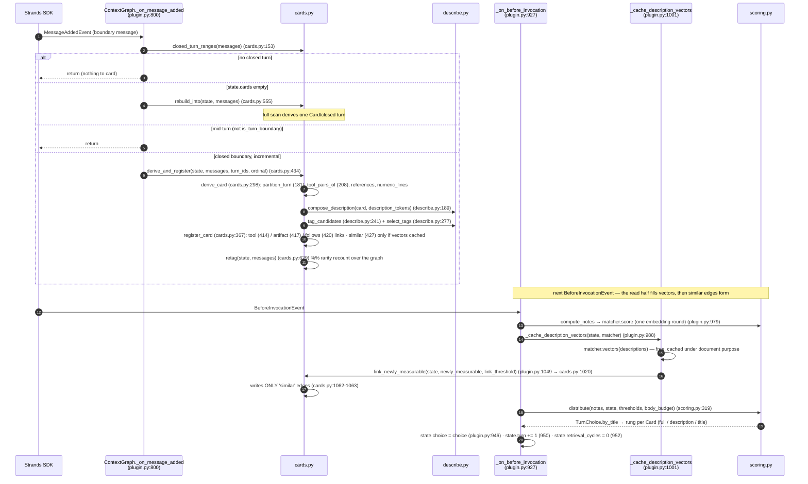
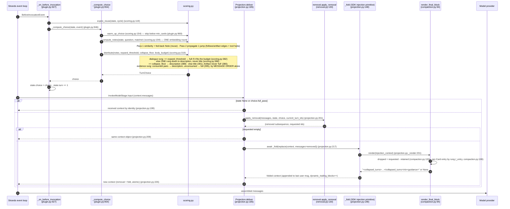
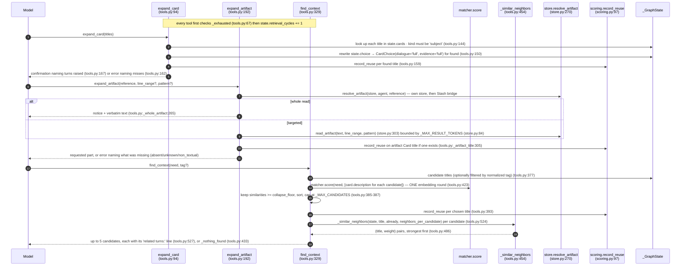
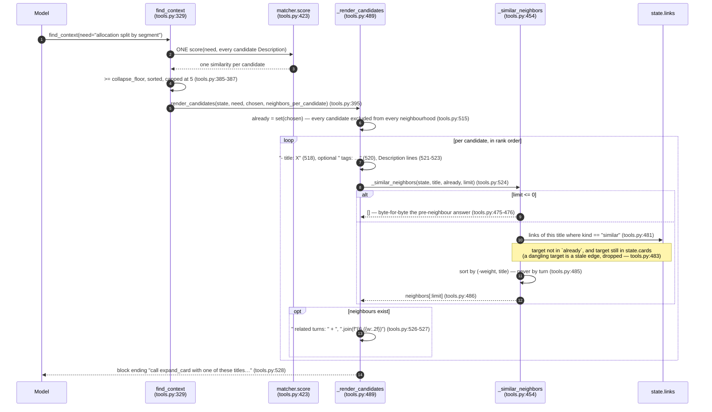

# Sequence Design — Practice D: `strands-context-graph`

Authority: `community-plugins/strands-context-graph/src/strands_context_graph/`. Every claim below carries a `file.py:LINE`. Literal strings are quoted from source. Where a thing does not exist, it is stated as not existing rather than invented.

---

## 1. What the plugin does, mechanically

`ContextGraph` (`plugin.py:446`) is a Strands `Plugin` that projects an agent's short-term memory as a graph of **Cards** — one Card per *closed* turn (`plugin.py:800`, `cards.py:closed_turn_ranges:153`), each Card holding **addresses** (durable `tracking_id`s and a reference key), never message content (`state.py:Card:64`). It never mutates `agent.messages`; instead it registers one `InvokeModelStage.Input` delivery handler plus three hooks (`plugin.py:init_agent:616`), and each turn it computes a per-Card **Note** from the cosine similarity between the turn's question and each Card's Description (`scoring.py:compute_notes:194`), propagates that Note exactly one jump along the structural links (`scoring.py:_propagate:234`), and from the resulting Note picks a **Resolution** per Card on a three-rung ladder — Full Content / Description / Title (`scoring.py:distribute:319`). At delivery it *removes* the collapsed messages from the call's own message list and *folds* a `<collapsed_turns>` block describing what left into the last user message (`projection.py:deliver:185`, `compaction.py:render_final_block:94`). The Resolution steps down only when the body budget runs out, never as a verdict (`scoring.py:distribute:319`, budget branch `scoring.py:385`). Three retrieval tools (`expand_card`, `expand_artifact`, `find_context`) let the model reach back into a Card the choice collapsed (`plugin.py:1077`, `plugin.py:1105`, `plugin.py:1148`).

**Two mechanics are documented below as first-class, not footnotes:**

1. `find_context` traverses the `similar` edge. `_similar_neighbors` (`tools.py:454`) is the **first and only reader of that edge anywhere in the plugin** — before it, the edge was measured on the write path, stored with its similarity as the weight, propagated no Note, and was walked by nothing at all. Each candidate carries its strongest neighbours as a `related turns:` line whenever `neighbors_per_candidate > 0` (`tools.py:527`). See §3 and §6.2.
2. The harness runs `body_budget` at `40_000` instead of `None`, set through `VALIDATION_GRAPH_BODY_BUDGET` (`config.py:501`), which is what makes the **budget-driven step down** in `distribute` an exercised path rather than dead code. `None` is not "no ceiling"; it is *the step down turned off* (`scoring.py:382`). See §5.1.

---

## 2. Integration table — where the plugin attaches to the Strands SDK

All four engagement points are wired in `init_agent` (`plugin.py:616`): "Exactly one handler of each type, per agent" (`plugin.py:619` docstring).

| Attach point | Registered at | Handler | Reads | Mutates | Order / notes |
|---|---|---|---|---|---|
| `MessageAddedEvent` | `plugin.py:648` (`agent.add_hook(self._on_message_added, MessageAddedEvent)`) | `_on_message_added` (`plugin.py:800`) | `agent.messages`; `closed_turn_ranges`, `is_turn_boundary` | `state.cards`, `state.links` (via `derive_and_register` / `_rebuild`) | Closes the turn *before* the boundary; also the ONLY place the rebuild scan may run (`plugin.py:801` docstring, `cards.py:rebuild:500`) |
| `AfterToolCallEvent` | `plugin.py:649` (`agent.add_hook(self._on_after_tool_call, AfterToolCallEvent)`) | `_on_after_tool_call` (`plugin.py:875`) | `event.result`, `event.tool_use['name']`, `agent.messages` | `state.cards`/`state.links` (artifact Cards) + the per-agent `InMemoryReferenceStore` (`record_references`, `plugin.py:918`) | Fast path only; the rebuild scan reaches the same references later, so hook order vs. an offloader is irrelevant (`plugin.py:876` docstring) |
| `BeforeInvocationEvent` | `plugin.py:647` (`agent.add_hook(self._on_before_invocation, BeforeInvocationEvent)`) | `_on_before_invocation` (`plugin.py:927`) | `state`, `event.messages`, `agent.event_loop_metrics.cycle_count` | `state.reuse` (expire), `state.choice`, `state.turn` (`+= 1`), `state.retrieval_cycles` (`= 0`), and `state.vectors` via `_cache_description_vectors` | On the critical path; the one embedding round of the turn happens here (`plugin.py:979`) |
| `InvokeModelStage.Input` middleware | `plugin.py:650` `self._projection.register(agent)`, which calls `registry.add_middleware(InvokeModelStage.Input, self.deliver)` (`projection.py:172`) and then moves it to **index 0** (`projection.py:175`, `handlers.insert(0, handlers.pop())`) | `Projection.deliver` (`projection.py:185`) | `context.messages`, `state.choice` | Returns a **new** `InvokeModelContext` via `dataclasses.replace` (replaces `messages` + `dynamic_trailing_blocks`); `agent.messages` never read/written here (`projection.py:11` header) | Input handlers run in registration order; index 0 guarantees the removal runs before any memory fold behind it in the same stage (`projection.py:register:150`). A failed move → wiring order + ordering warning (`projection.py:177`) |

Tools registered (auto-discovered as the three `@tool` members, `plugin.py:1073`):

| Tool | Defined | Decorator | Delegates to |
|---|---|---|---|
| `expand_card` | `plugin.py:1077` | `@tool(context=True)` (`plugin.py:1076`) | `tools.expand_card` (`tools.py:94`) |
| `expand_artifact` | `plugin.py:1105` | `@tool(context=True)` (`plugin.py:1104`) | `tools.expand_artifact` (`tools.py:192`) |
| `find_context` | `plugin.py:1148` | `@tool(context=True)` (`plugin.py:1147`) | `tools.find_context` (`tools.py:329`) |

`expand_artifact` is de-registered when `include_artifact_tool=False`, matched by `tool_name` (`plugin.py:_drop_artifact_tool_if_excluded:653`, called at `plugin.py:645`, dropped at `plugin.py:672`).

**System prompt:** the plugin writes NOTHING to `system_prompt`. `init_agent` states "`system_prompt`, `messages` and the tool registry come out as they went in, the retrieval tools aside" (`plugin.py:626` docstring); the only text placed in front of the model is the folded `<collapsed_turns>` block appended to the last **user** message via the SDK injection primitive (`projection.py:148`, `compaction.py`). See §8.

---

## 3. The data model

### What a Card is

A `Card` (`state.py:Card:64`) is a frozen dataclass that "Holds addresses and derived text, never message content." Its fields (`state.py:88`–`101`): `title`, `kind` (`"subject"`|`"artifact"`, `state.py:CardKind:36`), `turn`, `dialogue_ids`, `evidence_ids` (durable identities partitioning the turn's messages — evidence = a message carrying `toolUse`/`toolResult`, dialogue otherwise, `state.py:67`), `pairs` (`ToolPair`s), `tool_names`, `references`, `numeric_lines` (copied literally, `state.py:96`), `tags`, `description`, and — artifact-only — `reference`, `content_type`, `size_bytes`. The module header states three load-bearing absences, the first of them about derived `description` text (`state.py:14`): **no message-text field** (content stays in `agent.messages`), **no persisted note** (only `_GraphState.reuse` crosses turns), **no message metadata** (the graph never writes `metadata.custom`).

### The four LinkKind values

`LinkKind = Literal["tool", "artifact", "follows", "similar"]` (`state.py:39`). A `Link` (`state.py:105`) is `(kind, target, weight)`; `target` is a Card title for `follows`/`similar`/`artifact`, a **tool name** for `tool` (`state.py:113`). Weight is the measured similarity for `similar`, `1.0` otherwise (`state.py:114`; structural weight constant `cards.py:_STRUCTURAL_WEIGHT:73`).

| Link kind | Created (file:line) | Target | Propagates Note? | Traversed by a retrieval path? |
|---|---|---|---|---|
| `tool` | `cards.py:414` (one per `toolUse` name), and on artifact Cards through `_link` (`cards.py:765`) | a tool name | **Not via `_STRUCTURAL_WEIGHTS`** — walked separately by `_spread_over_tool_hubs` (`scoring.py:288`), weight `scoring.py:_W_TOOL:62` | No |
| `artifact` | `cards.py:417` (one per cited reference) | a reference / artifact-Card title | **Yes**, weight `scoring.py:_W_ARTIFACT:65`, listed in `_STRUCTURAL_WEIGHTS` (`scoring.py:71`) | No |
| `follows` | `cards.py:420` (to the immediately-preceding turn's Card) | prior Card title | **Yes**, weight `scoring.py:_W_PREVIOUS:68`, listed in `_STRUCTURAL_WEIGHTS` (`scoring.py:73`) | No |
| `similar` | `cards.py:427`–`428` (inside `register_card`, bidirectional, ≥ `link_threshold`) and `cards.py:1062`–`1063` (inside `link_newly_measurable`) | Card title | **No** — carries NO Note (`_STRUCTURAL_WEIGHTS` omits it, `scoring.py:71`; docstring `scoring.py:81`) | **Yes** — `_similar_neighbors` (`tools.py:454`), reached from `_render_candidates` (`tools.py:489`) |

Verified against source:

- `_STRUCTURAL_WEIGHTS` (`scoring.py:71`) contains **exactly** `{"follows": _W_PREVIOUS, "artifact": _W_ARTIFACT}` — only `follows` and `artifact`. Confirmed.
- `tool` is walked separately by `_spread_over_tool_hubs` (`scoring.py:288`); `_spread_over_card_edges` (`scoring.py:259`) skips any kind whose `_STRUCTURAL_WEIGHTS.get(kind)` is `None`, i.e. `tool` and `similar` (`scoring.py:279`–`284`). Confirmed.
- `similar` propagates **no** Note. Its docstring (`scoring.py:81`): "``similar`` targets a Card but inherits no Note at all (Requirement 8.4): it is an edge a manual search traverses." Confirmed — and that sentence describes running code.

### The hole this closed, and what closing it does not change

Until `_similar_neighbors` was written, the `similar` edge was **paid for and read by nothing**. Three facts, each still true in source:

1. It is measured on the write path — a real cosine similarity, stored as the Link's `weight` (`state.py:114`), computed twice over (`cards.py:427` at registration, `cards.py:1062` in the second pass).
2. It propagates **zero** Note, because `_STRUCTURAL_WEIGHTS` (`scoring.py:71`) carries only `follows` and `artifact`, and `_spread_over_card_edges` skips every kind the mapping does not name (`scoring.py:283`).
3. No retrieval path traversed it. `expand_card` (`tools.py:94`) reads `state.cards` / `state.choice` / `state.reuse` / `state.retrieval_cycles`; `expand_artifact` (`tools.py:192`) reads the reference store and `state.reuse`; `find_context` (`tools.py:329`) scored Descriptions from scratch and touched no Link.

`_similar_neighbors` (`tools.py:454`) is the reader that closes (3). It is the **only** one: `state.links` is still read by nothing else in `tools.py`. (1) and (2) are unchanged — the edge still carries no Note, and nothing in `scoring.py` was touched. What changed is that `find_context` spends the measurement instead of discarding it.

`link_newly_measurable` (`cards.py:1020`) still writes exclusively `similar` edges: it calls only `_link(state, title, "similar", …)` / `_link(state, other_title, "similar", …)` (`cards.py:1062`–`1063`). It exists because the `MessageAddedEvent` hook is network-free, so a Card's own Description vector is not yet cached when the Card is registered; this second pass (invoked from `_cache_description_vectors`, `plugin.py:1001` → `plugin.py:1049`) measures the pairs that became measurable once the reading half embedded the Descriptions (`cards.py:1020` docstring).

**Why the edge answers something the ranking cannot.** `find_context` scores each candidate's Description against the **question** and never against another Description (`tools.py:_similarities:398`, one `matcher.score(need, descriptions)` call at `tools.py:423`). Two turns that cover the same ground in different words are therefore invisible to each other in that ranking. The `similar` edge holds exactly that Description-to-Description relation, already measured. That is the argument recorded in the constructor docstring (`plugin.py:467`) and in `_DEFAULT_NEIGHBORS_PER_CANDIDATE` (`plugin.py:102`).

---

## 4. WRITE path — one turn being folded



Key sequencing facts: link construction for `similar` cannot complete on the `MessageAddedEvent` hook (it is network-free), so the Card's own vector is embedded only on the *next* `BeforeInvocationEvent`, and `link_newly_measurable` closes the gap there (`plugin.py:1045` computes `newly_measurable`, `plugin.py:1049` spends it). `link_newly_measurable` writes `similar` edges only (§3). The rung per Card is produced by `distribute` (`scoring.py:319`), not by the write hook.

**Consequence for that reader.** Because the edge forms one turn late, the first turn a Card exists has no `similar` neighbours to offer, and a `find_context` call on that turn renders no `related turns:` line for it. That is not a failure path — `_similar_neighbors` returns an empty list and the render skips the line because `neighbors` is falsy (`tools.py:525`).

---

## 5. DELIVERY path — assembling what the model receives

Package defaults: `expand_threshold` **`0.55`** (`plugin.py:_DEFAULT_EXPAND_THRESHOLD:88`); `collapse_floor` **`0.45`** (`plugin.py:_DEFAULT_COLLAPSE_FLOOR:91`); `body_budget` **`None`** = no ceiling (`plugin.py:_DEFAULT_BODY_BUDGET:115`). The harness overrides all three — §10.



### 5.1 The two axes read different things — and only one of them can be governed by a knob

This is the load-bearing asymmetry of the whole design, and `distribute`'s own docstring states it as two bullets (`scoring.py:322`–`337`):

| | Dialogue axis | Evidence axis |
|---|---|---|
| Rungs | **Three** — full / description / title | **Two** — full / description |
| Decided by | the **Note** (cosine similarity, threshold-governed) | **MESSAGE ORDER alone** |
| Source of the decision | `compute_notes` (`scoring.py:194`) → thresholds at `scoring.py:378`, `388` | `pair.consumed`, read off the Card's `pairs` (`scoring.py:395`), which `cards` derived by scanning message order |
| Model calls | zero for the decision itself; one embedding round per turn feeds the Note | **zero**, and **zero embeddings** (`scoring.py:335` states it: "runs no model call and no embedding call") |
| Knob that moves it | `expand_threshold`, `collapse_floor`, `body_budget` | **none exists** — a consumed pair goes to Description, an unconsumed pair travels whole, and no configuration changes that |

Read plainly: **tuning the thresholds moves dialogue and cannot move evidence.** A turn whose tool pairs are all consumed sends its evidence as a Description no matter how high the Note is; a turn with an unconsumed pair sends it whole no matter how low. `scoring.py:399`–`402` debits the budget for that whole-evidence case but clamps at zero rather than denying it — the comment says so: "an unconsumed pair travels whole regardless, so what would have gone negative is clamped instead of denied."

### 5.2 `body_budget`: `None` is not "no ceiling", it is the step down turned OFF

The mechanism, exactly:

- `expand_threshold` is a **per-Card classifier**. It is compared against one Card's Note (`scoring.py:378`) and knows nothing about the total. It cannot bound a call.
- The only thing that bounds the call is `remaining`, seeded from `body_budget` (`scoring.py:365`) and debited on the `full` branch (`scoring.py:384`).
- The branch that reads it is `elif remaining is None or cost <= remaining or in_progress:` (`scoring.py:382`). With `body_budget=None` the first disjunct is permanently true, so **every** Card at or above `expand_threshold` travels at Full Content, however many of them there are. The call then grows linearly with the conversation and nothing stops it.
- With a finite budget, a Card that does not fit takes the `else` at `scoring.py:385` and drops **ONE rung, to Description, never to Title** — the comment at `scoring.py:386` is literally "Budget exhausted: one rung down, never to Title."

So the ceiling costs a Description on the lowest-Note Card of the turn. It never drops a Card.

**This branch is exercised.** The harness moved `body_budget` from `None` to `40_000` (`config.py:501`), on the finding that the premise for `None` is dead: the combined arm's peak call went from 49,863 tokens to 75,000–81,000 on Opus 4.8, and the peak call's composition attributes the growth entirely to message mass (25,598 → 38,507 tokens of messages against a flat 7,963 of tool schema). That reasoning is recorded in `GraphTuning`'s docstring, in the paragraph on `body_budget` (`config.py:529`). `VALIDATION_GRAPH_BODY_BUDGET=none` restores the previous configuration (`config.py:501`).

### 5.3 What the model receives per rung

From `render_final_block` (`compaction.py:94`) and `_entry` (`compaction.py:199`): dialogue at **`description`** → the Card's Description lines (`compaction.py:230`); dialogue at **`title`** → only the `- <title>` line, no fragment (`compaction.py:237`); evidence at **`description`** → tools with call counts, references, numeric lines (`compaction.py:_evidence_fragments:256`); a part that stayed (whole or via a pin) contributes **nothing**, because `dropped = requested - retained` and a part contributes only when all its ids left (`compaction.py:132`, `_part_left:240`).

---

## 6. RETRIEVAL path — the model calling back in

### 6.1 The three tools



- **What is scored / returned:**
  - `expand_card` scores nothing — it looks Cards up by exact title and raises **both** axes to `full` for the rest of the turn (`tools.py:150`); several titles cost one retrieval cycle (`tools.py:94` docstring).
  - `expand_artifact` scores nothing — it resolves the reference through the store (own store first, optional `ContextManager` Stash second, `store.py:resolve_artifact:270`) and returns the content inline; it raises **no** Resolution (`tools.py:192` docstring, "raises nothing: the content comes back inline").
  - `find_context` **does one embedding round trip over every candidate Card Description**: `_similarities` (`tools.py:398`) builds `descriptions = tuple(state.cards[title].description …)` (`tools.py:421`) and calls `matcher.score(need, descriptions)` exactly once (`tools.py:423`), over the same matcher/index the Turn Choice uses (`tools.py:341` docstring, "Scored over the index the Turn Choice already uses and no other"). It returns at most `_MAX_CANDIDATES` = 5 (`tools.py:_MAX_CANDIDATES:86`).
- **Reuse-Note feedback:** all three call `record_reuse` (`scoring.py:97`) on **success only** — an error path never reaches it (`tools.py:1` header). `record_reuse` grants `_REUSE_BONUS` = `1.0` undecayed (`scoring.py:_REUSE_BONUS:92`) with expiry `cycle + reuse_ttl_cycles`, which is added in Pass 1 of the *next* turn's `compute_notes` (`scoring.py:194`). `expand_card` additionally elevates the current turn directly by rewriting `state.choice` (`tools.py:150`); the fed-back Note carries the request into the turn *after* (`tools.py:19`, Req 12.14).
- Retrieval-budget exhaustion is checked **before** the counter increments (`tools.py:_exhausted:67`, "a ceiling of `n` admits exactly `n` calls"); default ceiling `max_retrieval_cycles` = 8 (`plugin.py:_DEFAULT_MAX_RETRIEVAL_CYCLES:127`).

### 6.2 `find_context` WITH neighbours — the `similar` edge's first reader



The rendered line, literally (`tools.py:527`, format `f"  related turns: {rendered}"` over `f"{neighbor} ({weight:.2f})"` from `tools.py:526`):

```text
  related turns: Where does the S000 allocation land (0.71), Segment split for Q3 (0.64)
```

placed after the candidate's Description lines and before the next `- title:` entry, so one candidate renders as:

```text
- title: Reconcile the segment totals
  tags: allocation, segment, s000
  tools: query_ledger (2)
  references: ref-7f21
  related turns: Where does the S000 allocation land (0.71), Segment split for Q3 (0.64)
```

**Three deliberate decisions, each verified in source:**

1. **A candidate is never listed as another candidate's neighbour.** `_render_candidates` computes `already = set(chosen)` once (`tools.py:515`) and passes that `already` set on every call (`tools.py:524`) as the `exclude` argument; `_similar_neighbors` filters on `link.target not in exclude` (`tools.py:481`). The comment at `tools.py:513` gives the reason: a candidate is already being rendered in full, so offering it again as somebody's neighbour spends tokens to say nothing. Note the set is the **whole** chosen list, not "the ones already printed" — so the exclusion is symmetric and independent of rank order.
2. **A neighbour gets NO reuse Note.** `record_reuse` is called only over `chosen` (`tools.py:392`–`393`), before `_render_candidates` is reached (`tools.py:395`). Nothing in `_similar_neighbors` (`tools.py:454`) or `_render_candidates` (`tools.py:489`) touches `state.reuse` or `state.choice`. A neighbour is therefore a **hint, not evidence**: it does not raise, it does not persist, and its content does not arrive. The model must call `expand_card` with that title to get anything — which is exactly what the closing line tells it to do (`tools.py:528`), and a title is precisely the argument that tool takes (`plugin.py:1077`).
3. **`neighbors_per_candidate` defaults to 3, and `0` reproduces the previous response byte for byte.** The default is `_DEFAULT_NEIGHBORS_PER_CANDIDATE` = 3 (`plugin.py:102`), threaded constructor → instance → tool call (`plugin.py:524`, `plugin.py:1173`) → `tools.find_context` (`tools.py:339`) → `_render_candidates` (`tools.py:395`). At `0`, `_similar_neighbors` returns `[]` on its first guard (`tools.py:475`), `neighbors` is falsy, and the `related turns:` append is skipped (`tools.py:525`) — the rendered block is identical to the pre-change one, character for character. The harness relies on that: `GRAPH_TUNING` holds `neighbors_per_candidate` at `0` (`config.py:505`) and `VALIDATION_GRAPH_NEIGHBORS=3` is what turns the edge on for a sweep (`config.py:493`), because **every published token figure was measured with the edge unread**, so a run with neighbours on is not token-comparable to them (`config.py:492`).

Validation of the parameter is its own branch rather than `_validate_count`, because `0` must be admissible where a count must be ≥ 1: `plugin.py:554`–`561` rejects a `bool`, a non-`int`, or a negative, and the message is at `plugin.py:560`.

---

## 7. Expected model behaviour, and where the assumption fails

The plugin's central assumption (`tools.py:1` header, `plugin.py:446` docstring): when a Card arrives collapsed as a **Title** or a **Description**, a wrong automatic guess "leaves the model not with a worse answer but with a Title, an explicit invitation to ask" (`tools.py:4`). The design treats a folded Card as a *deferred* loss the model recovers via `expand_card` / `find_context` / `expand_artifact` — the `<collapsed_turns>` guidance names those tools explicitly (`compaction.py:_RETRIEVAL_PHRASES:62`, `compaction.py:guidance:160`) precisely so the model knows the invitation exists.

**Where it fails:** the assumption requires the model to *act on the invitation*. **Measured fact (attributed as a measurement):** across the Opus 4.8 60-turn runs, `retrievals=0` and `expand_card` was called **0 or 1 times per run** — the model almost never retrieves. In practice a folded Card is therefore a **permanent** loss, not a deferred one: the recovery path the whole design leans on is essentially unused, so any content the choice put below `full` is simply gone from the model's effective context for the rest of that turn. The ceiling logic (`plugin.py:_DEFAULT_MAX_RETRIEVAL_CYCLES:127`) guards the *opposite* failure — a model that retrieves too much (one measured turn spent 346 retrieval calls / 21 minutes, `plugin.py:133`) — but does nothing for the far more common case of a model that never retrieves at all.

**The neighbour line does not fix this, and is not claimed to.** It makes *one* retrieval call worth more — at `neighbors_per_candidate=3` a single `find_context` returns up to 5 candidates plus up to 15 neighbour titles instead of 5 candidates — but it still only pays off on a turn where the model calls a retrieval tool at all, and the harness holds the knob at `0` (`config.py:505`). Unmeasured: the `similar` edge had no reader in any published run (`config.py:492`).

---

## 8. Verbatim text the model sees

**System prompt:** the plugin writes **nothing** to the system prompt (see §2). Every literal string below reaches the model either as a folded trailing block on the last user message or as a tool return value.

### 8.1 Registered tool docstrings and input schemas

The `@tool` decorator derives the tool description from the docstring and the input schema from the typed signature. Signatures: `expand_card(self, titles: list[str], tool_context)` (`plugin.py:1077`); `expand_artifact(self, reference: str, tool_context, line_range: dict[str, int] | None = None, pattern: str | None = None)` (`plugin.py:1105`); `find_context(self, need: str, tool_context, tag: str | None = None)` (`plugin.py:1148`). `tool_context` is framework-injected, not part of the model-facing schema.

`expand_card` docstring (`plugin.py:1078`–`1094`):

```text
Bring back the full content of one or more earlier turns, by their titles.

Earlier turns may reach you as a title and a short description instead of their messages. When
a description is not enough to answer, call this with the titles exactly as they were shown and
those turns arrive in full for the rest of this turn.

Ask for every turn you need in ONE call: a list of titles costs one retrieval where the same
titles one at a time cost one each, and each extra call grows the conversation you are about to
reason over.

Args:
    titles: Titles of the turns you want back, copied as they were shown to you.
    tool_context: Injected by the framework. Not user-facing.

Returns:
    Confirmation that the turn will arrive in full, or an error naming the title asked for.
```

`expand_artifact` docstring (`plugin.py:1105`, body at lines 1109–1129):

```text
Read a stored artifact that an earlier turn of THIS conversation referred to by address.

Use this for a reference that appeared in the conversation as a placeholder standing in for content
too large to keep -- an image, a document, an export. The reference is the address that placeholder
carried.

If another tool told you it had replaced a tool result with a preview and handed you a reference,
that reference belongs to that tool, not to this one: use the tool that minted it. This one resolves
only addresses this plugin recorded, and answers by naming the miss when handed any other.

Prefer a line range or a pattern: without either, the whole artifact comes back and costs its
full token count again.

Args:
    reference: The artifact reference, copied as it was shown to you.
    tool_context: Injected by the framework. Not user-facing.
    line_range: ``{"start": int, "end": int}`` to read only those lines.
    pattern: Return only the lines matching this pattern.

Returns:
    The requested part of the artifact, or an error naming what was missing.
```

`find_context` docstring (`plugin.py:1149`–`1162`) — **unchanged by the neighbour work.** The neighbour line is not advertised in the schema; the model discovers it in the answer, and the answer's own closing line tells it what to do with a title:

```text
Find earlier turns of this conversation that match what you need, described in your words.

Use this when you suspect the conversation already covered something but you cannot see it in
what reached you. Describe the need, not a title.

Args:
    need: What you are looking for, in your own words.
    tool_context: Injected by the framework. Not user-facing.
    tag: Restrict the search to turns carrying this tag.

Returns:
    Up to five candidate turns with their title, tags and description, or an empty result
    naming the need received.
```

There is **no** fourth retrieval tool. Only these three `@tool` members exist (`plugin.py:1073` comment: "the only ``@tool`` members of the class").

### 8.2 The folded `<collapsed_turns>` block — rung templates

Markers and per-entry structure (`compaction.py`):

- Header `compaction.py:_HEADER:52` = `"<collapsed_turns>"`; footer `compaction.py:_FOOTER:56` = `"</collapsed_turns>"`.
- Entry prefix `compaction.py:_ENTRY_PREFIX:87` = `"- "`; fragment indent `compaction.py:_FRAGMENT_INDENT:90` = two spaces.
- A Card entry (`_entry`, `compaction.py:199`) renders as: `- <title>` then, indented by two spaces, its fragments (assembled at `compaction.py:237`). Dialogue-at-`description` fragments are `card.description.splitlines()` (`compaction.py:230`). Evidence-at-`description` fragments (`_evidence_fragments`, `compaction.py:256`): a `tools: name (count), …` line (`compaction.py:279`), a `references: …` line (`compaction.py:282`), then the literal numeric lines, then an omission line if any were cut (`compaction.py:292`).
- Omission line (from `describe.py`, reused by compaction): `describe.py:_OMISSION:111` = `"(+{count} numeric lines omitted)"`.

The full assembled block joins body, blank line and trailer (`compaction.py:157`, `"\n".join((*body, "", trailer)).lstrip("\n")`).

**Description templates** the fragments come from (`describe.py:compose_description:189`): a subject Card's Description header (`_subject_header`, `describe.py:401`) is the title, then `"tools: " + ", ".join(f"{name} ({count})" …)` when there are tools, then `"references: " + ", ".join(...)`. A textual artifact header (`_artifact_header`, `describe.py:424`) uses labelled fields `reference: …`, `tool: …`, `turn: …`; a non-textual artifact header uses `file: …`, `content_type: …`, `size: <n> bytes`, `tool: …`, `turn: …`, `reference: …`.

### 8.3 The guidance trailer

Preamble (`compaction.py:_PREAMBLE:59`):

```text
The turns above left this call in collapsed form; their numeric lines are copied literally.
```

Per-tool clauses (`compaction.py:_RETRIEVAL_PHRASES:62`), emitted only for tools currently registered:

```text
expand_card: call expand_card with a title to get that turn's messages back
expand_artifact: call expand_artifact with a reference to read an artifact
find_context: call find_context with what you need to search the turns by description
```

Assembly (`compaction.py:guidance:160`): one clause → `f"{_PREAMBLE} To close the gap, {clauses}."`; several → clauses joined with `", "` and a final `", or "`. When **no** retrieval tool is registered, `compaction.py:_NOTHING_TO_CALL:75` is used instead:

```text
No retrieval tool is registered, so the summary above is all that is available -- answer from it and say what it does not cover.
```

Searchable-gap announcement when the selection addressed only some Cards (`compaction.py:_SEARCHABLE:82`):

```text
{count} earlier turn(s) of this conversation are not shown above.
```

(rendered by `_trailer` as `_SEARCHABLE.format(count=…) + " " + guidance(...)`, `compaction.py:182`).

### 8.4 `find_context` answer text

Candidate rendering (`tools.py:_render_candidates:489`). First line (`tools.py:512`):

```text
find_context | {len(chosen)} earlier turn(s) match '{need}', best first:
```

Then per candidate: `- title: {title}` (`tools.py:518`), an optional `  tags: {', '.join(card.tags)}` (`tools.py:520`), the Description lines indented by two spaces (`tools.py:523`), and the neighbour line when `neighbors_per_candidate > 0` and the Card has `similar` edges (`tools.py:527`):

```text
  related turns: {title} ({weight:.2f}), {title} ({weight:.2f})
```

Two spaces of indent, the literal words `related turns: `, then `", "`-joined `TITLE (0.71)` pairs, strongest first (`tools.py:526`, ordering at `tools.py:485`). Weights are formatted to exactly two decimals. Absent when the list is empty (`tools.py:525`), which covers both `neighbors_per_candidate=0` and a Card with no surviving `similar` edge.

Closing line (`tools.py:528`), unchanged:

```text
call expand_card with one of these titles to bring that turn back in full
```

"Nothing found" text (`tools.py:_nothing_found:433`, assembled at `tools.py:447`), with `{narrowed}` = `", among the turns tagged '{tag}'"` when a tag was given else empty (`tools.py:446`):

```text
find_context | nothing in this conversation matches '{need}'{narrowed} | the titles already in front of you are the whole conversation, so what you need was either never discussed or is in a turn you can name directly with expand_card
```

### 8.5 Retrieval-budget-exhausted refusal

`tools.py:_EXHAUSTED:55`:

```text
{tool} | this turn has already spent its {spent} retrieval calls | no further recovery is available on this turn: answer from what the summary and the messages already give you, and state plainly which part you could not verify
```

### 8.6 Other literal strings the tools put in front of the model

`expand_card` — no title given (`tools.py:138`):

```text
expand_card | no title given | pass the titles you need, copied exactly as they were shown to you
```

`expand_card` — no match (`tools.py:163`):

```text
expand_card | no earlier turn of this conversation is titled {_quoted(missing)} | copy a title exactly as it was shown to you, or use find_context to describe what you need
```

`expand_card` — success (`tools.py:168`):

```text
expand_card | {_quoted(found)} arrives in full for the rest of this turn, its messages and its tool results together
```

with, when some titles missed (`tools.py:172`): ` | no turn is titled {_quoted(missing)}, so nothing was raised for it`. `_quoted` wraps each title in single quotes, comma-separated (`tools.py:_quoted:177`).

`expand_artifact` — whole-artifact notice (`tools.py:_whole_artifact:265`), returned as `f"{notice}\n\n{text}"`:

```text
expand_artifact | whole artifact '{reference}' | this call re-injects the artifact's entire token count, about {estimate_tokens(text)} tokens, and it stays in the conversation for the rest of the turn | next time pass line_range or pattern to read only the part you need
```

`expand_artifact` — malformed `line_range` (`tools.py:248`):

```text
expand_artifact | line_range=<{line_range!r}> is not a pair of integers | pass {"start": <int>, "end": <int>}, 1-indexed and inclusive
```

`expand_artifact` — search error (`tools.py:255`): `expand_artifact | reference '{reference}' | {error}`.

The three store miss messages. `absent_message` (`store.py:368`):

```text
expand_artifact | no artifact storage holds reference '{reference}' on this agent | nothing was ever offloaded under that reference, which means the full results are already in the conversation
```

`unknown_message` (`store.py:386`):

```text
expand_artifact | unknown reference '{reference}' | copy a reference exactly as it was shown to you in a turn's title or preview
```

`non_textual_message` (`store.py:401`):

```text
expand_artifact | reference '{reference}' holds non-textual content | line_range and pattern do not apply to it, and it cannot be returned as text
```

`read_artifact` — targeted reads unavailable (`store.py:read_artifact:303`):

```text
targeted reads are unavailable against this SDK build | read the reference whole instead, or pass no line_range and no pattern
```

The two wiring-time `warnings.warn` strings (`plugin.py:_ORDERING_WARNING:141`, `plugin.py:_MANAGER_WARNING:161`) go to the **developer** via `warnings.warn`, not to the model — noted here for completeness, not as model-facing text.

---

## 9. Configuration — every constructor parameter (`plugin.py:__init__:517`)

| Parameter | Default (source) | Accepts `None`? |
|---|---|---|
| `expand_threshold` | `plugin.py:_DEFAULT_EXPAND_THRESHOLD:88` = 0.55 | No — finite real in `[0.0, 1.0]` (`_validate_ratio:321`) |
| `collapse_floor` | `plugin.py:_DEFAULT_COLLAPSE_FLOOR:91` = 0.45 | No — ratio; must be `<= expand_threshold`, checked at `plugin.py:547` |
| `description_tokens` | `plugin.py:_DEFAULT_DESCRIPTION_TOKENS:96` = 100 | No — int `>= 1` (`_validate_count:344`) |
| `tags_per_card` | `plugin.py:_DEFAULT_TAGS_PER_CARD:99` = 5 | No — int `>= 1` |
| **`neighbors_per_candidate`** | `plugin.py:_DEFAULT_NEIGHBORS_PER_CANDIDATE:102` = 3 | No — int `>= 0`, validated inline at `plugin.py:554`–`561` rather than by `_validate_count`, because `0` must be admissible; `0` lists no neighbours and reproduces the pre-change `find_context` answer exactly |
| `body_budget` | `plugin.py:_DEFAULT_BODY_BUDGET:115` = `None` | **Yes** — `None` or int `>= 1` (`_validate_body_budget:361`). `None` disables the step down (§5.2) |
| `min_cards` | `plugin.py:_DEFAULT_MIN_CARDS:118` = 3 | No — int `>= 1` |
| `link_threshold` | `plugin.py:_DEFAULT_LINK_THRESHOLD:121` = 0.50 | No — ratio. Governs which `similar` edges exist at all, hence what `_similar_neighbors` can find |
| `reuse_ttl_cycles` | `plugin.py:_DEFAULT_REUSE_TTL_CYCLES:124` = 5 | No — int `>= 0` (`_validate_reuse_ttl_cycles:379`); `0` discards the fed-back Note at end of turn |
| `max_retrieval_cycles` | `plugin.py:_DEFAULT_MAX_RETRIEVAL_CYCLES:127` = 8 | **Yes** — `None` (unbounded) or int `>= 1` (`_validate_max_retrieval_cycles:395`) |
| `include_artifact_tool` | `True` (`plugin.py:530`) | No — must be `True` or `False` (`plugin.py:567`) |
| `matcher` | `None` → default `EmbeddingSimilarityMatcher` resolved lazily (`plugin.py:_matcher_for:1051`) | **Yes** — `None` or an object with a callable `score` (`_validate_matcher:415`) |
| `name` | `None` → `"strands:context-graph"` (`plugin.py:_DEFAULT_NAME:85`, applied `plugin.py:570`) | **Yes** — `None` or a non-empty string (`_validate_name:433`) |

The default matcher's own knobs: `model_id` = `"cohere.embed-multilingual-v3"` (`matcher.py:_DEFAULT_MODEL_ID:37`), `boto_session=None`, `region_name=None`, `client=None`, `cache_size` = 512 (`matcher.py:_DEFAULT_CACHE_SIZE:49`, accepts `None` for unbounded). Construction opens no AWS client — the `bedrock-runtime` client is built lazily on first `score` (`matcher.py:_ensure_client:284`).

---

## 10. How the validation harness configures the graph — one tuning, not two

### 10.1 The `GRAPH_ALONE` / `GRAPH_WITH_RELEVANCE` split is DELETED

The harness used to hold two tuning sets and pick between them at build time with `GRAPH_WITH_RELEVANCE if config.relevance else GRAPH_ALONE` — i.e. **the graph inspected whether the relevance filter was installed in order to decide how much to fold.** Both names are gone from `config.py` and `runner.py`; `build_plugins` (`runner.py:274`) reads one set unconditionally, `tuning = GRAPH_TUNING` (`runner.py:338`), and records `config.extra["_graph_tuning"] = "unified"` (`runner.py:339`).

The ruling is a design argument rather than a measurement, and it is recorded in `GraphTuning`'s docstring (`config.py:GraphTuning:428`):

- The relevance filter acts on `AfterToolCallEvent`, on a payload that **has not entered the history yet**. Its job ends at deciding what of that payload is worth keeping.
- The graph acts at delivery, on a **history that already exists**. It never sees a payload.

So the filter makes the graph's input *smaller*, not *different in kind*, and a knob that decides how aggressively to fold a history has no business reading whether some other plugin trimmed that history first. The measurement that originally justified the split is also confounded — it ran `preview_tokens` at 800 against payloads ten to thirty times that size, so the Cards were starved by the **first** cut in the chain and a larger Description budget had nothing left to preserve. `preview_tokens` is regime-dependent — 2,000 on a tight window (`config.py:TIGHT_WINDOW:319`) and 800 on a large one (`config.py:LARGE_WINDOW:296`), selected into `config.py:BUDGETS:354` — so the docstring's own "the preview is 2,000" (`config.py:450`) holds for a tight-window run and NOT for a large-window one, where the 800 that starved the Cards is still the value in force.

No coupling to the filter remains. The last one was not a tuning value: `include_artifact_tool=not config.relevance`, kept because two retrieval tools over two stores that do not know each other is a model-facing ambiguity rather than a folding decision. It is gone, and not because the filter stopped registering a tool — `include_retrieval_tool` defaults to `True` and the harness leaves it on (`runner.py:315`, `runner.py:200`). What removed the ambiguity is that the filter's tool is `retrieve_all_context`, scoped to the rare question that needs a whole result, named in the filter's own disclaimer, and kept out of the disclosure arm's `always_available` so it is reached through the catalog (`runner.py:370`–`374`, `runner.py:205`). The graph's own retrieval tools and that one therefore no longer present as one job, so the harness passes `include_artifact_tool=True` in every arm and records the drop as not taken (`runner.py:357`, `runner.py:352`–`356`, `runner.py:360`).

One consequence belongs here rather than in §4, because it decides what the graph can see: the filter removes its `retrieve_all_context` exchanges from `agent.messages` at `AfterInvocationEvent`, once the turn has ended (`strands_relevance_filter/plugin.py:_on_after_invocation:589`, dropping them through `_drop_tool_exchanges` at `strands_relevance_filter/plugin.py:605`). Those exchanges are gone before the next `MessageAddedEvent` boundary closes a turn, so `closed_turn_ranges` (`cards.py:153`) never scans them and the graph derives no Card from one. A retrieval through the filter is paid for once and leaves no Card behind.

### 10.2 The unified values

`GRAPH_TUNING` (`config.py:496`), every field env-overridable so a sweep needs no commit:

| Knob | Value | Env override | Note |
|---|---|---|---|
| `expand_threshold` | 0.62 | `VALIDATION_GRAPH_EXPAND` (`config.py:497`) | above the package's 0.55 — moves mass off Full Content onto a richer Description |
| `collapse_floor` | 0.45 | `VALIDATION_GRAPH_COLLAPSE` (`config.py:498`) | package default |
| `link_threshold` | 0.50 | `VALIDATION_GRAPH_LINK` (`config.py:499`) | package default; decides which `similar` edges exist |
| `description_tokens` | 250 tight / 100 large | `VALIDATION_GRAPH_DESCRIPTION_TOKENS` (`config.py:500`) | by window regime: `config.py:TIGHT_WINDOW:319` vs `config.py:LARGE_WINDOW:296`, selected into `config.py:BUDGETS:354` |
| **`body_budget`** | **40000** (was `None`) | `VALIDATION_GRAPH_BODY_BUDGET` (`config.py:501`), `=none` restores the old config | this is what exercises the step down — §5.2 |
| `max_retrieval_cycles` | 4 tight / 8 large | `VALIDATION_GRAPH_MAX_RETRIEVAL_CYCLES` (`config.py:502`) | from the same regime object |
| `reuse_ttl_cycles` | 5 | `VALIDATION_GRAPH_REUSE_TTL` (`config.py:503`) | package default, restated so a sweep can reach it |
| `tags_per_card` | 5 | `VALIDATION_GRAPH_TAGS` (`config.py:504`) | what `find_context` filters on |
| **`neighbors_per_candidate`** | **0** (the package default is 3) | `VALIDATION_GRAPH_NEIGHBORS` (`config.py:505`), `=3` turns the edge on for a sweep | held at `0` so the figures stay comparable with every published one, which was produced with the edge unread (`config.py:492`–`493`) — §6.2 |

These reach the plugin one-for-one in `build_plugins`: `expand_threshold` (`runner.py:342`), `collapse_floor` (`runner.py:343`), `description_tokens` (`runner.py:345`), `body_budget` (`runner.py:346`), `neighbors_per_candidate` (`runner.py:351`).

**Read every quantity in `config.py`'s tuning docstrings as a direction, not a settled number** — one replay each. The file says so itself, and the baseline row of the comparison it reports drifted +12.5% in tokens and two materially-correct turns with **no plugin installed at all**, which is the floor below which nothing there is attributable.
